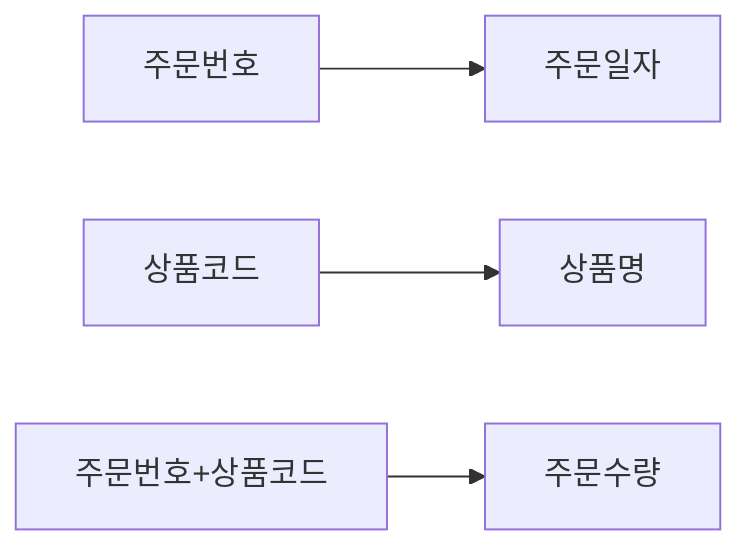
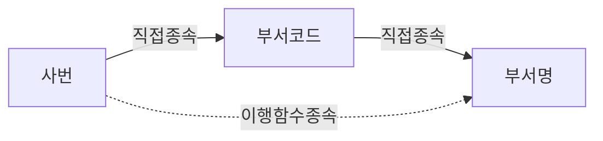

# SQLD 1과목 결정 트리

[00-SQLD-1과목-헌법.md](./00-SQLD-1과목-헌법.md)의 모든 결정 트리만 모은 회독용 문서다. 정의를 다시 읽는 것이 아니라 판단 순서만 5~10분에 복습하는 용도다. 각 트리 아래에는 법리 ID·시험용 한 줄·상세 조항 링크만 둔다. 긴 설명은 헌법 본문과 판례 파일을 참고한다.

## 총칙

### 기본 O/X 판정
```text
문제가 무엇을 요구하는가?
│
├─ 옳은 것을 묻는다 → O인 선지를 찾는다
├─ 옳지 않은 것을 묻는다 → X인 선지를 찾는다
└─ 모두 고른 것을 묻는다
   ├─ 각 진술을 O/X 판정
   ├─ X가 포함된 조합 소거
   └─ O만 포함된 조합 채택
```

### 부정형 문제
```text
각 선지를 일반 법리대로 판정
│
├─ 법리에 맞음 → O → 소거
└─ 법리에 어긋남 → X → 정답 후보
```

### 표·계산형
```text
문제 자료가 표·계산형인가?
│
├─ 예 → 원본 표를 행·열로 재작성 → 행별 계산/함수종속 확인 → 적용 법리 선택 → 선지별 결과 비교
└─ 아니오 → 정의·사례·ERD형 트리로 이동
```

### ERD형
```text
ERD를 판독해야 하는가?
│
├─ 예 → 엔터티 확인 → 부모·자식 방향 → 최소참여 → 최대카디널리티 → 식별·비식별관계 → 선지별 O/X
└─ 아니오 → 다른 트리로 이동
```

> 방법론 한 문장: 모든 선지를 먼저 O/X로 판정하고, 문제에서 O를 요구하는지 X를 요구하는지만 마지막에 확인한다.

---

## 01 데이터 모델링 총론

### [MOD-01] 모델링 유의사항
```text
지문에서 어떤 문제가 발생했는가?
│
├─ 같은 데이터가 여러 곳에 반복 저장 → 중복
├─ 애플리케이션 변경 때마다 모델도 변경(연계성 높음) → 비유연성
└─ 연관관계 불명확으로 일부만 변경 → 비일관성
```
> 중복은 "같은 데이터가 여러 곳에", 비유연성은 "연계성이 높아서 잦은 변경", 비일관성은 "일부만 고쳐서 어긋남" — 원인 키워드로 구분한다.
상세: [헌법 제1조](./00-SQLD-1과목-헌법.md#제1조-mod-01-데이터-모델링의-유의사항) · [MOD-01](./01-데이터모델링-총론/MOD-01-데이터모델링의-유의사항.md)

### [MOD-02] 개념·논리·물리 모델링
```text
어떤 수준의 모델링을 설명하는가?
│
├─ 추상적·전사적, 사용자 관점 → 개념적 모델링
├─ Key·속성·관계 구체적 표현, DBMS 독립, 재사용성 높음 → 논리적 모델링
└─ 성능·저장구조·반정규화·인덱스 → 물리적 모델링
```
> 반정규화·인덱스·저장구조가 보이면 물리, Key·속성·관계·정규화가 보이면 논리, 추상적·전사적 서술만 있으면 개념.
상세: [헌법 제2조](./00-SQLD-1과목-헌법.md#제2조-mod-02-개념논리물리-데이터-모델링-단계-구분) · [MOD-02](./01-데이터모델링-총론/MOD-02-개념논리물리모델.md)

### [MOD-03] 모델링 세 가지 관점
```text
선지가 설명하는 대상은?
│
├─ 업무가 어떤 데이터를 필요로 하는가 → 데이터 관점
├─ 업무 처리 절차 자체 → 프로세스 관점
├─ 업무흐름에 따라 데이터가 생성·조회·변경·삭제되는 방식 → 상관 관점
└─ "정규화 관점"처럼 기법이 등장 → 함정(기법은 관점이 아님)
```
> 데이터관점=무엇을 저장, 프로세스관점=어떻게 처리, 상관관점=업무흐름 따라 데이터가 어떻게 조작되는지 — 정규화는 관점이 아니라 기법이다.
상세: [헌법 제3조](./00-SQLD-1과목-헌법.md#제3조-mod-03-데이터-모델링의-세-가지-관점) · [MOD-03](./01-데이터모델링-총론/MOD-03-모델링관점.md)

### [SCH-01] DB 3단계 스키마
```text
어느 관점의 스키마인가?
│
├─ 사용자·응용프로그램별 개별 뷰 → 외부 스키마
├─ 조직 전체 통합 논리 구조 → 개념 스키마
├─ 실제 저장장치의 물리적 구조 → 내부 스키마
└─ "논리 스키마"라는 이름 → 함정(존재하지 않음)
```
> 3층 스키마는 외부·개념·내부뿐, "논리"는 없다 — 논리는 모델링 단계(MOD-02)에만 있는 말이다.
상세: [헌법 제4조](./00-SQLD-1과목-헌법.md#제4조-sch-01-데이터베이스-3단계-스키마) · [SCH-01](./01-데이터모델링-총론/SCH-01-데이터베이스-3단계-스키마.md)

---

## 02 엔터티

### [ENT-01] 엔터티 성립요건과 속성 구분
```text
요구사항서 단어가 독립적으로 관리되는가?
│
├─ 예 → 인스턴스 2개 이상? → 속성 1개 이상? → 관계 1개 이상?
│        (관계 0개면 통계성·코드성 엔터티 예외 검토)
│        → 모두 예 → 엔터티
└─ 아니오 → 다른 대상을 설명하는 세부항목인가?
   ├─ 예 → 속성
   └─ 아니오 → 단순 배경 설명
```
> 스스로 인스턴스 집합을 이루며 속성을 갖고 관계를 최소 1개 맺으면 엔터티, 다른 것을 설명하는 값 하나면 속성이다.
상세: [헌법 제5조](./00-SQLD-1과목-헌법.md#제5조-ent-01-엔터티의-성립요건과-엔터티-vs-속성-구분) · [ENT-01](./02-엔터티/ENT-01-엔터티-성립요건과-속성구분.md)

### [ENT-02] 엔터티 분류(발생시점 축 / 유무형 축)
```text
무엇을 기준으로 분류하는가?
│
├─ 유무형 → 유형엔터티 / 개념엔터티 / 사건(Event)엔터티
└─ 발생시점 → 기본(키)엔터티 → 중심엔터티 → 행위(Event)엔터티
   ⚠️ 같은 "Event"라도 축이 다르면 다른 개념
```
> 발생시점은 "누가 먼저 생기고 누가 파생됐는가"(기본→중심→행위), 유무형은 "형태가 있는가 없는가 사건인가"(유형/개념/사건) — 이름이 같은 Event라도 축이 다르면 다른 개념이다.
상세: [헌법 제6조](./00-SQLD-1과목-헌법.md#제6조-ent-02-엔터티-분류발생시점-축--유무형-축) · [ENT-02](./02-엔터티/ENT-02-엔터티-분류.md)

---

## 03 속성과 도메인

### [ATTR-01] 속성의 정의(단일값 원칙)
```text
속성이 가지는 값의 개수는?
│
├─ 하나의 값만 → 단일값 원칙 충족
└─ 여러 값 동시에 → 위반 → 1차정규화 대상(NORM-02)
```
> 속성은 "더 이상 쪼갤 수 없는 최소 정보 단위"이며 "반드시 하나의 값"만 가진다 — 다중값이 보이면 무조건 오답.
상세: [헌법 제7조](./00-SQLD-1과목-헌법.md#제7조-attr-01-속성의-정의와-특징단일값-원칙) · [ATTR-01](./03-속성과-도메인/ATTR-01-속성의-정의와-특징.md)

### [ATTR-02] 기본·설계·파생속성
```text
속성값이 어떻게 만들어지는가?
│
├─ 업무에서 원천적으로 입력 → 기본속성
├─ 업무 규칙 위해 설계 중 새로 정의(코드값 등) → 설계속성
└─ 다른 속성을 계산·집계·가공 → 파생속성(원본 변경 시 재계산 필요)
```
> "계산해서 나온 값"이면 파생, "업무 규칙을 위해 새로 정의한 코드값"이면 설계, "원초적으로 입력되는 값"이면 기본이다.
상세: [헌법 제8조](./00-SQLD-1과목-헌법.md#제8조-attr-02-기본속성설계속성파생속성-구분) · [ATTR-02](./03-속성과-도메인/ATTR-02-기본설계파생속성.md)

### [ATTR-03] 단일·복합속성
```text
속성값의 구조는?
│
├─ 더 이상 분해 불필요 → 단일(단순)속성
└─ 하위 항목으로 분해 가능 → 복합속성
   (값 개수·계산 여부와는 다른 축)
```
> 하위 항목으로 다시 나뉘면 복합속성, 더 쪼갤 필요가 없으면 단순속성 — 값의 개수나 계산 여부와는 무관하다.
상세: [헌법 제9조](./00-SQLD-1과목-헌법.md#제9조-attr-03-단일속성복합속성-구분) · [ATTR-03](./03-속성과-도메인/ATTR-03-단일복합속성.md)

### [DOM-01] 도메인
```text
무엇을 판단하는가?
│
├─ 값의 범위(자료형·길이·형식·허용범위) → 도메인
└─ 속성 자체가 무엇인지 → 도메인 아님(ATTR-01)
```
> 도메인은 "그 속성에 어떤 값이 들어갈 수 있는가"(데이터 타입·형식·허용범위)를 정하는 제약조건이다.
상세: [헌법 제10조](./00-SQLD-1과목-헌법.md#제10조-dom-01-도메인의-의미) · [DOM-01](./03-속성과-도메인/DOM-01-도메인의-의미.md)

---

## 04 관계와 ERD

### [REL-01] 관계 성립요건, 필수·선택참여
```text
두 엔터티 사이 연관성을 관리해야 하는가?
│
├─ 예 → 업무기술서에 동사가 있는가?(명사 아님)
│        → 차수(1:1/1:N/M:N, M:N은 1:N+M:1로 분리)
│        → 참여방식(반드시 있어야 함=필수 / 없어도 됨=선택)
└─ 아니오 → 관계 아님
```
> 관계는 동사로 도출하고, "반드시 있어야 하면 필수참여, 없어도 되면 선택참여"이며, M:N은 원칙적으로 1:N과 M:1로 분리한다.
상세: [헌법 제11조](./00-SQLD-1과목-헌법.md#제11조-rel-01-관계의-정의성립요건과-필수참여선택참여) · [REL-01](./04-관계와-ERD/REL-01-관계의-정의와-필수선택참여.md)

### [REL-02] 존재관계·행위관계
```text
관계가 왜 발생했는가?
│
├─ 업무 행위 없이 신분·소속상 자연 성립 → 존재적 관계
└─ 특정 업무 행위 필요(구매·수령·작성) → 행위적 관계
   ⚠️ ERD는 이 둘을 표기법상 구분하지 않는다
```
> 행위 없이 자연히 성립하면 존재관계, 구매·수령·작성처럼 업무 행위가 있어야 성립하면 행위관계이며, ERD는 이 둘을 표기법상 구분하지 않는다.
상세: [헌법 제12조](./00-SQLD-1과목-헌법.md#제12조-rel-02-존재관계와-행위관계의-구분) · [REL-02](./04-관계와-ERD/REL-02-존재관계와-행위관계.md)

### [ERD-01] ERD 표기법과 카디널리티
```text
표기법 구분: 마름모=Peter Chen / 실선·점선박스=IDEF1X / 관계선반대편실선·점선+o·*=Barker / 까치발+원·바=IE
카디널리티: 까치발 한쪽=1:N, 양쪽=M:N, 까치발="2개 이상"
선택성: 원·점선=선택참여, 바·실선=필수참여
NULL표기: Barker만 가능(IE는 불가)
```
> 필수참여는 실선/바, 선택참여는 점선/원이며, 까치발은 "2개 이상"을 뜻하고, NULL 표기가 가능한 것은 Barker표기법뿐이다.
상세: [헌법 제13조](./00-SQLD-1과목-헌법.md#제13조-erd-01-erd-표기법과-카디널리티선택성-판독) · [ERD-01](./04-관계와-ERD/ERD-01-ERD-표기법과-카디널리티.md)

### [ERD-02] ERD 작성 순서
```text
① 엔터티 도출 → ② 엔터티 배치 → ③ 관계선 연결
→ ④ 관계명 작성 → ⑤ 관계차수 표현 → ⑥ 관계선택성 표시
```
> ERD는 "엔터티 → 배치 → 관계선 → 관계명 → 차수 → 선택성" 순서로, 있는 것을 먼저 정하고 관계를 점점 구체화한다.
상세: [헌법 제14조](./00-SQLD-1과목-헌법.md#제14조-erd-02-erd-작성-순서) · [ERD-02](./04-관계와-ERD/ERD-02-ERD-작성순서.md)

---

## 05 식별자

### [ID-01] 주식별자 성립요건
```text
유일한가?(유일성) → 최소 속성만인가?(최소성) → 안 바뀌는가?(불변성) → NULL 없는가?(존재성)
→ 넷 다 예 → 주식별자 후보
```
> 유일성은 "다 구분되는가", 최소성은 "더 뺄 게 없는가", 불변성은 "안 바뀌는가", 존재성은 "NULL이 없는가" — 넷 중 방향이 뒤집힌 것을 찾는다.
상세: [헌법 제15조](./00-SQLD-1과목-헌법.md#제15조-id-01-주식별자의-성립요건) · [ID-01](./05-식별자/ID-01-주식별자의-성립요건.md)

### [ID-02] 식별관계·비식별관계
```text
부모 식별자가 자식의 주식별자에 포함? → 식별관계(실선)
부모 식별자가 자식의 일반속성으로만? → 비식별관계(점선)
```
> 부모 식별자가 자식의 "주식별자"에 들어가면 식별관계(실선), "일반속성"에만 들어가면 비식별관계(점선).
상세: [헌법 제16조](./00-SQLD-1과목-헌법.md#제16조-id-02-식별관계와-비식별관계) · [ID-02](./05-식별자/ID-02-식별관계와-비식별관계.md)

### [ID-03] 본질식별자·인조식별자
```text
업무에서 자연 발생한 값 그대로? → 본질식별자
인위적으로 새로 생성? → 인조식별자(자연식별자 중복은 자동차단 안 됨)
```
> 본질식별자는 "업무가 만든 의미 있는 값"(복합키 되기 쉬움), 인조식별자는 "사람이 붙인 의미 없는 번호"(단일키, 관리는 쉽지만 중복은 자동으로 안 막아준다).
상세: [헌법 제17조](./00-SQLD-1과목-헌법.md#제17조-id-03-본질식별자와-인조식별자) · [ID-03](./05-식별자/ID-03-본질식별자와-인조식별자.md)

### [ID-04] 식별자 구성방식(3개 독립 축)
```text
자체생성? → 내부/외부   속성개수? → 단일/복합   대표성? → 주/보조
(세 축은 동시에 독립적으로 적용)
```
> 내부/외부는 "누가 만들었나", 단일/복합은 "속성이 몇 개인가", 주/보조는 "관계에 참조되는 대표인가" — 세 축을 따로 판단한다.
상세: [헌법 제18조](./00-SQLD-1과목-헌법.md#제18조-id-04-식별자의-구성방식-분류내부외부-단일복합-주보조) · [ID-04](./05-식별자/ID-04-식별자의-구성방식-분류.md)

### [ID-05] 외래키·참조무결성
```text
FK 값이 부모테이블에 존재? → 충족
FK 값이 NULL(선택참여)? → 충족
FK 값이 부모테이블에 없음? → 위반
```
> 외래키는 부모 테이블에 있는 값이거나 NULL만 가질 수 있다 — "부모에 없는 값도 가능"은 항상 오답.
상세: [헌법 제19조](./00-SQLD-1과목-헌법.md#제19조-id-05-외래키와-참조무결성) · [ID-05](./05-식별자/ID-05-외래키와-참조무결성.md)

---

## 06 정규화

### [NORM-01] 정규화 총론 / 함수종속 / 이상현상
```text
원자값인가? 아니오→1NF(NORM-02)
복합키 일부에만 종속? 예→2NF위반(NORM-03)
일반속성이 일반속성 결정? 예→3NF위반(NORM-04)
결정자가 후보키 아님? 예→BCNF위반(NORM-05)

함수종속: X값 정해지면 Y값 하나로 결정 → X→Y (X=결정자, Y=종속자)

이상현상: 못넣음=삽입이상 / 일부만수정=갱신이상 / 지우니같이없어짐=삭제이상
("생성이상"은 없는 용어)
```
> 정보가 없어 못 넣으면 삽입이상, 일부만 고쳐 어긋나면 갱신이상, 지우니 같이 없어지면 삭제이상 — "생성이상"은 없는 말이다.
상세: [헌법 제20조](./00-SQLD-1과목-헌법.md#제20조-norm-01-정규화의-목적과-이상현상-함수종속의-정의) · [NORM-01](./06-정규화/NORM-01-정규화의-목적과-이상현상.md)

### [NORM-02] 제1정규형
```text
한 셀에 값이 여럿 or 번호붙은 반복컬럼? → 1NF 위반 → 별도 엔터티 분리(1:M)
원자값만 있음? → 1NF 충족
```
> "속성1, 속성2, 속성3"처럼 번호 붙은 반복 컬럼이 보이면 1NF 위반 — 별도 엔터티로 분리해 1:M 관계로 연결한다.
상세: [헌법 제21조](./00-SQLD-1과목-헌법.md#제21조-norm-02-제1정규형도메인-원자성) · [NORM-02](./06-정규화/NORM-02-제1정규형.md)

### [NORM-03] 제2정규형·부분함수종속
```text
복합 주식별자인가?
├─ 아니오 → 2NF 자동통과
└─ 예 → 일반속성이 복합키 전체에 종속?
   ├─ 예(완전함수종속) → 2NF 충족
   └─ 아니오(일부에만 종속=부분함수종속) → 2NF위반 → 분리
```

> 복합 주식별자 "일부"에만 종속되면 부분함수종속(2NF 위반) — 결정자가 주식별자의 일부인지가 핵심.
상세: [헌법 제22조](./00-SQLD-1과목-헌법.md#제22조-norm-03-제2정규형과-부분함수종속) · [NORM-03](./06-정규화/NORM-03-제2정규형과-부분함수종속.md)

### [NORM-04] 제3정규형·이행함수종속
```text
일반속성 X가 다른 일반속성 Y를 결정?(X,Y 모두 일반속성)
├─ 예(이행함수종속: 주식별자→X→Y 간접결정) → 3NF위반 → 분리
└─ 아니오 → 3NF 충족
```

> 일반속성이 일반속성을 결정하면 이행함수종속(3NF 위반) — 결정자가 "일반속성"인지가 핵심.
상세: [헌법 제23조](./00-SQLD-1과목-헌법.md#제23조-norm-04-제3정규형과-이행함수종속) · [NORM-04](./06-정규화/NORM-04-제3정규형과-이행함수종속.md)

**NORM-03 vs NORM-04 구별**: 결정자가 "주식별자의 일부"면 2NF(부분함수종속), 결정자가 "일반속성"이면 3NF(이행함수종속).

### [NORM-05] BCNF
```text
함수종속 X→Y 존재? → 결정자 X가 후보키인가?
├─ 예 → BCNF 충족
└─ 아니오 → BCNF 위반
(4NF=다치종속 제거, 5NF=조인종속 제거, SQLD에서는 존재만 인지)
```
> "모든 결정자가 후보키"면 BCNF — 3NF(이행함수종속 제거)의 한 단계 위이며, 4NF·5NF는 SQLD에서 이름만 알아둔다.
상세: [헌법 제24조](./00-SQLD-1과목-헌법.md#제24조-norm-05-bcnf와-상위정규형) · [NORM-05](./06-정규화/NORM-05-BCNF와-상위정규형.md)

---

## 07 데이터 모델과 SQL

### [SQL-01] 조인 목적, 계층형·상호배타 모델
```text
필요 정보가 한 테이블에 다 있는가?
├─ 예 → 단일 테이블 조회
└─ 아니오 → 관계·공통식별자 있는가? → 예 → JOIN(정보통합조회, 성능목적 아님)

자기 자신과 관계? → 계층형모델(Self Join)
후보 중 정확히 하나와만 대응? → 상호배타모델(중복없음, UNION=UNION ALL)
```
> 조인은 나뉜 데이터를 다시 합치기 위함, 반정규화는 애초에 합쳐서 저장하기 위함 — 목적이 정반대다. 상호배타 모델은 중복이 없어 UNION=UNION ALL이다.
상세: [헌법 제25조](./00-SQLD-1과목-헌법.md#제25조-sql-01-관계형-모델의-조인-목적-계층형상호배타-모델) · [SQL-01](./07-데이터모델과-SQL/SQL-01-관계형모델과-조인.md)

### [TXN-01] 트랜잭션
```text
여러 DML이 하나의 업무단위? → 트랜잭션
├─ 모두 성공 → COMMIT
└─ 하나라도 실패 → ROLLBACK

"반드시 함께 등록" 요구사항 → ERD 관계가 필수참여인가?
├─ 예 → 반영됨
└─ 아니오(선택참여) → 미반영(오류)
```
> 트랜잭션은 성능이 아니라 논리적 작업단위(정합성)를 보장하는 것 — 필수 요구사항은 반드시 필수참여 관계로 그려야 한다.
상세: [헌법 제26조](./00-SQLD-1과목-헌법.md#제26조-txn-01-트랜잭션과-데이터-모델) · [TXN-01](./07-데이터모델과-SQL/TXN-01-트랜잭션과-데이터모델.md)

### [PERF-01] 반정규화
```text
성능문제 확인? → 조인·집계비용 큼? → 정합성위험 감수가능?
└─ 예 → 병합 / 분할(수직·수평) / 중복컬럼추가 / 중복관계추가(유일하게 무결성위험無)

⚠️ 함수종속 고려한 "분할", 슈퍼/서브타입 "분리"는 정규화 방향(반정규화 아님)
```
> 정규화는 무결성을 위해 나누고, 반정규화는 성능을 위해 합친다 — 분리·분할이 목적이면 정규화, 병합·중복추가가 목적이면 반정규화다.
상세: [헌법 제27조](./00-SQLD-1과목-헌법.md#제27조-perf-01-반정규화의-목적과-기법) · [PERF-01](./07-데이터모델과-SQL/PERF-01-반정규화.md)

---

## 08 NULL

### [NULL-01] NULL의 의미·표기법
```text
0/공백/빈문자열 = NULL 아님(일반 DBMS 기준)
⚠️ Oracle 예외: 빈 문자열을 NULL처럼 처리
표기: Barker=o(허용)/*(비허용), IE=표기 안 함
```
> NULL은 0도 공백도 아닌 "값이 없는 상태"이며, Barker는 o/*로 NULL 여부를 표시하지만 IE는 아예 표시하지 않는다.
상세: [헌법 제28조](./00-SQLD-1과목-헌법.md#제28조-null-01-null의-의미와-표기법) · [NULL-01](./08-NULL/NULL-01-NULL의-의미와-표기법.md)

### [NULL-02] NULL과 비교연산(3값 논리)
```text
IS NULL/IS NOT NULL → TRUE/FALSE 반환(정상 판정)
= NULL → 항상 UNKNOWN(0건)
WHERE → TRUE만 통과, FALSE·UNKNOWN 제외
```
> `COL = NULL`은 항상 UNKNOWN이라 결과가 없다 — NULL을 찾으려면 반드시 `IS NULL`을 쓴다.
상세: [헌법 제29조](./00-SQLD-1과목-헌법.md#제29조-null-02-null과-비교연산3값-논리unknown) · [NULL-02](./08-NULL/NULL-02-NULL과-비교연산.md)

### [NULL-03] NULL과 산술연산
```text
NULL이 산술연산(+,-,*,/) 피연산자? → 결과 항상 NULL(전파)
값 살리려면 → NVL/COALESCE/ISNULL 사용
```
> NULL이 산술연산에 하나라도 섞이면 결과는 무조건 NULL — 값을 살리려면 NVL로 먼저 치환한다.
상세: [헌법 제30조](./00-SQLD-1과목-헌법.md#제30조-null-03-null과-산술연산) · [NULL-03](./08-NULL/NULL-03-NULL과-산술연산.md)

### [NULL-04] NULL과 집계함수
```text
COUNT(*) → NULL 무관하게 행 카운트(유일한 예외)
COUNT(컬럼)/SUM/AVG/MAX/MIN → NULL 제외하고 계산
⚠️ "NULL을 0으로 계산" (X) / "집계함수도 NULL있으면 결과 NULL" (X, 그건 산술연산 규칙)
```
> 집계함수는 NULL을 빼고 계산한다 — 예외는 딱 하나, `COUNT(*)`만 NULL이 있어도 행을 그대로 센다.
상세: [헌법 제31조](./00-SQLD-1과목-헌법.md#제31조-null-04-null과-집계함수) · [NULL-04](./08-NULL/NULL-04-NULL과-집계함수.md)
