# SQLD 1과목 고난도 문제

[00-SQLD-1과목-헌법.md](./00-SQLD-1과목-헌법.md)(제1조~제31조)과 [00-SQLD-1과목-결정트리.md](./00-SQLD-1과목-결정트리.md)를 적용해야 풀리는 수능형 고난도 문제집이다. 기존 기출 문장을 그대로 복제하지 않고, 기존 기출의 핵심 법리·오답 구조·결정적 사실을 재조합해 새로운 사례로 재구성했다.

## 공부 순서

```text
새로운 개념 등장
→ 헌법 조항 신설·개정
→ 결정 트리 분기 추가
→ 유사 사례에 적용
→ 수능형 선지로 혼동 유발
→ ERD·정규화·NULL 계산 문제로 재검증
```

## 문제 구성

| 단원 | 문제 수 | 단일선지형(A) | 조합선지형(B) | 사례형(C) | 표·계산형(D) | ERD형(E) | 장문지문형(F) |
| --- | ---: | ---: | ---: | ---: | ---: | ---: | ---: |
| 01 데이터 모델링 총론 | 9 | 4 | 2 | 2 | - | - | 1 |
| 02 엔터티 | 9 | 4 | 2 | 2 | - | - | 1 |
| 03 속성과 도메인 | 9 | 4 | 2 | 2 | - | - | 1 |
| 04 관계와 ERD | 12 | 4 | 2 | 2 | - | 3 | 1 |
| 05 식별자 | 12 | 4 | 2 | 2 | - | 3 | 1 |
| 06 정규화 | 13 | 4 | 2 | 2 | 4 | - | 1 |
| 07 데이터 모델과 SQL | 12 | 5 | 2 | 2 | 2 | - | 1 |
| 08 NULL | 13 | 6 | 2 | 2 | 2 | - | 1 |
| **합계** | **89** | **35** | **16** | **16** | **8** | **6** | **8** |

(04·05단원의 ERD형 6문제는 관계·식별자 통합 문제로 두 단원에 걸쳐 출제되어 있다. 표는 각 문제가 실제로 실려 있는 단원 섹션 기준으로 집계했다.)

## 난이도 분포

각 단원 최소 기준(하 2·중 3·상 3·최상 1)을 모두 충족했다. 상세 분포는 각 단원 섹션 하단의 문제 목록을 참고한다.

## 문제 유형 풀이 원칙

- **단일 선지형**: 각 선지를 O/X로 판정한 뒤, 문제가 옳은 것을 묻는지 옳지 않은 것을 묻는지 마지막에 확인한다.
- **조합선지형**: 각 진술을 O/X로 판정한 뒤, X가 하나라도 포함된 조합을 소거하고 O만 포함된 조합을 채택한다.
- **ERD형**: 엔터티 → 부모·자식 방향 → 최소참여 → 최대카디널리티 → 식별·비식별관계 순으로 확인한 뒤 선지를 판정한다. Mermaid는 원본 표기법(IE·Barker 등)을 단순화한 것이며, Mermaid 표현 한계를 이용한 함정은 두지 않았다.
- **표·계산형(정규화)**: 후보키 → 함수종속 → 결정자·종속자 → 완전/부분/이행함수종속 → 위반 정규형 → 분해 순서로 판단한다.
- **표·계산형(NULL)**: 행별 산술(1단계)과 집계(2단계)를 분리해서 계산한 뒤 선지를 비교한다.

---

## 01 데이터 모델링 총론

### 문제 01-01 (난이도: 하)

다음은 데이터 모델링에서 지양해야 할 유의사항에 관한 설명이다. 옳지 않은 것은?

#### 보기
① 동일한 고객 정보가 여러 테이블에 그대로 반복해서 저장되어 있다면 이는 중복(Duplication)에 해당한다.
② 업무 요구사항이 조금만 바뀌어도 데이터 모델 구조 자체를 함께 뜯어고쳐야 한다면, 이는 애플리케이션과 데이터 모델의 연계성이 지나치게 높아서 발생하는 비유연성(Inflexibility)이다.
③ 연관된 데이터 간의 관계를 명확히 정의하지 않아 하나의 이벤트에서 일부 데이터만 변경되고 나머지는 그대로 남아 정합성이 깨졌다면, 이는 비일관성(Inconsistency)에 해당한다.
④ 애플리케이션과 데이터 모델 사이의 연계성을 최대한 높여 두면, 요구사항이 변경되더라도 데이터 모델은 흔들리지 않고 안정적으로 유지된다.

<details>
<summary>정답과 판례식 해설</summary>

### 주문
**정답: ④**

### 질문 극성
옳지 않은 것

### 적용 결정 트리
```text
선지가 "무엇 때문에 어떤 문제가 생기는가"를 서술하는가?
→ ①②③은 중복·비유연성·비일관성의 정의를 그대로 서술 → O
→ ④는 "연계성을 높이면 안정적"이라고 서술 → 비유연성의 원인(연계성 높음)을 장점으로 뒤집음
→ 정답: ④
```

### 핵심 법리
데이터 모델링은 중복·비유연성·비일관성 세 가지를 지양해야 하며, 비유연성은 애플리케이션과 데이터의 연계성이 높아서 사소한 변경에도 모델이 흔들리는 현상이다(제1조 MOD-01).

### 정답을 가르는 사실
④는 "연계성을 높인다"를 안정성의 근거로 제시했지만, 헌법상 연계성이 높을수록 사소한 변경에도 모델이 함께 흔들리는 비유연성이 발생한다. 원인과 결과가 정반대로 서술된 것이 정답을 가르는 지점이다.

### 선지별 판단
| 선지 | O/X | 판단 이유 | 반복 오답 유형 |
| --- | --- | --- | --- |
| ① | O | 같은 데이터가 여러 곳에 저장 = 중복의 정의 그대로 | 해당 없음 |
| ② | O | 연계성이 높아 사소한 변경에도 모델이 흔들림 = 비유연성의 정의 그대로 | 해당 없음 |
| ③ | O | 연관관계 미정의로 일부만 변경 = 비일관성의 정의 그대로 | 해당 없음 |
| ④ | X | 연계성을 높이는 것은 비유연성의 "원인"이지 안정성의 근거가 아님 | "연계성을 높인다"를 장점처럼 서술하는 함정 |

### 선지 교정
④ 애플리케이션과 데이터 모델 사이의 연계성이 지나치게 높으면, 요구사항이 조금만 변경되어도 데이터 모델 구조 전체를 다시 설계해야 하는 비유연성 문제가 발생한다.

### 관련 조항
- 헌법 제1조([MOD-01])
- 상세 판례: [MOD-01-데이터모델링의-유의사항.md](./01-데이터모델링-총론/MOD-01-데이터모델링의-유의사항.md)

</details>

---

### 문제 01-02 (난이도: 하)

ANSI/SPARC 3층 스키마에 대한 설명으로 옳지 않은 것은?

#### 보기
① 외부 스키마는 개별 사용자나 응용프로그램 관점에서 필요한 데이터만 뽑아 보여주는 뷰의 집합이다.
② 개념 스키마는 조직 전체 관점에서 통합된 하나의 논리적 데이터 구조를 정의한다.
③ 내부 스키마는 데이터가 실제로 저장 장치에 저장되는 물리적 구조를 정의한다.
④ 3층 스키마는 외부-논리-내부 스키마로 구성되며, 논리 스키마는 개념 스키마보다 더 추상화된 상위 계층이다.

<details>
<summary>정답과 판례식 해설</summary>

### 주문
**정답: ④**

### 질문 극성
옳지 않은 것

### 적용 결정 트리
```text
선지에 "논리 스키마"라는 이름이 등장하는가?
→ 등장함(④) → 3층 스키마에 "논리" 단계는 존재하지 않음 → 함정
→ 등장하지 않음(①②③) → 외부/개념/내부 정의 그대로인지 확인 → 모두 O
→ 정답: ④
```

### 핵심 법리
ANSI/SPARC 3층 스키마는 외부 스키마·개념 스키마·내부 스키마 3단계로만 구성되며, "논리"라는 이름의 스키마는 존재하지 않는다(제4조 SCH-01).

### 정답을 가르는 사실
④는 존재하지 않는 "논리 스키마"를 3층 스키마의 구성요소로 서술했다. 이는 데이터 모델링 3단계(개념적/논리적/물리적, 제2조)의 "논리적"이라는 이름을 3층 스키마 축에 잘못 끌어온 것이다.

### 선지별 판단
| 선지 | O/X | 판단 이유 | 반복 오답 유형 |
| --- | --- | --- | --- |
| ① | O | 사용자·응용프로그램별 개별 뷰 = 외부 스키마의 정의 그대로 | 해당 없음 |
| ② | O | 조직 전체 통합 논리적 구조 = 개념 스키마의 정의 그대로 | 해당 없음 |
| ③ | O | 실제 저장 장치의 물리적 구조 = 내부 스키마의 정의 그대로 | 해당 없음 |
| ④ | X | 3층 스키마에는 "논리" 단계가 없음(외부/개념/내부 3단계만 존재) | 3층 스키마와 모델링 3단계를 혼동해 "논리"를 끼워 넣는 함정 |

### 선지 교정
④ 3층 스키마는 외부-개념-내부 스키마로 구성되며, "논리"라는 이름의 스키마 단계는 존재하지 않는다.

### 관련 조항
- 헌법 제4조([SCH-01])
- 상세 판례: [SCH-01-데이터베이스-3단계-스키마.md](./01-데이터모델링-총론/SCH-01-데이터베이스-3단계-스키마.md)

</details>

---

### 문제 01-03 (난이도: 중)

다음 중 개념 스키마와 개념적 모델링에 대한 설명으로 가장 적절한 것은?

#### 보기
① 개념 스키마는 데이터 모델링 3단계 중 하나이며, 개념적 모델링과 완전히 동일한 절차를 가리키는 다른 이름이다.
② 개념 스키마는 조직 전체 관점에서 통합된 논리적 구조를 정의하는 3층 스키마의 한 단계이고, 개념적 모델링은 추상적·전사적 수준에서 업무의 핵심 개념과 관계를 사용자 관점으로 표현하는 모델링 단계로, 이름은 비슷하지만 서로 다른 분류축에 속한다.
③ 개념적 모델링은 실제 DBMS의 테이블·컬럼·자료형을 구현하는 단계이며, 개념 스키마는 그 결과물을 저장하는 물리적 구조다.
④ 개념 스키마와 개념적 모델링은 모두 Key·속성·관계를 구체적으로 표현하며 재사용성이 높다는 공통점을 가진다.

<details>
<summary>정답과 판례식 해설</summary>

### 주문
**정답: ②**

### 질문 극성
가장 적절한 것

### 적용 결정 트리
```text
"개념 스키마"인가, "개념적 모델링"인가?
├─ 3층 스키마 축(외부/개념/내부) → 개념 스키마 = 조직 전체 통합 논리적 구조
└─ 모델링 단계 축(개념적/논리적/물리적) → 개념적 모델링 = 추상적·전사적·사용자 관점
→ 이름은 비슷하나 서로 다른 분류축 → 동일시하면 오답
→ 정답: ②
```

### 핵심 법리
"개념 스키마"(3층 스키마 축, 제4조)와 "개념적 모델링"(모델링 단계 축, 제2조)은 이름이 비슷하지만 서로 다른 분류축이므로 혼동하지 않아야 한다.

### 정답을 가르는 사실
①은 두 개념을 "동일한 절차"라고 단정했고, ③은 개념적 모델링에 물리적 모델링의 특징(DBMS 구현)을 섞었으며, ④는 두 개념 모두에 논리적 모델링의 특징(Key·속성·관계 구체화, 재사용성)을 잘못 부여했다. ②만이 각 개념을 정확한 정의대로 서술하면서 "다른 분류축"이라는 관계를 명시했다.

### 선지별 판단
| 선지 | O/X | 판단 이유 | 반복 오답 유형 |
| --- | --- | --- | --- |
| ① | X | 두 개념은 이름만 비슷할 뿐 서로 다른 분류축(3층 스키마 vs 모델링 단계) | 이름 유사성으로 동일 개념처럼 단정하는 함정 |
| ② | O | 개념 스키마·개념적 모델링을 각각의 정의대로 서술하고 분류축이 다름을 정확히 언급 | 해당 없음 |
| ③ | X | 개념적 모델링에 물리적 모델링의 특징(DBMS 구현)을 섞음 | 모델링 단계 특징을 서로 뒤바꾸는 함정 |
| ④ | X | 두 개념 모두에 논리적 모델링의 특징을 잘못 부여 | 재사용성·Key구체화(논리 모델링 특징)를 다른 단계에 섞는 함정 |

### 선지 교정
① 개념 스키마와 개념적 모델링은 이름은 비슷하지만 서로 다른 분류축(3층 스키마 vs 모델링 단계)에 속한 별개의 개념이다.
③ 물리적 모델링이 실제 DBMS의 테이블·컬럼·자료형을 구현하는 단계이며, 내부 스키마가 그 결과물이 저장되는 물리적 구조다.
④ 논리적 모델링이 Key·속성·관계를 구체적으로 표현하며 재사용성이 높다.

### 관련 조항
- 헌법 제2조([MOD-02]), 제4조([SCH-01])
- 상세 판례: [MOD-02-개념논리물리모델.md](./01-데이터모델링-총론/MOD-02-개념논리물리모델.md), [SCH-01-데이터베이스-3단계-스키마.md](./01-데이터모델링-총론/SCH-01-데이터베이스-3단계-스키마.md)

</details>

---

### 문제 01-04 (난이도: 중)

다음 ㄱ~ㄹ 중 데이터 모델링의 세 가지 관점(MOD-03)과 데이터 모델링의 유의사항(MOD-01)에 대한 설명으로 옳은 것만을 모두 고른 것은?

**<보기>**
ㄱ. 데이터 모델링에서 애플리케이션과 데이터 간 연계성을 최대한 높이면 요구사항 변경에 유연하게 대응할 수 있으므로 이는 지향해야 할 목표다.
ㄴ. 논리적 모델링은 특정 DBMS에 독립적으로 Key·속성·관계를 구체적으로 표현하는 단계로, 재사용성이 높다.
ㄷ. 데이터 모델링은 데이터 관점, 프로세스 관점, 정규화 관점의 세 가지 관점으로 접근한다.
ㄹ. 3층 스키마 중 개념 스키마는 조직 전체 관점에서 통합된 논리적 구조를 정의하며, 이는 모델링 단계상의 "개념적 모델링"과 동일한 개념이다.

#### 보기
① ㄱ, ㄴ
② ㄴ
③ ㄴ, ㄹ
④ ㄱ, ㄷ, ㄹ

<details>
<summary>정답과 판례식 해설</summary>

### 주문
**정답: ②**

### 질문 극성
모두 고른 것(조합)

### 적용 결정 트리
```text
각 진술이 어느 조항의 법리를 다루는가?
├─ ㄱ: 제1조(MOD-01) 비유연성 원인 → 연계성 높임=긍정적으로 서술 → 원인·결과 역전 → X
├─ ㄴ: 제2조(MOD-02) 논리적 모델링 정의 → 그대로 일치 → O
├─ ㄷ: 제3조(MOD-03) 관점 3가지 → "정규화 관점"은 존재하지 않는 함정 → X
└─ ㄹ: 제4조(SCH-01) 개념 스키마 ≠ 개념적 모델링(다른 분류축) → X
→ O는 ㄴ뿐 → X 포함 조합 소거 → ㄴ만 채택
```

### 진술별 판단
| 진술 | O/X | 판단 이유 |
| --- | --- | --- |
| ㄱ | X | 연계성을 높이면 오히려 비유연성이 발생한다(제1조). 원인과 결과가 뒤집힌 서술 |
| ㄴ | O | 논리적 모델링의 정의(DBMS 독립적, Key·속성·관계 구체화, 재사용성 높음)와 정확히 일치(제2조) |
| ㄷ | X | 정규화는 모델링 "기법"이지 세 가지 관점 중 하나가 아니다(제3조) |
| ㄹ | X | 개념 스키마(3층 스키마 축)와 개념적 모델링(모델링 단계 축)은 이름만 비슷할 뿐 다른 분류축이다(제4조) |

### 조합 판정
| 선택지 | 포함 진술 | X 포함 여부 | 채택·소거 |
| --- | --- | --- | --- |
| ① ㄱ,ㄴ | ㄱ(X), ㄴ(O) | X 포함 | 소거 |
| ② ㄴ | ㄴ(O) | X 미포함 | 채택 |
| ③ ㄴ,ㄹ | ㄴ(O), ㄹ(X) | X 포함 | 소거 |
| ④ ㄱ,ㄷ,ㄹ | 모두 X | X 포함 | 소거 |

### 핵심 법리
비유연성의 원인(연계성)을 뒤집지 않고, 관점(제3조)에 정규화 같은 "기법"을 섞지 않으며, 개념 스키마와 개념적 모델링(제4조)의 분류축을 혼동하지 않아야 한다.

### 정답을 가르는 사실
ㄴ만이 각 조항의 정의를 그대로 서술했고, 나머지는 모두 헌법에 명시된 반복 오답 패턴(원인·결과 역전, 존재하지 않는 관점 삽입, 이름 유사 개념 혼동)을 그대로 재현했다.

### 관련 조항
- 헌법 제1조([MOD-01]), 제2조([MOD-02]), 제3조([MOD-03]), 제4조([SCH-01])
- 상세 판례: [MOD-01](./01-데이터모델링-총론/MOD-01-데이터모델링의-유의사항.md), [MOD-02](./01-데이터모델링-총론/MOD-02-개념논리물리모델.md), [MOD-03](./01-데이터모델링-총론/MOD-03-모델링관점.md), [SCH-01](./01-데이터모델링-총론/SCH-01-데이터베이스-3단계-스키마.md)

</details>

---

### 문제 01-05 (난이도: 중)

다음은 물류회사 A사가 통합배송관리시스템을 구축하며 진행한 작업이다.

> (가) 분석팀은 '화주', '배송', '창고' 등 핵심 업무 개념과 그들 사이의 관계만 전사적 관점에서 정의했다. 이 단계의 산출물에는 아직 구체적인 속성이나 기본키가 포함되지 않았다.
>
> (나) 배송기사용 모바일 앱은 '오늘 배정된 배송건 목록'만 보여주고, 창고 관리자용 화면은 '입출고 현황'만 보여준다. 이처럼 사용자별로 필요한 데이터만 뽑아 보여주는 개별 뷰들의 집합을 시스템 설계 문서에서는 별도 항목으로 정의해 관리한다.

(가)와 (나)에 해당하는 개념을 순서대로 바르게 짝지은 것은?

#### 보기
① (가) 논리적 모델링 – (나) 개념 스키마
② (가) 개념적 모델링 – (나) 외부 스키마
③ (가) 개념적 모델링 – (나) 개념 스키마
④ (가) 물리적 모델링 – (나) 외부 스키마

<details>
<summary>정답과 판례식 해설</summary>

### 주문
**정답: ②**

### 질문 극성
가장 적절한 것(짝짓기)

### 적용 결정 트리
```text
(가): 추상적·전사적·사용자 관점, Key·속성 미확정 → 개념적 모델링(제2조)
(나): 사용자·응용프로그램별 개별 뷰의 집합 → 외부 스키마(제4조)
→ (가)=개념적 모델링, (나)=외부 스키마 → 정답 ②
```

### 핵심 법리
(가)는 제2조(MOD-02)의 개념적 모델링 정의(추상적·전사적, 사용자 관점, Key·속성 미확정)와 일치하고, (나)는 제4조(SCH-01)의 외부 스키마 정의(사용자·응용프로그램별 개별 뷰의 집합)와 일치한다.

### 정답을 가르는 사실
(가)에서 "구체적인 속성이나 기본키가 포함되지 않았다"는 서술이 논리적 모델링(Key·속성 구체화)이 아니라 개념적 모델링임을 가른다. (나)에서 "사용자별로 필요한 데이터만 뽑아 보여주는 개별 뷰"라는 서술이 개념 스키마(조직 전체 통합 구조)가 아니라 외부 스키마임을 가른다.

### 선지별 판단
| 선지 | O/X | 판단 이유 | 반복 오답 유형 |
| --- | --- | --- | --- |
| ① | X | (가)는 Key·속성이 미확정이므로 논리적 모델링이 아니라 개념적 모델링 | 모델링 단계 명칭 오배치 |
| ② | O | (가)=개념적 모델링, (나)=외부 스키마로 정확히 일치 | 해당 없음 |
| ③ | X | (나)는 "사용자별 개별 뷰"이므로 개념 스키마가 아니라 외부 스키마 | 개념 스키마와 외부 스키마를 이름 유사성으로 혼동 |
| ④ | X | (가)는 성능·저장구조를 다루지 않으므로 물리적 모델링이 아님 | 개념적 모델링에 물리적 모델링 이름을 붙이는 오배치 |

### 선지 교정
① (가) 개념적 모델링 – (나) 외부 스키마
③ (가) 개념적 모델링 – (나) 외부 스키마
④ (가) 개념적 모델링 – (나) 외부 스키마

### 관련 조항
- 헌법 제2조([MOD-02]), 제4조([SCH-01])
- 상세 판례: [MOD-02](./01-데이터모델링-총론/MOD-02-개념논리물리모델.md), [SCH-01](./01-데이터모델링-총론/SCH-01-데이터베이스-3단계-스키마.md)

</details>

---

### 문제 01-06 (난이도: 상)

다음 ㄱ~ㄹ 중 데이터 모델링 총론에 대한 설명으로 옳은 것만을 모두 고른 것은?

**<보기>**
ㄱ. 데이터 모델링에서 애플리케이션과 데이터 간 연계성을 높이면 요구사항 변경에 유연하게 대응할 수 있으므로 지향해야 한다.
ㄴ. 논리적 모델링은 특정 DBMS에 독립적으로 Key, 속성, 관계를 구체적으로 표현하는 단계로 재사용성이 높다.
ㄷ. 데이터 모델링은 데이터 관점, 프로세스 관점, 정규화 관점의 세 가지 관점으로 접근한다.
ㄹ. ANSI/SPARC 3층 스키마 중 개념 스키마는 조직 전체 관점에서 통합된 논리적 구조를 정의하며, 이는 모델링 단계상의 "개념적 모델링"과 동일한 개념이다.

#### 보기
① ㄱ, ㄴ
② ㄴ
③ ㄴ, ㄹ
④ ㄱ, ㄷ, ㄹ

<details>
<summary>정답과 판례식 해설</summary>

### 주문
**정답: ②**

### 질문 극성
모두 고른 것(조합)

### 적용 결정 트리
```text
ㄱ→제1조 원인역전 X / ㄴ→제2조 정의일치 O / ㄷ→제3조 존재하지않는관점 X / ㄹ→제4조 분류축혼동 X
→ O는 ㄴ뿐 → ②
```

### 진술별 판단
| 진술 | O/X | 판단 이유 |
| --- | --- | --- |
| ㄱ | X | 연계성이 높을수록 비유연성이 발생한다(제1조) |
| ㄴ | O | 논리적 모델링의 정의와 정확히 일치(제2조) |
| ㄷ | X | 정규화는 관점이 아니라 모델링 기법(제3조) |
| ㄹ | X | 개념 스키마와 개념적 모델링은 서로 다른 분류축(제4조) |

### 조합 판정
| 선택지 | 포함 진술 | X 포함 여부 | 채택·소거 |
| --- | --- | --- | --- |
| ① ㄱ,ㄴ | ㄱ(X) | 포함 | 소거 |
| ② ㄴ | ㄴ(O) | 미포함 | 채택 |
| ③ ㄴ,ㄹ | ㄹ(X) | 포함 | 소거 |
| ④ ㄱ,ㄷ,ㄹ | 모두 X | 포함 | 소거 |

### 핵심 법리
이 문제는 제1조~제4조 네 조항의 대표 반복 오답(원인역전·기법의 관점화·분류축 혼동)을 한 문제에 모두 배치한 종합형이다.

### 정답을 가르는 사실
ㄴ을 제외한 나머지 세 진술이 각각 다른 조항의 반복 오답 패턴을 재현하고 있으므로, 네 조항의 정의를 모두 정확히 아는지가 정답을 가른다.

### 관련 조항
- 헌법 제1조([MOD-01]), 제2조([MOD-02]), 제3조([MOD-03]), 제4조([SCH-01])
- 상세 판례: [MOD-01](./01-데이터모델링-총론/MOD-01-데이터모델링의-유의사항.md), [MOD-02](./01-데이터모델링-총론/MOD-02-개념논리물리모델.md), [MOD-03](./01-데이터모델링-총론/MOD-03-모델링관점.md), [SCH-01](./01-데이터모델링-총론/SCH-01-데이터베이스-3단계-스키마.md)

</details>

---

### 문제 01-07 (난이도: 상)

○○쇼핑몰 데이터 모델링 프로젝트 회의에서 다음과 같은 의견이 나왔다.

> 김주임: "물리적 모델링 단계에서는 성능을 고려해 반정규화도 함께 수행해야 합니다."
> 이대리: "지금 우리가 그리는 다이어그램은 이 업무가 어떤 데이터를 필요로 하는지를 나타낸 것이니, 상관 관점에 해당합니다."
> 박과장: "정규화 관점에서 보면, 지금 데이터 모델은 아직 개선의 여지가 있습니다."
> 최사원: "요구사항이 자주 바뀌니, 앞으로는 애플리케이션과 데이터 모델의 연계성을 최대한 높여서 하나가 바뀌면 다른 하나도 자동으로 맞춰지게 설계하죠."

위 발언 중 데이터 모델링 법리에 부합하는 것은?

#### 보기
① 김주임
② 이대리
③ 박과장
④ 최사원

<details>
<summary>정답과 판례식 해설</summary>

### 주문
**정답: ①**

### 질문 극성
가장 적절한 것

### 적용 결정 트리
```text
김주임: 물리적 모델링=반정규화 포함(제2조) → 정의 그대로 → O
이대리: "어떤 데이터를 필요로 하는가"=데이터 관점인데 "상관 관점"이라 명명(제3조) → 정의-명칭 불일치 → X
박과장: "정규화 관점"=존재하지 않는 관점(제3조) → X
최사원: 연계성 높임=비유연성 유발(제1조) → 원인역전 → X
→ 정답: ①
```

### 핵심 법리
물리적 모델링은 반정규화를 포함하며(제2조), 데이터 관점은 "업무가 어떤 데이터를 필요로 하는가"를 다루고 상관 관점은 "업무 흐름에 따른 데이터의 생성·조회·변경·삭제"를 다룬다(제3조). 정규화는 관점이 아니다(제3조). 연계성을 높이면 비유연성이 발생한다(제1조).

### 정답을 가르는 사실
이대리의 발언 내용 자체는 데이터 관점의 정의(저장 대상 자체)와 일치하지만, 이를 "상관 관점"이라고 잘못 명명했다. 결론(관점 판단)은 있었지만 그 이유(정의)가 틀린 전형적인 함정이다.

### 선지별 판단
| 선지 | O/X | 판단 이유 | 반복 오답 유형 |
| --- | --- | --- | --- |
| ① | O | 물리적 모델링은 성능 조정을 위한 반정규화를 포함한다(제2조) | 해당 없음 |
| ② | X | "무엇을 필요로 하는가"는 데이터 관점이지 상관 관점이 아님 | 데이터 관점과 상관 관점의 정의를 뒤바꾸는 함정 |
| ③ | X | 정규화는 모델링 기법이지 세 가지 관점 중 하나가 아님(제3조) | 기법을 관점으로 위장하는 함정 |
| ④ | X | 연계성을 높이면 비유연성이 발생함(제1조) | 원인·결과를 뒤집는 함정 |

### 선지 교정
② "지금 우리가 그리는 다이어그램은 이 업무가 어떤 데이터를 필요로 하는지를 나타낸 것이니, 데이터 관점에 해당합니다."
③ "정규화는 관점이 아니라 논리 모델링 단계에서 수행하는 기법입니다."
④ "연계성을 지나치게 높이면 오히려 사소한 변경에도 모델이 흔들리는 비유연성 문제가 생깁니다."

### 관련 조항
- 헌법 제1조([MOD-01]), 제2조([MOD-02]), 제3조([MOD-03])
- 상세 판례: [MOD-01](./01-데이터모델링-총론/MOD-01-데이터모델링의-유의사항.md), [MOD-02](./01-데이터모델링-총론/MOD-02-개념논리물리모델.md), [MOD-03](./01-데이터모델링-총론/MOD-03-모델링관점.md)

</details>

---

### 문제 01-08 (난이도: 상)

데이터 모델링 총론에 관한 설명으로 옳지 않은 것은?

#### 보기
① 물리적 모델링은 실제 DBMS의 테이블, 컬럼, 자료형, 인덱스 등으로 구현되며 반정규화도 이 단계에서 다뤄진다.
② 상관 관점은 업무 흐름에 따라 데이터가 어떻게 생성·조회·변경·삭제되는지를 다루며, 이는 데이터와 프로세스의 상호작용을 보는 관점이다.
③ 내부 스키마는 실제 데이터가 저장 장치에 저장되는 물리적 구조를 정의하며, 이는 데이터 모델링 3단계 중 물리적 모델링과 완전히 동일한 절차를 지칭하는 다른 이름일 뿐이다.
④ 외부 스키마는 사용자나 응용프로그램별로 필요한 데이터만 보여주는 개별 뷰의 집합이다.

<details>
<summary>정답과 판례식 해설</summary>

### 주문
**정답: ③**

### 질문 극성
옳지 않은 것

### 적용 결정 트리
```text
①②④: 각 조항의 정의를 정확히 서술 → O
③: 내부 스키마와 물리적 모델링을 "완전히 동일한 절차"로 단정 → 반복 오답
→ 정답: ③
```

### 핵심 법리
내부 스키마(3층 스키마 축)와 물리적 모델링(모델링 단계 축)은 서로 관련은 있으나(둘 다 물리적 저장구조를 다룸) "완전히 동일한 절차"는 아니다. 헌법은 이 둘을 완전히 같은 개념으로 뒤섞는 것을 명시적 반복 오답으로 지정한다(제4조).

### 정답을 가르는 사실
③은 내부 스키마의 정의 자체(실제 데이터가 저장되는 물리적 구조)는 정확히 서술했지만, 이를 물리적 모델링과 "완전히 동일한 절차"라고 과장했다. 두 축이 유사한 소재(물리적 저장)를 다룬다는 이유로 동일시하면 안 된다.

### 선지별 판단
| 선지 | O/X | 판단 이유 | 반복 오답 유형 |
| --- | --- | --- | --- |
| ① | O | 물리적 모델링에 반정규화가 포함된다는 제2조 정의 그대로 | 해당 없음 |
| ② | O | 상관 관점의 정의(업무 흐름에 따른 데이터 조작) 그대로 | 해당 없음 |
| ③ | X | 내부 스키마와 물리적 모델링을 완전히 동일한 절차로 단정 | 내부 스키마와 물리적 모델링을 동일 개념으로 뒤섞는 함정 |
| ④ | O | 외부 스키마의 정의(사용자·응용프로그램별 개별 뷰) 그대로 | 해당 없음 |

### 선지 교정
③ 내부 스키마는 실제 데이터가 저장 장치에 저장되는 물리적 구조를 정의하는 3층 스키마의 한 단계이며, 물리적 모델링과 다루는 대상(물리적 저장)이 유사하지만 서로 다른 분류축에 속하므로 완전히 동일한 절차는 아니다.

### 관련 조항
- 헌법 제2조([MOD-02]), 제3조([MOD-03]), 제4조([SCH-01])
- 상세 판례: [MOD-02](./01-데이터모델링-총론/MOD-02-개념논리물리모델.md), [MOD-03](./01-데이터모델링-총론/MOD-03-모델링관점.md), [SCH-01](./01-데이터모델링-총론/SCH-01-데이터베이스-3단계-스키마.md)

</details>

---

### 문제 01-09 (난이도: 최상)

다음 글을 읽고 물음에 답하시오.

> K사는 사내 인사관리시스템을 새로 구축하기로 하고 다음과 같은 절차로 프로젝트를 진행했다.
>
> **1단계**: 분석팀은 전사 인사부서 담당자들과 함께 '사원', '부서', '발령' 등 핵심 업무 개념과 그 관계만 화이트보드에 정리했다. 이 단계에서는 아직 특정 DBMS 제품이나 구체적인 속성, 기본키가 정해지지 않았으며, 추상화 수준이 높은 전사적 구조만 다루었다.
>
> **2단계**: 이후 담당자들은 이 구조에 Key와 속성, 관계를 구체적으로 표현하는 산출물을 만들었다. 이 산출물은 특정 DBMS에 종속되지 않아 다른 프로젝트에서도 재사용할 수 있었다.
>
> **3단계**: DBA는 실제 운영계 DBMS에 테이블, 컬럼, 자료형, 인덱스를 설계하며 조회 성능을 높이기 위한 반정규화까지 함께 반영했다.
>
> 한편 시스템 오픈 후, 인사팀 화면에는 '사원 인사기록'만 보이고 재무팀 화면에는 '급여 지급 내역'만 보이도록 사용자별 개별 뷰를 구성했다. 이 개별 뷰들의 집합과, 조직 전체 관점에서 통합된 하나의 논리적 구조, 그리고 실제 저장장치의 물리적 구조는 시스템 설계 문서에서 각각 별도 항목으로 관리되었다.
>
> 프로젝트 회고에서 팀원들은 다음과 같이 평가했다.

**<보기>**
ㄱ. "1단계 산출물은 개념적 모델링의 결과물이며, 사용자 관점에서 업무의 핵심 구조를 표현한 것이다."
ㄴ. "2단계와 3단계 산출물을 구분하는 것은 결국 '데이터 관점'과 '프로세스 관점' 중 어느 쪽을 택했는가의 문제다."
ㄷ. "시스템 오픈 후 구성한 개별 뷰들의 집합은 외부 스키마에 해당하고, 조직 전체의 통합된 논리적 구조는 개념 스키마에 해당한다."
ㄹ. "이번 프로젝트 초기에 애플리케이션 요구사항이 바뀔 때마다 인사기록 구조 전체를 다시 설계해야 했던 이유는, 애플리케이션과 데이터 모델의 연계성이 지나치게 높았기 때문이며 이는 비유연성 문제로 분류된다."

위 ㄱ~ㄹ의 평가 중 옳은 것만을 모두 고른 것은?

#### 보기
① ㄱ, ㄴ
② ㄱ, ㄷ, ㄹ
③ ㄴ, ㄷ, ㄹ
④ ㄱ, ㄴ, ㄷ, ㄹ

<details>
<summary>정답과 판례식 해설</summary>

### 주문
**정답: ②**

### 질문 극성
모두 고른 것(조합)

### 적용 결정 트리
```text
ㄱ: 1단계=추상적·전사적·Key미확정 → 개념적 모델링(제2조) → O
ㄴ: 2단계(논리)와 3단계(물리)의 구분은 "모델링 단계" 축이지 "관점" 축이 아님(제3조 관련조항) → X
ㄷ: 개별 뷰의 집합=외부 스키마, 통합 논리적 구조=개념 스키마(제4조) → O
ㄹ: 연계성이 높아 사소한 변경에도 재설계=비유연성(제1조) → O
→ O는 ㄱㄷㄹ, X는 ㄴ → X 포함 조합 소거 → ②
```

### 진술별 판단
| 진술 | O/X | 판단 이유 |
| --- | --- | --- |
| ㄱ | O | 1단계는 개념적 모델링의 정의(추상적·전사적·사용자 관점, Key·속성 미확정)와 일치 |
| ㄴ | X | 2단계(논리적)와 3단계(물리적)의 구분은 모델링 "단계" 축의 문제이며, "관점"(데이터/프로세스/상관) 축과는 별개의 분류다 |
| ㄷ | O | 개별 뷰의 집합=외부 스키마, 통합된 논리적 구조=개념 스키마의 정의와 일치 |
| ㄹ | O | 연계성이 높아 사소한 변경에도 전체 재설계가 필요했다는 서술은 비유연성의 정의와 일치 |

### 조합 판정
| 선택지 | 포함 진술 | X 포함 여부 | 채택·소거 |
| --- | --- | --- | --- |
| ① ㄱ,ㄴ | ㄴ(X) | 포함 | 소거 |
| ② ㄱ,ㄷ,ㄹ | 모두 O | 미포함 | 채택 |
| ③ ㄴ,ㄷ,ㄹ | ㄴ(X) | 포함 | 소거 |
| ④ ㄱ,ㄴ,ㄷ,ㄹ | ㄴ(X) | 포함 | 소거 |

### 핵심 법리
모델링 "단계"(개념적/논리적/물리적, 제2조)와 "관점"(데이터/프로세스/상관, 제3조)은 서로 다른 분류축이다. ㄴ은 단계 축의 구분(2단계 vs 3단계)을 관점 축의 언어로 잘못 재서술한 함정이다.

### 정답을 가르는 사실
ㄴ은 "2단계와 3단계"라는 명백한 모델링 단계 서술을 "데이터 관점 vs 프로세스 관점"이라는 별개의 축으로 바꿔치기했다. 나머지 ㄱㄷㄹ은 각 조항의 정의를 정확히 적용한 서술이다.

### 관련 조항
- 헌법 제1조([MOD-01]), 제2조([MOD-02]), 제3조([MOD-03]), 제4조([SCH-01])
- 상세 판례: [MOD-01](./01-데이터모델링-총론/MOD-01-데이터모델링의-유의사항.md), [MOD-02](./01-데이터모델링-총론/MOD-02-개념논리물리모델.md), [MOD-03](./01-데이터모델링-총론/MOD-03-모델링관점.md), [SCH-01](./01-데이터모델링-총론/SCH-01-데이터베이스-3단계-스키마.md)

</details>

---

## 02 엔터티

### 문제 02-01 (난이도: 하)

엔터티의 성립요건에 대한 설명으로 옳지 않은 것은?

#### 보기
① 엔터티는 업무에서 필요로 하는 정보를 저장·관리하기 위한 집합적이고 포괄적인 대상이어야 한다.
② 하나의 엔터티는 2개 이상의 인스턴스를 가질 수 있어야 한다.
③ 엔터티는 다른 엔터티와 반드시 2개 이상의 관계를 맺어야 성립할 수 있다.
④ 엔터티는 1개 이상의 속성을 가져야 한다.

<details>
<summary>정답과 판례식 해설</summary>

### 주문
**정답: ③**

### 질문 극성
옳지 않은 것

### 적용 결정 트리
```text
엔터티 성립요건 4가지(집합적 대상, 인스턴스 2개 이상, 속성 1개 이상, 관계 최소 1개 이상)를 확인
→ ③은 관계 요건을 "반드시 2개 이상"으로 과장 → 최소 1개 이상 원칙 위반
→ 정답: ③
```

### 핵심 법리
엔터티는 다른 엔터티와 최소 1개 이상의 관계를 맺어야 성립하며(통계성·코드성 엔터티는 예외), "반드시 2개 이상"이라는 요건은 존재하지 않는다(제5조 ENT-01).

### 정답을 가르는 사실
③은 관계 요건의 최소 개수를 "1개"에서 "2개"로 과장했다. 이는 헌법이 명시한 대표적 반복 오답이다.

### 선지별 판단
| 선지 | O/X | 판단 이유 | 반복 오답 유형 |
| --- | --- | --- | --- |
| ① | O | 집합적·포괄적 대상 = 엔터티 정의 그대로 | 해당 없음 |
| ② | O | 인스턴스 2개 이상 요건 그대로 | 해당 없음 |
| ③ | X | 관계 요건은 "최소 1개 이상"이지 "반드시 2개 이상"이 아님 | 관계 개수를 2개 이상으로 과장하는 함정 |
| ④ | O | 속성 1개 이상 요건 그대로 | 해당 없음 |

### 선지 교정
③ 엔터티는 원칙적으로 다른 엔터티와 최소 1개 이상의 관계를 맺어야 성립할 수 있다(단, 통계성·코드성 엔터티는 예외적으로 관계 없이도 성립 가능).

### 관련 조항
- 헌법 제5조([ENT-01])
- 상세 판례: [ENT-01-엔터티-성립요건과-속성구분.md](./02-엔터티/ENT-01-엔터티-성립요건과-속성구분.md)

</details>

---

### 문제 02-02 (난이도: 하)

엔터티의 유무형(有無形) 기준 분류에 대한 설명으로 가장 적절한 것은?

#### 보기
① 물리적인 형태가 있는 실체는 사건(Event) 엔터티로 분류한다.
② 개념적으로만 존재하는 무형의 정보는 유형 엔터티로 분류한다.
③ 업무 수행 과정에서 발생하는 사건 자체는 사건(Event) 엔터티로 분류하며, 이는 발생시점을 기준으로 한 행위(Event) 엔터티와는 다른 분류축의 개념이다.
④ 유형·개념·사건 엔터티는 발생시점을 기준으로 한 분류이며, 기본·중심·행위 엔터티보다 먼저 생성되어야 한다.

<details>
<summary>정답과 판례식 해설</summary>

### 주문
**정답: ③**

### 질문 극성
가장 적절한 것

### 적용 결정 트리
```text
유무형 기준인가, 발생시점 기준인가?
├─ 유무형: 유형(물리적형태) / 개념(무형정보) / 사건(업무수행으로 발생하는 사건)
└─ 발생시점: 기본 → 중심 → 행위(Event, 이력포함)
"Event"라는 이름이 양쪽 축에 등장 → 서로 다른 축의 별개 개념
→ 정답: ③
```

### 핵심 법리
엔터티는 유무형 기준(유형/개념/사건 엔터티)과 발생시점 기준(기본/중심/행위 엔터티)이라는 서로 다른 두 축으로 분류되며, "Event"라는 이름이 양쪽 축(사건 엔터티, 행위 엔터티)에 모두 등장하지만 별개의 개념이다(제6조 ENT-02).

### 정답을 가르는 사실
①②는 유형·개념 엔터티의 정의를 서로 바꿔치기했고, ④는 유무형 축을 발생시점 축인 것처럼 서술하며 "먼저 생성되어야 한다"는 존재하지 않는 순서 개념까지 만들어냈다. ③만이 두 축의 관계(같은 이름, 다른 축)를 정확히 서술했다.

### 선지별 판단
| 선지 | O/X | 판단 이유 | 반복 오답 유형 |
| --- | --- | --- | --- |
| ① | X | 물리적 형태가 있는 실체는 유형 엔터티이지 사건 엔터티가 아님 | 유형·사건 엔터티 정의 바꿔치기 |
| ② | X | 개념적으로만 존재하는 무형의 정보는 개념 엔터티이지 유형 엔터티가 아님 | 유형·개념 엔터티 정의 바꿔치기 |
| ③ | O | 사건 엔터티(유무형 축)와 행위 엔터티(발생시점 축)를 정확히 구분 | 해당 없음 |
| ④ | X | 유형·개념·사건은 유무형 기준이지 발생시점 기준이 아니며, "먼저 생성" 같은 순서 요건은 존재하지 않음 | 분류축을 뒤바꾸고 근거 없는 순서 요건을 만드는 함정 |

### 선지 교정
① 물리적인 형태가 있는 실체는 유형 엔터티로 분류한다.
② 개념적으로만 존재하는 무형의 정보는 개념 엔터티로 분류한다.
④ 유형·개념·사건 엔터티는 유무형을 기준으로 한 분류이며, 기본·중심·행위 엔터티(발생시점 기준)와는 별개의 분류축이다.

### 관련 조항
- 헌법 제6조([ENT-02])
- 상세 판례: [ENT-02-엔터티-분류.md](./02-엔터티/ENT-02-엔터티-분류.md)

</details>

---

### 문제 02-03 (난이도: 중)

다음 설명에 해당하는 엔터티에 대한 설명으로 가장 적절한 것은?

> 공통코드 엔터티는 다른 엔터티와 관계를 맺지 않고도 존재하며, 시스템 전반에서 참조되는 코드 값들을 관리한다.

#### 보기
① 관계가 없으므로 엔터티 성립요건을 충족하지 못해 엔터티로 볼 수 없다.
② 통계성·코드성 엔터티에 해당하며, 관계 없이도 예외적으로 엔터티로 성립할 수 있다.
③ 발생시점 기준으로 분류하면 이 엔터티는 항상 행위(Event) 엔터티에 해당한다.
④ 유무형 기준으로 분류하면 이 엔터티는 반드시 사건(Event) 엔터티에 해당한다.

<details>
<summary>정답과 판례식 해설</summary>

### 주문
**정답: ②**

### 질문 극성
가장 적절한 것

### 적용 결정 트리
```text
관계가 없는 엔터티인가?
→ 예 → 통계성·코드성 엔터티 예외 검토(제5조)
→ 코드값을 관리하는 대상 → 통계성·코드성 엔터티에 해당 → 관계 없이도 성립 가능
→ 발생시점·유무형 분류는 지문에 근거가 없으므로 단정 불가
→ 정답: ②
```

### 핵심 법리
엔터티는 원칙적으로 다른 엔터티와 최소 1개 이상의 관계를 맺어야 하지만, 통계성·코드성 엔터티는 예외적으로 관계 없이도 성립할 수 있다(제5조 ENT-01).

### 정답을 가르는 사실
①은 "관계가 필수조건"이라는 원칙만 적용하고 통계성·코드성 엔터티의 예외를 누락했다. ③④는 지문에 없는 근거로 발생시점·유무형 분류를 "항상/반드시"라고 단정했는데, 지문은 관계 요건의 예외만 설명할 뿐 다른 분류축에 대한 정보를 주지 않는다.

### 선지별 판단
| 선지 | O/X | 판단 이유 | 반복 오답 유형 |
| --- | --- | --- | --- |
| ① | X | 통계성·코드성 엔터티는 관계 요건의 예외이므로 관계가 없어도 엔터티로 성립 가능 | 예외를 무시하고 원칙만 적용하는 함정 |
| ② | O | 코드 값을 관리하며 관계가 없는 엔터티는 통계성·코드성 엔터티의 전형적 사례 | 해당 없음 |
| ③ | X | 지문은 발생시점 축에 대한 근거를 제공하지 않으므로 "항상 행위 엔터티"라고 단정할 수 없음 | 근거 없이 만들어낸 단정 |
| ④ | X | 지문은 유무형 축에 대한 근거를 제공하지 않으므로 "반드시 사건 엔터티"라고 단정할 수 없음 | 근거 없이 만들어낸 단정 |

### 선지 교정
① 통계성·코드성 엔터티는 예외적으로 관계 없이도 엔터티로 성립할 수 있으므로, 이 엔터티는 엔터티로 볼 수 있다.
③ 지문만으로는 발생시점 기준 분류를 단정할 수 없다.
④ 지문만으로는 유무형 기준 분류를 단정할 수 없다.

### 관련 조항
- 헌법 제5조([ENT-01]), 제6조([ENT-02])
- 상세 판례: [ENT-01](./02-엔터티/ENT-01-엔터티-성립요건과-속성구분.md), [ENT-02](./02-엔터티/ENT-02-엔터티-분류.md)

</details>

---

### 문제 02-04 (난이도: 중)

다음 ㄱ~ㄹ 중 엔터티에 대한 설명으로 옳은 것만을 모두 고른 것은?

**<보기>**
ㄱ. 엔터티가 되기 위해서는 반드시 두 개 이상의 다른 엔터티와 관계를 맺어야 하며, 예외는 인정되지 않는다.
ㄴ. 기본(키) 엔터티는 다른 엔터티로부터 파생되지 않고 원래부터 독립적으로 존재할 수 있으며, 다른 엔터티의 부모 역할을 한다.
ㄷ. 사건(Event) 엔터티는 발생시점 축에서 기본엔터티와 중심엔터티 사이에 위치하는 분류다.
ㄹ. 중심엔터티는 기본엔터티에서 파생되며 업무 수행 시 발생량이 많아 업무의 핵심 데이터를 담고 있다.

#### 보기
① ㄱ, ㄴ
② ㄴ, ㄹ
③ ㄴ, ㄷ, ㄹ
④ ㄱ, ㄷ

<details>
<summary>정답과 판례식 해설</summary>

### 주문
**정답: ②**

### 질문 극성
모두 고른 것(조합)

### 적용 결정 트리
```text
ㄱ: 관계 요건 "2개 이상, 예외 없음" → 최소 1개 이상 원칙 + 통계성코드성 예외 위반 → X
ㄴ: 기본엔터티 정의(독립적 존재, 부모 역할) → 일치 → O
ㄷ: 사건 엔터티(유무형 축)를 발생시점 축(기본-중심-행위)에 끼워 넣음 → X
ㄹ: 중심엔터티 정의(기본에서 파생, 핵심 데이터 다량 발생) → 일치 → O
→ O는 ㄴㄹ → ②
```

### 진술별 판단
| 진술 | O/X | 판단 이유 |
| --- | --- | --- |
| ㄱ | X | 관계 요건은 최소 1개 이상이며, 통계성·코드성 엔터티는 예외적으로 관계 없이도 성립 가능(제5조) |
| ㄴ | O | 기본(키) 엔터티의 정의와 정확히 일치(제6조) |
| ㄷ | X | 사건(Event) 엔터티는 유무형 기준 분류이며, 발생시점 기준(기본→중심→행위)에는 속하지 않음(제6조) |
| ㄹ | O | 중심엔터티의 정의와 정확히 일치(제6조) |

### 조합 판정
| 선택지 | 포함 진술 | X 포함 여부 | 채택·소거 |
| --- | --- | --- | --- |
| ① ㄱ,ㄴ | ㄱ(X) | 포함 | 소거 |
| ② ㄴ,ㄹ | 모두 O | 미포함 | 채택 |
| ③ ㄴ,ㄷ,ㄹ | ㄷ(X) | 포함 | 소거 |
| ④ ㄱ,ㄷ | 모두 X | 포함 | 소거 |

### 핵심 법리
관계 요건의 "예외 없음" 단정(ㄱ)과 유무형 축(사건 엔터티)을 발생시점 축에 끼워 넣는 것(ㄷ)은 모두 헌법이 명시한 반복 오답이다.

### 정답을 가르는 사실
ㄴㄹ은 발생시점 축(기본→중심→행위)의 정의를 그대로 서술했고, ㄱㄷ은 각각 예외 누락과 분류축 혼동이라는 서로 다른 함정을 담고 있다.

### 관련 조항
- 헌법 제5조([ENT-01]), 제6조([ENT-02])
- 상세 판례: [ENT-01](./02-엔터티/ENT-01-엔터티-성립요건과-속성구분.md), [ENT-02](./02-엔터티/ENT-02-엔터티-분류.md)

</details>

---

### 문제 02-05 (난이도: 중)

다음은 반려동물 병원 예약 시스템 요구사항서의 일부다.

> "보호자는 이름, 연락처, 주소를 등록하고 반려동물을 1마리 이상 키울 수 있다. 반려동물은 이름, 품종, 생년월일을 가지며, 보호자 1명에게 여러 마리가 등록될 수 있다. 보호자는 원하는 날짜에 진료를 예약하며, 진료 예약 시 담당 수의사와 예약일시가 함께 기록된다. 참고로 본 병원은 강아지, 고양이, 특수동물 등 다양한 반려동물의 진료를 전문으로 한다."

위 요구사항서에서 엔터티로 도출하기에 가장 적절하지 않은 것은?

#### 보기
① 보호자
② 반려동물
③ 진료예약
④ 품종

<details>
<summary>정답과 판례식 해설</summary>

### 주문
**정답: ④**

### 질문 극성
가장 적절하지 않은 것

### 적용 결정 트리
```text
그 단어가 독립적으로 관리되는 대상인가, 다른 대상을 설명하는 세부 항목인가?
├─ 보호자, 반려동물, 진료예약: 독립적으로 관리·저장되는 대상, 인스턴스 2개 이상, 관계 보유 → 엔터티
└─ 품종: 반려동물을 설명하는 세부 항목(반려동물 엔터티의 속성) → 엔터티 아님
→ 정답: ④
```

### 핵심 법리
엔터티와 속성을 가르는 기준은 요구사항서에서 그 단어 자체가 독립적으로 저장·관리되는 대상인지, 아니면 다른 관리 대상을 설명하는 세부 항목인지에 있다(제5조 ENT-01).

### 정답을 가르는 사실
"품종"은 "반려동물"이라는 관리 대상을 설명하는 정보 항목일 뿐, 그 자체가 독립적으로 관리되는 대상이 아니다. 지문 말미의 "다양한 반려동물의 진료를 전문으로 한다"는 배경 설명은 병원의 업무 범위를 나타낼 뿐 별도의 관리 대상을 지시하지 않으므로 엔터티 후보에서 제외된다.

### 선지별 판단
| 선지 | O/X | 판단 이유 | 반복 오답 유형 |
| --- | --- | --- | --- |
| ① | O(엔터티 맞음) | 독립적으로 등록·관리되는 대상, 인스턴스 2개 이상, 반려동물·예약과 관계 | 해당 없음 |
| ② | O(엔터티 맞음) | 독립적으로 관리되는 대상, 이름·품종·생년월일 속성 보유, 보호자와 관계 | 해당 없음 |
| ③ | O(엔터티 맞음) | 진료 예약이라는 업무 행위로 발생하는 독립적 관리 대상, 수의사·예약일시 속성 보유 | 해당 없음 |
| ④ | X(엔터티 아님) | 품종은 반려동물을 설명하는 세부 항목으로, 그 자체로 독립적으로 관리되지 않음 | 속성(세부 항목)을 엔터티로 잘못 분류하는 함정 |

### 선지 교정
④ 품종은 엔터티가 아니라 반려동물 엔터티가 갖는 속성이다.

### 관련 조항
- 헌법 제5조([ENT-01])
- 상세 판례: [ENT-01-엔터티-성립요건과-속성구분.md](./02-엔터티/ENT-01-엔터티-성립요건과-속성구분.md)

</details>

---

### 문제 02-06 (난이도: 상)

엔터티에 관한 설명으로 옳지 않은 것은?

#### 보기
① 엔터티는 인스턴스가 2개 이상 존재해야 하며, 인스턴스가 1개뿐인 대상은 엔터티가 아니라 개별 사례일 가능성이 크다.
② 통계성·코드성 엔터티는 다른 엔터티와 관계를 맺지 않아도 예외적으로 엔터티로 성립할 수 있다.
③ 이력을 포함한 행위(Event) 엔터티는 기본·중심 엔터티 사이의 관계 속에서 자주 발생·변경되는 엔터티이므로, 발생시점 축에서 기본엔터티로 분류해야 한다.
④ 유형 엔터티는 물리적 형태가 있는 실체를 가리키며, 이는 발생시점이 아니라 유무형을 기준으로 한 분류다.

<details>
<summary>정답과 판례식 해설</summary>

### 주문
**정답: ③**

### 질문 극성
옳지 않은 것

### 적용 결정 트리
```text
①②④: 각각 인스턴스 요건, 관계 요건의 예외, 유무형 축 정의를 정확히 서술 → O
③: 행위 엔터티의 정의는 정확하나 결론에서 "기본엔터티로 분류"라고 뒤집음 → X(결론 오류)
→ 정답: ③
```

### 핵심 법리
행위(이력) 엔터티는 기본·중심엔터티의 관계 속에서 자주 발생·변경되는 엔터티로서 발생시점 축의 세 번째 단계이며, 기본엔터티와는 별개의 분류다(제6조 ENT-02).

### 정답을 가르는 사실
③은 행위 엔터티의 정의(기본·중심엔터티 관계 속에서 자주 발생·변경)까지는 정확히 서술했지만, 마지막 결론에서 이를 "기본엔터티로 분류해야 한다"고 뒤집었다. 정의는 맞지만 결론이 틀린 전형적인 함정이다.

### 선지별 판단
| 선지 | O/X | 판단 이유 | 반복 오답 유형 |
| --- | --- | --- | --- |
| ① | O | 인스턴스 2개 이상 요건과 그 미충족 시의 판단 기준을 정확히 서술 | 해당 없음 |
| ② | O | 통계성·코드성 엔터티의 관계 요건 예외를 정확히 서술 | 해당 없음 |
| ③ | X | 행위 엔터티의 정의는 맞지만 "기본엔터티로 분류"라는 결론이 틀림 | 이력엔터티를 기본엔터티로 서술하는 함정(정의는 맞고 결론이 틀림) |
| ④ | O | 유형 엔터티가 유무형 기준 분류임을 정확히 서술 | 해당 없음 |

### 선지 교정
③ 이력을 포함한 행위(Event) 엔터티는 기본·중심 엔터티 사이의 관계 속에서 자주 발생·변경되는 엔터티이므로, 발생시점 축에서 행위(이력)엔터티로 분류해야 한다.

### 관련 조항
- 헌법 제5조([ENT-01]), 제6조([ENT-02])
- 상세 판례: [ENT-01](./02-엔터티/ENT-01-엔터티-성립요건과-속성구분.md), [ENT-02](./02-엔터티/ENT-02-엔터티-분류.md)

</details>

---

### 문제 02-07 (난이도: 상)

다음 ㄱ~ㄹ 중 엔터티에 대한 설명으로 옳은 것만을 모두 고른 것은?

**<보기>**
ㄱ. "Event 엔터티"라는 이름은 유무형 축(사건 엔터티)과 발생시점 축(행위 엔터티) 모두에 등장하지만 서로 다른 분류 기준에 속하는 별개 개념이다.
ㄴ. 통계성·코드성 엔터티는 관계 요건의 예외이지, 인스턴스 2개 이상 요건이나 속성 1개 이상 요건의 예외는 아니다.
ㄷ. 중심엔터티는 원래부터 독립적으로 존재할 수 있으며 다른 엔터티의 부모 역할을 하는 반면, 기본엔터티는 중심엔터티에서 파생된다.
ㄹ. 요구사항서에서 특정 단어가 독립적으로 관리되는 대상이 아니라 다른 관리 대상을 설명하는 세부 항목이라면, 그 단어는 엔터티가 아니라 속성으로 분류될 가능성이 크다.

#### 보기
① ㄱ, ㄴ, ㄹ
② ㄱ, ㄴ, ㄷ
③ ㄴ, ㄷ, ㄹ
④ ㄱ, ㄷ, ㄹ

<details>
<summary>정답과 판례식 해설</summary>

### 주문
**정답: ①**

### 질문 극성
모두 고른 것(조합)

### 적용 결정 트리
```text
ㄱ: Event 이름의 두 축 병존 → 헌법 명시 주의사항 그대로 → O
ㄴ: 통계성코드성 예외의 적용 범위(관계 요건 한정) → 인스턴스·속성 요건까지 확장할 근거 없음 → O
ㄷ: 기본엔터티↔중심엔터티 정의 뒤바뀜 → X
ㄹ: 엔터티 vs 속성 구분 기준 → 정의 그대로 → O
→ O는 ㄱㄴㄹ → ①
```

### 진술별 판단
| 진술 | O/X | 판단 이유 |
| --- | --- | --- |
| ㄱ | O | 헌법이 명시적으로 경고하는 지점: "Event"라는 이름이 유무형 축과 발생시점 축 양쪽에 등장하지만 서로 다른 축(제6조) |
| ㄴ | O | 헌법에 명시된 예외는 "관계" 요건에 대한 것뿐이며, 인스턴스·속성 요건까지 예외라는 근거는 없음(제5조) |
| ㄷ | X | 기본엔터티는 원래부터 독립적으로 존재하며 부모 역할을 하고, 중심엔터티는 기본엔터티에서 파생된다 — 정의가 서로 뒤바뀜(제6조) |
| ㄹ | O | 엔터티와 속성을 가르는 기준(독립적 관리 대상 vs 세부 항목)과 정확히 일치(제5조) |

### 조합 판정
| 선택지 | 포함 진술 | X 포함 여부 | 채택·소거 |
| --- | --- | --- | --- |
| ① ㄱ,ㄴ,ㄹ | 모두 O | 미포함 | 채택 |
| ② ㄱ,ㄴ,ㄷ | ㄷ(X) | 포함 | 소거 |
| ③ ㄴ,ㄷ,ㄹ | ㄷ(X) | 포함 | 소거 |
| ④ ㄱ,ㄷ,ㄹ | ㄷ(X) | 포함 | 소거 |

### 핵심 법리
통계성·코드성 엔터티의 예외는 관계 요건에 한정된 것이지 다른 성립요건까지 확장되지 않으며(제5조), 기본엔터티와 중심엔터티의 파생 방향을 뒤바꾸지 않아야 한다(제6조).

### 정답을 가르는 사실
ㄴ은 "예외의 적용 범위"를 정확히 한정했는지를 묻는 세밀한 진술이고, ㄷ은 기본-중심 파생 방향을 뒤집은 명백한 오류다. 두 진술을 정확히 구분해야 정답에 도달한다.

### 관련 조항
- 헌법 제5조([ENT-01]), 제6조([ENT-02])
- 상세 판례: [ENT-01](./02-엔터티/ENT-01-엔터티-성립요건과-속성구분.md), [ENT-02](./02-엔터티/ENT-02-엔터티-분류.md)

</details>

---

### 문제 02-08 (난이도: 상)

다음은 공유오피스 운영 시스템의 업무기술서와, 분석팀이 도출한 엔터티 후보를 정리한 표다.

> "공유오피스는 여러 개의 지점을 운영한다. 회원은 신분증을 통해 최초 1회 등록되며, 좌석은 지점별로 배치되어 있다. 회원이 원하는 좌석을 예약하면 예약 건이 생성되고, 여러 예약 건이 쌓이며 이용 패턴 등 업무의 핵심 데이터를 담게 된다. 예약에 대해 결제가 이루어지면 결제내역이 남으며, 결제내역은 예약·결제 관계 속에서 자주 발생하고 취소·환불에 따라 자주 변경된다."

| 후보 | 유무형 축 | 발생시점 축 |
| --- | --- | --- |
| 회원 | 유형 | 기본 |
| 좌석 | 유형 | ⓐ |
| 예약 | 사건 | ⓑ |
| 결제내역 | ⓒ | 행위 |

표의 빈칸 ⓐ(좌석의 발생시점), ⓑ(예약의 발생시점), ⓒ(결제내역의 유무형)에 들어갈 내용을 순서대로 바르게 나열한 것은?

#### 보기
① 중심 - 기본 - 유형
② 기본 - 중심 - 사건
③ 기본 - 행위 - 개념
④ 중심 - 행위 - 유형

<details>
<summary>정답과 판례식 해설</summary>

### 주문
**정답: ②**

### 질문 극성
가장 적절한 것

### 적용 결정 트리
```text
ⓐ 좌석: 원래부터 독립적으로 존재, 예약의 부모 역할 → 기본엔터티
ⓑ 예약: 회원·좌석 관계 속에서 발생, 이용 패턴 등 핵심 데이터를 다량 보유 → 중심엔터티
ⓒ 결제내역: 물리적 형태 없이 업무 수행으로 발생하는 사건 정보 → 사건 엔터티
→ ⓐ기본, ⓑ중심, ⓒ사건 → 정답: ②
```

### 핵심 법리
발생시점 축은 기본(독립적 존재, 부모 역할) → 중심(기본에서 파생, 핵심 데이터 다량 발생) → 행위(기본·중심 관계 속 빈번한 발생·변경)의 순으로 파생되며, 유무형 축은 이와 독립적으로 유형·개념·사건으로 나뉜다(제6조 ENT-02).

### 정답을 가르는 사실
좌석은 "지점별로 배치"되어 원래부터 독립적으로 존재하므로 기본엔터티(ⓐ)다. 예약은 "이용 패턴 등 업무의 핵심 데이터를 담는다"는 표현이 중심엔터티(ⓑ)의 정의(핵심 데이터 다량 발생)와 일치한다. 결제내역은 "결제내역"이라는 정보 자체이지 물리적 실체가 아니므로 사건 엔터티(ⓒ)다.

### 선지별 판단
| 선지 | O/X | 판단 이유 | 반복 오답 유형 |
| --- | --- | --- | --- |
| ① | X | 좌석은 원래부터 독립적으로 존재하므로 중심이 아니라 기본엔터티 | 기본·중심 파생 방향 오배치 |
| ② | O | ⓐ기본, ⓑ중심, ⓒ사건 — 지문 근거와 정확히 일치 | 해당 없음 |
| ③ | X | 예약은 핵심 데이터를 다량 보유하는 중심엔터티이지 자주 발생·변경되는 행위엔터티가 아니며, 결제내역은 개념 엔터티가 아니라 사건 엔터티 | 중심·행위 혼동, 개념·사건 엔터티 혼동 |
| ④ | X | 좌석은 기본엔터티이며, 예약은 행위가 아니라 중심엔터티 | 기본·중심을 중심·행위로 한 단계씩 밀어 서술 |

### 선지 교정
① 기본 - 중심 - 사건
③ 기본 - 중심 - 사건
④ 기본 - 중심 - 사건

### 관련 조항
- 헌법 제6조([ENT-02])
- 상세 판례: [ENT-02-엔터티-분류.md](./02-엔터티/ENT-02-엔터티-분류.md)

</details>

---

### 문제 02-09 (난이도: 최상)

다음 글을 읽고 물음에 답하시오.

> ○○공공도서관은 신규 대출관리시스템 구축을 위해 다음과 같이 업무를 분석했다.
>
> "회원은 이름, 생년월일, 연락처를 등록하며, 회원증 발급 시 최초 1회만 등록하면 이후 여러 차례 도서를 대출할 수 있다. 도서는 도서명, 저자, 출판사, 청구기호를 가지며, 동일한 도서라도 여러 권(복본)이 있을 수 있어 각 권마다 별도의 바코드가 부여된다. 회원이 도서를 대출하면 대출일자와 반납예정일이 기록되는 대출 이력이 남으며, 반납이 늦어지면 연체 이력이 별도로 관리된다. 한편 도서관은 문헌정보, 인문, 과학 등 다양한 분야의 장서를 보유하고 있다. 참고로 도서 분류에 사용하는 청구기호 체계는 도서관 내부에서 공통으로 사용하는 코드값들의 목록으로 별도 관리되며, 이 코드값 목록은 특정 도서나 회원과 관계를 맺지 않고도 독립적으로 관리된다."
>
> 이를 검토한 팀원들은 다음과 같이 논의했다.

**<보기>**
ㄱ. '회원'과 '도서'는 업무에서 독립적으로 관리되는 대상으로서 인스턴스가 2개 이상이고 속성도 1개 이상이므로 엔터티 후보다.
ㄴ. '청구기호 체계(공통코드)'는 다른 엔터티와 관계를 맺지 않지만, 통계성·코드성 엔터티에 해당하므로 예외적으로 엔터티로 성립할 수 있다.
ㄷ. '다양한 분야의 장서를 보유하고 있다'는 설명에 등장하는 '문헌정보, 인문, 과학'은 도서관이 취급하는 업무 범위를 보여주는 배경 설명일 뿐, 그 자체로 독립적으로 관리되는 엔터티 후보로 보기는 어렵다.
ㄹ. 발생시점 축으로 볼 때 '대출 이력'과 '연체 이력'은 원래부터 독립적으로 존재할 수 있고 다른 엔터티의 부모 역할을 하므로 기본엔터티에 해당하며, '회원'과 '도서'는 그로부터 파생된 중심엔터티에 해당한다.

위 ㄱ~ㄹ 중 옳은 것만을 모두 고른 것은?

#### 보기
① ㄱ, ㄴ, ㄷ
② ㄱ, ㄴ, ㄹ
③ ㄴ, ㄷ, ㄹ
④ ㄱ, ㄴ, ㄷ, ㄹ

<details>
<summary>정답과 판례식 해설</summary>

### 주문
**정답: ①**

### 질문 극성
모두 고른 것(조합)

### 적용 결정 트리
```text
ㄱ: 회원·도서=독립관리대상, 인스턴스≥2, 속성≥1 → 엔터티 성립요건 충족 → O
ㄴ: 청구기호체계=관계 없음 + 코드값 관리 → 통계성·코드성 엔터티 예외 → O
ㄷ: "문헌정보,인문,과학"=업무범위 배경설명, 독립관리대상 아님 → O
ㄹ: 대출·연체 이력을 "기본엔터티"로, 회원·도서를 "중심엔터티"로 서술 → 발생시점축 파생방향 완전 역전 → X
→ O는 ㄱㄴㄷ → ①
```

### 진술별 판단
| 진술 | O/X | 판단 이유 |
| --- | --- | --- |
| ㄱ | O | 회원·도서는 독립적으로 관리되는 대상이며 성립요건(인스턴스 2개 이상, 속성 1개 이상)을 충족(제5조) |
| ㄴ | O | 관계 없이 코드값을 관리하는 대상은 통계성·코드성 엔터티의 예외에 해당(제5조) |
| ㄷ | O | 배경 설명(업무 범위 서술)은 관리 대상이 아니므로 엔터티 후보가 아님(제5조) |
| ㄹ | X | 대출·연체 이력은 회원·도서의 관계 속에서 자주 발생·변경되는 행위(이력)엔터티이지 기본엔터티가 아니며, 회원·도서는 원래부터 독립적으로 존재하는 기본엔터티이지 중심엔터티가 아니다 — 파생 방향이 완전히 역전됨(제6조) |

### 조합 판정
| 선택지 | 포함 진술 | X 포함 여부 | 채택·소거 |
| --- | --- | --- | --- |
| ① ㄱ,ㄴ,ㄷ | 모두 O | 미포함 | 채택 |
| ② ㄱ,ㄴ,ㄹ | ㄹ(X) | 포함 | 소거 |
| ③ ㄴ,ㄷ,ㄹ | ㄹ(X) | 포함 | 소거 |
| ④ ㄱ,ㄴ,ㄷ,ㄹ | ㄹ(X) | 포함 | 소거 |

### 핵심 법리
엔터티 성립요건(제5조)의 원칙(집합적 대상·인스턴스·속성·관계)과 예외(통계성·코드성 엔터티), 배경 설명과 관리 대상의 구분, 그리고 발생시점 축(제6조)에서 기본-중심-행위의 파생 방향이 이 문제의 핵심 법리다.

### 정답을 가르는 사실
ㄹ은 이력엔터티를 기본엔터티로, 기본엔터티(회원·도서)를 중심엔터티로 서술해 발생시점 축의 파생 방향을 이중으로 뒤집었다. 이는 헌법이 명시한 "이력엔터티를 기본엔터티로 서술하는 함정"을 확장한 형태다.

### 관련 조항
- 헌법 제5조([ENT-01]), 제6조([ENT-02])
- 상세 판례: [ENT-01](./02-엔터티/ENT-01-엔터티-성립요건과-속성구분.md), [ENT-02](./02-엔터티/ENT-02-엔터티-분류.md)

</details>

---

## 03 속성과 도메인

### 문제 03-01 (난이도: 하)

속성(Attribute)에 관한 설명으로 옳지 않은 것은?

#### 보기
① 속성은 엔터티의 인스턴스를 설명하는, 더 이상 분리되지 않는 최소 단위의 정보 항목이다.
② 하나의 속성은 원칙적으로 하나의 속성값만 가져야 한다.
③ 속성의 이름이 지나치게 길어 가독성이 떨어진다면, 담당자가 편의상 임의로 새로운 약어를 만들어 사용해도 무방하다.
④ 하나의 인스턴스에서 어떤 속성이 여러 값을 동시에 가진다면 이는 단일값 원칙 위반으로 1차 정규화 대상이다.

<details>
<summary>정답과 판례식 해설</summary>

### 주문
**정답: ③**

### 질문 극성
옳지 않은 것

### 적용 결정 트리
```text
①②④: 속성의 정의·단일값 원칙·위반 시 처리를 정확히 서술 → O
③: 명명규칙에서 "임의 약어 사용 가능"이라 서술 → 협의·공식화된 약어만 허용 원칙 위반
→ 정답: ③
```

### 핵심 법리
속성은 엔터티의 인스턴스를 설명하는 더 이상 분리되지 않는 최소 단위의 정보 항목이며, 하나의 속성은 하나의 값만 가져야 한다(단일값 원칙). 속성 명명 시 협의되지 않은 임의 약어는 허용되지 않는다(제7조 ATTR-01).

### 정답을 가르는 사실
③은 "임의로 새로운 약어를 만들어 사용해도 무방하다"고 서술했는데, 헌법은 공식화·협의된 약어만 허용한다고 명시한다.

### 선지별 판단
| 선지 | O/X | 판단 이유 | 반복 오답 유형 |
| --- | --- | --- | --- |
| ① | O | 속성의 정의(더 이상 분리되지 않는 최소 단위) 그대로 | 해당 없음 |
| ② | O | 단일값 원칙 그대로 | 해당 없음 |
| ③ | X | 임의 약어 사용은 허용되지 않으며, 협의되고 공식화된 약어만 허용됨 | 임의 약어 사용을 허용하는 것처럼 서술하는 함정 |
| ④ | O | 다중값 발생 시 1차정규화 대상이라는 결정 트리 그대로 | 해당 없음 |

### 선지 교정
③ 속성의 이름이 지나치게 길어 가독성이 떨어지더라도, 협의되고 공식화된 약어만 사용해야 하며 담당자가 임의로 약어를 만들어 쓰면 안 된다.

### 관련 조항
- 헌법 제7조([ATTR-01])
- 상세 판례: [ATTR-01-속성의-정의와-특징.md](./03-속성과-도메인/ATTR-01-속성의-정의와-특징.md)

</details>

---

### 문제 03-02 (난이도: 하)

도메인(Domain)에 대한 설명으로 가장 적절한 것은?

#### 보기
① 도메인은 하나의 엔터티가 가질 수 있는 속성들의 집합을 의미한다.
② 도메인은 하나의 속성이 가질 수 있는 값의 범위로, 데이터 타입·길이·형식·허용 범위 등의 제약조건을 의미한다.
③ 도메인은 엔터티의 인스턴스를 설명하는 더 이상 분리되지 않는 최소 단위의 정보 항목을 의미한다.
④ 도메인은 여러 세부 항목으로 다시 분해할 수 있는 속성의 구조를 의미한다.

<details>
<summary>정답과 판례식 해설</summary>

### 주문
**정답: ②**

### 질문 극성
가장 적절한 것

### 적용 결정 트리
```text
무엇을 판단하는 문제인가?
├─ 속성이 가질 수 있는 값의 범위(자료형·길이·형식·허용범위) → 도메인
└─ 속성 자체가 무엇인지(정의) → 도메인이 아니라 속성의 정의
→ ②만 값의 범위를 정확히 서술 → 정답: ②
```

### 핵심 법리
도메인은 하나의 속성이 가질 수 있는 값들의 범위이며, 데이터 타입·길이·형식·허용 범위 등의 제약조건을 의미한다. 도메인은 속성이 무엇인지(정의)를 다루는 것이 아니다(제10조 DOM-01).

### 정답을 가르는 사실
①은 엔터티 정의(속성들의 집합)와 혼동했고, ③은 속성 자체의 정의를 도메인의 정의로 잘못 제시했으며, ④는 복합속성(제9조)의 정의를 도메인으로 잘못 제시했다. ②만이 "값의 범위·제약조건"이라는 도메인 고유의 정의를 서술했다.

### 선지별 판단
| 선지 | O/X | 판단 이유 | 반복 오답 유형 |
| --- | --- | --- | --- |
| ① | X | 이는 엔터티(속성들을 가지는 집합적 대상)의 정의와 혼동한 서술 | 도메인을 "속성들의 집합"으로 서술해 엔터티 정의와 혼동 |
| ② | O | 값의 범위·제약조건이라는 도메인의 정의 그대로 | 해당 없음 |
| ③ | X | 이는 속성 자체의 정의이지 도메인의 정의가 아님 | 도메인 정의를 속성 정의와 바꿔치기 |
| ④ | X | 이는 복합속성(제9조)의 정의이지 도메인의 정의가 아님 | 도메인을 복합속성 정의와 혼동 |

### 선지 교정
① 엔터티는 하나 이상의 속성들을 가지는 집합적이고 포괄적인 대상이다.
③ 속성은 엔터티의 인스턴스를 설명하는 더 이상 분리되지 않는 최소 단위의 정보 항목이다.
④ 복합속성은 여러 세부 항목으로 다시 분해할 수 있는 속성이다.

### 관련 조항
- 헌법 제10조([DOM-01])
- 상세 판례: [DOM-01-도메인의-의미.md](./03-속성과-도메인/DOM-01-도메인의-의미.md)

</details>

---

### 문제 03-03 (난이도: 중)

다음 설명 중 '복합속성'에 대한 예로 가장 적절한 것은?

#### 보기
① 한 명의 고객이 여러 개의 연락처(휴대전화, 집전화)를 동시에 가지는 경우
② 사원의 '주소' 속성이 시/구/동/번지로 다시 나뉠 수 있는 경우
③ '총주문금액' 속성이 수량과 단가를 곱해 자동으로 계산되는 경우
④ '고객구분코드' 속성이 업무 규칙을 정형화하기 위해 설계 과정에서 새로 정의된 경우

<details>
<summary>정답과 판례식 해설</summary>

### 주문
**정답: ②**

### 질문 극성
가장 적절한 것

### 적용 결정 트리
```text
속성값의 구조가 세부 항목으로 재분해 가능한가?(제9조 판단축)
├─ ①: 값이 여러 개 동시 존재 → 단일값 원칙 위반(제7조, 다중값속성) → 구조축 아님 → X
├─ ②: 시/구/동/번지로 재분해 가능 → 복합속성의 정의 그대로 → O
├─ ③: 계산으로 생성 → 파생속성(제8조) → 구조축 아님 → X
└─ ④: 설계 과정에서 새로 정의 → 설계속성(제8조) → 구조축 아님 → X
→ 정답: ②
```

### 핵심 법리
복합속성은 "속성값의 구조를 세부 항목으로 나눌 수 있는가"의 문제이며, "값이 몇 개인가"(제7조 단일값 원칙)나 "값이 계산되는가"(제8조 발생방식)와는 다른 판단 축이다(제9조 ATTR-03).

### 정답을 가르는 사실
①③④는 모두 그럴듯한 "속성 관련 사례"이지만 각각 다중값속성(값의 개수 문제), 파생속성(계산 여부 문제), 설계속성(발생 방식 문제)이라는 다른 축의 개념이다. ②만이 "구조를 나눌 수 있는가"라는 복합속성 고유의 판단 기준에 부합한다.

### 선지별 판단
| 선지 | O/X | 판단 이유 | 반복 오답 유형 |
| --- | --- | --- | --- |
| ① | X | 여러 값을 동시에 가지는 것은 단일값 원칙(제7조) 위반 사례인 다중값속성이지 복합속성이 아님 | 복합속성을 다중값속성과 혼동 |
| ② | O | 시/구/동/번지로 재분해 가능 = 복합속성의 정의(주소 예시) 그대로 | 해당 없음 |
| ③ | X | 계산으로 생성되는 것은 발생방식(제8조) 축의 파생속성이지 복합속성이 아님 | 복합속성을 파생속성과 혼동 |
| ④ | X | 설계 과정에서 새로 정의되는 것은 발생방식(제8조) 축의 설계속성이지 복합속성이 아님 | 복합속성을 설계속성과 혼동 |

### 선지 교정
① 한 명의 고객이 여러 개의 연락처를 동시에 가지는 것은 다중값속성(단일값 원칙 위반)의 예다.
③ '총주문금액'이 계산으로 만들어지는 것은 파생속성의 예다.
④ '고객구분코드'가 설계 과정에서 새로 정의된 것은 설계속성의 예다.

### 관련 조항
- 헌법 제7조([ATTR-01]), 제8조([ATTR-02]), 제9조([ATTR-03])
- 상세 판례: [ATTR-01](./03-속성과-도메인/ATTR-01-속성의-정의와-특징.md), [ATTR-02](./03-속성과-도메인/ATTR-02-기본설계파생속성.md), [ATTR-03](./03-속성과-도메인/ATTR-03-단일복합속성.md)

</details>

---

### 문제 03-04 (난이도: 중)

다음 ㄱ~ㄹ 중 속성의 발생 방식(ATTR-02)에 대한 설명으로 옳은 것만을 모두 고른 것은?

**<보기>**
ㄱ. 기본속성은 업무 분석 요구사항으로부터 원천적으로 도출되는 속성이다.
ㄴ. 설계속성은 업무 규칙을 정형화하기 위해 설계 과정에서 새로 정의하는 속성으로, 코드값이나 구분값이 그 예다.
ㄷ. 파생속성은 다른 속성을 계산·집계해 만든 속성이며, 원본 속성값이 바뀌어도 한 번 계산된 값은 그대로 유지해야 한다.
ㄹ. 일반속성은 업무에서 자연스럽게 도출되는지, 설계 과정에서 새로 만들어졌는지에 따라 기본속성·설계속성·파생속성과 함께 나열되는 발생방식 분류의 하나다.

#### 보기
① ㄱ, ㄴ
② ㄱ, ㄴ, ㄷ
③ ㄴ, ㄷ, ㄹ
④ ㄷ, ㄹ

<details>
<summary>정답과 판례식 해설</summary>

### 주문
**정답: ①**

### 질문 극성
모두 고른 것(조합)

### 적용 결정 트리
```text
ㄱ: 기본속성 정의(원천적 도출) → 일치 → O
ㄴ: 설계속성 정의(설계과정에서 새로 정의, 코드값·구분값) → 일치 → O
ㄷ: 파생속성 정의는 맞으나 "그대로 유지"라 서술 → 재계산·갱신 필요 원칙 위반 → X
ㄹ: "일반속성"을 발생방식 분류로 서술 → 일반속성은 PK/FK 구성방식 분류 → X
→ O는 ㄱㄴ → ①
```

### 진술별 판단
| 진술 | O/X | 판단 이유 |
| --- | --- | --- |
| ㄱ | O | 기본속성의 정의(업무에서 원천적으로 입력됨)와 정확히 일치(제8조) |
| ㄴ | O | 설계속성의 정의(업무 규칙 정형화를 위해 설계 과정에서 새로 정의)와 정확히 일치(제8조) |
| ㄷ | X | 파생속성은 원본 값 변경 시 재계산·갱신되어야 하며 "그대로 유지"는 정반대 서술(제8조) |
| ㄹ | X | "일반속성"은 PK/FK 포함 여부에 따른 엔터티 구성방식 분류이지, 기본/설계/파생속성과 같은 발생방식 분류가 아님(제8조) |

### 조합 판정
| 선택지 | 포함 진술 | X 포함 여부 | 채택·소거 |
| --- | --- | --- | --- |
| ① ㄱ,ㄴ | 모두 O | 미포함 | 채택 |
| ② ㄱ,ㄴ,ㄷ | ㄷ(X) | 포함 | 소거 |
| ③ ㄴ,ㄷ,ㄹ | ㄷ(X),ㄹ(X) | 포함 | 소거 |
| ④ ㄷ,ㄹ | 모두 X | 포함 | 소거 |

### 핵심 법리
파생속성은 원본이 바뀌면 재계산·갱신되어야 하며 자동 갱신이 보장되는 것도 아니다. "일반속성"이라는 이름을 발생방식 분류에 끼워 넣지 않아야 한다(제8조 ATTR-02).

### 정답을 가르는 사실
ㄷ은 파생속성의 정의 자체는 맞게 서술했지만 갱신 여부라는 핵심 성질을 뒤집었고, ㄹ은 서로 다른 분류축(발생방식 vs PK/FK 구성방식)에 속한 "일반속성"을 잘못 끼워 넣었다.

### 관련 조항
- 헌법 제8조([ATTR-02])
- 상세 판례: [ATTR-02-기본설계파생속성.md](./03-속성과-도메인/ATTR-02-기본설계파생속성.md)

</details>

---

### 문제 03-05 (난이도: 중)

다음은 항공권 예약 시스템의 속성 목록이다.

> - 탑승객 성명, 여권번호: 예약 신청서에서 그대로 입력받아 저장한다.
> - 좌석등급코드: 시스템 설계 과정에서 'E(이코노미)/B(비즈니스)/F(퍼스트)'로 구분값을 새로 정의해 관리한다.
> - 총결제금액: 항공권 가격과 부대서비스 금액을 더해 자동으로 계산해 저장하며, 부대서비스가 변경되면 다시 계산된다.

위 속성들을 발생 방식에 따라 분류한 것으로 가장 적절한 것은?

#### 보기
① 탑승객 성명-설계속성, 좌석등급코드-기본속성, 총결제금액-파생속성
② 탑승객 성명-기본속성, 좌석등급코드-설계속성, 총결제금액-파생속성
③ 탑승객 성명-기본속성, 좌석등급코드-파생속성, 총결제금액-설계속성
④ 탑승객 성명-파생속성, 좌석등급코드-설계속성, 총결제금액-기본속성

<details>
<summary>정답과 판례식 해설</summary>

### 주문
**정답: ②**

### 질문 극성
가장 적절한 것

### 적용 결정 트리
```text
탑승객 성명: 예약 신청서에서 그대로 입력 → 업무에서 원천적으로 도출 → 기본속성
좌석등급코드: 설계 과정에서 새로 정의한 구분값(E/B/F) → 설계속성
총결제금액: 다른 속성을 더해 자동 계산, 변경 시 재계산 → 파생속성
→ 정답: ②
```

### 핵심 법리
업무에서 원천적으로 입력되면 기본속성, 업무 규칙을 정형화하기 위해 설계 과정에서 새로 정의하면 설계속성, 다른 속성을 계산·가공하면 파생속성이다(제8조 ATTR-02).

### 정답을 가르는 사실
"예약 신청서에서 그대로 입력"이라는 표현이 기본속성을, "구분값을 새로 정의"라는 표현이 설계속성을, "자동으로 계산...다시 계산된다"는 표현이 파생속성을 가른다.

### 선지별 판단
| 선지 | O/X | 판단 이유 | 반복 오답 유형 |
| --- | --- | --- | --- |
| ① | X | 탑승객 성명은 원천 입력값이므로 기본속성, 좌석등급코드는 설계속성 | 기본·설계속성 자리 바꿔치기 |
| ② | O | 기본속성(탑승객 성명)-설계속성(좌석등급코드)-파생속성(총결제금액) 정확히 일치 | 해당 없음 |
| ③ | X | 좌석등급코드는 설계속성, 총결제금액은 파생속성 | 설계·파생속성 자리 바꿔치기 |
| ④ | X | 탑승객 성명은 기본속성, 총결제금액은 파생속성 | 기본·파생속성 자리 바꿔치기 |

### 선지 교정
① 탑승객 성명-기본속성, 좌석등급코드-설계속성, 총결제금액-파생속성
③ 탑승객 성명-기본속성, 좌석등급코드-설계속성, 총결제금액-파생속성
④ 탑승객 성명-기본속성, 좌석등급코드-설계속성, 총결제금액-파생속성

### 관련 조항
- 헌법 제8조([ATTR-02])
- 상세 판례: [ATTR-02-기본설계파생속성.md](./03-속성과-도메인/ATTR-02-기본설계파생속성.md)

</details>

---

### 문제 03-06 (난이도: 상)

속성과 도메인에 관한 설명으로 옳지 않은 것은?

#### 보기
① 속성은 엔터티의 인스턴스를 설명하는 더 이상 분리되지 않는 최소 단위의 정보 항목이며, 하나의 속성은 원칙적으로 하나의 값만 가진다.
② 파생속성은 다른 속성의 값을 계산·가공해 만들어지므로, 원본 속성의 값이 바뀌면 함께 재계산·갱신되어야 한다.
③ '주소' 속성이 시/구/동/번지로 나뉠 수 있는 것은 그 값이 계산에 의해 만들어졌기 때문이며, 이는 복합속성이 아니라 파생속성의 특징이다.
④ 도메인은 속성이 가질 수 있는 값의 범위(자료형·길이·형식·허용범위 등)를 의미하며, 속성 자체의 정의와는 다른 개념이다.

<details>
<summary>정답과 판례식 해설</summary>

### 주문
**정답: ③**

### 질문 극성
옳지 않은 것

### 적용 결정 트리
```text
①②④: 각각 속성의 단일값 원칙, 파생속성의 갱신 필요성, 도메인의 정의를 정확히 서술 → O
③: "주소가 나뉘는 이유가 계산 때문"이라 서술 → 복합속성은 계산 여부와 무관한 구조축 문제 → X
→ 정답: ③
```

### 핵심 법리
복합속성은 "구조를 나눌 수 있는가"의 문제이지 "값이 계산되는가"(파생속성, 제8조)의 문제가 아니다(제9조 ATTR-03).

### 정답을 가르는 사실
③은 주소가 세부 항목으로 나뉜다는 사실은 맞지만, 그 이유를 "계산에 의해 만들어졌기 때문"이라고 서술했다. 주소는 계산으로 생성되는 속성이 아니라 원천적으로 입력되는 기본속성이면서 구조상 복합속성일 뿐이다. 결론(나뉜다)은 맞지만 이유가 틀린 전형적 함정이다.

### 선지별 판단
| 선지 | O/X | 판단 이유 | 반복 오답 유형 |
| --- | --- | --- | --- |
| ① | O | 속성의 정의와 단일값 원칙 그대로 | 해당 없음 |
| ② | O | 파생속성의 재계산·갱신 필요성 그대로 | 해당 없음 |
| ③ | X | 복합속성 여부는 구조를 나눌 수 있는가의 문제이지 계산 여부의 문제가 아님 | 복합속성을 파생속성의 특징으로 착각하는 함정(결론은 맞고 이유가 틀림) |
| ④ | O | 도메인의 정의(값의 범위)와 속성 정의의 구분 그대로 | 해당 없음 |

### 선지 교정
③ '주소' 속성이 시/구/동/번지로 나뉠 수 있는 것은 업무상 의미 있는 세부 항목으로 재분해할 수 있기 때문이며, 이는 복합속성의 특징이지 계산 여부(파생속성)와는 무관하다.

### 관련 조항
- 헌법 제7조([ATTR-01]), 제8조([ATTR-02]), 제9조([ATTR-03]), 제10조([DOM-01])
- 상세 판례: [ATTR-01](./03-속성과-도메인/ATTR-01-속성의-정의와-특징.md), [ATTR-02](./03-속성과-도메인/ATTR-02-기본설계파생속성.md), [ATTR-03](./03-속성과-도메인/ATTR-03-단일복합속성.md), [DOM-01](./03-속성과-도메인/DOM-01-도메인의-의미.md)

</details>

---

### 문제 03-07 (난이도: 상)

다음 ㄱ~ㄹ 중 속성과 도메인에 대한 설명으로 옳은 것만을 모두 고른 것은?

**<보기>**
ㄱ. 속성의 구조를 세부 항목으로 나눌 수 있는지(단일/복합속성 구분)와, 속성값이 다른 속성을 계산해서 만들어지는지(기본/설계/파생속성 구분)는 서로 다른 판단 축이다.
ㄴ. '근속연수' 속성처럼 다른 속성의 값을 계산해서 만들어지는 속성은 그 자체로 복합속성에 해당한다.
ㄷ. 도메인은 속성이 무엇인지를 정의하는 것이 아니라, 그 속성에 어떤 값이 들어갈 수 있는지를 정하는 개념이므로, '성별' 속성의 도메인은 '남'과 '여' 중 하나의 문자값으로 정의할 수 있다.
ㄹ. 다중값속성은 하나의 세부 항목을 여러 개의 하위 구성요소로 다시 나눌 수 있는 속성을 가리키는 이름이며, 복합속성과 동일한 개념이다.

#### 보기
① ㄱ, ㄷ
② ㄱ, ㄴ, ㄷ
③ ㄷ, ㄹ
④ ㄱ, ㄴ, ㄹ

<details>
<summary>정답과 판례식 해설</summary>

### 주문
**정답: ①**

### 질문 극성
모두 고른 것(조합)

### 적용 결정 트리
```text
ㄱ: 구조축(단일/복합)과 발생방식축(기본/설계/파생)은 별개 → 일치 → O
ㄴ: 계산되어 만들어짐(파생속성) → 자동으로 복합속성 단정 → 근거 없는 결합 → X
ㄷ: 도메인=값의 범위, 성별 예시 정확 → O
ㄹ: 다중값속성≠복합속성(제9조 명시) → X
→ O는 ㄱㄷ → ①
```

### 진술별 판단
| 진술 | O/X | 판단 이유 |
| --- | --- | --- |
| ㄱ | O | 구조축(제9조)과 발생방식축(제8조)이 서로 다른 판단 기준이라는 원칙과 정확히 일치 |
| ㄴ | X | 계산되어 만들어지는지(파생속성 여부)와 세부 항목으로 나뉘는지(복합속성 여부)는 별개 판단이며, 파생속성이라는 사실만으로 복합속성이라 단정할 근거가 없음(제9조) |
| ㄷ | O | 도메인의 정의와 성별 속성의 예시가 정확히 일치(제10조) |
| ㄹ | X | 다중값속성은 단일값 원칙(제7조) 위반 사례를 가리키는 이름이며, 구조를 나눌 수 있는지를 다루는 복합속성(제9조)과는 다른 개념 |

### 조합 판정
| 선택지 | 포함 진술 | X 포함 여부 | 채택·소거 |
| --- | --- | --- | --- |
| ① ㄱ,ㄷ | 모두 O | 미포함 | 채택 |
| ② ㄱ,ㄴ,ㄷ | ㄴ(X) | 포함 | 소거 |
| ③ ㄷ,ㄹ | ㄹ(X) | 포함 | 소거 |
| ④ ㄱ,ㄴ,ㄹ | ㄴ(X),ㄹ(X) | 포함 | 소거 |

### 핵심 법리
구조축(단일/복합속성)과 발생방식축(기본/설계/파생속성)은 독립된 판단 기준이므로 파생속성이라는 사실만으로 복합속성 여부를 단정할 수 없으며(제9조), 다중값속성과 복합속성도 서로 다른 개념이다(제9조).

### 정답을 가르는 사실
ㄴ은 "값이 계산되는가"(파생속성)의 정보만으로 "구조를 나눌 수 있는가"(복합속성)를 근거 없이 결합했고, ㄹ은 다중값속성과 복합속성을 동일 개념으로 서술했다. 둘 다 제9조가 명시적으로 경고하는 반복 오답이다.

### 관련 조항
- 헌법 제7조([ATTR-01]), 제8조([ATTR-02]), 제9조([ATTR-03]), 제10조([DOM-01])
- 상세 판례: [ATTR-01](./03-속성과-도메인/ATTR-01-속성의-정의와-특징.md), [ATTR-02](./03-속성과-도메인/ATTR-02-기본설계파생속성.md), [ATTR-03](./03-속성과-도메인/ATTR-03-단일복합속성.md), [DOM-01](./03-속성과-도메인/DOM-01-도메인의-의미.md)

</details>

---

### 문제 03-08 (난이도: 상)

다음은 렌터카 예약 시스템의 속성 후보와 특징을 정리한 표다.

| 속성 | 특징 |
| --- | --- |
| 예약자 성명 | 예약 신청서에서 그대로 입력받아 저장 |
| 대여기간코드 | '1일권/3일권/7일권'으로 설계 과정에서 새로 정의 |
| 대여료 | 일일요금 × 대여일수로 자동 계산되며, 대여일수가 바뀌면 다시 계산됨 |
| 주소 | 시/도, 시/군/구, 상세주소로 다시 나눌 수 있음 |

위 속성들에 대한 이중 분류(발생방식 / 구조)로 옳은 것은?

#### 보기
① 예약자 성명(기본/단일), 대여기간코드(설계/단일), 대여료(파생/단일), 주소(기본/복합)
② 예약자 성명(기본/단일), 대여기간코드(파생/단일), 대여료(설계/복합), 주소(기본/복합)
③ 예약자 성명(설계/복합), 대여기간코드(기본/단일), 대여료(파생/단일), 주소(파생/복합)
④ 예약자 성명(기본/복합), 대여기간코드(설계/단일), 대여료(파생/복합), 주소(기본/단일)

<details>
<summary>정답과 판례식 해설</summary>

### 주문
**정답: ①**

### 질문 극성
가장 적절한 것

### 적용 결정 트리
```text
발생방식(제8조): 예약자성명=원천입력→기본 / 대여기간코드=설계과정신규정의→설계 / 대여료=계산→파생 / 주소=원천입력→기본
구조(제9조): 예약자성명=재분해불필요→단일 / 대여기간코드=재분해불필요→단일 / 대여료=재분해불필요→단일 / 주소=시도·시군구·상세주소로 재분해→복합
→ 예약자성명(기본/단일), 대여기간코드(설계/단일), 대여료(파생/단일), 주소(기본/복합) → 정답: ①
```

### 핵심 법리
발생방식 축(기본/설계/파생, 제8조)과 구조 축(단일/복합, 제9조)은 서로 독립적으로 각 속성에 동시에 적용되는 별개의 분류다.

### 정답을 가르는 사실
"자동 계산되며 다시 계산됨"은 발생방식에서 파생속성을, "시/도, 시/군/구, 상세주소로 다시 나눌 수 있음"은 구조에서 복합속성을 가른다. 대여료는 계산되어 만들어지지만(파생) 표에 세부 항목으로 나뉜다는 근거가 없으므로 구조는 단일로 판단해야 하며, 이는 "파생=복합"이라는 근거 없는 결합을 피해야 함을 보여준다.

### 선지별 판단
| 선지 | O/X | 판단 이유 | 반복 오답 유형 |
| --- | --- | --- | --- |
| ① | O | 발생방식·구조 이중 분류가 표의 근거와 정확히 일치 | 해당 없음 |
| ② | X | 대여기간코드는 파생이 아니라 설계속성, 대여료는 설계가 아니라 파생속성 | 발생방식 분류 자리 바꿔치기 |
| ③ | X | 예약자 성명은 원천 입력값이므로 기본속성이며 세부 항목으로 나뉜다는 근거가 없어 단일속성 | 기본·설계속성 자리 바꿔치기, 근거 없는 복합속성 단정 |
| ④ | X | 대여료는 세부 항목으로 나뉜다는 근거가 없으므로 복합이 아니라 단일속성 | 파생속성을 근거 없이 복합속성으로 단정하는 함정 |

### 선지 교정
② 예약자 성명(기본/단일), 대여기간코드(설계/단일), 대여료(파생/단일), 주소(기본/복합)
③ 예약자 성명(기본/단일), 대여기간코드(설계/단일), 대여료(파생/단일), 주소(기본/복합)
④ 예약자 성명(기본/단일), 대여기간코드(설계/단일), 대여료(파생/단일), 주소(기본/복합)

### 관련 조항
- 헌법 제8조([ATTR-02]), 제9조([ATTR-03])
- 상세 판례: [ATTR-02](./03-속성과-도메인/ATTR-02-기본설계파생속성.md), [ATTR-03](./03-속성과-도메인/ATTR-03-단일복합속성.md)

</details>

---

### 문제 03-09 (난이도: 최상)

다음 글을 읽고 물음에 답하시오.

> ○○병원은 외래진료 시스템을 개편하며 다음과 같이 속성을 정리했다.
>
> "환자는 이름, 생년월일, 연락처를 등록하며 이는 접수창구에서 그대로 입력받는다. 진료과코드는 병원이 내부적으로 '01(내과)/02(외과)/03(소아과)' 형태로 정의해 사용한다. 진료비는 기본진찰료와 검사비를 더해 시스템이 자동으로 계산하며, 검사비가 추가되면 진료비도 다시 계산된다. 환자의 주소는 시/도, 시/군/구, 상세주소로 나누어 관리하며, 성별 속성은 반드시 '남' 또는 '여' 중 하나의 문자값만 가지도록 제한한다. 한편 한 환자가 여러 개의 알레르기 정보를 동시에 등록하는 경우가 있어, 개발팀 내부에서 이 처리 방식을 두고 논의가 있었다."
>
> 논의 내용은 다음과 같다.

**<보기>**
ㄱ. '진료과코드'는 업무 규칙을 정형화하기 위해 설계 과정에서 새로 정의된 속성이므로 설계속성이며, '이름'·'연락처'처럼 원천적으로 입력되는 속성인 기본속성과는 발생 방식이 다르다.
ㄴ. '진료비'는 다른 속성을 계산해 만들어지는 파생속성이며, 검사비가 바뀔 때마다 다시 계산되어야 하므로 '주소'와 같은 복합속성으로 분류해야 한다.
ㄷ. '성별' 속성이 '남' 또는 '여' 중 하나의 문자값만 가지도록 제한하는 것은 도메인에 대한 설명이며, 이는 속성 자체가 무엇인지에 대한 정의와는 다른 개념이다.
ㄹ. 한 환자가 여러 개의 알레르기 정보를 동시에 가지는 것은 단일값 원칙 위반에 해당하며, 이 경우 알레르기 정보는 별도 엔터티로 분리하는 것을 검토해야 한다.

위 ㄱ~ㄹ 중 옳은 것만을 모두 고른 것은?

#### 보기
① ㄱ, ㄴ, ㄷ
② ㄱ, ㄷ, ㄹ
③ ㄴ, ㄷ, ㄹ
④ ㄱ, ㄴ, ㄹ

<details>
<summary>정답과 판례식 해설</summary>

### 주문
**정답: ②**

### 질문 극성
모두 고른 것(조합)

### 적용 결정 트리
```text
ㄱ: 진료과코드=설계과정신규정의 → 설계속성, 이름·연락처=원천입력 → 기본속성 → 일치 → O
ㄴ: 진료비=계산으로생성 → 파생속성(맞음), 그러나 "그러므로 복합속성" → 발생방식과 구조축을 근거없이 결합 → X
ㄷ: 성별 값 범위 제한 → 도메인 정의, 속성 정의와 구분 → 일치 → O
ㄹ: 알레르기 다중값 → 단일값원칙 위반(제7조) → 별도 엔터티 분리 검토(제7조 결정트리) → 일치 → O
→ O는 ㄱㄷㄹ, X는 ㄴ → ②
```

### 진술별 판단
| 진술 | O/X | 판단 이유 |
| --- | --- | --- |
| ㄱ | O | 진료과코드(설계속성)와 이름·연락처(기본속성)의 발생방식 구분이 정확(제8조) |
| ㄴ | X | 진료비가 파생속성이라는 판단은 맞으나, "계산되어 만들어짐(발생방식)"과 "세부 항목으로 나뉨(구조)"은 서로 다른 축이므로 파생속성이라는 사실만으로 복합속성이라 단정할 근거가 없음(제9조) |
| ㄷ | O | 값의 범위 제한은 도메인의 정의이며 속성 자체의 정의와 다른 개념이라는 서술이 정확(제10조) |
| ㄹ | O | 다중값은 단일값 원칙 위반이며, 다중값속성은 별도 엔터티로 분리해야 한다는 결정 트리와 정확히 일치(제7조) |

### 조합 판정
| 선택지 | 포함 진술 | X 포함 여부 | 채택·소거 |
| --- | --- | --- | --- |
| ① ㄱ,ㄴ,ㄷ | ㄴ(X) | 포함 | 소거 |
| ② ㄱ,ㄷ,ㄹ | 모두 O | 미포함 | 채택 |
| ③ ㄴ,ㄷ,ㄹ | ㄴ(X) | 포함 | 소거 |
| ④ ㄱ,ㄴ,ㄹ | ㄴ(X) | 포함 | 소거 |

### 핵심 법리
발생방식 축(기본/설계/파생, 제8조)과 구조 축(단일/복합, 제9조)은 독립적이므로 파생속성이라는 사실만으로 복합속성 여부를 결정할 수 없다. 도메인(제10조)은 값의 범위를, 단일값 원칙(제7조)은 값의 개수를 다루는 별개의 법리다.

### 정답을 가르는 사실
ㄴ은 진료비가 파생속성이라는 정확한 전제에서 "그러므로 복합속성"이라는 근거 없는 결론을 도출했다 — 발생방식 축의 결론을 구조 축의 결론으로 부당하게 확장한 것이 정답을 가르는 지점이다.

### 관련 조항
- 헌법 제7조([ATTR-01]), 제8조([ATTR-02]), 제9조([ATTR-03]), 제10조([DOM-01])
- 상세 판례: [ATTR-01](./03-속성과-도메인/ATTR-01-속성의-정의와-특징.md), [ATTR-02](./03-속성과-도메인/ATTR-02-기본설계파생속성.md), [ATTR-03](./03-속성과-도메인/ATTR-03-단일복합속성.md), [DOM-01](./03-속성과-도메인/DOM-01-도메인의-의미.md)

</details>

---
## 04 관계와 ERD

### 문제 04-A1 (난이도: 하)

관계(Relationship)와 그 참여방식에 대한 설명으로 옳은 것은?

#### 보기
① 관계는 업무기술서에 등장하는 명사를 근거로 도출한다.
② 관계에 반드시 참여해야 하는 경우를 선택참여, 참여하지 않아도 되는 경우를 필수참여라 한다.
③ 업무규칙상 반드시 있어야 하는 관계는 필수참여로 표시한다.
④ 두 엔터티 사이에는 반드시 부모-자식 관계가 성립해야 관계로 인정된다.

<details>
<summary>정답과 판례식 해설</summary>

### 주문
**정답: ③**

### 질문 극성
옳은 것을 묻는다.

### 적용 결정 트리
```text
선지가 판단하는 대상은?
├─ 관계 도출 근거: 명사인가 동사인가 → 동사(①은 명사로 서술 → X)
├─ 참여방식 정의: 필수/선택참여의 방향 → "반드시 있어야 하면 필수참여"(②는 반대로 서술 → X, ③은 정확히 서술 → O)
└─ 관계 성립조건 과장 여부 → "반드시 부모-자식 관계"는 과장(④ → X)
```

### 핵심 법리
관계는 두 개 이상의 엔터티 간 의미 있는 연결이며, 업무기술서에서 관계를 도출하는 근거는 명사가 아니라 동사다. 업무규칙상 반드시 있어야 하는 관계는 필수참여, 없어도 되는 관계는 선택참여다.

### 정답을 가르는 사실
③은 "업무규칙상 반드시 있어야 하는 관계는 필수참여"라는 정의를 정확한 방향으로 서술했다.

### 선지별 판단
| 선지 | O/X | 판단 이유 | 반복 오답 유형 |
| --- | --- | --- | --- |
| ① | X | 관계 도출 근거는 명사가 아니라 동사다 | D1 정의 바꿔치기 |
| ② | X | 필수참여·선택참여의 정의가 반대로 서술됨 | D2 반대개념 적용 |
| ③ | O | 필수참여의 정의를 정확히 서술 | 해당 없음 |
| ④ | X | 관계 성립에 "반드시 부모-자식 관계"라는 조건은 없음(과장) | D4 범위 과장 |

### 선지 교정
① "관계 연결을 가능하게 하는 동사(Verb)가 있는가"로 고치면 참
② "업무규칙상 반드시 참여해야 하는 관계를 필수참여, 참여하지 않아도 되는 관계를 선택참여라 한다"로 고치면 참
④ "관계 성립에 부모-자식 관계가 반드시 필요한 것은 아니다"로 고치면 참

### 관련 조항
- 헌법 제11조(REL-01)
- 상세 판례: `./04-관계와-ERD/REL-01-관계의-정의와-필수선택참여.md`

</details>

---

### 문제 04-A2 (난이도: 중)

존재적 관계와 행위적 관계에 대한 설명으로 옳은 것은?

#### 보기
① "학생이 동아리에 가입하다"는 별도의 업무행위 없이 성립하므로 존재적 관계다.
② "사원이 부서에 소속되다"는 행위적 관계이며, ERD 표기법상 존재적 관계와 다른 기호로 표시된다.
③ "고객이 쿠폰을 발급받다"는 특정 업무행위가 발생해야 성립하므로 행위적 관계다.
④ ERD는 관계선의 모양(실선/점선의 굵기 등)으로 존재적 관계와 행위적 관계를 구분해 표시한다.

<details>
<summary>정답과 판례식 해설</summary>

### 주문
**정답: ③**

### 질문 극성
옳은 것을 묻는다.

### 적용 결정 트리
```text
관계가 왜 발생했는가?
├─ 별도 업무행위 없이 신분·소속상 자연히 성립 → 존재적 관계(예: 소속되다)
└─ 특정 업무행위가 발생해야 성립 → 행위적 관계(예: 가입하다, 발급받다)

ERD가 이 구분을 표기법으로 반영하는가? → 반영하지 않는다(항상 X)
```

### 핵심 법리
존재적 관계는 업무 행위 없이 신분·소속상 자연히 성립하고, 행위적 관계는 구매·발급·가입처럼 특정 시점의 업무 행위가 있어야 성립한다. ERD는 이 둘을 표기법상 구분하지 않고 동일한 선·기호로 표현한다.

### 정답을 가르는 사실
"가입하다", "발급받다"는 모두 특정 시점에 이뤄지는 업무 행위이므로 행위적 관계다. "ERD가 구분해서 표현한다"는 서술은 항상 오답이다.

### 선지별 판단
| 선지 | O/X | 판단 이유 | 반복 오답 유형 |
| --- | --- | --- | --- |
| ① | X | 가입은 신청이라는 업무행위가 있어야 성립하는 행위적 관계 | D2 반대개념 적용 |
| ② | X | 소속되다는 행위적 관계가 아니라 존재적 관계이며, ERD는 애초에 구분 표기하지 않음(이중 오류) | D1+D2 결합 |
| ③ | O | 발급받다는 업무행위가 있어야 성립하므로 행위적 관계 | 해당 없음 |
| ④ | X | ERD는 존재/행위관계를 표기법상 구분하지 않음 | D1 정의 바꿔치기 |

### 선지 교정
① "가입하다는 행위적 관계다"로 고치면 참
② "사원이 부서에 소속되다는 존재적 관계이며, ERD는 이를 행위적 관계와 구분해서 표시하지 않는다"로 고치면 참
④ "ERD는 존재적 관계와 행위적 관계를 표기법상 구분하지 않는다"로 고치면 참

### 관련 조항
- 헌법 제12조(REL-02)
- 상세 판례: `./04-관계와-ERD/REL-02-존재관계와-행위관계.md`

</details>

---

### 문제 04-A3 (난이도: 중)

ERD 작성 순서에 대한 설명으로 옳은 것은?

#### 보기
① 관계명을 먼저 부여한 뒤 엔터티를 도출한다.
② 엔터티 배치보다 관계선 연결을 먼저 수행한다.
③ 관계차수(카디널리티) 표현은 관계선택성(참여도) 표시보다 먼저 이루어진다.
④ 엔터티 도출은 가장 마지막 단계에서 수행한다.

<details>
<summary>정답과 판례식 해설</summary>

### 주문
**정답: ③**

### 질문 극성
옳은 것을 묻는다.

### 적용 결정 트리
```text
선지가 제시하는 순서가
"엔터티 도출 → 엔터티 배치 → 관계선 연결 → 관계명 작성 → 관계차수 표현 → 관계선택성 표시"와 일치하는가?
├─ ①: 관계명이 엔터티 도출보다 앞섬 → 순서 위반
├─ ②: 관계선 연결이 배치보다 앞섬 → 순서 위반
├─ ③: 차수 표현이 선택성 표시보다 앞섬 → 순서 일치
└─ ④: 엔터티 도출이 맨 뒤 → 순서 위반
```

### 핵심 법리
ERD는 "엔터티 도출 → 엔터티 배치 → 관계선 연결 → 관계명 작성 → 관계차수(카디널리티) 표현 → 관계선택성(참여도) 표시"의 순서로 작성한다.

### 정답을 가르는 사실
차수(몇 대 몇인가) 표현이 선택성(필수/선택 여부) 표시보다 먼저 이뤄진다.

### 선지별 판단
| 선지 | O/X | 판단 이유 | 반복 오답 유형 |
| --- | --- | --- | --- |
| ① | X | 엔터티 도출이 항상 가장 먼저 이뤄져야 함 | D5 단계 혼동 |
| ② | X | 엔터티 배치가 관계선 연결보다 먼저 | D5 단계 혼동 |
| ③ | O | 차수 표현 → 선택성 표시 순서가 실제 작성 순서와 일치 | 해당 없음 |
| ④ | X | 엔터티 도출은 가장 먼저 수행하는 단계 | D5 단계 혼동 |

### 선지 교정
① "엔터티를 먼저 도출한 뒤 관계명을 작성한다"로 고치면 참
② "엔터티 배치를 먼저 수행한 뒤 관계선을 연결한다"로 고치면 참
④ "엔터티 도출은 가장 먼저 수행하는 단계다"로 고치면 참

### 관련 조항
- 헌법 제14조(ERD-02)
- 상세 판례: `./04-관계와-ERD/ERD-02-ERD-작성순서.md`

</details>

---

### 문제 04-A4 (난이도: 상)

ERD 표기법에 대한 설명으로 옳은 것은?

#### 보기
① IE(Crow's Foot) 표기법은 속성 앞 o/* 기호로 NULL 허용 여부를 표시한다.
② Barker 표기법은 관계선 반대편의 점선으로 필수참여를, 실선으로 선택참여를 표시한다.
③ 까치발(Crow's Foot) 기호는 "3개 이상"의 관계를 의미한다.
④ IDEF1X 표기법은 실선 박스와 점선 박스로 자식엔터티의 식별관계·비식별관계 여부를 구분한다.

<details>
<summary>정답과 판례식 해설</summary>

### 주문
**정답: ④**

### 질문 극성
옳은 것을 묻는다.

### 적용 결정 트리
```text
표기법별 기호 체계를 하나씩 대조
├─ ①: NULL 표기는 Barker만 가능, IE는 불가능 → X
├─ ②: Barker는 실선=필수, 점선=선택 → 반대로 서술됨 → X
├─ ③: 까치발은 "2개 이상"을 의미 → X
└─ ④: IDEF1X는 실선 박스(식별)/점선 박스(비식별)로 자식엔터티 구분 → O
```

### 핵심 법리
ERD 표기법마다 필수/선택참여·카디널리티·NULL 허용 여부를 표시하는 기호 체계가 다르다. IDEF1X는 실선 박스(식별관계)/점선 박스(비식별관계)로 자식엔터티 자체를 구분한다.

### 정답을 가르는 사실
문제에 제시된 표기법이 무엇인지 먼저 확정한 뒤 기호를 해석해야 하며, 표기법의 기호를 서로 바꿔치기하면 오답이 된다.

### 선지별 판단
| 선지 | O/X | 판단 이유 | 반복 오답 유형 |
| --- | --- | --- | --- |
| ① | X | NULL 허용 여부 표기는 Barker표기법만 가능하고 IE는 표기 관례가 없음 | D7 기호 오독 |
| ② | X | Barker는 실선=필수, 점선=선택인데 반대로 서술됨 | D7 기호 오독 |
| ③ | X | 까치발은 "2개 이상"을 의미하며 "3개 이상"이 아님 | D4 범위 과장 |
| ④ | O | IDEF1X의 실선/점선 박스 구분을 정확히 서술 | 해당 없음 |

### 선지 교정
① "Barker 표기법은 속성 앞 o/* 기호로 NULL 허용 여부를 표시한다"로 고치면 참
② "Barker 표기법은 관계선 반대편의 실선으로 필수참여를, 점선으로 선택참여를 표시한다"로 고치면 참
③ "까치발 기호는 2개 이상의 관계를 의미한다"로 고치면 참

### 관련 조항
- 헌법 제13조(ERD-01)
- 상세 판례: `./04-관계와-ERD/ERD-01-ERD-표기법과-카디널리티.md`

</details>

---

### 문제 04-B1 (난이도: 중, 조합선지형)

다음 <보기>의 진술 중 옳은 것을 모두 고른 것은?

#### 보기
ㄱ. 관계를 도출하는 근거는 업무기술서의 동사이지 명사가 아니다.
ㄴ. M:N 관계는 원칙적으로 그대로 유지하는 것이 바람직하다.
ㄷ. 업무규칙상 반드시 있어야 하는 관계는 필수참여로 설정한다.
ㄹ. 관계 차수는 1:1, 1:N, M:N 세 가지로 정의될 수 있다.

① ㄱ, ㄴ
② ㄱ, ㄷ, ㄹ
③ ㄴ, ㄷ
④ ㄱ, ㄴ, ㄹ

<details>
<summary>정답과 판례식 해설</summary>

### 주문
**정답: ②**

### 질문 극성
모두 고른 것을 묻는다 → 각 진술 O/X 판정 → X 포함 조합 소거 → O만 포함 조합 채택

### 적용 결정 트리
```text
각 진술을 REL-01 법리에 대조
├─ ㄱ: 관계 도출 근거 = 동사 → 법리와 일치 → O
├─ ㄴ: M:N은 원칙적으로 1:N과 M:1로 분리 → 그대로 유지는 원칙 위반 → X
├─ ㄷ: "반드시 있어야 하는 관계 = 필수참여" → 법리와 일치 → O
└─ ㄹ: 관계 차수 1:1/1:N/M:N → 법리와 일치 → O
→ X(ㄴ) 포함 조합 소거 → O만 남은 조합(ㄱ,ㄷ,ㄹ) 채택
```

### 핵심 법리
관계는 동사로 도출하며, 차수는 1:1/1:N/M:N으로 구분하고 M:N은 원칙적으로 분리한다. 참여방식은 "반드시 있어야 하면 필수참여"로 판별한다.

### 정답을 가르는 사실
ㄴ만 M:N을 "그대로 유지"한다고 서술해 원칙(분리)을 위반했다.

### 진술별 O/X 판정표
| 진술 | O/X | 이유 |
| --- | --- | --- |
| ㄱ | O | 관계 도출 근거는 동사(명사 아님) |
| ㄴ | X | M:N은 원칙적으로 1:N과 M:1로 분리해야 함 |
| ㄷ | O | 필수참여의 정의를 정확히 서술 |
| ㄹ | O | 관계 차수의 세 가지 유형을 정확히 서술 |

### 조합 판정표
| 선택지 | 포함된 진술 | X 포함 여부 | 채택/소거 |
| --- | --- | --- | --- |
| ① | ㄱ, ㄴ | ㄴ 포함 | 소거 |
| ② | ㄱ, ㄷ, ㄹ | 없음 | 채택(정답) |
| ③ | ㄴ, ㄷ | ㄴ 포함 | 소거 |
| ④ | ㄱ, ㄴ, ㄹ | ㄴ 포함 | 소거 |

### 진술 교정
ㄴ. "M:N 관계는 원칙적으로 1:N과 M:1로 분리해서 표현한다"로 고치면 참

### 관련 조항
- 헌법 제11조(REL-01)
- 상세 판례: `./04-관계와-ERD/REL-01-관계의-정의와-필수선택참여.md`

</details>

---

### 문제 04-B2 (난이도: 상, 조합선지형)

다음 <보기>의 진술 중 옳은 것을 모두 고른 것은?

#### 보기
ㄱ. Peter Chen 표기법은 관계를 마름모(다이아몬드) 도형으로 표시한다.
ㄴ. IE 표기법은 별도의 도형 없이 선과 까치발·원·바 기호만으로 관계를 표시한다.
ㄷ. Barker 표기법은 속성 앞 기호로 NULL 허용 여부까지 표시할 수 있다.
ㄹ. IE 표기법도 Barker 표기법과 마찬가지로 NULL 허용 여부를 표기할 수 있다.

① ㄱ, ㄴ, ㄷ
② ㄱ, ㄴ, ㄹ
③ ㄴ, ㄷ, ㄹ
④ ㄱ, ㄷ, ㄹ

<details>
<summary>정답과 판례식 해설</summary>

### 주문
**정답: ①**

### 질문 극성
모두 고른 것을 묻는다 → 각 진술 O/X 판정 → X 포함 조합 소거 → O만 포함 조합 채택

### 적용 결정 트리
```text
각 진술을 ERD-01 법리에 대조
├─ ㄱ: Peter Chen = 마름모 도형 → O
├─ ㄴ: IE = 도형 없이 선+기호만 사용 → O
├─ ㄷ: Barker = o/* 기호로 NULL 표기 가능 → O
└─ ㄹ: IE도 NULL 표기 가능 → 법리 위반(IE는 NULL 표기 관례 없음) → X
→ X(ㄹ) 포함 조합 소거 → O만 남은 조합(ㄱ,ㄴ,ㄷ) 채택
```

### 핵심 법리
Peter Chen은 마름모 도형, IE는 도형 없이 선·기호만 사용, Barker는 o/* 기호로 NULL 허용 여부까지 표시한다. NULL 표기가 가능한 표기법은 Barker뿐이다.

### 정답을 가르는 사실
ㄹ만 "IE도 NULL 여부를 표기할 수 있다"고 서술해 표기법 간 경계를 무너뜨렸다.

### 진술별 O/X 판정표
| 진술 | O/X | 이유 |
| --- | --- | --- |
| ㄱ | O | Peter Chen의 마름모 도형 특징 |
| ㄴ | O | IE의 도형 없는 선·기호 표현 특징 |
| ㄷ | O | Barker만의 NULL 표기(o/*) 특징 |
| ㄹ | X | IE는 NULL 허용 여부를 표기하는 관례가 없음 |

### 조합 판정표
| 선택지 | 포함된 진술 | X 포함 여부 | 채택/소거 |
| --- | --- | --- | --- |
| ① | ㄱ, ㄴ, ㄷ | 없음 | 채택(정답) |
| ② | ㄱ, ㄴ, ㄹ | ㄹ 포함 | 소거 |
| ③ | ㄴ, ㄷ, ㄹ | ㄹ 포함 | 소거 |
| ④ | ㄱ, ㄷ, ㄹ | ㄹ 포함 | 소거 |

### 진술 교정
ㄹ. "NULL 허용 여부를 표기할 수 있는 것은 Barker표기법뿐이며, IE표기법은 표기하지 않는다"로 고치면 참

### 관련 조항
- 헌법 제13조(ERD-01)
- 상세 판례: `./04-관계와-ERD/ERD-01-ERD-표기법과-카디널리티.md`

</details>

---

### 문제 04-C1 (난이도: 상, 사례형)

어느 사내 교육 시스템의 업무기술서에 다음 규칙이 있다.

> "모든 직원은 반드시 하나 이상의 부서에 소속되어야 한다(부서 소속은 신분상 자연히 발생하며 별도 행위를 요하지 않는다). 직원은 여러 강좌를 수강할 수 있고, 하나의 강좌에는 여러 직원이 수강신청할 수 있다(수강신청은 직원이 특정 시점에 신청 버튼을 눌러야 발생하는 행위다). 다만 직원이 반드시 강좌를 수강해야 하는 것은 아니다."

이 업무기술서를 ERD로 옮긴 것으로 옳은 것은?

#### 보기
① 직원-부서 관계는 행위적 관계이며 필수참여로 설정한다.
② 직원-강좌 관계는 M:N이므로 원칙적으로 수강신청이라는 교차엔터티를 두어 1:N, N:1로 분리하고, 직원 쪽 참여는 선택참여로 설정한다.
③ 직원-부서 관계는 존재적 관계이므로 ERD에서는 실선이 아닌 점선으로 표시해 행위적 관계와 구분한다.
④ 직원-강좌 관계는 필수참여이며, 교차엔터티 없이 M:N 그대로 표현하는 것이 원칙이다.

<details>
<summary>정답과 판례식 해설</summary>

### 주문
**정답: ②**

### 질문 극성
옳은 것을 묻는다.

### 적용 결정 트리
```text
지문의 각 관계를 REL-01·REL-02로 분석
├─ 직원-부서: 별도 행위 없이 신분상 성립 → 존재적 관계, "반드시 소속" → 필수참여
├─ 직원-강좌: 신청 버튼(행위) → 행위적 관계, M:N → 원칙적으로 1:N/N:1 분리
│  └─ "반드시 수강해야 하는 것은 아니다" → 직원 쪽 선택참여
└─ ERD는 존재/행위관계를 실선·점선으로 구분해 표기하지 않음(제12조)
```

### 핵심 법리
존재적 관계와 행위적 관계의 구분(제12조)은 관계가 왜 발생했는지를 가르는 축이고, 필수/선택참여(제11조)는 참여의 강제성을 가르는 축이다. M:N 관계는 원칙적으로 분리한다.

### 정답을 가르는 사실
직원-부서는 "행위 없이 성립"하므로 존재적 관계이고, 직원-강좌는 "신청 버튼"이라는 행위가 있어야 성립하므로 행위적 관계이며 M:N이므로 분리해야 한다.

### 선지별 판단
| 선지 | O/X | 판단 이유 | 반복 오답 유형 |
| --- | --- | --- | --- |
| ① | X | 부서 소속은 행위 없이 성립하므로 존재적 관계이지 행위적 관계가 아님 | D2 반대개념 적용 |
| ② | O | M:N 분리 원칙과 선택참여 판단을 모두 정확히 적용 | 해당 없음 |
| ③ | X | ERD는 존재/행위관계를 실선·점선으로 구분해 표시하지 않음 | D1 정의 바꿔치기 |
| ④ | X | M:N은 원칙적으로 분리해야 하며, "반드시 수강"이 아니므로 필수참여도 아님(이중 오류) | D2+D4 결합 |

### 선지 교정
① "직원-부서 관계는 존재적 관계이며 필수참여로 설정한다"로 고치면 참
③ "ERD는 존재적 관계와 행위적 관계를 표기법상 구분하지 않는다"로 고치면 참
④ "직원-강좌 관계는 선택참여이며, 원칙적으로 교차엔터티를 두어 M:N을 분리한다"로 고치면 참

### 관련 조항
- 헌법 제11조(REL-01), 제12조(REL-02)
- 상세 판례: `./04-관계와-ERD/REL-01-관계의-정의와-필수선택참여.md`, `./04-관계와-ERD/REL-02-존재관계와-행위관계.md`

</details>

---

### 문제 04-C2 (난이도: 최상, 사례형)

다음은 한 물류회사의 업무기술서 일부다.

> "화물은 반드시 하나의 운송계약에 속해야 하며, 운송계약 없이 화물만 단독으로 존재할 수 없다(화물이 운송계약에 속하는 것은 계약 체결이라는 업무행위가 있어야 비로소 성립한다). 기사는 여러 배차에 배정될 수 있고 하나의 배차는 여러 기사가 함께 배정될 수 있다. 배차이력은 배차가 취소되거나 완료될 때마다 별도로 남기며, 배차이력 없이 배차 자체는 존재할 수 있다."

아래 <보기>에서 이 업무기술서를 ERD로 정확히 반영한 설명을 모두 고르면?

#### 보기
ㄱ. 화물-운송계약 관계는 행위적 관계이며 화물 쪽은 필수참여다.
ㄴ. 기사-배차 관계는 M:N이므로 원칙적으로 교차엔터티를 두어 1:N과 N:1로 분리한다.
ㄷ. 배차이력 없이 배차 자체는 존재할 수 있으므로 배차-배차이력 관계는 선택참여다.
ㄹ. 화물-운송계약 관계와 기사-배차 관계는 ERD 상에서 실선과 점선으로 구분되어 표시되므로, 두 관계의 성격(행위/존재) 차이가 시각적으로 드러난다.

① ㄱ, ㄴ
② ㄱ, ㄴ, ㄷ
③ ㄴ, ㄷ, ㄹ
④ ㄱ, ㄷ, ㄹ

<details>
<summary>정답과 판례식 해설</summary>

### 주문
**정답: ②**

### 질문 극성
모두 고른 것을 묻는다 → 각 진술 O/X 판정 → X 포함 조합 소거 → O만 포함 조합 채택

### 적용 결정 트리
```text
각 진술을 REL-01·REL-02로 분석
├─ ㄱ: 계약체결(행위) + "반드시 속해야" → 행위적 관계·필수참여 → O
├─ ㄴ: 기사-배차 M:N → 원칙적으로 분리 → O
├─ ㄷ: "배차이력 없이 배차 존재 가능" → 배차 쪽 선택참여 → O
└─ ㄹ: 실선/점선은 식별관계·비식별관계(제16조) 표기이며, 존재/행위관계(제12조)는
      ERD가 애초에 구분 표기하지 않음 → 서로 다른 법리를 혼동시킨 함정 → X
→ X(ㄹ) 포함 조합 소거 → O만 남은 조합(ㄱ,ㄴ,ㄷ) 채택
```

### 핵심 법리
존재/행위관계(제12조)는 ERD 표기법상 구분되지 않으며, 실선/점선은 식별관계·비식별관계(제16조)를 표시하는 기호이지 존재/행위관계를 표시하는 기호가 아니다. M:N은 원칙적으로 분리하고, 참여방식은 업무규칙의 "반드시/아니어도"를 그대로 판독한다.

### 정답을 가르는 사실
ㄹ은 "실선·점선으로 존재/행위관계가 구분된다"고 서술해, 실제로는 식별관계 판단(제16조)에 쓰이는 기호를 존재/행위관계(제12조)의 기호인 것처럼 뒤바꿨다.

### 진술별 O/X 판정표
| 진술 | O/X | 이유 |
| --- | --- | --- |
| ㄱ | O | 계약 체결이라는 업무행위 + "반드시 속해야" → 행위적 관계·필수참여 |
| ㄴ | O | M:N 관계는 원칙적으로 교차엔터티로 분리 |
| ㄷ | O | "배차이력 없이 배차 존재 가능" = 배차 쪽 선택참여 |
| ㄹ | X | ERD는 존재/행위관계를 표기법상 구분하지 않으며, 실선/점선은 식별/비식별관계의 기호다 |

### 조합 판정표
| 선택지 | 포함된 진술 | X 포함 여부 | 채택/소거 |
| --- | --- | --- | --- |
| ① | ㄱ, ㄴ | 없음(불완전) | 소거(ㄷ 누락) |
| ② | ㄱ, ㄴ, ㄷ | 없음 | 채택(정답) |
| ③ | ㄴ, ㄷ, ㄹ | ㄹ 포함 | 소거 |
| ④ | ㄱ, ㄷ, ㄹ | ㄹ 포함 | 소거 |

### 진술 교정
ㄹ. "ERD는 존재적 관계와 행위적 관계를 표기법상 구분하지 않는다. 실선/점선은 식별관계·비식별관계를 구분하는 기호다"로 고치면 참

### 관련 조항
- 헌법 제11조(REL-01), 제12조(REL-02), 제16조(ID-02, 실선·점선 기호와 구별)
- 상세 판례: `./04-관계와-ERD/REL-01-관계의-정의와-필수선택참여.md`, `./04-관계와-ERD/REL-02-존재관계와-행위관계.md`

</details>

---

### 문제 04-F1 (난이도: 상, 장문 지문형)

한 헬스장 정보시스템 개발팀이 다음과 같은 업무기술서를 바탕으로 ERD를 설계하려 한다.

> ① 회원은 반드시 하나의 회원등급에 속하며, 이는 가입과 동시에 자동 부여되어 별도의 업무 처리 절차 없이 성립한다.
> ② 회원은 PT세션을 신청할 수도 있고 신청하지 않을 수도 있으며, PT세션 신청은 회원이 프론트데스크에서 신청서를 작성해야 성립하는 절차다.
> ③ 트레이너는 여러 PT세션을 담당할 수 있고, 하나의 PT세션은 여러 트레이너가 공동으로 담당할 수 있다.
> ④ 설계팀은 엔터티를 모두 도출한 뒤 관계명부터 먼저 부여하고, 그 다음에 각 엔터티를 배치하고 관계선을 연결하기로 순서를 정했다.
> ⑤ 설계팀은 IE(Crow's Foot) 표기법을 사용하기로 했으며, 회원-회원등급 관계의 카디널리티 까치발 기호를 회원등급 쪽에 배치하기로 했다.

이 설계에 대한 평가로 옳은 것은?

#### 보기
① 회원-회원등급 관계는 존재적 관계이며, ERD에서는 회원-PT세션 관계(행위적 관계)와 다른 선 모양으로 표시되어 두 관계의 성격 차이가 시각적으로 구분된다.
② 회원-PT세션 관계는 선택참여이며, 신청서 작성이라는 업무행위가 있어야 성립하므로 행위적 관계다.
③ ④에서 정한 "관계명 부여 → 엔터티 배치 → 관계선 연결" 순서는 ERD 작성 순서 원칙에 부합한다.
④ ⑤에서 회원등급 쪽에 까치발을 배치하기로 한 것은 올바른 설계이므로 수정할 필요가 없다.

<details>
<summary>정답과 판례식 해설</summary>

### 주문
**정답: ②**

### 질문 극성
옳은 것을 묻는다.

### 적용 결정 트리
```text
지문의 다섯 사실을 각 조항에 대조
├─ ①(회원-회원등급): 행위 없이 자동 성립 → 존재적 관계, 그러나 ERD는 존재/행위를 표기 구분하지 않음(제12조)
├─ ②(회원-PT세션): 신청서 작성(행위) + "신청할 수도, 안 할 수도" → 행위적 관계·선택참여(제11·12조)
├─ ④(작성 순서): "관계명 → 배치 → 관계선" → 실제 순서(엔터티 도출→배치→관계선→관계명→차수→선택성)와 불일치(제14조)
└─ ⑤(까치발 위치): 1(회원등급):N(회원) 구조이므로 까치발은 '많은 쪽'인 회원 쪽에 있어야 함(제13조) → 회원등급 쪽 배치는 오류
```

### 핵심 법리
존재/행위관계 구분(제12조)은 ERD 표기법에 반영되지 않는다. ERD 작성은 "엔터티 도출 → 배치 → 관계선 연결 → 관계명 → 차수 → 선택성" 순서를 따른다(제14조). 까치발 기호는 "다수(N)" 쪽 엔터티에 배치해 그 개수가 여럿일 수 있음을 나타낸다(제13조).

### 정답을 가르는 사실
지문 ②의 "신청할 수도 있고 신청하지 않을 수도 있다"는 선택참여를, "신청서를 작성해야 성립"은 행위적 관계를 가리키므로 이 둘을 모두 정확히 서술한 선지만 옳다.

### 선지별 판단
| 선지 | O/X | 판단 이유 | 반복 오답 유형 |
| --- | --- | --- | --- |
| ① | X | ERD는 존재/행위관계를 표기법상 구분하지 않음 | D1 정의 바꿔치기 |
| ② | O | 선택참여·행위적 관계를 지문과 정확히 대조 | 해당 없음 |
| ③ | X | 실제 순서는 "엔터티 배치가 관계선 연결보다 먼저, 관계명은 관계선 연결 다음"인데 지문의 순서는 이를 어김 | D5 단계 혼동 |
| ④ | X | 회원(N) 쪽이 아니라 회원등급(1) 쪽에 까치발을 배치한 것은 표기 오류이며 수정이 필요함 | D7 기호 오독 |

### 선지 교정
① "ERD는 존재적 관계와 행위적 관계를 표기법상 구분하지 않는다"로 고치면 참
③ "엔터티 배치 → 관계선 연결 → 관계명 작성" 순서로 고치면 참
④ "까치발은 회원 쪽에 배치해야 한다"로 고치면 참

### 관련 조항
- 헌법 제11조(REL-01), 제12조(REL-02), 제13조(ERD-01), 제14조(ERD-02)
- 상세 판례: `./04-관계와-ERD/REL-01-관계의-정의와-필수선택참여.md`, `./04-관계와-ERD/REL-02-존재관계와-행위관계.md`, `./04-관계와-ERD/ERD-01-ERD-표기법과-카디널리티.md`, `./04-관계와-ERD/ERD-02-ERD-작성순서.md`

</details>

---

### 문제 ERD-01 (난이도: 하)

다음 ERD를 보고 옳은 설명을 고르시오.

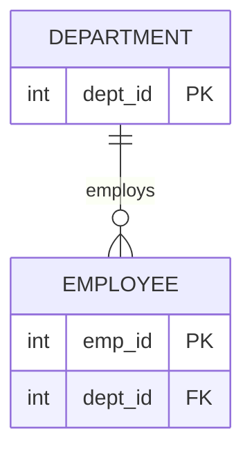

#### 보기
① DEPARTMENT가 자식 엔터티이고 EMPLOYEE가 부모 엔터티다.
② 하나의 EMPLOYEE는 여러 DEPARTMENT에 소속될 수 있다.
③ 하나의 DEPARTMENT에는 0명 이상의 EMPLOYEE가 소속될 수 있다.
④ 이 관계는 M:N 관계이므로 원칙적으로 교차엔터티가 필요하다.

<details>
<summary>정답과 해설</summary>

**정답: ③**
- ① X: DEPARTMENT의 dept_id를 EMPLOYEE가 FK로 보유하므로 DEPARTMENT가 부모, EMPLOYEE가 자식이다(방향이 반대로 서술됨).
- ② X: EMPLOYEE 쪽 카디널리티는 `||`(정확히 1)이므로 각 EMPLOYEE는 정확히 하나의 DEPARTMENT에만 소속된다.
- ③ O: DEPARTMENT 쪽 카디널리티는 `o{`(0 이상)이므로 부서에 소속 직원이 0명이어도 무방하다.
- ④ X: 까치발이 EMPLOYEE 쪽에만 있는 1:N 관계이며 M:N이 아니므로 교차엔터티가 필요하지 않다.

**적용 결정 트리:** 제11조(REL-01, 카디널리티) · 제13조(ERD-01, 까치발 판독)
**핵심 법리:** 부모의 기본키를 자식이 외래키로 보유하는 쪽이 자식 엔터티이며, 까치발이 있는 쪽이 "여럿일 수 있음(0 또는 다수)"을 나타낸다.

**관련 조항:** 헌법 제11조(REL-01), 제13조(ERD-01) · 상세 판례: `./04-관계와-ERD/REL-01-관계의-정의와-필수선택참여.md`, `./04-관계와-ERD/ERD-01-ERD-표기법과-카디널리티.md`

</details>

---

### 문제 ERD-02 (난이도: 중)

다음 ERD를 보고 옳은 설명을 고르시오.

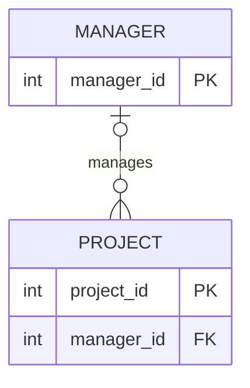

#### 보기
① PROJECT는 부모 엔터티이고 MANAGER가 자식 엔터티다.
② 모든 PROJECT는 반드시 담당 MANAGER가 지정되어야 한다.
③ 하나의 MANAGER는 0개 이상의 PROJECT를 담당할 수 있다.
④ PROJECT 쪽 참여는 필수참여로 표현되어 있다.

<details>
<summary>정답과 해설</summary>

**정답: ③**
- ① X: MANAGER의 manager_id를 PROJECT가 FK로 보유하므로 MANAGER가 부모, PROJECT가 자식이다(방향 반대).
- ② X: MANAGER 쪽 카디널리티가 `|o`(0 또는 1)이므로 PROJECT의 manager_id는 NULL을 허용하며, 담당자가 아직 없는 프로젝트도 존재할 수 있다.
- ③ O: PROJECT 쪽 카디널리티는 `o{`(0 이상)이므로 담당 프로젝트가 0개인 매니저도 있을 수 있다.
- ④ X: manager_id가 NULL을 허용하므로(선택적 FK) PROJECT 쪽 참여는 필수참여가 아니라 선택참여다.

**적용 결정 트리:** 제11조(REL-01, 필수·선택참여) · 제19조(ID-05, 외래키 NULL 허용)
**핵심 법리:** 외래키가 NULL을 허용하도록 설계되어 있으면 그 관계는 선택참여이며, 부모 없이도 자식 인스턴스가 생성될 수 있다.

**관련 조항:** 헌법 제11조(REL-01), 제19조(ID-05) · 상세 판례: `./04-관계와-ERD/REL-01-관계의-정의와-필수선택참여.md`, `./05-식별자/ID-05-외래키와-참조무결성.md`

</details>

---

### 문제 ERD-03 (난이도: 상)

다음 ERD는 학생과 강좌 사이의 수강신청 관계를 표현한 것이다.

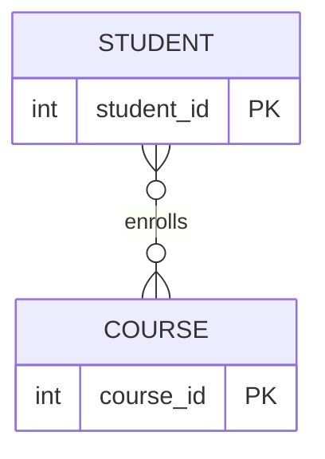

#### 보기
① 이 ERD는 M:N 관계를 올바르게 표현하고 있으므로 추가 수정이 필요 없다.
② 이 ERD는 M:N 관계이므로, 원칙적으로 수강신청과 같은 교차(연결) 엔터티를 두어 STUDENT-수강신청(1:N), 수강신청-COURSE(1:N) 관계로 분리해야 한다.
③ STUDENT와 COURSE는 각각 부모 엔터티이면서 동시에 자식 엔터티일 수 없으므로, 이 ERD 자체가 성립할 수 없는 구조다.
④ M:N 관계를 그대로 두는 대신, STUDENT 테이블에 COURSE의 기본키를 다중값 속성으로 저장하면 정상적인 모델이 된다.

<details>
<summary>정답과 해설</summary>

**정답: ②**
- ① X: M:N 관계는 원칙적으로 그대로 두지 않고 1:N과 M:1로 분리해야 한다(제11조).
- ② O: 수강신청 같은 교차엔터티를 두어 M:N을 두 개의 1:N 관계로 분리하는 것이 원칙적인 수정 방향이다.
- ③ X: 서로 다른 관계에서는 한 엔터티가 부모이면서 다른 관계에서는 자식일 수 있으므로, "동시에 부모·자식일 수 없다"는 서술은 이 ERD의 문제와 무관한 과장된 주장이다.
- ④ X: 기본키를 다중값 속성으로 저장하는 것은 단일값 원칙(제7조) 위반이며, M:N 문제의 해결책이 아니다.

**적용 결정 트리:** 제11조(REL-01, M:N 분리 원칙) · 제7조(ATTR-01, 단일값 원칙 참고)
**핵심 법리:** M:N 관계는 원칙적으로 교차엔터티를 두어 1:N과 M:1(N:1)로 분리해야 하며, 이를 다중값 속성으로 우회하는 것은 별도의 원칙(단일값 원칙) 위반이다.

**관련 조항:** 헌법 제11조(REL-01) · 상세 판례: `./04-관계와-ERD/REL-01-관계의-정의와-필수선택참여.md`

</details>

---

## 05 식별자

### 문제 05-A1 (난이도: 하)

주식별자의 성립요건에 대한 설명으로 옳은 것은?

#### 보기
① 주식별자는 값이 자주 변경되더라도 무방하다.
② 주식별자는 유일성을 만족하는 범위 내에서 최소한의 속성으로 구성해야 한다.
③ 주식별자로 지정된 속성은 NULL 값을 가질 수 있다.
④ 하나의 엔터티에는 주식별자와 보조식별자가 동시에 존재할 수 없다.

<details>
<summary>정답과 판례식 해설</summary>

### 주문
**정답: ②**

### 질문 극성
옳은 것을 묻는다.

### 적용 결정 트리
```text
선지가 유일성·최소성·불변성·존재성 중 무엇을 서술하는가?
├─ ①: 불변성 → "자주 바뀌면 안 됨"인데 반대로 서술 → X
├─ ②: 최소성 → "최소 속성으로 구성" → 정확한 방향 → O
├─ ③: 존재성 → "NULL 불허"인데 반대로 서술 → X
└─ ④: 존재하지 않는 원칙("동시 존재 불가")을 창작 → X
```

### 핵심 법리
주식별자는 유일성·최소성·불변성·존재성의 네 요건을 모두 갖춰야 한다. 최소성은 유일성을 만족하는 범위 내에서 속성 수를 최소화하는 것을 의미한다.

### 정답을 가르는 사실
②는 최소성 요건을 정확한 방향("최소한의 속성")으로 서술했다.

### 선지별 판단
| 선지 | O/X | 판단 이유 | 반복 오답 유형 |
| --- | --- | --- | --- |
| ① | X | 불변성 요건상 값은 자주 바뀌면 안 됨 | D2 반대개념 적용 |
| ② | O | 최소성 요건을 정확히 서술 | 해당 없음 |
| ③ | X | 존재성(개체무결성) 요건상 NULL은 허용되지 않음 | D2 반대개념 적용 |
| ④ | X | 주식별자와 보조식별자는 한 엔터티에 동시에 존재할 수 있음 | D1 정의 바꿔치기(존재하지 않는 원칙 창작) |

### 선지 교정
① "주식별자는 값이 자주 변경되지 않아야 한다"로 고치면 참
③ "주식별자로 지정된 속성은 NULL 값을 가질 수 없다"로 고치면 참
④ "하나의 엔터티에는 주식별자와 보조식별자가 동시에 존재할 수 있다"로 고치면 참

### 관련 조항
- 헌법 제15조(ID-01)
- 상세 판례: `./05-식별자/ID-01-주식별자의-성립요건.md`

</details>

---

### 문제 05-A2 (난이도: 중)

본질식별자와 인조식별자에 대한 설명으로 옳은 것은?

#### 보기
① 인조식별자는 복합키로 구성되는 경우가 많아 값 자체에 의미를 내포한다.
② 본질식별자는 업무 분석을 통해 자연적으로 발생한 값을 그대로 사용하므로 복합키가 되기 쉽다.
③ 인조식별자를 사용하면 원래 자연식별자의 중복 여부를 DB가 자동으로 감지·차단해준다.
④ 인조식별자는 값 자체에 의미가 있어 사용자가 쉽게 의미를 파악할 수 있다.

<details>
<summary>정답과 판례식 해설</summary>

### 주문
**정답: ②**

### 질문 극성
옳은 것을 묻는다.

### 적용 결정 트리
```text
식별자 값의 출처는?
├─ 업무에서 자연발생 → 본질식별자(의미 내포, 복합키 되기 쉬움) → ②는 정확
├─ 인위적 생성 → 인조식별자(의미 없는 일련번호, 단일키, 관리 간편)
│  └─ ①은 본질/인조 특징을 뒤바꿈, ④는 반대 서술
└─ 인조식별자를 쓴다고 자연식별자 중복이 자동 차단되지는 않음 → ③은 과장
```

### 핵심 법리
본질식별자는 자연발생 값을 그대로 사용해 의미를 내포하고 복합키가 되기 쉬우며, 인조식별자는 의미 없는 일련번호로 관리가 간편하지만 자연식별자의 중복을 자동으로 막아주지는 않는다.

### 정답을 가르는 사실
②는 본질식별자의 정의와 특징(자연발생, 복합키 경향)을 정확히 서술했다.

### 선지별 판단
| 선지 | O/X | 판단 이유 | 반복 오답 유형 |
| --- | --- | --- | --- |
| ① | X | "복합키 되기 쉬움"과 "의미 내포"는 인조식별자가 아니라 본질식별자의 특징 | D1 정의 바꿔치기 |
| ② | O | 본질식별자의 정의와 특징을 정확히 서술 | 해당 없음 |
| ③ | X | 인조식별자는 자연식별자 중복을 자동 차단하지 않음 | D4 범위 과장 |
| ④ | X | 인조식별자는 의미 없는 값이라 사용자가 의미를 파악하기 어려움 | D2 반대개념 적용 |

### 선지 교정
① "본질식별자는 복합키로 구성되는 경우가 많아 값 자체에 의미를 내포한다"로 고치면 참
③ "인조식별자를 사용해도 원래 자연식별자의 중복 여부는 DB가 자동으로 걸러주지 않는다"로 고치면 참
④ "인조식별자는 값 자체에 의미가 없어 사용자가 의미를 파악하기 어렵다"로 고치면 참

### 관련 조항
- 헌법 제17조(ID-03)
- 상세 판례: `./05-식별자/ID-03-본질식별자와-인조식별자.md`

</details>

---

### 문제 05-A3 (난이도: 중)

식별자의 구성방식 분류에 대한 설명으로 옳은 것은?

#### 보기
① 관계를 통해 다른 엔터티로부터 받아들인 식별자는 내부식별자다.
② 속성이 2개 이상 결합되어야 유일성을 만족하는 식별자는 복합식별자다.
③ 유일성·최소성을 만족하지 못하는 일반속성도 보조식별자가 될 수 있다.
④ 엔터티를 대표해 관계에 참조되지 않는 후보키는 주식별자로 선정해야 한다.

<details>
<summary>정답과 판례식 해설</summary>

### 주문
**정답: ②**

### 질문 극성
옳은 것을 묻는다.

### 적용 결정 트리
```text
세 가지 분류축 중 어느 것을 묻는가?
├─ 생성 주체: 자체 생성=내부식별자 / 관계로 받음=외부식별자 → ①은 반대 서술
├─ 속성 개수: 1개=단일 / 2개 이상=복합 → ②는 정확
└─ 대표성: 대표=주식별자 / 비대표=보조식별자
   ├─ ③: 유일성·최소성 미충족 속성은 애초에 식별자 후보가 아님 → X
   └─ ④: 대표로 선정되지 않은 후보키는 주식별자가 아니라 보조식별자 → X(반대 서술)
```

### 핵심 법리
식별자는 생성 주체(내부/외부), 속성 개수(단일/복합), 대표성(주/보조)이라는 세 가지 독립된 축으로 분류된다.

### 정답을 가르는 사실
②는 속성 개수 기준(단일/복합)의 정의를 정확히 서술했다.

### 선지별 판단
| 선지 | O/X | 판단 이유 | 반복 오답 유형 |
| --- | --- | --- | --- |
| ① | X | 관계를 통해 받아들인 식별자는 외부식별자이지 내부식별자가 아님 | D2 반대개념 적용 |
| ② | O | 복합식별자의 정의(속성 2개 이상 결합)를 정확히 서술 | 해당 없음 |
| ③ | X | 유일성·최소성을 갖추지 못한 속성은 식별자 후보 자체가 될 수 없음 | D3 조건 누락 |
| ④ | X | 대표로 선정되지 않으면 보조식별자이지 주식별자가 아님 | D2 반대개념 적용 |

### 선지 교정
① "관계를 통해 다른 엔터티로부터 받아들인 식별자는 외부식별자다"로 고치면 참
③ "유일성·최소성을 갖춘 후보키만 보조식별자가 될 수 있다"로 고치면 참
④ "엔터티를 대표해 관계에 참조되지 않는 후보키는 보조식별자로 남는다"로 고치면 참

### 관련 조항
- 헌법 제18조(ID-04)
- 상세 판례: `./05-식별자/ID-04-식별자의-구성방식-분류.md`

</details>

---

### 문제 05-A4 (난이도: 상)

외래키(FK)와 참조무결성에 대한 설명으로 옳은 것은?

#### 보기
① 외래키는 부모 테이블에 존재하지 않는 값도 자유롭게 저장할 수 있다.
② 외래키 컬럼은 그 관계가 필수참여로 설정된 경우에도 항상 NULL을 허용해야 한다.
③ 외래키 값은 부모 테이블에 실제로 존재하는 값이거나 NULL이어야 한다.
④ 외래키가 NULL을 허용하는지 여부는 참조무결성 규칙 자체에 의해 절대적으로 결정되며, 관계의 필수·선택 여부와는 무관하다.

<details>
<summary>정답과 판례식 해설</summary>

### 주문
**정답: ③**

### 질문 극성
옳은 것을 묻는다.

### 적용 결정 트리
```text
외래키(FK) 값이 무엇을 가리키는가?
├─ 부모 테이블에 실제로 존재하는 값 → 참조무결성 충족
├─ NULL(선택참여인 경우) → 참조무결성 충족(예외적 허용)
└─ 부모 테이블에 존재하지 않는 값 → 참조무결성 위반
→ ①은 위반을 허용처럼 서술, ②는 필수참여인데 NULL 허용은 모순,
  ④는 NULL 허용 여부가 참여방식과 무관하다고 서술(실제로는 관계 설계에 좌우)
```

### 핵심 법리
외래키 값은 반드시 부모 테이블에 실제로 존재하는 값이거나 NULL이어야 한다. 외래키의 NULL 허용 여부는 그 관계가 필수참여로 설계되었는지 선택참여로 설계되었는지에 달려 있다.

### 정답을 가르는 사실
③은 참조무결성 규칙(부모에 존재하는 값 또는 NULL)을 정확한 방향으로 서술했다.

### 선지별 판단
| 선지 | O/X | 판단 이유 | 반복 오답 유형 |
| --- | --- | --- | --- |
| ① | X | 부모 테이블에 없는 값을 저장하면 참조무결성 위반 | D2 반대개념 적용 |
| ② | X | 관계가 필수참여이면 외래키는 NULL을 허용하지 않아야 함(자기모순) | D2 반대개념 적용 |
| ③ | O | 참조무결성 규칙(존재하는 값 또는 NULL)을 정확히 서술 | 해당 없음 |
| ④ | X | NULL 허용 여부는 관계의 필수·선택 설계에 좌우되는 별개 문제임 | D4 범위 과장 |

### 선지 교정
① "외래키는 부모 테이블에 존재하는 값(또는 NULL)만 사용할 수 있다"로 고치면 참
② "외래키 컬럼은 관계가 필수참여로 설정된 경우 NULL을 허용하지 않는다"로 고치면 참
④ "외래키의 NULL 허용 여부는 관계가 필수참여인지 선택참여인지에 따라 달라진다"로 고치면 참

### 관련 조항
- 헌법 제19조(ID-05), 제11조(REL-01, 필수·선택참여와 NULL의 관계)
- 상세 판례: `./05-식별자/ID-05-외래키와-참조무결성.md`

</details>

---

### 문제 05-B1 (난이도: 중, 조합선지형)

다음 <보기>의 진술 중 옳은 것을 모두 고른 것은?

#### 보기
ㄱ. 부모 엔터티의 식별자가 자식 엔터티의 주식별자 일부로 포함되면 식별관계다.
ㄴ. 외부식별자가 자식 엔터티에 포함되어 있으면 그 관계는 항상 비식별관계다.
ㄷ. 식별관계는 ERD에서 실선으로, 비식별관계는 점선으로 표시한다.
ㄹ. 비식별관계에서는 외래키가 일반속성으로만 존재하며, NULL을 허용하는 경우 부모 없이도 자식 인스턴스가 독립적으로 생성될 수 있다.

① ㄱ, ㄷ
② ㄱ, ㄷ, ㄹ
③ ㄴ, ㄷ, ㄹ
④ ㄱ, ㄴ, ㄷ, ㄹ

<details>
<summary>정답과 판례식 해설</summary>

### 주문
**정답: ②**

### 질문 극성
모두 고른 것을 묻는다 → 각 진술 O/X 판정 → X 포함 조합 소거 → O만 포함 조합 채택

### 적용 결정 트리
```text
각 진술을 ID-02 법리에 대조
├─ ㄱ: 부모 식별자가 자식 주식별자에 포함 → 식별관계 정의 그대로 → O
├─ ㄴ: 외부식별자 "포함 여부"만으로 단순 판정 → 핵심은 주식별자 포함 여부이지 외부식별자 포함 여부가 아님 → X
├─ ㄷ: 실선(식별)·점선(비식별) 표기 → O
└─ ㄹ: 비식별관계는 외래키가 일반속성, NULL 허용 시 독립생성 가능 → O
→ X(ㄴ) 포함 조합 소거 → O만 남은 조합(ㄱ,ㄷ,ㄹ) 채택
```

### 핵심 법리
부모의 식별자가 자식의 주식별자 일부로 포함되면 식별관계(실선), 일반속성으로만 포함되면 비식별관계(점선)다. 외부식별자가 존재한다는 사실 자체만으로는 식별/비식별을 단정할 수 없다.

### 정답을 가르는 사실
ㄴ은 "외부식별자가 포함되면 무조건 비식별관계"라고 단순화했으나, 실제로는 그 외부식별자가 주식별자에 포함되는지 여부가 관건이다.

### 진술별 O/X 판정표
| 진술 | O/X | 이유 |
| --- | --- | --- |
| ㄱ | O | 식별관계의 정의 그대로 |
| ㄴ | X | 외부식별자 포함 여부만으로는 식별/비식별을 단정할 수 없음(주식별자 포함 여부가 관건) |
| ㄷ | O | 실선(식별)·점선(비식별) 표기 규칙 |
| ㄹ | O | 비식별관계의 외래키 특징(일반속성, NULL 허용 시 독립생성 가능) |

### 조합 판정표
| 선택지 | 포함된 진술 | X 포함 여부 | 채택/소거 |
| --- | --- | --- | --- |
| ① | ㄱ, ㄷ | 없음(불완전) | 소거(ㄹ 누락) |
| ② | ㄱ, ㄷ, ㄹ | 없음 | 채택(정답) |
| ③ | ㄴ, ㄷ, ㄹ | ㄴ 포함 | 소거 |
| ④ | ㄱ, ㄴ, ㄷ, ㄹ | ㄴ 포함 | 소거 |

### 진술 교정
ㄴ. "외부식별자가 자식의 주식별자 일부로 포함되면 식별관계이고, 일반속성으로만 포함되면 비식별관계다"로 고치면 참

### 관련 조항
- 헌법 제16조(ID-02)
- 상세 판례: `./05-식별자/ID-02-식별관계와-비식별관계.md`

</details>

---

### 문제 05-B2 (난이도: 상, 조합선지형)

다음 <보기>의 진술 중 옳은 것을 모두 고른 것은?

#### 보기
ㄱ. 주식별자의 최소성은 유일성을 만족하는 범위에서 속성 개수를 최대한 줄이는 것을 의미한다.
ㄴ. 부모 엔터티의 주식별자는 자식 엔터티의 외래키 값에 의해 결정되며, 자식의 외래키가 원본이고 부모의 주식별자가 이를 참조하는 종속적 값이다.
ㄷ. 주식별자는 존재성 요건에 따라 NULL을 허용하지 않는다.
ㄹ. 본질식별자와 인조식별자는 식별자 값의 발생 기원(자연발생/인위생성)을 기준으로 구분되며, 식별관계·비식별관계 판단과는 독립적인 분류축이다.

① ㄱ, ㄷ
② ㄱ, ㄷ, ㄹ
③ ㄴ, ㄷ, ㄹ
④ ㄱ, ㄴ, ㄹ

<details>
<summary>정답과 판례식 해설</summary>

### 주문
**정답: ②**

### 질문 극성
모두 고른 것을 묻는다 → 각 진술 O/X 판정 → X 포함 조합 소거 → O만 포함 조합 채택

### 적용 결정 트리
```text
각 진술을 ID-01·ID-02·ID-03 법리에 대조
├─ ㄱ: 최소성 = 유일성 유지 범위에서 최소 속성 → O
├─ ㄴ: 부모의 주식별자가 원본이고 자식의 외래키가 이를 참조하는 것이 원칙(제16조,제19조)
│  → ㄴ은 방향을 반대로 서술(자식 외래키가 부모 주식별자를 결정한다고 서술) → X
├─ ㄷ: 존재성(개체무결성) = NULL 불허 → O
└─ ㄹ: 본질/인조식별자(값의 발생 기원)와 식별/비식별관계(상속 방식)는 서로 다른 독립 축 → O
→ X(ㄴ) 포함 조합 소거 → O만 남은 조합(ㄱ,ㄷ,ㄹ) 채택
```

### 핵심 법리
부모 엔터티의 식별자가 자식에게 전달되는 것이지, 자식의 외래키가 부모의 주식별자를 결정하는 것이 아니다(제16조). 본질/인조식별자는 식별자 값의 발생 기원을, 식별/비식별관계는 그 값이 자식에게 상속되는 방식을 다루는 서로 다른 분류축이다(제17조).

### 정답을 가르는 사실
ㄴ은 부모(원본)와 자식(참조자)의 방향을 뒤바꿔, 자식의 외래키가 부모의 주식별자를 "결정"한다고 서술했다.

### 진술별 O/X 판정표
| 진술 | O/X | 이유 |
| --- | --- | --- |
| ㄱ | O | 최소성의 정의를 정확히 서술 |
| ㄴ | X | 부모의 식별자가 자식에게 전달되는 것이지, 자식의 외래키가 부모의 주식별자를 결정하는 것이 아님(방향 반대) |
| ㄷ | O | 존재성(개체무결성)의 정의를 정확히 서술 |
| ㄹ | O | 본질/인조식별자와 식별/비식별관계가 독립적 분류축이라는 서술이 정확함 |

### 조합 판정표
| 선택지 | 포함된 진술 | X 포함 여부 | 채택/소거 |
| --- | --- | --- | --- |
| ① | ㄱ, ㄷ | 없음(불완전) | 소거(ㄹ 누락) |
| ② | ㄱ, ㄷ, ㄹ | 없음 | 채택(정답) |
| ③ | ㄴ, ㄷ, ㄹ | ㄴ 포함 | 소거 |
| ④ | ㄱ, ㄴ, ㄹ | ㄴ 포함 | 소거 |

### 진술 교정
ㄴ. "부모 엔터티의 주식별자가 원본이며, 자식 엔터티의 외래키는 이 값을 참조(전달)받은 것이다"로 고치면 참

### 관련 조항
- 헌법 제15조(ID-01), 제16조(ID-02), 제17조(ID-03)
- 상세 판례: `./05-식별자/ID-01-주식별자의-성립요건.md`, `./05-식별자/ID-02-식별관계와-비식별관계.md`, `./05-식별자/ID-03-본질식별자와-인조식별자.md`

</details>

---

### 문제 05-C1 (난이도: 상, 사례형)

어느 병원 예약시스템에 [환자] 엔터티와 [진료예약] 엔터티가 있다.

> 환자번호는 환자 엔터티가 자체적으로 부여하는 일련번호(자동증가)이며, 진료예약 엔터티는 진료예약번호(자동증가, 진료예약 엔터티 자체에서 생성)를 주식별자로 사용하고, 환자번호는 진료예약 엔터티의 일반속성(외래키)으로만 보유한다. 진료예약 없이도 환자는 단독으로 등록될 수 있고, 환자 없이는 진료예약이 생성될 수 없다(진료예약 등록 시 환자번호가 반드시 입력되어야 하며 NULL을 허용하지 않는다).

이 상황에 대한 설명으로 옳은 것은?

#### 보기
① 환자-진료예약 관계는 식별관계이며, 진료예약의 주식별자는 환자번호를 포함한다.
② 환자-진료예약 관계는 비식별관계이며, 진료예약 엔터티의 환자번호는 외부식별자(외래키)이지만 주식별자에는 포함되지 않는다.
③ 진료예약번호는 외부식별자이고, 환자번호는 내부식별자이므로 진료예약 엔터티에서 두 속성 모두 내부식별자로 분류된다.
④ 환자번호 외래키는 참조무결성 규칙과 무관하게 NULL을 허용해야 한다.

<details>
<summary>정답과 판례식 해설</summary>

### 주문
**정답: ②**

### 질문 극성
옳은 것을 묻는다.

### 적용 결정 트리
```text
부모(환자)의 식별자가 자식(진료예약)에게 어떻게 쓰이는가?
├─ 진료예약의 주식별자 = 진료예약번호(자체 생성)뿐, 환자번호는 일반속성(FK)로만 존재
│  → 부모 식별자가 자식 주식별자에 포함되지 않음 → 비식별관계
├─ 진료예약번호: 진료예약 엔터티가 자체 생성 → 내부식별자
├─ 환자번호(진료예약 입장): 관계를 통해 받아들인 값 → 외부식별자
└─ "NULL 불허"로 지문에 명시 → 참조무결성 및 필수참여 설계와 일치
```

### 핵심 법리
부모의 식별자가 자식의 주식별자 일부로 포함되지 않고 일반속성(외부식별자)으로만 존재하면 비식별관계다(제16조). 엔터티 자신이 자체 생성한 식별자는 내부식별자, 관계를 통해 받아들인 식별자는 외부식별자다(제18조).

### 정답을 가르는 사실
진료예약의 주식별자가 진료예약번호 하나뿐이고 환자번호는 그 주식별자에 포함되지 않으므로 비식별관계이며, 환자번호는 진료예약 입장에서 외부식별자다.

### 선지별 판단
| 선지 | O/X | 판단 이유 | 반복 오답 유형 |
| --- | --- | --- | --- |
| ① | X | 환자번호가 진료예약의 주식별자에 포함되지 않으므로 식별관계가 아님 | D2 반대개념 적용 |
| ② | O | 비식별관계·외부식별자 판정을 정확히 서술 | 해당 없음 |
| ③ | X | 진료예약번호는 진료예약이 자체 생성했으므로 내부식별자이지 외부식별자가 아님(방향 반대) | D2 반대개념 적용 |
| ④ | X | 지문은 환자번호가 NOT NULL(NULL 불허)이라고 명시함 | D2 반대개념 적용 |

### 선지 교정
① "환자-진료예약 관계는 비식별관계다"로 고치면 참
③ "진료예약번호는 내부식별자이고, 환자번호는 외부식별자다"로 고치면 참
④ "환자번호 외래키는 참조무결성 규칙에 따라 NULL을 허용하지 않는다"로 고치면 참

### 관련 조항
- 헌법 제16조(ID-02), 제18조(ID-04), 제19조(ID-05)
- 상세 판례: `./05-식별자/ID-02-식별관계와-비식별관계.md`, `./05-식별자/ID-04-식별자의-구성방식-분류.md`, `./05-식별자/ID-05-외래키와-참조무결성.md`

</details>

---

### 문제 05-C2 (난이도: 최상, 사례형)

한 도서관 시스템에서 [회원] 엔터티의 주식별자는 회원이 스스로 발급받는 회원카드번호(랜덤 발급, 업무상 의미 없는 일련번호, 자동증가)이다. [대출] 엔터티는 대출번호(대출 엔터티가 자체 생성하는 자동증가 일련번호)와 회원카드번호(외래키)를 함께 주식별자로 구성한다. 대출 없이 회원은 단독으로 존재할 수 있지만, 대출은 반드시 회원이 있어야 생성될 수 있으며 회원카드번호 없이는 대출 인스턴스가 성립하지 않는다.

설계팀 신입사원은 다음과 같이 주장했다.

> "회원카드번호는 랜덤 일련번호이므로 본질식별자이고, 대출번호는 대출 엔터티에서 자체적으로 생성한 값이므로 인조식별자가 아니라 외부식별자로 봐야 한다. 또한 대출 엔터티의 회원카드번호는 대출번호보다 나중에 결합된 것이므로 내부식별자다."

이 신입사원의 주장과 실제 설계에 대한 평가로 옳은 것은?

#### 보기
① 회원카드번호는 본질식별자가 맞지만, 대출번호를 외부식별자로 본 것은 틀렸다 — 대출번호는 대출 엔터티가 자체 생성했으므로 내부식별자다.
② 회원카드번호는 의미 없는 랜덤 일련번호이므로 본질식별자가 아니라 인조식별자다. 대출번호는 대출 엔터티가 자체 생성했으므로 외부식별자가 아니라 내부식별자다. 회원카드번호는 대출 엔터티 입장에서 관계를 통해 받아들인 값이므로 내부식별자가 아니라 외부식별자다.
③ 신입사원의 주장은 모두 옳으며, 대출-회원 관계는 회원카드번호가 대출의 주식별자에 포함되므로 식별관계로 설계된 것도 타당하다.
④ 대출 엔터티의 주식별자에 회원카드번호가 포함되어 있지 않으므로 이 관계는 비식별관계이고, 신입사원이 회원카드번호를 내부식별자로 본 것은 옳다.

<details>
<summary>정답과 판례식 해설</summary>

### 주문
**정답: ②**

### 질문 극성
옳은 것을 묻는다.

### 적용 결정 트리
```text
회원카드번호: 랜덤·의미 없음·자동증가 → 인조식별자(제17조, 본질식별자 아님)
대출번호: 대출 엔터티 자체 생성 → 내부식별자(제18조, 외부식별자 아님)
회원카드번호(대출 입장): 관계를 통해 받아들인 값 → 외부식별자(제18조, 내부식별자 아님)
대출의 주식별자 = {대출번호, 회원카드번호} → 회원카드번호 포함 → 식별관계(제16조)
```

### 핵심 법리
식별자 값이 업무상 의미 없이 인위적으로 부여됐으면 인조식별자다(제17조). 엔터티 자신이 자체 생성한 값은 내부식별자, 관계를 통해 받아들인 값은 외부식별자다(제18조). 이 두 분류축은 서로 독립적이므로 함께 정확히 판정해야 한다.

### 정답을 가르는 사실
신입사원은 "랜덤·의미 없음(인조식별자의 정의)"을 "본질식별자"로, "자체 생성(내부식별자의 정의)"을 "외부식별자"로, "관계로 받아들인 값(외부식별자의 정의)"을 "내부식별자"로 — 세 곳 모두 반대로 서술했다.

### 선지별 판단
| 선지 | O/X | 판단 이유 | 반복 오답 유형 |
| --- | --- | --- | --- |
| ① | X | 대출번호 판정(내부식별자)은 맞지만, 회원카드번호를 본질식별자로 본 첫 전제가 틀림(부분 정답 함정) | D1 정의 바꿔치기(일부만 교정) |
| ② | O | 세 가지 판정(인조식별자·내부식별자·외부식별자)을 모두 정확히 교정 | 해당 없음 |
| ③ | X | 신입사원의 주장은 세 가지 모두 틀렸으므로 "모두 옳다"는 전제 자체가 오류(결론인 식별관계 판정은 맞지만 이유가 틀림) | D1 정의 바꿔치기 |
| ④ | X | 대출의 주식별자는 회원카드번호를 포함하므로 비식별관계가 아니라 식별관계다(전제 오류) | D2 반대개념 적용 |

### 선지 교정
① "회원카드번호는 인조식별자다"로 고치면 참
③ "신입사원의 주장은 세 항목 모두 틀렸다"로 고치면 참(다만 식별관계라는 결론 자체는 옳음 — 결론은 맞지만 근거가 틀린 사례)
④ "대출-회원 관계는 회원카드번호가 대출의 주식별자에 포함되므로 식별관계다"로 고치면 참

### 관련 조항
- 헌법 제16조(ID-02), 제17조(ID-03), 제18조(ID-04)
- 상세 판례: `./05-식별자/ID-02-식별관계와-비식별관계.md`, `./05-식별자/ID-03-본질식별자와-인조식별자.md`, `./05-식별자/ID-04-식별자의-구성방식-분류.md`

</details>

---

### 문제 05-F1 (난이도: 상, 장문 지문형)

한 렌터카 회사가 다음과 같은 데이터 구조를 설계했다.

> ① [차량] 엔터티의 주식별자는 차량이 스스로 부여받는 차대번호(VIN, 업무상 자연적으로 부여되는 17자리 고유값)이다. 이 값은 한번 부여되면 절대 변경되지 않는다.
> ② [예약] 엔터티는 예약번호(예약 엔터티가 자체 생성하는 자동증가 일련번호)를 주식별자로 사용하며, 차대번호는 예약 엔터티의 일반속성(외래키)으로만 보유한다. 예약 없이도 차량은 단독으로 등록될 수 있고, 예약은 차대번호 없이 생성될 수 없다(차대번호 컬럼은 NOT NULL로 설정된다).
> ③ [정비이력] 엔터티는 차대번호와 정비순번(정비이력 내에서 차량별로 1부터 순차 부여되는 값)을 결합해 주식별자로 구성하며, 정비이력은 차량 없이 단독으로 생성될 수 없다.
> ④ 설계팀은 예약번호 자체는 아무런 업무적 의미가 없다고 판단해 이 값을 채택했다.

이 설계에 대한 평가로 옳은 것은?

#### 보기
① 차대번호는 업무에서 자연적으로 발생한 값을 그대로 사용하므로 본질식별자이며, 불변성 요건도 함께 만족한다.
② 차량-예약 관계는 차대번호가 예약의 주식별자 일부로 포함되므로 식별관계다.
③ 정비이력의 주식별자는 차대번호를 포함하지 않는 단일식별자이며, 차량-정비이력 관계는 비식별관계다.
④ 예약번호는 업무적 의미가 없는 값이므로 본질식별자이며, 이는 회사가 인조식별자보다 본질식별자를 선호했음을 보여준다.

<details>
<summary>정답과 판례식 해설</summary>

### 주문
**정답: ①**

### 질문 극성
옳은 것을 묻는다.

### 적용 결정 트리
```text
① 차대번호: 업무상 자연발생 + "절대 변경되지 않음" → 본질식별자(제17조) + 불변성 충족(제15조)
② 차량-예약: 차대번호는 예약의 "일반속성(외래키)"일 뿐 주식별자에 미포함 → 비식별관계(제16조, ②는 반대 서술)
③ 정비이력: 주식별자 = {차대번호, 정비순번}의 복합식별자, 차대번호 포함 → 식별관계(제16조, ③은 이중 오류)
④ 예약번호: "업무적 의미 없음" → 인조식별자(제17조, ④는 반대 서술)
```

### 핵심 법리
업무에서 자연발생하고 불변하는 값은 본질식별자다(제15·17조). 부모의 식별자가 자식의 일반속성(외래키)으로만 존재하면 비식별관계, 주식별자에 포함되면 식별관계다(제16조). 업무적 의미가 없는 값은 인조식별자다(제17조).

### 정답을 가르는 사실
①만 "자연발생 + 불변성"이라는 본질식별자의 두 특징을 지문의 사실과 정확히 대조해 서술했다.

### 선지별 판단
| 선지 | O/X | 판단 이유 | 반복 오답 유형 |
| --- | --- | --- | --- |
| ① | O | 자연발생·불변이라는 지문 사실이 본질식별자·불변성 요건과 정확히 일치 | 해당 없음 |
| ② | X | 차대번호는 예약의 일반속성(외래키)일 뿐 주식별자에 포함되지 않으므로 비식별관계 | D2 반대개념 적용 |
| ③ | X | 정비이력의 주식별자는 차대번호를 포함하는 복합식별자이며, 그 관계는 식별관계(단일식별자·비식별관계 이중 오류) | D2 반대개념 적용(이중) |
| ④ | X | 업무적 의미가 없는 값은 인조식별자이지 본질식별자가 아님 | D2 반대개념 적용 |

### 선지 교정
② "차량-예약 관계는 비식별관계다"로 고치면 참
③ "정비이력의 주식별자는 차대번호를 포함하는 복합식별자이며, 차량-정비이력 관계는 식별관계다"로 고치면 참
④ "예약번호는 인조식별자다"로 고치면 참

### 관련 조항
- 헌법 제15조(ID-01), 제16조(ID-02), 제17조(ID-03), 제18조(ID-04)
- 상세 판례: `./05-식별자/ID-01-주식별자의-성립요건.md`, `./05-식별자/ID-02-식별관계와-비식별관계.md`, `./05-식별자/ID-03-본질식별자와-인조식별자.md`, `./05-식별자/ID-04-식별자의-구성방식-분류.md`

</details>

---

### 문제 ERD-04 (난이도: 하)

다음 ERD를 보고 옳은 설명을 고르시오.

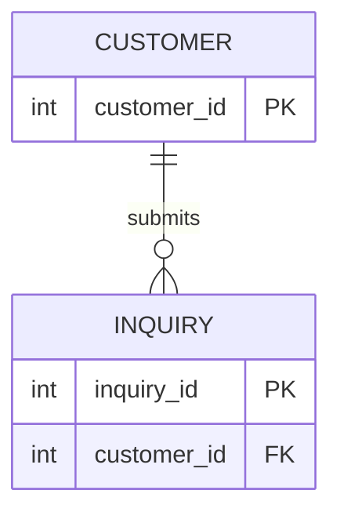

#### 보기
① CUSTOMER가 자식 엔터티이고 INQUIRY가 부모 엔터티다.
② INQUIRY의 주식별자는 inquiry_id 하나이며, customer_id는 주식별자에 포함되지 않는 일반속성(외래키)이다.
③ CUSTOMER와 INQUIRY의 관계는 식별관계이므로 ERD에서 실선으로 표시해야 한다.
④ customer_id는 INQUIRY 엔터티가 자체적으로 생성한 내부식별자다.

<details>
<summary>정답과 해설</summary>

**정답: ②**
- ① X: CUSTOMER의 customer_id를 INQUIRY가 FK로 보유하므로 CUSTOMER가 부모, INQUIRY가 자식이다(방향 반대).
- ② O: INQUIRY의 PK는 inquiry_id뿐이며 customer_id는 PK에 포함되지 않은 일반속성(FK)이다.
- ③ X: customer_id가 INQUIRY의 주식별자에 포함되지 않으므로 비식별관계이며, 점선으로 표시해야 한다.
- ④ X: customer_id는 CUSTOMER로부터 관계를 통해 받아들인 외부식별자이지 INQUIRY가 자체 생성한 내부식별자가 아니다.

**적용 결정 트리:** 제16조(ID-02, 주식별자 포함 여부로 식별/비식별 판정) · 제18조(ID-04, 내부/외부식별자)
**핵심 법리:** 부모의 식별자가 자식의 주식별자에 포함되지 않고 일반속성(FK)으로만 있으면 비식별관계이며, 그 FK는 자식 입장에서 외부식별자다.

**관련 조항:** 헌법 제16조(ID-02), 제18조(ID-04) · 상세 판례: `./05-식별자/ID-02-식별관계와-비식별관계.md`, `./05-식별자/ID-04-식별자의-구성방식-분류.md`

</details>

---

### 문제 ERD-05 (난이도: 중)

다음 ERD를 보고 옳은 설명을 고르시오.

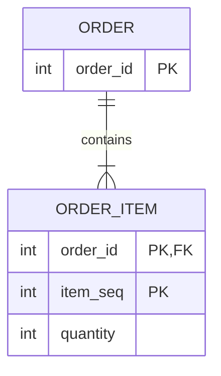

#### 보기
① ORDER-ORDER_ITEM 관계는 비식별관계이며, ERD에서 점선으로 표시해야 한다.
② ORDER_ITEM의 주식별자는 order_id와 item_seq로 구성된 복합식별자이며, order_id는 ORDER로부터 받아들인 외부식별자이자 동시에 ORDER_ITEM 주식별자의 일부다.
③ order_id는 ORDER_ITEM 입장에서 내부식별자이며, ORDER와의 관계는 식별관계다.
④ ORDER_ITEM은 order_id 없이도 독립적으로 인스턴스를 생성할 수 있다.

<details>
<summary>정답과 해설</summary>

**정답: ②**
- ① X: order_id가 ORDER_ITEM의 주식별자(PK)에 포함되어 있으므로 식별관계이며, 실선으로 표시해야 한다.
- ② O: ORDER_ITEM의 PK는 order_id + item_seq이며, order_id는 ORDER로부터 관계를 통해 받아들인 외부식별자이면서 동시에 주식별자의 일부다(제16조·제18조가 동시에 성립).
- ③ X: order_id는 ORDER_ITEM이 자체 생성한 값이 아니라 ORDER로부터 받아들인 값이므로 외부식별자다(내부/외부가 반대로 서술됨). 다만 "식별관계"라는 결론 자체는 옳다(이유가 틀린 경우).
- ④ X: 식별관계이므로 부모(order_id) 없이 ORDER_ITEM 인스턴스가 독립적으로 생성될 수 없다.

**적용 결정 트리:** 제16조(ID-02, 식별관계 판정) · 제18조(ID-04, 내부/외부·단일/복합 동시 적용)
**핵심 법리:** 하나의 속성은 여러 분류축(외부식별자이면서 동시에 주식별자의 일부)에 동시에 해당할 수 있으며, 세 분류축(생성주체/속성개수/대표성)은 서로 독립적으로 적용된다.

**관련 조항:** 헌법 제16조(ID-02), 제18조(ID-04) · 상세 판례: `./05-식별자/ID-02-식별관계와-비식별관계.md`, `./05-식별자/ID-04-식별자의-구성방식-분류.md`

</details>

---

### 문제 ERD-06 (난이도: 상)

다음 ERD는 상품-상품옵션-옵션재고의 3단계 구조를 표현한 것이다.

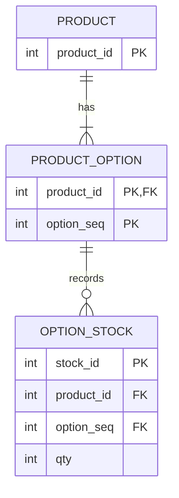

#### 보기
① PRODUCT_OPTION의 주식별자는 product_id와 option_seq로 구성되며, PRODUCT-PRODUCT_OPTION 관계는 식별관계다.
② OPTION_STOCK의 주식별자는 stock_id, product_id, option_seq 세 속성을 모두 포함하는 복합식별자이며, PRODUCT_OPTION-OPTION_STOCK 관계도 식별관계로 연쇄된다.
③ OPTION_STOCK 엔터티는 product_id와 option_seq 없이는 절대 생성될 수 없으므로, 이 관계는 반드시 식별관계로 수정해야 하는 설계 오류다.
④ PRODUCT-PRODUCT_OPTION 관계와 PRODUCT_OPTION-OPTION_STOCK 관계는 모두 동일하게 실선으로 표시된다.

<details>
<summary>정답과 해설</summary>

**정답: ①**
- ① O: PRODUCT_OPTION의 PK는 product_id(PRODUCT로부터 상속)와 option_seq로 구성된 복합식별자이며, product_id가 주식별자에 포함되므로 식별관계다.
- ② X: OPTION_STOCK의 PK는 stock_id 하나뿐이다. product_id와 option_seq는 PK가 아니라 일반속성(FK)이므로 OPTION_STOCK의 주식별자는 단일식별자이며, PRODUCT_OPTION-OPTION_STOCK 관계는 식별관계가 아니라 비식별관계다(연쇄가 이어지지 않음).
- ③ X: product_id·option_seq가 NOT NULL FK로 참조무결성을 지키면서도 OPTION_STOCK 자신의 PK에는 포함되지 않는 비식별관계 설계는 정상적으로 가능한 구조다. "반드시 식별관계로 수정해야 한다"는 과도한 일반화다.
- ④ X: PRODUCT-PRODUCT_OPTION은 식별관계(실선)이지만 PRODUCT_OPTION-OPTION_STOCK은 비식별관계(점선)이므로 두 관계의 표시가 서로 다르다.

**적용 결정 트리:** 제16조(ID-02, 관계마다 개별적으로 부모 식별자의 주식별자 포함 여부를 판정)
**핵심 법리:** 식별관계 여부는 전체 구조가 아니라 각 관계(부모-자식 쌍)마다 "부모의 식별자가 자식의 주식별자에 포함되는가"를 개별적으로 판정한다. 상위 단계가 식별관계라고 해서 다음 단계도 자동으로 식별관계가 되는 것은 아니며, 자식이 별도의 단일 주식별자(stock_id)를 가지면 그 지점에서 비식별관계로 연쇄가 끊길 수 있다.

**관련 조항:** 헌법 제16조(ID-02) · 상세 판례: `./05-식별자/ID-02-식별관계와-비식별관계.md`

</details>
## 06 정규화

### 문제 06-01 (유형: A / 난이도: 하)

다음 중 정규화와 이상현상에 대한 설명으로 **옳지 않은 것**을 고르시오.

#### 보기
① 정규화는 논리적 데이터 모델링 단계에서 함수종속성을 분석해 테이블을 무손실 분해하는 작업이다.
② 담당교수가 아직 배정되지 않아 신입생 정보 자체를 입력할 수 없는 것은 삽입이상의 예다.
③ 같은 학생 이름이 여러 행에 중복 저장된 테이블에서 한 행의 이름만 고쳐 두 행의 값이 서로 달라지는 것은 갱신이상의 예다.
④ 이상현상은 삽입이상·갱신이상·삭제이상·생성이상 네 가지로 분류된다.

<details>
<summary>정답과 판례식 해설</summary>

### 주문
**정답: ④**

### 질문 극성
옳지 않은 것(X)을 찾는 부정형 문제 — 나머지 세 선지는 법리에 부합하므로 소거하고, 법리에 어긋나는 하나만 남긴다.

### 적용 결정 트리
```text
선지가 이상현상을 몇 가지로 분류하는가?
│
├─ 삽입·갱신·삭제 3가지로 분류 → 법리에 맞음(O)
└─ "생성이상"을 포함해 4가지로 분류 → 법리에 어긋남(X, 존재하지 않는 용어)
```

### 핵심 법리
정규화는 논리적 모델링 단계에서 함수종속성을 분석해 무손실 분해를 수행하는 작업이며, 이를 하지 않으면 삽입이상·갱신이상·삭제이상 세 가지만 발생한다. "생성이상"이라는 용어는 존재하지 않는다.

### 정답을 가르는 사실
필요한 다른 정보가 없어 입력 자체가 불가능하면 삽입이상, 중복 저장된 값 중 일부만 고쳐 불일치가 생기면 갱신이상, 행을 지울 때 함께 필요한 정보까지 사라지면 삭제이상이다. 이상현상의 유형은 이 세 가지뿐이다.

### 선지별 판단
| 선지 | O/X | 판단 이유 |
|---|---|---|
| ① | O | 정규화의 수행 단계(논리적 모델링)와 목적(무손실 분해)에 대한 정확한 서술 |
| ② | O | 필요한 다른 정보(담당교수)의 부재로 무관한 정보(신입생)조차 입력 못하는 삽입이상의 정의에 부합 |
| ③ | O | 중복 저장된 값 중 일부만 고쳐 불일치가 발생하는 갱신이상의 정의에 부합 |
| ④ | X | 이상현상은 삽입·갱신·삭제 3유형뿐이며 "생성이상"이라는 용어는 존재하지 않는다 |

### 선지 교정
④ "이상현상은 삽입이상·갱신이상·삭제이상 세 가지로 분류된다."

### 관련 조항
- 헌법 제20조(NORM-01)
- 상세 판례: `./06-정규화/NORM-01-정규화의-목적과-이상현상.md`

</details>

---

### 문제 06-02 (유형: A / 난이도: 하)

릴레이션 회원(회원번호, 이름, 가입일, 회원등급)에서 회원번호 값이 정해지면 회원등급 값이 항상 하나로 정해진다. 이에 대한 설명으로 **옳은 것**을 고르시오.

#### 보기
① 이 관계는 "회원번호 → 회원등급"으로 표기하며, 회원번호가 결정자(Determinant)이고 회원등급이 종속자(Dependent)이다.
② 회원등급이 결정자이고 회원번호가 종속자이다.
③ 회원번호가 회원등급을 함수적으로 결정하므로, 회원등급 값이 같은 두 행은 회원번호도 항상 같아야 한다.
④ 이 함수종속 관계는 하나의 회원번호에 회원등급 값이 두 개 이상 대응할 수 있다는 것을 전제로 한다.

<details>
<summary>정답과 판례식 해설</summary>

### 주문
**정답: ①**

### 질문 극성
옳은 것(O)을 찾는 문제 — 각 선지를 함수종속의 정의(X→Y, X가 결정자)에 대입해 O/X를 가린 뒤 O 하나만 남긴다.

### 적용 결정 트리
```text
속성 집합 X의 값이 정해지면 Y의 값이 하나로 결정되는가?
│
├─ 예 → X → Y 함수종속 성립
│  ├─ X = 결정자(Determinant)
│  └─ Y = 종속자(Dependent)
│
└─ 아니오 → 함수종속 아님
```

### 핵심 법리
함수종속 X→Y는 X의 값이 정해지면 Y의 값이 오직 하나로 결정된다는 관계이며, X를 결정자, Y를 종속자라 한다. 이 관계는 방향성을 가지므로 역방향(Y가 같으면 X도 같다)이 성립한다고 볼 수 없고, Y가 여러 값을 동시에 가질 수 있다는 것도 함수종속의 정의와 모순된다.

### 정답을 가르는 사실
"회원번호 값이 정해지면 회원등급 값이 하나로 정해진다"는 서술 자체가 회원번호가 결정자, 회원등급이 종속자임을 그대로 말해준다. 결정자·종속자의 방향을 반대로 서술하거나, 함수종속의 역(逆)이 성립한다고 서술하거나, 종속자가 다중값을 가질 수 있다고 서술하면 모두 오답이다.

### 선지별 판단
| 선지 | O/X | 판단 이유 |
|---|---|---|
| ① | O | 회원번호(X)가 정해지면 회원등급(Y)이 하나로 정해지므로 회원번호가 결정자, 회원등급이 종속자 |
| ② | X | 결정자·종속자의 방향을 반대로 서술 — 문제의 전제(회원번호→회원등급)와 모순 |
| ③ | X | 함수종속의 역(逆)이 항상 성립한다고 서술한 논리적 오류 — X→Y가 성립해도 Y가 같다고 X가 같아야 하는 것은 아님(예: 여러 회원이 같은 등급을 가질 수 있음) |
| ④ | X | 함수종속은 하나의 X값에 Y값이 오직 하나로 대응한다는 정의이므로, 다중값 대응을 전제로 한다는 서술은 정의 자체와 모순 |

### 선지 교정
② "회원번호가 결정자이고 회원등급이 종속자이다." / ③ "회원번호가 같은 두 행은 회원등급도 항상 같아야 한다(역은 성립하지 않는다)." / ④ "하나의 회원번호에는 회원등급 값이 오직 하나만 대응한다."

### 관련 조항
- 헌법 제20조(NORM-01)
- 상세 판례: `./06-정규화/NORM-01-정규화의-목적과-이상현상.md`

</details>

---

### 문제 06-03 (유형: A / 난이도: 중)

다음과 같이 고객 정보를 관리하는 릴레이션이 있다.

`고객(고객번호, 고객명, 연락처1, 연락처2, 연락처3)`

한 고객이 여러 개의 연락처를 가질 수 있어, 연락처를 "연락처1, 연락처2, 연락처3"처럼 번호를 붙인 컬럼으로 나누어 저장하고 있다. 이에 대한 설명으로 **옳지 않은 것**을 고르시오.

#### 보기
① 연락처1~3처럼 같은 의미의 컬럼이 번호를 붙여 반복되는 것은 도메인 원자성 위반으로 1NF 위반에 해당한다.
② 이 문제를 해결하려면 연락처를 별도 엔터티로 분리하고 고객과 1:M 관계로 연결해야 한다.
③ 이 위반은 연락처 속성이 고객번호에 부분함수종속되어 있기 때문에 발생한다.
④ 1NF를 충족시킨 이후에도, 복합키를 갖는 릴레이션이라면 부분함수종속 여부는 별도로 검토해야 한다.

<details>
<summary>정답과 판례식 해설</summary>

### 주문
**정답: ③**

### 질문 극성
옳지 않은 것(X)을 찾는 부정형 문제 — 1NF의 판단 기준(원자값 여부)과 2NF의 판단 기준(부분함수종속 여부)을 혼동시키는 선지를 가려낸다.

### 적용 결정 트리
```text
한 셀(컬럼)에 여러 값이 들어 있거나, 같은 의미의 컬럼이 번호를 붙여 반복되는가?
│
├─ 예 → 반복속성·다중값 존재 → 1NF 위반
│  └─ 해당 속성을 별도 엔터티로 분리해 1:M 관계로 연결해야 충족
│
└─ 아니오(모든 속성값이 원자값) → 1NF 충족
   └─ (이후 복합키 여부에 따라 2NF 부분함수종속 여부를 별도로 검토, 제22조)
```

### 핵심 법리
1NF는 "속성값이 원자값인가"를 판단 기준으로 삼는 도메인 원자성의 문제이며, 부분함수종속은 "복합키의 일부에만 종속되는가"를 판단 기준으로 삼는 2NF의 문제다. 두 개념은 서로 다른 축(원자성 vs 종속성)의 판단이므로, 1NF 위반의 원인을 부분함수종속으로 설명하는 것은 성립하지 않는다.

### 정답을 가르는 사실
이 릴레이션은 아직 기본키가 복합키인지조차 확정되지 않았고(고객번호 단일키로 추정됨), 연락처가 반복되는 원인은 "하나의 셀에 원자값이 아닌 반복 항목이 들어있기 때문"이지 "복합키의 일부에만 종속되기 때문"이 아니다. 부분함수종속은 복합키를 가진 릴레이션에서만 성립할 수 있는 개념(제22조)이므로, 단일키로 보이는 이 릴레이션의 1NF 위반 원인으로 제시하는 것은 개념 자체가 성립하지 않는다.

### 선지별 판단
| 선지 | O/X | 판단 이유 |
|---|---|---|
| ① | O | 번호 붙은 반복 컬럼은 도메인 원자성 위반으로 1NF 위반의 전형적 사례 |
| ② | O | 1NF 위반 해소는 반복 속성을 별도 엔터티로 분리해 1:M 관계로 연결하는 것 |
| ③ | X | 1NF 위반의 원인은 "원자값이 아님"이지 "부분함수종속"이 아니며, 부분함수종속은 복합키를 전제로 하는 2NF 개념이다 |
| ④ | O | 1NF 충족 이후 복합키 릴레이션이라면 2NF(부분함수종속) 검토가 별도로 필요하다는 정규화 단계 순서에 대한 정확한 서술 |

### 선지 교정
③ "이 위반은 연락처 속성이 원자값을 갖지 못하고 여러 값을 반복해서 갖기 때문에 발생한다(도메인 원자성 위반)."

### 관련 조항
- 헌법 제21조(NORM-02), 제22조(NORM-03) — 반드시 구별할 것
- 상세 판례: `./06-정규화/NORM-02-제1정규형.md`

</details>

---

### 문제 06-04 (유형: D / 난이도: 중)

컨퍼런스 운영팀은 다음과 같이 세미나 참가신청 내역을 하나의 릴레이션으로 관리한다.

`참가신청(세미나번호, 발표자코드, 참가비, 발표자소속, 신청좌석수)`

| 세미나번호 | 발표자코드 | 참가비 | 발표자소속 | 신청좌석수 |
|---|---|---|---|---|
| S01 | P01 | 30000 | A대학교 | 40 |
| S01 | P02 | 30000 | B연구소 | 25 |
| S02 | P03 | 50000 | C기업 | 60 |

기본키는 `(세미나번호, 발표자코드)`이다. 하나의 세미나에 여러 발표자가 배정될 수 있고, 참가비는 세미나 단위로 동일하게 책정된다.

#### 보기
① 세미나번호는 참가비를 함수적으로 결정한다.
② 발표자코드는 발표자소속을 함수적으로 결정한다.
③ 신청좌석수는 세미나번호에만 완전함수종속된다.
④ 참가비와 발표자소속 때문에 이 릴레이션은 제2정규형을 위반한다.

<details>
<summary>정답과 판례식 해설</summary>

### 주문
**정답: ③**

### 함수 종속 다이어그램
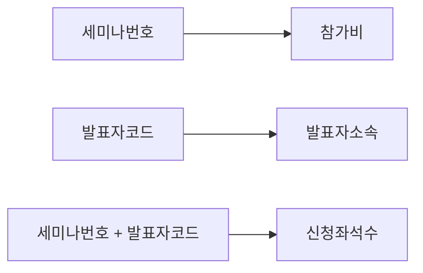

### 종속 판정표
| 속성 | 결정자 | 종속 유형 | 판정 |
| --- | --- | --- | --- |
| 참가비 | 세미나번호 | 부분함수종속 | 2NF 위반 |
| 발표자소속 | 발표자코드 | 부분함수종속 | 2NF 위반 |
| 신청좌석수 | 세미나번호+발표자코드 | 완전함수종속 | 유지 |

### 선지별 판단
| 선지 | O/X | 판단 이유 |
|---|---|---|
| ① | O | 세미나번호가 정해지면 참가비가 하나로 결정됨(부분함수종속의 근거) |
| ② | O | 발표자코드가 정해지면 발표자소속이 하나로 결정됨(부분함수종속의 근거) |
| ③ | X | 신청좌석수는 "세미나번호"가 아니라 "세미나번호+발표자코드" 전체에 완전함수종속됨(하나의 세미나 안에서도 발표자마다 신청좌석수가 다름) |
| ④ | O | 참가비·발표자소속이 복합키의 일부에만 종속되는 부분함수종속이므로 2NF 위반의 원인 |

### 선지 교정
③ "신청좌석수는 세미나번호와 발표자코드 전체에 완전함수종속된다."

### 관련 조항
- 헌법 제22조(NORM-03)
- 상세 판례: `./06-정규화/NORM-03-제2정규형과-부분함수종속.md`

</details>

---

### 문제 06-05 (유형: B / 난이도: 중)

다음은 온라인 강좌 수강료 납부 내역을 관리하는 릴레이션이다.

`수강료납부(학번, 강좌코드, 납부일, 학생이름, 강좌명, 강좌등급, 강좌등급별할인율)`

기본키는 `(학번, 강좌코드)`이다. 학번이 정해지면 학생이름이 하나로 정해지고, 강좌코드가 정해지면 강좌명과 강좌등급이 각각 하나로 정해진다. 또한 강좌등급이 정해지면 강좌등급별할인율이 하나로 정해진다(예: 강좌등급 "프리미엄"은 항상 할인율 10%).

다음 ㄱ~ㄹ 중 옳은 것을 모두 고른 것은?

ㄱ. 학생이름은 학번에 부분함수종속되어 있다.
ㄴ. 강좌명은 강좌코드에 이행함수종속되어 있다.
ㄷ. 강좌등급별할인율은 강좌등급에 함수종속되며, 이는 이행함수종속에 해당한다.
ㄹ. 납부일은 학번과 강좌코드 전체에 완전함수종속되어 있다.

#### 보기
① ㄱ, ㄴ
② ㄱ, ㄷ, ㄹ
③ ㄴ, ㄷ, ㄹ
④ ㄱ, ㄴ, ㄷ, ㄹ

<details>
<summary>정답과 판례식 해설</summary>

### 주문
**정답: ②**

### 질문 극성
조합선지형 — 각 진술을 O/X로 판정한 뒤, X가 포함된 조합을 소거하고 O만 포함된 조합을 채택한다.

### 적용 결정 트리
```text
결정자가 무엇인가?
│
├─ 복합 기본키의 일부 → 그 종속은 부분함수종속(2NF 영역)
├─ 기본키가 아닌 일반속성 → 그 종속은 이행함수종속(3NF 영역)
└─ 기본키 전체(복합키 전체) → 완전함수종속(2NF 충족)
```

### 핵심 법리
결정자가 복합 기본키의 "일부"이면 부분함수종속(제22조), 결정자가 "일반속성"이면 이행함수종속(제23조)이다. 강좌명·강좌등급의 결정자인 강좌코드는 기본키의 일부이므로 그 종속은 부분함수종속이지 이행함수종속이 아니다. 반면 강좌등급별할인율의 결정자인 강좌등급은 기본키가 아닌 일반속성이므로, 강좌코드→강좌등급→할인율로 이어지는 이행함수종속이 성립한다.

### 정답을 가르는 사실
강좌코드는 기본키의 일부이므로 강좌코드가 결정하는 모든 종속(강좌명, 강좌등급)은 부분함수종속이다. 반면 강좌등급은 기본키가 아닌 일반속성이므로, 강좌등급이 결정하는 할인율과의 관계는 이행함수종속이다. "강좌코드에 이행함수종속"이라는 표현은 결정자가 기본키의 일부라는 점을 무시한 오류다.

### 진술별 O/X 판정
| 진술 | O/X | 판단 이유 |
|---|---|---|
| ㄱ | O | 학생이름은 기본키의 일부인 학번에만 종속 → 부분함수종속 |
| ㄴ | X | 강좌명의 결정자(강좌코드)는 기본키의 일부이므로 부분함수종속이지 이행함수종속이 아니다 |
| ㄷ | O | 강좌등급(일반속성)이 할인율(일반속성)을 결정하므로 이행함수종속의 정의에 정확히 부합 |
| ㄹ | O | 납부일은 학번+강좌코드 조합이 있어야만 하나로 정해지므로 완전함수종속 |

### 조합판정표
| 조합 | 포함 진술 | 채택 여부 |
|---|---|---|
| ① | ㄱ,ㄴ | ㄴ이 X이므로 소거 |
| ② | ㄱ,ㄷ,ㄹ | 모두 O이므로 채택 |
| ③ | ㄴ,ㄷ,ㄹ | ㄴ이 X이므로 소거 |
| ④ | ㄱ,ㄴ,ㄷ,ㄹ | ㄴ이 X이므로 소거 |

### 선지 교정
ㄴ "강좌명은 강좌코드에 부분함수종속되어 있다."

### 관련 조항
- 헌법 제22조(NORM-03), 제23조(NORM-04) — 반드시 구별할 것
- 상세 판례: `./06-정규화/NORM-03-제2정규형과-부분함수종속.md`, `./06-정규화/NORM-04-제3정규형과-이행함수종속.md`

</details>

---

### 문제 06-06 (유형: C / 난이도: 중)

시립도서관은 다음과 같이 하나의 테이블로 대출 내역을 관리하고 있다.

`대출내역(대출번호, 도서번호, 대출일, 반납예정일, 회원이름, 대출수량, 도서명, 출판사)`

한 번의 대출 요청으로 여러 책을 동시에 빌릴 수 있어 기본키는 `(대출번호, 도서번호)`이다. 대출번호가 정해지면 대출일·반납예정일·회원이름이 각각 하나로 정해지고, 도서번호가 정해지면 도서명이 하나로 정해지며, 도서명이 정해지면 출판사가 하나로 정해진다(같은 책 제목은 항상 같은 출판사에서만 출간된다고 가정).

사서가 이 테이블을 분석했다. 다음 중 **옳지 않은 것**을 고르시오.

#### 보기
① 이 릴레이션의 기본키는 (대출번호, 도서번호)이다.
② 회원이름은 대출번호에만 종속되는 부분함수종속이므로 2NF 위반의 원인이다.
③ 출판사는 도서번호에 직접 부분함수종속되어 있으므로, {도서번호, 출판사}로 별도 테이블을 분리하면 충분하다.
④ 도서명은 도서번호에, 출판사는 도서명에 종속되는 이행함수종속 관계이므로 도서명과 출판사를 별도 테이블로 분리해야 한다.

<details>
<summary>정답과 판례식 해설</summary>

### 주문
**정답: ③**

### 질문 극성
옳지 않은 것(X)을 찾는 사례형 부정형 문제 — 실제 업무 시나리오에서 부분함수종속과 이행함수종속을 정확히 구별해야 한다.

### 적용 결정 트리
```text
복합 기본키(대출번호+도서번호)를 갖는 릴레이션인가?
│
└─ 예
   ├─ 대출일·반납예정일·회원이름: 대출번호(기본키 일부)에만 종속 → 부분함수종속(2NF 위반)
   ├─ 도서명: 도서번호(기본키 일부)에만 종속 → 부분함수종속(2NF 위반)
   └─ 출판사: 도서명(일반속성)에 종속
      → 도서번호→도서명→출판사로 이어지는 이행함수종속(3NF 위반)
      → 결정자(도서명)와 종속자(출판사)를 별도 테이블로 분리해야 함
```

### 핵심 법리
복합 기본키의 일부(대출번호, 도서번호)가 직접 결정하는 속성은 부분함수종속이지만, 출판사처럼 그 결정자가 "기본키에서 파생된 일반속성(도서명)"인 경우는 이행함수종속이다. 이행함수종속을 해소하려면 실제 결정자인 일반속성(도서명)과 그 종속자(출판사)를 묶어 분리해야 하며, 원래의 기본키 속성(도서번호)과 묶어 분리하는 것은 잘못된 분해다.

### 정답을 가르는 사실
출판사의 직접 결정자는 도서명이지 도서번호가 아니다("같은 책 제목은 항상 같은 출판사"라는 조건이 도서명→출판사 종속을 명시). 따라서 출판사를 도서번호와 묶어 {도서번호, 출판사}로 분리하면 도서명이 빠진 채로 잘못 분해되어, 여전히 도서명-출판사 간 이행적 관계를 제대로 해소하지 못하고 무손실 분해도 되지 않는다. 올바른 분해는 {도서명, 출판사}를 묶고, 도서 테이블은 {도서번호, 도서명}으로 구성하는 것이다.

### 선지별 판단
| 선지 | O/X | 판단 이유 |
|---|---|---|
| ① | O | 한 번의 대출로 여러 책을 빌릴 수 있으므로 대출번호만으로는 각 행을 구분할 수 없어 (대출번호, 도서번호)가 기본키 |
| ② | O | 회원이름의 결정자(대출번호)가 복합키의 일부이므로 부분함수종속, 2NF 위반의 원인이 맞음 |
| ③ | X | 출판사의 직접 결정자는 도서명(일반속성)이지 도서번호(기본키 일부)가 아니므로 부분함수종속이 아니라 이행함수종속이며, {도서번호,출판사}로 분리하는 것은 실제 결정자(도서명)를 누락한 잘못된 분해 |
| ④ | O | 도서번호→도서명→출판사로 이어지는 관계는 이행함수종속의 정의(일반속성이 일반속성을 결정)에 정확히 부합하며, 올바른 분해 방법 제시 |

### 선지 교정
③ "출판사는 도서명(일반속성)에 이행함수종속되어 있으므로, {도서명, 출판사}로 별도 테이블을 분리해야 한다."

### 관련 조항
- 헌법 제22조(NORM-03), 제23조(NORM-04)
- 상세 판례: `./06-정규화/NORM-03-제2정규형과-부분함수종속.md`, `./06-정규화/NORM-04-제3정규형과-이행함수종속.md`

</details>

---

### 문제 06-07 (유형: D / 난이도: 상)

IT기업 인사팀은 다음과 같이 사원의 프로젝트 투입 현황을 하나의 릴레이션으로 관리한다.

`사원프로젝트배정(사원번호, 프로젝트코드, 투입시간, 사원이름, 부서코드, 부서위치)`

| 사원번호 | 프로젝트코드 | 투입시간 | 사원이름 | 부서코드 | 부서위치 |
|---|---|---|---|---|---|
| E01 | PJ01 | 120 | 김도윤 | D01 | 3층 |
| E01 | PJ02 | 80 | 김도윤 | D01 | 3층 |
| E02 | PJ01 | 100 | 이서연 | D02 | 5층 |

기본키는 `(사원번호, 프로젝트코드)`이다. 사원번호가 정해지면 사원이름과 부서코드가 각각 하나로 정해지고, 부서코드가 정해지면 부서위치가 하나로 정해진다.

#### 보기
① 사원이름과 부서코드는 사원번호에 부분함수종속되어 있으므로 2NF 위반의 원인이다.
② 부서위치는 부서코드에 함수종속되며, 이는 사원번호→부서코드→부서위치로 이어지는 이행함수종속이다.
③ 이 릴레이션은 부분함수종속만 제거하면 곧바로 BCNF까지 충족한다.
④ 투입시간은 사원번호와 프로젝트코드 전체에 완전함수종속된다.

<details>
<summary>정답과 판례식 해설</summary>

### 주문
**정답: ③**

### 함수 종속 다이어그램
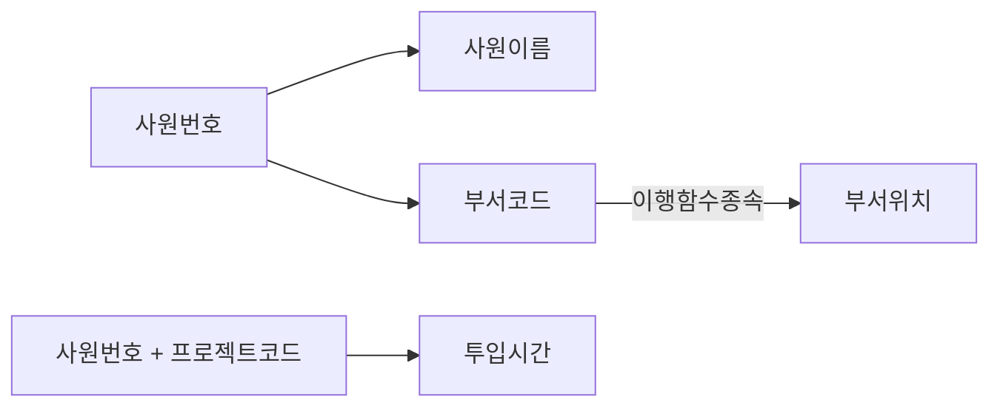

### 종속 판정표
| 속성 | 결정자 | 종속 유형 | 판정 |
| --- | --- | --- | --- |
| 사원이름 | 사원번호 | 부분함수종속 | 2NF 위반 |
| 부서코드 | 사원번호 | 부분함수종속 | 2NF 위반 |
| 부서위치 | 부서코드(일반속성) | 이행함수종속 | 3NF 위반 |
| 투입시간 | 사원번호+프로젝트코드 | 완전함수종속 | 유지 |

### 선지별 판단
| 선지 | O/X | 판단 이유 |
|---|---|---|
| ① | O | 사원이름·부서코드의 결정자(사원번호)가 복합키의 일부이므로 부분함수종속, 2NF 위반 |
| ② | O | 부서코드(일반속성)가 부서위치(일반속성)를 결정하므로 이행함수종속, 3NF 위반의 원인 |
| ③ | X | 부분함수종속을 제거해도 부서코드→부서위치라는 이행함수종속이 남아 있어 3NF조차 충족하지 못한다. 부분함수종속 제거는 2NF 충족일 뿐이며, 이 릴레이션을 완전히 분해하려면 부분함수종속 제거(2NF)에 더해 이행함수종속 제거(3NF)까지 별도로 수행해야 한다 |
| ④ | O | 투입시간은 특정 사원이 특정 프로젝트에 투입한 시간이므로 복합키 전체가 있어야 하나로 정해짐(완전함수종속) |

### 선지 교정
③ "이 릴레이션은 부분함수종속과 이행함수종속을 모두 제거해야 3NF까지 충족하며, {사원번호,프로젝트코드,투입시간}, {사원번호,사원이름,부서코드}, {부서코드,부서위치} 세 테이블로 분해해야 한다."

### 관련 조항
- 헌법 제22조(NORM-03), 제23조(NORM-04) — 두 단계를 순차적으로 모두 적용해야 하는 사례
- 상세 판례: `./06-정규화/NORM-03-제2정규형과-부분함수종속.md`, `./06-정규화/NORM-04-제3정규형과-이행함수종속.md`

</details>

---

### 문제 06-08 (유형: A / 난이도: 상)

다음 중 정규형과 그 충족 조건을 **옳게 짝지은 것**을 고르시오.

#### 보기
① 2NF — 테이블 내 모든 결정자가 후보키여야 한다.
② 3NF — 기본키가 아닌 일반속성이 다른 일반속성을 결정하는 이행함수종속을 제거해야 한다.
③ BCNF — 일반속성이 다른 일반속성을 결정하지 않아야 한다.
④ 1NF — 복합 기본키의 일부에만 종속되는 부분함수종속을 제거해야 한다.

<details>
<summary>정답과 판례식 해설</summary>

### 주문
**정답: ②**

### 질문 극성
옳은 것(O)을 찾는 정의 짝짓기 문제 — 각 정규형의 조건이 다른 정규형의 조건과 뒤바뀌어 제시되지 않았는지 확인한다.

### 적용 결정 트리
```text
선지가 제시하는 조건은?
│
├─ "모든 결정자가 후보키" → BCNF의 조건
├─ "이행함수종속 제거(일반속성→일반속성 제거)" → 3NF의 조건
├─ "부분함수종속 제거(복합키 일부 종속 제거)" → 2NF의 조건
└─ "도메인 원자성(원자값)" → 1NF의 조건
```

### 핵심 법리
1NF는 도메인 원자성, 2NF는 부분함수종속 제거, 3NF는 이행함수종속 제거, BCNF는 모든 결정자가 후보키일 것을 각각 조건으로 한다. 이 네 조건은 서로 다른 정규형에 정확히 하나씩 대응하며, 출제자는 이 대응관계를 뒤섞어 제시하는 방식으로 함정을 만든다.

### 정답을 가르는 사실
① "모든 결정자가 후보키"는 BCNF의 조건인데 2NF에 붙여 놓았고, ③ "일반속성 간 결정 관계 제거"는 3NF의 조건인데 BCNF에 붙여 놓았으며, ④ "부분함수종속 제거"는 2NF의 조건인데 1NF에 붙여 놓았다. 오직 ②만 3NF와 이행함수종속 제거라는 올바른 조건이 정확히 짝지어져 있다.

### 선지별 판단
| 선지 | O/X | 판단 이유 |
|---|---|---|
| ① | X | "모든 결정자가 후보키"는 BCNF의 조건이며 2NF의 조건이 아니다 |
| ② | O | "기본키가 아닌 일반속성이 다른 일반속성을 결정하는 이행함수종속 제거"는 3NF의 정확한 조건 |
| ③ | X | "일반속성이 일반속성을 결정하지 않음"은 3NF의 조건이며 BCNF의 조건이 아니다(BCNF는 후보키 여부를 기준으로 함) |
| ④ | X | "부분함수종속 제거"는 2NF의 조건이며 1NF의 조건이 아니다(1NF는 도메인 원자성) |

### 선지 교정
① "BCNF — 테이블 내 모든 결정자가 후보키여야 한다." / ③ "3NF — 일반속성이 다른 일반속성을 결정하지 않아야 한다." / ④ "2NF — 복합 기본키의 일부에만 종속되는 부분함수종속을 제거해야 한다."

### 관련 조항
- 헌법 제21조(NORM-02), 제22조(NORM-03), 제23조(NORM-04), 제24조(NORM-05) — 4개 정규형 조건을 모두 대조
- 상세 판례: `./06-정규화/NORM-04-제3정규형과-이행함수종속.md`, `./06-정규화/NORM-05-BCNF와-상위정규형.md`

</details>

---

### 문제 06-09 (유형: C / 난이도: 상)

여행사 A는 다음과 같이 하나의 테이블로 예약 정보를 관리한다.

`예약상세(예약번호, 상품코드, 예약일, 고객명, 상품명, 상품유형, 상품유형별기본수수료, 인원수)`

한 번의 예약에서 여러 여행 상품을 함께 예약할 수 있어 기본키는 `(예약번호, 상품코드)`이다. 예약번호가 정해지면 예약일·고객명이 각각 하나로 정해지고, 상품코드가 정해지면 상품명·상품유형이 각각 하나로 정해지며, 상품유형이 정해지면 상품유형별기본수수료가 하나로 정해진다(예: 상품유형 "항공패키지"는 항상 수수료율 5%).

정규화 담당자가 이 테이블을 검토했다. 다음 중 **옳은 것**을 고르시오.

#### 보기
① 상품유형별기본수수료는 상품코드에 부분함수종속되어 있으므로, {상품코드, 상품유형별기본수수료}로 분리하면 3NF까지 충족된다.
② 고객명은 예약번호에만 종속되는 부분함수종속이므로 2NF 위반이며, {예약번호, 예약일, 고객명}으로 분리해야 한다.
③ 인원수는 예약번호에만 종속되는 부분함수종속이다.
④ 상품유형은 예약번호와 상품코드 전체에 종속되는 완전함수종속이다.

<details>
<summary>정답과 판례식 해설</summary>

### 주문
**정답: ②**

### 질문 극성
옳은 것(O)을 찾는 사례형 문제 — 부분함수종속과 이행함수종속을 혼동시키는 선지, 완전함수종속과 부분함수종속을 뒤바꾼 선지가 함께 제시된다.

### 적용 결정 트리
```text
복합 기본키(예약번호+상품코드)를 갖는 릴레이션인가?
│
└─ 예
   ├─ 예약일·고객명: 예약번호(기본키 일부)에만 종속 → 부분함수종속
   ├─ 상품명·상품유형: 상품코드(기본키 일부)에만 종속 → 부분함수종속
   ├─ 상품유형별기본수수료: 상품유형(일반속성)에 종속
   │  → 상품코드→상품유형→기본수수료로 이어지는 이행함수종속
   └─ 인원수: 예약번호+상품코드 전체에 종속 → 완전함수종속
```

### 핵심 법리
결정자가 복합 기본키의 일부(예약번호, 상품코드)이면 부분함수종속이고, 결정자가 기본키에서 파생된 일반속성(상품유형)이면 이행함수종속이다. 부분함수종속만 제거해서는 이행함수종속이 남아 3NF에 도달하지 못하며, 복합키 전체가 있어야만 값이 정해지는 속성(인원수)을 부분함수종속으로 서술하면 완전함수종속과 부분함수종속을 뒤바꾼 오류다.

### 정답을 가르는 사실
①은 "상품코드에 부분함수종속"이라 했지만 실제 결정자는 상품유형(일반속성)이므로 이행함수종속이며, {상품코드,수수료}로 분리해도 상품유형이 빠져 무손실 분해가 되지 않고 3NF에도 도달하지 못한다. ③은 인원수가 예약된 상품별로 다르므로(같은 예약번호라도 상품코드마다 인원수가 다를 수 있음) 복합키 전체에 종속되는 완전함수종속인데 이를 부분함수종속으로 뒤바꿔 서술했다. ④는 상품유형이 상품코드 하나만으로 정해지는데도 복합키 전체에 종속된다고 뒤바꿔 서술했다.

### 선지별 판단
| 선지 | O/X | 판단 이유 |
|---|---|---|
| ① | X | 수수료의 직접 결정자는 상품유형(일반속성)이지 상품코드(기본키 일부)가 아니므로 이행함수종속이며, 제시된 분리 방식으로는 상품유형이 누락되어 무손실 분해가 되지 않는다 |
| ② | O | 고객명의 결정자(예약번호)가 복합키의 일부이므로 부분함수종속이 맞고, 제시된 분리({예약번호,예약일,고객명})도 정석적인 2NF 분해 |
| ③ | X | 인원수는 예약번호와 상품코드 전체가 있어야 하나로 정해지므로 완전함수종속이지 부분함수종속이 아니다 |
| ④ | X | 상품유형은 상품코드 하나만으로 정해지므로 부분함수종속이지 완전함수종속이 아니다 |

### 선지 교정
① "상품유형별기본수수료는 상품유형(일반속성)에 이행함수종속되어 있으므로, {상품유형, 상품유형별기본수수료}로 분리해야 한다." / ③ "인원수는 예약번호와 상품코드 전체에 완전함수종속된다." / ④ "상품유형은 상품코드에 부분함수종속된다."

### 관련 조항
- 헌법 제22조(NORM-03), 제23조(NORM-04)
- 상세 판례: `./06-정규화/NORM-03-제2정규형과-부분함수종속.md`, `./06-정규화/NORM-04-제3정규형과-이행함수종속.md`

</details>

---

### 문제 06-10 (유형: D / 난이도: 중)

물류회사는 다음과 같이 배송 상세 내역을 하나의 릴레이션으로 관리한다.

`배송상세(운송장번호, 상품코드, 배송일, 고객명, 상품명, 배송수량)`

| 운송장번호 | 상품코드 | 배송일 | 고객명 | 상품명 | 배송수량 |
|---|---|---|---|---|---|
| W01 | G01 | 2026-07-01 | 박지훈 | 무선마우스 | 2 |
| W01 | G02 | 2026-07-01 | 박지훈 | 키보드 | 1 |
| W02 | G01 | 2026-07-03 | 최유나 | 무선마우스 | 3 |

기본키는 `(운송장번호, 상품코드)`이다. 운송장번호가 정해지면 배송일·고객명이 각각 하나로 정해지고, 상품코드가 정해지면 상품명이 하나로 정해진다.

#### 보기
① 이 릴레이션에서 부분함수종속을 모두 제거하려면 {운송장번호, 배송일, 고객명}, {상품코드, 상품명}, {운송장번호, 상품코드, 배송수량} 세 테이블로 분해해야 한다.
② 배송일과 고객명은 상품코드에 부분함수종속되어 있다.
③ 상품명은 운송장번호와 상품코드 전체에 완전함수종속된다.
④ 이 릴레이션은 부분함수종속이 없으므로 이미 2NF를 충족한다.

<details>
<summary>정답과 판례식 해설</summary>

### 주문
**정답: ①**

### 함수 종속 다이어그램
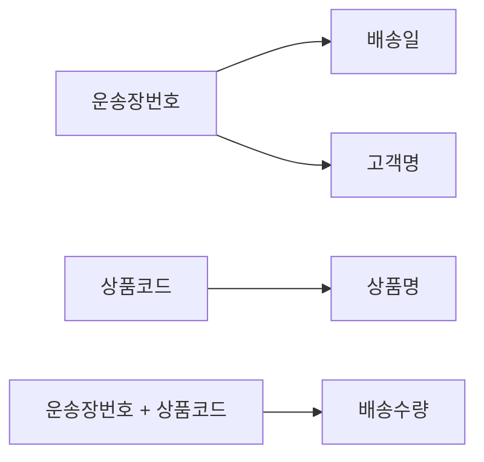

### 종속 판정표
| 속성 | 결정자 | 종속 유형 | 판정 |
| --- | --- | --- | --- |
| 배송일 | 운송장번호 | 부분함수종속 | 2NF 위반 |
| 고객명 | 운송장번호 | 부분함수종속 | 2NF 위반 |
| 상품명 | 상품코드 | 부분함수종속 | 2NF 위반 |
| 배송수량 | 운송장번호+상품코드 | 완전함수종속 | 유지 |

### 선지별 판단
| 선지 | O/X | 판단 이유 |
|---|---|---|
| ① | O | 부분함수종속을 결정자별로 묶어 별도 테이블로 분리하고, 완전함수종속인 배송수량은 원래의 복합키 테이블에 남기는 정석적인 2NF 분해 |
| ② | X | 배송일·고객명의 실제 결정자는 운송장번호이지 상품코드가 아니다(결정자를 반대로 서술) |
| ③ | X | 상품명은 상품코드 하나만으로 정해지므로 부분함수종속이지 완전함수종속이 아니다 |
| ④ | X | 배송일·고객명·상품명이 모두 복합키의 일부에만 종속되는 부분함수종속을 가지므로 2NF를 위반한다 |

### 선지 교정
② "배송일과 고객명은 운송장번호에 부분함수종속되어 있다." / ③ "상품명은 상품코드에만 부분함수종속된다." / ④ "이 릴레이션은 배송일·고객명·상품명이 모두 부분함수종속을 가지므로 2NF를 위반한다."

### 관련 조항
- 헌법 제22조(NORM-03)
- 상세 판례: `./06-정규화/NORM-03-제2정규형과-부분함수종속.md`

</details>

---

### 문제 06-11 (유형: D / 난이도: 상)

고객센터는 다음과 같이 지점별 상담 이력을 하나의 릴레이션으로 관리한다.

`상담이력(고객번호, 상담지점, 상담일자, 지점상담사)`

| 고객번호 | 상담지점 | 상담일자 | 지점상담사 |
|---|---|---|---|
| C01 | 강남점 | 2026-07-01 | 정하윤 |
| C01 | 홍대점 | 2026-07-10 | 서준서 |
| C02 | 강남점 | 2026-07-05 | 정하윤 |

기본키는 `(고객번호, 상담지점)`이며, 이것이 이 릴레이션의 유일한 후보키다. 각 지점에는 상담사가 한 명만 고정 배정되어 있어, 상담지점이 정해지면 지점상담사가 항상 하나로 정해진다.

#### 보기
① 이 릴레이션은 3NF를 만족하지만 BCNF는 위반한다.
② 지점상담사는 고객번호에 이행함수종속되어 있으므로 3NF 위반이다.
③ 상담지점→지점상담사라는 함수종속이 존재하고 상담지점이 후보키이므로, 이 릴레이션은 BCNF를 충족한다.
④ 상담일자는 고객번호에만 종속되는 부분함수종속이다.

<details>
<summary>정답과 판례식 해설</summary>

### 주문
**정답: ①**

### 함수 종속 다이어그램
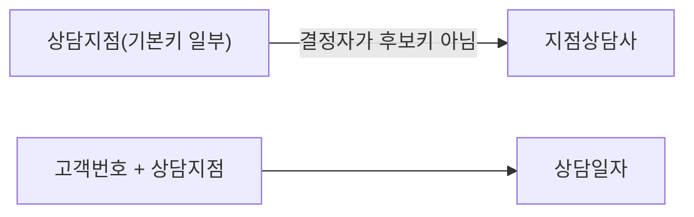

### 종속 판정표
| 속성 | 결정자 | 결정자가 기본키의 일부인가 | 종속 유형(SQLD 단순 판정) | 후보키 여부 | 판정 |
| --- | --- | --- | --- | --- | --- |
| 지점상담사 | 상담지점 | 예(일반속성 아님) | 이행함수종속 아님(3NF 판정 대상 아님) | 상담지점 단독은 후보키 아님 | BCNF 위반 |
| 상담일자 | 고객번호+상담지점 | 전체 종속 | 완전함수종속 | — | 유지 |

### 선지별 판단
| 선지 | O/X | 판단 이유 |
|---|---|---|
| ① | O | 3NF는 "기본키가 아닌 일반속성이 다른 일반속성을 결정"하는 관계만 위반으로 보는데, 상담지점은 기본키의 일부(일반속성이 아님)이므로 이 기준으로는 3NF 위반이 없다. 그러나 BCNF는 "모든 결정자가 후보키인가"를 기준으로 하므로, 상담지점(후보키가 아님)이 지점상담사를 결정하는 이 관계는 BCNF 위반이다 |
| ② | X | 지점상담사의 결정자는 고객번호가 아니라 상담지점이며, 상담지점은 기본키의 일부이지 일반속성이 아니므로 이행함수종속의 정의(일반속성→일반속성)에 해당하지 않는다 |
| ③ | X | 상담지점은 고객번호 없이는 각 행을 유일하게 구분하지 못하므로 그 자체로는 후보키가 아니다. 후보키가 아닌 속성이 다른 속성을 결정하므로 BCNF 위반 |
| ④ | X | 상담일자는 같은 고객이라도 상담지점마다 다를 수 있으므로 고객번호와 상담지점 전체에 종속되는 완전함수종속이다 |

### 선지 교정
② "지점상담사는 상담지점(기본키 일부)에 종속되며, 이는 이행함수종속이 아니라 BCNF 위반 사유다." / ③ "상담지점은 그 자체로는 후보키가 아니므로 이 릴레이션은 BCNF를 위반한다." / ④ "상담일자는 고객번호와 상담지점 전체에 완전함수종속된다."

### 관련 조항
- 헌법 제23조(NORM-04), 제24조(NORM-05) — 3NF와 BCNF의 판정 기준 차이를 정확히 적용해야 하는 사례
- 상세 판례: `./06-정규화/NORM-04-제3정규형과-이행함수종속.md`, `./06-정규화/NORM-05-BCNF와-상위정규형.md`

</details>

---

### 문제 06-12 (유형: B / 난이도: 상)

정규화에 대한 다음 ㄱ~ㄹ 진술 중 옳은 것을 모두 고른 것은?

ㄱ. 부분함수종속은 결정자가 후보키 전체가 아니라 그 일부인 경우에만 성립할 수 있으며, 단일 속성으로 이루어진 기본키를 가진 릴레이션에는 성립할 수 없다.
ㄴ. 이행함수종속은 기본키가 아닌 일반속성이 다른 일반속성을 결정하는 경우에 성립하며, 이를 제거하면 그 릴레이션은 항상 BCNF에 도달한다.
ㄷ. BCNF는 모든 결정자가 후보키가 되도록 요구하므로, 3NF를 만족하는 모든 릴레이션은 항상 BCNF도 만족한다.
ㄹ. 어떤 릴레이션에 후보키가 아닌 속성이 결정자로 작용하는 함수종속이 존재한다면, 그 결정자가 후보키의 일부이든 완전히 별개의 일반속성이든 관계없이 BCNF 위반이다.

#### 보기
① ㄱ, ㄴ
② ㄱ, ㄹ
③ ㄴ, ㄷ
④ ㄷ, ㄹ

<details>
<summary>정답과 판례식 해설</summary>

### 주문
**정답: ②**

### 질문 극성
조합선지형 — 옳은 정의 서술(ㄱ)과 옳은 판정 기준 서술(ㄹ)을 "반드시·항상" 같은 과장된 단정이 섞인 진술(ㄴ, ㄷ)로부터 가려낸다.

### 적용 결정 트리
```text
진술이 "항상/반드시/모든 경우"처럼 예외 없는 단정을 포함하는가?
│
├─ 예 → 반례가 존재하는지 검토(존재하면 X)
│  ├─ "이행함수종속 제거 → 항상 BCNF" → 반례 있음(문제 06-11처럼 3NF는 만족해도 BCNF는 위반 가능) → X
│  └─ "3NF 만족 → 항상 BCNF 만족" → 반례 있음(동일 사례) → X
│
└─ 아니오(조건부·정의 서술) → 정의 자체의 정확성만 검토
```

### 핵심 법리
BCNF는 3NF보다 한 단계 더 엄격한 조건(모든 결정자가 후보키)이므로, 3NF를 만족한다고 해서 BCNF까지 자동으로 만족되는 것은 아니다(문제 06-11의 상담이력 사례가 바로 이 반례다). "이행함수종속 제거 = 3NF 충족"까지는 참이지만, 거기서 더 나아가 "항상 BCNF에 도달한다"고 단정하는 것은 범위를 과장한 오류다. 반면 BCNF의 판정 기준 자체는 "결정자가 후보키인가"만을 묻기 때문에, 그 결정자가 후보키의 일부이든 순수한 일반속성이든 관계없이 후보키가 아니면 위반이다.

### 정답을 가르는 사실
ㄴ과 ㄷ은 공통적으로 "이행함수종속 제거"와 "3NF 충족"이라는 참인 전제에서 출발해 "항상 BCNF"라는 과장된 결론으로 비약한다. 정규화 단계는 1NF⊂2NF⊂3NF⊂BCNF처럼 상위 단계가 하위 단계를 포함하는 방향으로만 성립하며, 그 역(하위 단계 충족이 상위 단계 충족을 보장)은 성립하지 않는다.

### 진술별 O/X 판정
| 진술 | O/X | 판단 이유 |
|---|---|---|
| ㄱ | O | 부분함수종속은 복합 기본키를 전제로 하는 개념이며, 단일 속성 기본키에는 애초에 "일부"라는 개념이 성립하지 않으므로 부분함수종속도 성립할 수 없다(제22조) |
| ㄴ | X | 이행함수종속 제거는 3NF 충족을 의미할 뿐이며, BCNF까지 항상 도달한다고 단정할 수 없다(반례: 문제 06-11) |
| ㄷ | X | 3NF를 만족한다고 BCNF까지 항상 만족하는 것은 아니다(BCNF가 3NF보다 엄격한 상위 조건이기 때문) |
| ㄹ | O | BCNF의 판정 기준은 오직 "결정자가 후보키인가"이므로, 결정자가 기본키의 일부이든 순수 일반속성이든 후보키가 아니면 동일하게 BCNF 위반이다 |

### 조합판정표
| 조합 | 포함 진술 | 채택 여부 |
|---|---|---|
| ① | ㄱ,ㄴ | ㄴ이 X이므로 소거 |
| ② | ㄱ,ㄹ | 모두 O이므로 채택 |
| ③ | ㄴ,ㄷ | 둘 다 X이므로 소거 |
| ④ | ㄷ,ㄹ | ㄷ이 X이므로 소거 |

### 선지 교정
ㄴ "이행함수종속을 제거하면 그 릴레이션은 3NF에 도달하지만, BCNF까지 항상 도달하는 것은 아니다." / ㄷ "3NF를 만족하는 릴레이션이라도 BCNF는 위반할 수 있다."

### 관련 조항
- 헌법 제22조(NORM-03), 제23조(NORM-04), 제24조(NORM-05)
- 상세 판례: `./06-정규화/NORM-04-제3정규형과-이행함수종속.md`, `./06-정규화/NORM-05-BCNF와-상위정규형.md`

</details>

---

### 문제 06-13 (유형: F / 난이도: 최상)

다음 지문을 읽고 물음에 답하시오.

자동차 정비센터는 정비 이력을 다음과 같이 하나의 릴레이션으로 관리하고 있다.

`정비이력(차량번호, 정비항목코드, 정비일자, 차량모델, 정비항목명, 담당정비사, 정비사소속센터)`

정비센터는 한 번의 입고에서 여러 정비 항목(예: 엔진오일 교체, 타이어 교체)을 동시에 처리할 수 있어, 각 정비 작업 행을 구분하려면 차량번호와 정비항목코드를 함께 사용해야 한다. 차량번호가 정해지면 차량모델이 하나로 정해지고(차량 한 대는 모델이 하나), 정비항목코드가 정해지면 정비항목명과 담당정비사가 각각 하나로 정해진다(정비 항목별로 전담 정비사가 지정되어 있다고 가정). 또한 담당정비사가 정해지면 그 정비사가 소속된 정비센터(정비사소속센터)가 하나로 정해진다.

이 릴레이션에서 함수종속 관계를 정리하면, 먼저 어떤 속성 X의 값이 정해질 때 다른 속성 Y의 값이 항상 하나로만 결정되는지를 확인해 결정자와 종속자를 가려내야 한다. 그다음 그 결정자가 기본키 전체인지, 기본키의 일부인지, 아니면 기본키가 아닌 일반속성인지에 따라 완전함수종속·부분함수종속·이행함수종속을 구분하고, 마지막으로 어느 정규형까지 위반되는지 판단해 적절한 분해 방법을 결정해야 한다.

기본키는 `(차량번호, 정비항목코드)`이다.

다음 ㄱ~ㅁ 중 옳은 것을 모두 고른 것은?

ㄱ. 차량모델은 차량번호에 부분함수종속되어 있고, 이는 2NF 위반의 원인이다.
ㄴ. 정비항목명과 담당정비사는 정비항목코드에 완전함수종속되어 있다.
ㄷ. 정비사소속센터는 담당정비사(일반속성)에 이행함수종속되어 있고, 이는 3NF 위반의 원인이다.
ㄹ. 이 릴레이션을 3NF까지 정규화하려면 {차량번호, 차량모델}, {정비항목코드, 정비항목명, 담당정비사}, {담당정비사, 정비사소속센터}, {차량번호, 정비항목코드, 정비일자} 네 테이블로 분해해야 한다.
ㅁ. 정비일자는 차량번호에만 종속되는 부분함수종속이다.

#### 보기
① ㄱ, ㄴ
② ㄱ, ㄷ, ㄹ
③ ㄴ, ㄷ, ㅁ
④ ㄱ, ㄴ, ㄷ, ㅁ

<details>
<summary>정답과 판례식 해설</summary>

### 주문
**정답: ②**

### 질문 극성
장문 지문형 + 조합선지형 결합 — 함수종속 판정부터 결정자·종속자 확정, 완전/부분/이행함수종속 구분, 정규형 판단, 분해까지 지문에 제시된 순서대로 적용한 뒤 각 진술을 O/X로 판정해 조합을 채택한다.

### 적용 결정 트리
```text
1. 결정자·종속자 확정: X값이 정해지면 Y값이 하나로 결정되는가?
2. 그 결정자가 기본키(차량번호+정비항목코드) 전체인가, 일부인가, 일반속성인가?
   ├─ 기본키 전체 → 완전함수종속
   ├─ 기본키 일부 → 부분함수종속(2NF 위반)
   └─ 기본키가 아닌 일반속성 → 이행함수종속(3NF 위반)
3. 위반된 최고 단계까지 결정자별로 테이블을 묶어 분해
```

### 함수 종속 다이어그램
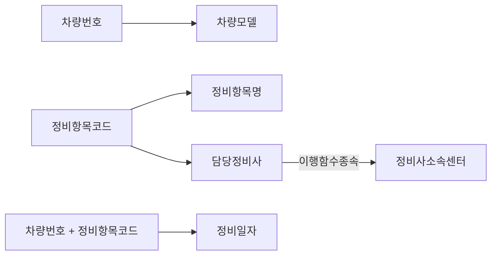

### 종속 판정표
| 속성 | 결정자 | 결정자의 성격 | 종속 유형 | 판정 |
| --- | --- | --- | --- | --- |
| 차량모델 | 차량번호 | 기본키 일부 | 부분함수종속 | 2NF 위반 |
| 정비항목명 | 정비항목코드 | 기본키 일부 | 부분함수종속 | 2NF 위반 |
| 담당정비사 | 정비항목코드 | 기본키 일부 | 부분함수종속 | 2NF 위반 |
| 정비사소속센터 | 담당정비사 | 일반속성 | 이행함수종속 | 3NF 위반 |
| 정비일자 | 차량번호+정비항목코드 | 기본키 전체 | 완전함수종속 | 유지 |

### 핵심 법리
차량모델·정비항목명·담당정비사는 모두 기본키의 "일부"가 결정하므로 부분함수종속이다. 그런데 담당정비사는 그 자체로 다시 정비사소속센터를 결정하는 결정자가 되며, 이때 담당정비사는 이미 기본키가 아닌 일반속성이므로 담당정비사→정비사소속센터는 이행함수종속이다. 정비일자는 특정 차량의 특정 정비항목 조합에서만 값이 정해지므로 복합키 전체에 완전함수종속된다.

### 정답을 가르는 사실
ㄴ은 정비항목명·담당정비사의 결정자(정비항목코드)가 기본키의 "일부"라는 점을 무시하고 "완전함수종속"이라 뒤바꿔 서술했다 — 실제로는 부분함수종속이다. ㅁ은 정비일자가 복합키 전체에 종속되는데 "차량번호에만"이라며 부분함수종속으로 뒤바꿔 서술했다. ㄱ·ㄷ·ㄹ은 각각 부분함수종속·이행함수종속의 정의와 최종 분해 결과를 정확히 서술하고 있다.

### 진술별 O/X 판정
| 진술 | O/X | 판단 이유 |
|---|---|---|
| ㄱ | O | 차량모델의 결정자(차량번호)가 기본키의 일부이므로 부분함수종속, 2NF 위반의 원인 |
| ㄴ | X | 정비항목명·담당정비사의 결정자(정비항목코드)도 기본키의 일부이므로 완전함수종속이 아니라 부분함수종속이다 |
| ㄷ | O | 정비사소속센터의 결정자(담당정비사)는 기본키가 아닌 일반속성이므로 이행함수종속, 3NF 위반의 원인 |
| ㄹ | O | 부분함수종속(차량모델, 정비항목명+담당정비사)과 이행함수종속(정비사소속센터)을 모두 해소하도록 결정자 단위로 묶어 분해한 정석적인 3NF 분해 결과 |
| ㅁ | X | 정비일자는 차량번호와 정비항목코드 전체가 있어야 하나로 정해지므로 완전함수종속이지 부분함수종속이 아니다 |

### 조합판정표
| 조합 | 포함 진술 | 채택 여부 |
|---|---|---|
| ① | ㄱ,ㄴ | ㄴ이 X이므로 소거 |
| ② | ㄱ,ㄷ,ㄹ | 모두 O이므로 채택 |
| ③ | ㄴ,ㄷ,ㅁ | ㄴ,ㅁ이 X이므로 소거 |
| ④ | ㄱ,ㄴ,ㄷ,ㅁ | ㄴ,ㅁ이 X이므로 소거 |

### 선지 교정
ㄴ "정비항목명과 담당정비사는 정비항목코드에 부분함수종속되어 있다." / ㅁ "정비일자는 차량번호와 정비항목코드 전체에 완전함수종속된다."

### 관련 조항
- 헌법 제20조(NORM-01, 함수종속·결정자·종속자), 제22조(NORM-03, 부분함수종속), 제23조(NORM-04, 이행함수종속)
- 상세 판례: `./06-정규화/NORM-01-정규화의-목적과-이상현상.md`, `./06-정규화/NORM-03-제2정규형과-부분함수종속.md`, `./06-정규화/NORM-04-제3정규형과-이행함수종속.md`

</details>
## 07 데이터 모델과 SQL

### 문제 07-01 (난이도: 하)

관계형 데이터모델에서 조인(JOIN)이 필요한 이유로 가장 적절한 것은?

#### 보기
① 데이터 중복을 허용하여 조회 성능을 향상시키기 위해서다.
② 정규화 원칙에 따라 여러 엔터티에 나뉘어 저장된 데이터를 하나의 결과로 다시 결합해 조회하기 위해서다.
③ 트랜잭션의 원자성을 보장하기 위해서다.
④ 정규화 과정에서 발생한 이상현상을 제거하기 위해서다.

<details>
<summary>정답과 해설</summary>

### 주문
**정답: ②**

### 질문 극성
옳은 것을 묻는다 → O인 선지를 찾는다.

### 적용 결정 트리
```text
필요한 정보가 하나의 테이블에 모두 있는가?
│
└─ 아니오 → 테이블 사이에 관계·공통 식별자가 있는가?
   └─ 예 → JOIN 필요
      └─ 목적: 여러 엔터티에서 데이터를 한 번에 가져오는 것 ★
         (중복 허용으로 성능을 높이는 것이 아님 — 그건 반정규화)
```

### 핵심 법리
관계형 데이터모델은 정규화 원칙에 따라 데이터를 여러 엔터티로 분산 저장하므로, 필요한 정보를 한 번에 조회하려면 조인이 필요하다. 조인의 목적은 "여러 엔터티에서 데이터를 한 번에 가져오는 것"이지, 중복을 허용해 성능을 높이는 것이 아니다.

### 정답을 가르는 사실
선지가 "중복을 허용/성능 향상"을 조인의 목적으로 서술하면 반정규화(제27조)의 목적과 뒤바뀐 함정이다.

### 선지별 판단
| 선지 | 판정 | 이유 |
|---|---|---|
| ① | X | 중복 허용을 통한 성능 향상은 반정규화(제27조)의 목적이지 조인의 목적이 아니다 |
| ② | O | 조인의 목적을 정확히 서술 — 정답 |
| ③ | X | 트랜잭션(제26조)의 목적은 정합성 보장이며 조인과는 별개의 개념이다 |
| ④ | X | 이상현상 제거는 정규화(제20조)의 목적이며, 조인은 이미 정규화된 구조를 다시 결합하는 것이다 |

### 선지 교정
① "여러 엔터티에서 데이터를 한 번에 가져오기 위해서다"로 고치면 참. ③·④는 각각 트랜잭션·정규화의 목적으로 문장 자체를 교체해야 한다.

### 관련 조항
- 헌법 제25조(SQL-01)
- 상세 판례: `./07-데이터모델과-SQL/SQL-01-관계형모델과-조인.md`

</details>

---

### 문제 07-02 (난이도: 하)

트랜잭션(Transaction)에 대한 설명으로 옳은 것은?

#### 보기
① 트랜잭션은 반드시 하나의 엔터티에서 발생하는 작업만을 의미한다.
② 트랜잭션은 업무상 나눌 수 없는 하나의 논리적 작업 단위로, 모두 성공하거나 모두 실패해야 한다.
③ 트랜잭션을 적용하는 주된 목적은 조회 성능을 향상시키는 것이다.
④ 트랜잭션 요구사항은 물리적 모델링 단계에서 인덱스로 반영한다.

<details>
<summary>정답과 해설</summary>

### 주문
**정답: ②**

### 질문 극성
옳은 것을 묻는다 → O인 선지를 찾는다.

### 적용 결정 트리
```text
여러 DML이 하나의 업무 단위인가?
│
└─ 예(트랜잭션)
   ├─ 모든 작업 성공 → COMMIT
   └─ 하나라도 실패 → ROLLBACK ★(원자성)
```

### 핵심 법리
트랜잭션은 업무상 나눌 수 없는 하나의 논리적 작업 단위로서 원자성(모두 성공 또는 모두 실패)을 가지며, 하나의 커밋 단위로 묶인다. 목적은 성능 향상이 아니라 데이터 정합성 보장이다.

### 정답을 가르는 사실
"하나의 엔터티만", "성능 향상", "물리적 모델링" 같은 서술이 트랜잭션과 함께 등장하면 함정이다.

### 선지별 판단
| 선지 | 판정 | 이유 |
|---|---|---|
| ① | X | 트랜잭션은 여러 엔터티에 걸쳐 발생할 수 있다(범위 축소 함정) |
| ② | O | 원자성의 정의를 정확히 서술 — 정답 |
| ③ | X | 트랜잭션의 목적은 정합성 보장이지 성능 향상이 아니다 |
| ④ | X | 트랜잭션 요구사항 반영은 논리적 모델링 단계에서 관계의 필수참여로 이뤄진다(물리설계의 성능튜닝과 혼동) |

### 선지 교정
①은 "여러 엔터티에 걸쳐 발생할 수 있다"로, ③은 "데이터 정합성을 보장하는 것"으로, ④는 "논리적 모델링 단계에서 관계의 필수참여로 반영한다"로 고치면 참.

### 관련 조항
- 헌법 제26조(TXN-01)
- 상세 판례: `./07-데이터모델과-SQL/TXN-01-트랜잭션과-데이터모델.md`

</details>

---

### 문제 07-03 (난이도: 중)

다음 중 반정규화(De-normalization) 기법으로 볼 수 없는 것은?

#### 보기
① 자주 함께 조회되는 두 개의 1:1 관계 테이블을 하나로 병합한다.
② 사용 빈도가 낮은 컬럼들만 모아 별도 테이블로 수직분할한다.
③ 함수종속성을 고려하여 이상현상이 발생하지 않도록 테이블을 분할한다.
④ 조인 경로를 단축하기 위해 두 테이블 사이에 중복된 관계를 추가한다.

<details>
<summary>정답과 해설</summary>

### 주문
**정답: ③**

### 질문 극성
"기법으로 볼 수 없는 것"을 묻는다(부정형) → X인 선지를 찾는다.

### 적용 결정 트리
```text
선지가 설명하는 방향은?
│
├─ 테이블을 병합/분할(수직·수평)/중복컬럼·관계 추가 → 반정규화 기법
└─ 함수종속을 고려해 이상현상 없도록 "분할" → 정규화 방향(반정규화 아님) ★
```

### 핵심 법리
반정규화 기법은 테이블 병합, 테이블 분할(수직/수평), 중복 컬럼 추가, 중복 관계 추가로 나뉜다. 함수종속을 고려한 "분할"이나 슈퍼/서브타입 "분리"는 정규화 방향이므로 반정규화 기법이 아니다.

### 정답을 가르는 사실
"함수종속", "이상현상 방지"라는 표현이 붙은 분할은 정규화(제20조)의 언어이지 반정규화(제27조)의 언어가 아니다.

### 선지별 판단
| 선지 | 판정 | 이유 |
|---|---|---|
| ① | O(기법 맞음) | 테이블 병합은 반정규화 기법이다 |
| ② | O(기법 맞음) | 수직분할은 반정규화 기법이다 |
| ③ | X(기법 아님) | 함수종속을 고려한 분할은 이상현상 제거가 목적인 정규화 방향 — 정답 |
| ④ | O(기법 맞음) | 중복 관계 추가는 반정규화 기법이며 무결성 위험이 없는 유일한 예외다 |

### 선지 교정
③을 반정규화 기법으로 만들려면 "자주 조회되는 컬럼만 모아 수직분할한다"처럼 성능 목적의 분할로 바꿔야 한다.

### 관련 조항
- 헌법 제27조(PERF-01)
- 상세 판례: `./07-데이터모델과-SQL/PERF-01-반정규화.md`

</details>

---

### 문제 07-04 (난이도: 중)

계층형 데이터모델과 상호배타 데이터모델에 대한 설명으로 옳은 것은?

#### 보기
① 계층형 데이터모델은 서로 다른 두 엔터티 사이의 일반적인 1:N 관계를 의미한다.
② 계층형 데이터모델은 하나의 엔터티가 자기 자신과 관계를 맺는 Self Join 구조로 구현된다.
③ 상호배타 모델에서는 하나의 관계가 여러 후보 엔터티에 동시에 대응될 수 있다.
④ 상호배타 모델에서는 UNION의 결과 건수가 UNION ALL의 결과 건수보다 항상 적다.

<details>
<summary>정답과 해설</summary>

### 주문
**정답: ②**

### 질문 극성
옳은 것을 묻는다 → O인 선지를 찾는다.

### 적용 결정 트리
```text
부가 판정:
├─ 엔터티가 "자기 자신"과 관계를 맺는가? → 계층형 모델(Self Join) ★
└─ 관계가 여러 후보 엔터티 중 정확히 하나와만 대응되는가?
   → 상호배타 모델(중복이 원천적으로 없어 UNION=UNION ALL)
```

### 핵심 법리
계층형 모델은 Self Join으로 자기 자신과 관계를 맺어 상위-하위 구조를 표현한다. 상호배타 모델은 하나의 관계가 여러 후보 엔터티 중 정확히 하나와만 대응되어 데이터 중복이 원천적으로 없으며, 그 결과 UNION과 UNION ALL의 결과 건수가 같다.

### 정답을 가르는 사실
"자기 자신과 관계"면 계층형, "정확히 하나에만 대응"이면 상호배타이며 이때 UNION=UNION ALL이다.

### 선지별 판단
| 선지 | 판정 | 이유 |
|---|---|---|
| ① | X | 계층형 모델은 "다른" 엔터티와의 일반 관계가 아니라 "자기 자신"과의 관계다 |
| ② | O | Self Join 정의를 정확히 서술 — 정답 |
| ③ | X | 상호배타 모델은 정확히 "하나"에만 대응된다(동시 대응 불가) |
| ④ | X | 상호배타 모델은 중복이 없으므로 UNION=UNION ALL이며, "적다"는 서술은 성질을 반대로 서술한 것 |

### 선지 교정
①은 "자기 자신과 맺는 관계"로, ③은 "정확히 하나의 후보에만 대응된다"로, ④는 "UNION과 UNION ALL의 결과 건수가 같다"로 고치면 참.

### 관련 조항
- 헌법 제25조(SQL-01)
- 상세 판례: `./07-데이터모델과-SQL/SQL-01-관계형모델과-조인.md`

</details>

---

### 문제 07-05 (난이도: 상)

반정규화를 적용하는 이유로 가장 적절한 것은?

#### 보기
① 데이터 입력·갱신 시 속도가 느려지는 것을 막기 위해서다.
② 데이터 무결성이 깨질 위험을 원천적으로 제거하기 위해서다.
③ 특정 범위의 데이터가 반복적으로 조회되어 조인·집계 비용이 크다고 판단될 때 조회 성능을 확보하기 위해서다.
④ 논리 모델링 단계에서 함수종속 관계를 명확히 정리하기 위해서다.

<details>
<summary>정답과 해설</summary>

### 주문
**정답: ③**

### 질문 극성
옳은 것을 묻는다 → O인 선지를 찾는다.

### 적용 결정 트리
```text
성능 문제가 확인됐는가?
│
└─ 예 → 조인·집계 비용이 반복적으로 큰가?
   └─ 예 → 중복 저장에 따른 정합성 위험을 감수할 수 있는가?
      └─ 예 → 반정규화 기법 선택 ★(조회 성능 확보가 목적)
```

### 핵심 법리
반정규화는 조회 성능을 향상시키기 위해 이미 정규화된 데이터모델에 의도적으로 중복을 허용하는 물리적 모델링 기법이다. 입력 속도 저하나 무결성 위험은 반정규화를 적용하는 "이유"가 아니라 반정규화의 "부작용"이다.

### 정답을 가르는 사실
"입력/갱신 속도 저하 방지"가 이유로 등장하면 부작용을 이유로 뒤집은 함정이다. "무결성 위험 제거"도 반대다 — 반정규화는 오히려 위험을 감수한다.

### 선지별 판단
| 선지 | 판정 | 이유 |
|---|---|---|
| ① | X | 입력 속도 저하는 반정규화의 부작용이지 도입 이유가 아니다(부작용↔이유 뒤바뀜) |
| ② | X | 반정규화는 무결성 위험을 "감수"하는 기법이지 "제거"하는 기법이 아니다 |
| ③ | O | 조회 성능 확보라는 정당한 이유를 정확히 서술 — 정답 |
| ④ | X | 함수종속 정리는 정규화(제20조)의 작업이며 논리 모델링 단계의 일이다 |

### 선지 교정
①은 "입력 속도가 느려질 수 있음을 감수하고서라도"처럼 부작용으로 재서술해야 하고, ②는 "위험을 감수하고"로, ④는 정규화 설명으로 문장을 교체해야 한다.

### 관련 조항
- 헌법 제27조(PERF-01)
- 상세 판례: `./07-데이터모델과-SQL/PERF-01-반정규화.md`

</details>

---

### 문제 07-06 (난이도: 중)

다음 진술 중 옳은 것만을 모두 고른 것은?

#### 보기
가. 조인의 목적은 여러 엔터티에 분산 저장된 데이터를 한 번에 가져오기 위함이다.
나. 트랜잭션의 목적은 데이터 조회 성능을 향상시키는 것이다.
다. 반정규화는 정합성이 깨질 위험을 감수하고 조회 성능을 확보하는 물리적 모델링 기법이다.
라. "A를 등록할 때 B도 반드시 함께 등록되어야 한다"는 요구사항이 있으면, 두 엔터티 관계를 선택참여로 설정해도 무방하다.

① 가, 나
② 가, 다
③ 나, 라
④ 다, 라
⑤ 가, 나, 다

<details>
<summary>정답과 해설</summary>

### 주문
**정답: ②**

### 질문 극성
모두 고른 것을 묻는다 → 각 진술을 O/X 판정 → X 포함 조합 소거 → O만 포함된 조합 채택.

### 적용 결정 트리
```text
총칙 제1항: 모두 고른 것을 묻는다
├─ 각 진술을 O/X 판정
├─ X가 포함된 조합 소거
└─ O만 포함된 조합 채택
```

### 핵심 법리
조인(제25조)·트랜잭션(제26조)·반정규화(제27조)는 각각 목적이 다르다. 조인은 정보 통합 조회, 트랜잭션은 정합성 보장, 반정규화는 조회 성능 확보다. 트랜잭션 요구사항이 "반드시"라면 필수참여로 반영해야 한다.

### 진술별 O/X 판정
| 진술 | 판정 | 이유 |
|---|---|---|
| 가 | O | 조인의 목적을 정확히 서술 |
| 나 | X | 트랜잭션의 목적은 정합성 보장이지 조회 성능 향상이 아니다 |
| 다 | O | 반정규화의 목적과 위험 감수 구조를 정확히 서술 |
| 라 | X | "반드시"는 필수참여로 반영해야 하며, 선택참여로 두면 요구사항이 미반영된다 |

### 조합 판정표
| 조합 | 포함 진술 | X 포함 여부 | 채택 여부 |
|---|---|---|---|
| ① | 가, 나 | 나(X) 포함 | 소거 |
| ② | 가, 다 | 없음 | **채택** |
| ③ | 나, 라 | 나, 라(X) 포함 | 소거 |
| ④ | 다, 라 | 라(X) 포함 | 소거 |
| ⑤ | 가, 나, 다 | 나(X) 포함 | 소거 |

### 선지 교정
나는 "데이터 정합성을 보장하는 것"으로, 라는 "필수참여로 설정해야 한다"로 고치면 참이 된다.

### 관련 조항
- 헌법 제25조(SQL-01) / 제26조(TXN-01) / 제27조(PERF-01)
- 상세 판례: `./07-데이터모델과-SQL/SQL-01-관계형모델과-조인.md`, `./07-데이터모델과-SQL/TXN-01-트랜잭션과-데이터모델.md`, `./07-데이터모델과-SQL/PERF-01-반정규화.md`

</details>

---

### 문제 07-07 (난이도: 상)

다음 진술 중 옳은 것만을 모두 고른 것은?

#### 보기
가. 두 개의 서브타입 테이블을 하나의 슈퍼타입 테이블로 병합하는 것은 반정규화 기법에 해당한다.
나. 자주 조회되는 컬럼만 모아 별도 테이블로 수직분할하는 것은 반정규화 기법에 해당하지 않는다.
다. 다른 테이블의 값을 미리 복제해 컬럼으로 추가하면, 원본 데이터 변경 시 함께 갱신하지 않을 경우 데이터 불일치가 발생할 수 있다.
라. 조인 경로 단축을 위한 중복 관계 추가는 반정규화 기법 중 유일하게 무결성 위험이 없는 기법이다.

① 가, 나, 다
② 가, 다, 라
③ 나, 다, 라
④ 가, 나, 라
⑤ 가, 다

<details>
<summary>정답과 해설</summary>

### 주문
**정답: ②**

### 질문 극성
모두 고른 것을 묻는다 → 각 진술을 O/X 판정 → X 포함 조합 소거 → O만 포함된 조합 채택.

### 적용 결정 트리
```text
반정규화 기법 4종:
├─ 테이블 병합(1:1, 슈퍼/서브타입 통합)
├─ 테이블 분할(수직/수평) ★(나 판정에 사용)
├─ 중복 컬럼 추가 ★(다 판정에 사용)
└─ 중복 관계 추가 ← 유일하게 무결성 위험 없음 ★(라 판정에 사용)
```

### 핵심 법리
반정규화 기법은 병합, 분할(수직/수평), 중복 컬럼 추가, 중복 관계 추가 4가지이며, 이 중 중복 관계 추가만 무결성 위험이 없다. 중복 컬럼 추가는 원본 변경 시 갱신하지 않으면 불일치가 생길 수 있다.

### 진술별 O/X 판정
| 진술 | 판정 | 이유 |
|---|---|---|
| 가 | O | 슈퍼/서브타입 "병합"은 반정규화 기법(병합)이다 |
| 나 | X | 수직분할은 반정규화 기법에 "해당하지 않는다"는 서술이 틀렸다 — 수직분할도 반정규화 기법이다 |
| 다 | O | 중복 컬럼 추가의 정합성 위험을 정확히 서술 |
| 라 | O | 중복 관계 추가가 유일하게 무결성 위험이 없는 기법이라는 예외를 정확히 서술 |

### 조합 판정표
| 조합 | 포함 진술 | X 포함 여부 | 채택 여부 |
|---|---|---|---|
| ① | 가, 나, 다 | 나(X) 포함 | 소거 |
| ② | 가, 다, 라 | 없음 | **채택** |
| ③ | 나, 다, 라 | 나(X) 포함 | 소거 |
| ④ | 가, 나, 라 | 나(X) 포함 | 소거 |
| ⑤ | 가, 다 | 없음(단, 라 누락으로 옳은 진술을 빠짐없이 포함하지 못함) | 불완전 조합이므로 소거 |

### 선지 교정
나는 "수직분할도 반정규화 기법에 해당한다"로 고치면 참이 된다.

### 관련 조항
- 헌법 제27조(PERF-01)
- 상세 판례: `./07-데이터모델과-SQL/PERF-01-반정규화.md`

</details>

---

### 문제 07-08 (난이도: 중)

다음 사례를 읽고 물음에 답하시오.

> 온라인 서점 시스템에서 "주문" 엔터티와 "결제" 엔터티가 있다. 업무 규칙상 주문이 성립하려면 결제 정보가 반드시 함께 등록되어야 한다(결제 정보 없는 주문은 존재할 수 없다). 그런데 논리 데이터 모델을 검토한 결과, 주문과 결제 사이의 관계가 선택참여(0..1)로 설정되어 있었다.

이 데이터 모델의 문제점으로 가장 적절한 것은?

#### 보기
① 정규화가 미흡하여 삽입 이상이 발생할 수 있다.
② 반정규화가 적용되지 않아 조회 성능이 저하될 수 있다.
③ 필수 트랜잭션 요구사항이 선택참여 관계로 설정되어, 결제 정보 없이도 주문이 생성될 수 있다.
④ 조인 경로가 길어져 SQL 작성이 복잡해진다.

<details>
<summary>정답과 해설</summary>

### 주문
**정답: ③**

### 질문 극성
옳은 것을 묻는다 → O인 선지를 찾는다.

### 적용 결정 트리
```text
"반드시 함께 등록" 요구사항 → ERD 관계가 필수참여인가?
├─ 예 → 반영됨
└─ 아니오(선택참여로 설정됨) → 미반영(오류) ★
```

### 핵심 법리
"반드시 함께 등록되어야 한다"는 요구사항은 논리적 모델링 단계에서 관계의 필수참여로 반영해야 한다. 관계가 선택참여로 그려지면 결제 없이도 주문 인스턴스가 생성될 수 있어 요구사항이 데이터 모델에 반영되지 않은 것이다.

### 정답을 가르는 사실
사례의 결정적 사실은 "반드시"라는 필수 요구사항과 "선택참여(0..1)"라는 ERD 설정의 불일치다.

### 선지별 판단
| 선지 | 판정 | 이유 |
|---|---|---|
| ① | X | 이 사례는 함수종속·이상현상 문제가 아니라 관계의 참여방식 문제다 |
| ② | X | 반정규화(성능)는 이 사례의 쟁점과 무관하다 |
| ③ | O | 필수↔선택 불일치를 정확히 진단 — 정답 |
| ④ | X | 조인 경로 길이는 이 사례에서 언급되지 않은 무관한 사실이다 |

### 선지 교정
해당 없음(정답이 이미 올바른 진단).

### 관련 조항
- 헌법 제26조(TXN-01)
- 상세 판례: `./07-데이터모델과-SQL/TXN-01-트랜잭션과-데이터모델.md`

</details>

---

### 문제 07-09 (난이도: 상)

다음 사례를 읽고 물음에 답하시오.

> 한 쇼핑몰의 "상품" 테이블과 "카테고리" 테이블은 정규화되어 있다. 상품 목록 화면은 초당 수백 건씩 조회되며, 매 조회마다 상품-카테고리를 조인해 카테고리명을 함께 출력해야 한다. 담당자는 카테고리명이 자주 바뀌지 않는다는 점과, 약간의 데이터 불일치를 감수하더라도 조회 성능을 우선해야 한다는 점을 확인했다.

이 상황에서 담당자가 취할 수 있는 가장 적절한 조치는?

#### 보기
① 상품 테이블의 함수종속을 재검토해 컬럼을 추가로 분할한다.
② 카테고리명을 상품 테이블에 중복 컬럼으로 추가하여 조인 없이 조회할 수 있게 한다.
③ 카테고리 테이블을 슈퍼타입/서브타입으로 분리하여 관리한다.
④ 상품-카테고리 관계를 선택참여로 변경하여 데이터 등록을 자유롭게 한다.

<details>
<summary>정답과 해설</summary>

### 주문
**정답: ②**

### 질문 극성
옳은 것을 묻는다 → O인 선지를 찾는다.

### 적용 결정 트리
```text
성능 문제가 확인됐는가? → 예
조인·집계 비용이 반복적으로 큰가? → 예
중복 저장에 따른 정합성 위험을 감수할 수 있는가? → 예
└─ 반정규화 기법 선택 → 중복 컬럼 추가 ★
```

### 핵심 법리
사례의 세 조건(반복 조회로 조인 비용이 큼, 값이 자주 바뀌지 않음, 정합성 위험을 감수할 수 있음)은 반정규화 결정 트리의 모든 분기를 "예"로 통과시킨다. 이때 적합한 기법은 중복 컬럼 추가다.

### 정답을 가르는 사실
"조회 빈도가 높음", "값이 자주 바뀌지 않음", "불일치를 감수"라는 세 조건이 모두 충족되면 반정규화(중복 컬럼 추가)가 정답 방향이다.

### 선지별 판단
| 선지 | 판정 | 이유 |
|---|---|---|
| ① | X | 함수종속 재검토·분할은 정규화 방향이며 이 사례의 성능 문제 해결과 반대 방향이다 |
| ② | O | 결정 트리의 결론(중복 컬럼 추가)과 정확히 일치 — 정답 |
| ③ | X | 슈퍼/서브타입 "분리"는 정규화 방향이다(반정규화는 "병합") |
| ④ | X | 관계의 필수·선택참여는 업무 규칙에 따라 결정되는 것이지 성능 문제 해결책이 아니며, 무단 변경 시 정합성 요구사항이 깨질 수 있다 |

### 선지 교정
①은 함수종속 재검토가 아니라 "중복 컬럼을 추가"로, ③은 "병합"으로, ④는 성능과 무관한 서술이므로 삭제하고 반정규화 기법으로 교체해야 한다.

### 관련 조항
- 헌법 제27조(PERF-01)
- 상세 판례: `./07-데이터모델과-SQL/PERF-01-반정규화.md`

</details>

---

### 문제 07-10 (난이도: 상, 표·계산형)

다음은 어떤 물리 모델링 담당자가 정리한 "수행 내용과 분류" 표다.

| 사례 | 수행 내용 | 분류 |
|---|---|---|
| A | 자주 조회되는 컬럼만 모아 별도 테이블로 분리한다 | 수직분할 |
| B | 함수종속을 고려해 이상현상이 없도록 테이블을 나눈다 | 정규화 |
| C | 다른 테이블의 값을 복제해 컬럼으로 추가한다 | 중복 컬럼 추가 |
| D | 조인 경로 단축을 위해 관계선을 추가로 연결한다(무결성 위험 없음) | 병합 |

위 표에서 "수행 내용"과 "분류"가 잘못 짝지어진 사례를 고르시오.

#### 보기
① A
② B
③ C
④ D

<details>
<summary>정답과 해설</summary>

### 주문
**정답: ④**

### 질문 극성
"잘못 짝지어진 것"을 묻는다(부정형) → X인 항목을 찾는다.

### 적용 결정 트리
```text
총칙 제3항: 표·계산형
├─ 원본 표를 행·열 단위로 다시 쓴다
├─ 각 행의 수행 내용에 적용 법리(반정규화 4기법 vs 정규화)를 선택한다
└─ 표에 적힌 분류와 비교한다
```

### 핵심 법리
반정규화 기법은 병합/분할(수직·수평)/중복 컬럼 추가/중복 관계 추가 4가지로 분류되며, "조인 경로 단축을 위한 관계선 추가"는 병합이 아니라 중복 관계 추가(유일하게 무결성 위험 없음)로 분류해야 한다.

### 표 재검토
| 사례 | 수행 내용 요약 | 올바른 분류 | 표의 분류 | 일치 여부 |
|---|---|---|---|---|
| A | 자주 쓰는 컬럼만 분리 | 수직분할 | 수직분할 | 일치 |
| B | 함수종속 고려 분할(이상현상 방지) | 정규화(반정규화 아님) | 정규화 | 일치 |
| C | 값 복제해 컬럼 추가 | 중복 컬럼 추가 | 중복 컬럼 추가 | 일치 |
| D | 관계선 추가(무결성 위험 없음) | 중복 관계 추가 | 병합 | **불일치** |

### 정답을 가르는 사실
"관계선을 추가"하는 것은 테이블을 합치는 "병합"이 아니라 "중복 관계 추가"라는 별개 기법이며, 무결성 위험이 없다는 서술도 중복 관계 추가의 특징과 일치한다.

### 선지별 판단
| 선지 | 판정 | 이유 |
|---|---|---|
| ① A | O(일치) | 수직분할 분류가 정확함 |
| ② B | O(일치) | 정규화로 분류한 것이 정확함(반정규화 기법 목록에 없음) |
| ③ C | O(일치) | 중복 컬럼 추가 분류가 정확함 |
| ④ D | X(불일치) | "병합"이 아니라 "중복 관계 추가"로 분류해야 한다 — 정답 |

### 선지 교정
D의 분류를 "병합"에서 "중복 관계 추가"로 정정하면 표 전체가 일치한다.

### 관련 조항
- 헌법 제27조(PERF-01)
- 상세 판례: `./07-데이터모델과-SQL/PERF-01-반정규화.md`

</details>

---

### 문제 07-11 (난이도: 최상, 표·계산형)

다음은 세 가지 상황과, 그에 대응해 담당자가 취해야 할 조치 후보(JOIN 수행 / 반정규화 적용 / 트랜잭션으로 처리)를 정리한 것이다.

| 사례 | 상황 |
|---|---|
| 1 | 두 엔터티에 나뉜 정보를 한 번의 조회로 가져와야 하며, 정합성 위험을 감수할 필요는 없다 |
| 2 | 조인·집계 비용이 반복적으로 크고, 담당자가 약간의 정합성 위험을 감수하기로 했다 |
| 3 | 여러 DML이 하나의 업무 단위로 묶여야 하며, 모두 성공하거나 모두 실패해야 한다 |

각 사례에 대응하는 조치를 올바르게 짝지은 것은?

#### 보기
① 1-JOIN, 2-반정규화, 3-트랜잭션 처리
② 1-반정규화, 2-JOIN, 3-트랜잭션 처리
③ 1-JOIN, 2-트랜잭션 처리, 3-반정규화
④ 1-트랜잭션 처리, 2-반정규화, 3-JOIN

<details>
<summary>정답과 해설</summary>

### 주문
**정답: ①**

### 질문 극성
옳은 것을 묻는다 → O인 선지를 찾는다.

### 적용 결정 트리
```text
[사례 1] 필요한 정보가 한 테이블에 없고, 정합성 위험 감수 불필요
→ 관계·공통식별자로 JOIN(정보 통합 조회, 구조는 그대로 유지) ★

[사례 2] 조인·집계 비용이 반복적으로 크고, 정합성 위험 감수 가능
→ 반정규화 적용(중복 허용으로 성능 확보) ★

[사례 3] 여러 DML이 하나의 업무단위, 원자성 요구
→ 트랜잭션으로 처리(COMMIT/ROLLBACK 단위) ★
```

### 핵심 법리
세 결정 트리(제25조 JOIN, 제27조 반정규화, 제26조 트랜잭션)는 서로 다른 질문에서 출발한다. JOIN은 "정보가 나뉘어 있는가"에서, 반정규화는 "성능 문제와 위험 감수 여부"에서, 트랜잭션은 "여러 DML의 원자성 요구"에서 각각 출발하므로 세 결정 트리를 혼동하지 않고 각 사례의 결정적 조건에 맞춰 순서대로 적용해야 한다.

### 정답을 가르는 사실
사례 1은 "정합성 위험을 감수할 필요가 없다"는 점에서 반정규화가 아니라 JOIN이 답이고, 사례 2는 "정합성 위험을 감수하기로 했다"는 점에서 반정규화가 답이며, 사례 3은 "모두 성공/모두 실패"라는 원자성 서술이 트랜잭션의 결정적 사실이다.

### 선지별 판단
| 선지 | 판정 | 이유 |
|---|---|---|
| ① | O | 세 사례의 결정적 조건에 정확히 대응 — 정답 |
| ② | X | 사례 1과 2의 조치가 뒤바뀜(위험 감수 여부가 반대로 적용됨) |
| ③ | X | 사례 2(정합성 위험 감수, 성능 문제)를 트랜잭션 처리로 잘못 연결하고, 사례 3(원자성 요구)을 반정규화로 잘못 연결함 |
| ④ | X | 사례 1을 트랜잭션 처리로, 사례 3을 JOIN으로 서로 뒤바꿔 연결함 |

### 선지 교정
②·③·④는 사례와 조치의 대응 관계를 ①과 같이 재배열해야 한다.

### 관련 조항
- 헌법 제25조(SQL-01) / 제26조(TXN-01) / 제27조(PERF-01)
- 상세 판례: `./07-데이터모델과-SQL/SQL-01-관계형모델과-조인.md`, `./07-데이터모델과-SQL/TXN-01-트랜잭션과-데이터모델.md`, `./07-데이터모델과-SQL/PERF-01-반정규화.md`

</details>

---

### 문제 07-12 (난이도: 최상, 장문 지문형)

다음은 한 중고서적 거래 플랫폼의 데이터 모델링 담당자가 남긴 회의록이다.

> 우리 서비스는 "회원", "도서", "주문", "주문상세" 4개의 핵심 엔터티로 정규화되어 있다. "주문"과 "주문상세"는 필수식별관계로, 주문 없이는 주문상세가 존재할 수 없다. 업무 규칙상 "결제가 완료되어야만 주문이 확정된다"는 조건이 있는데, 현재 ERD에서는 "주문"과 "결제"가 선택참여(0..1)로 연결되어 있다. 한편 도서 목록 화면에서는 "도서"와 "저자", "출판사" 세 테이블을 매번 조인해서 조회하는데, 이 조회가 초당 수백 건씩 발생해 성능 이슈가 보고되고 있다. 저자명과 출판사명은 한 번 등록되면 거의 바뀌지 않는다는 특성이 있다. 담당자 A는 "조인을 여러 번 쓰는 것은 데이터 품질을 높이기 위한 것이므로 이 조인 횟수를 줄이면 데이터 품질이 나빠진다"고 주장했다. 담당자 B는 "주문 확정 요구사항은 이미 필수식별관계로 잘 반영되어 있으므로 손댈 필요가 없다"고 주장했다. 담당자 C는 "도서 목록 조회 성능 문제는 저자명·출판사명을 도서 테이블에 중복 컬럼으로 추가해 완화할 수 있고, 이는 갱신 시 추가 작업이 필요하다는 부작용을 감수하는 것"이라고 주장했다.

담당자 A, B, C의 주장에 대한 평가로 가장 적절한 것은?

#### 보기
① A의 주장이 옳다. 조인은 데이터 품질(중복 제거) 향상을 위한 것이므로 조인을 줄이면 품질이 나빠진다.
② B의 주장이 옳다. "주문"-"결제" 관계는 이미 필수식별관계이므로 결제 없이 주문이 확정될 위험은 없다.
③ C의 주장이 옳다. 저자명·출판사명은 자주 바뀌지 않고 조회 빈도가 매우 높으므로 중복 컬럼 추가로 조회 성능을 확보할 수 있으며, 갱신 부담은 감수해야 할 부작용이다.
④ A, B, C의 주장이 모두 옳다.

<details>
<summary>정답과 해설</summary>

### 주문
**정답: ③**

### 질문 극성
가장 적절한 평가를 묻는다 → 각 주장을 사실관계와 대조해 O/X 판정 후 옳은 평가를 찾는다.

### 적용 결정 트리
```text
[A 주장] "조인의 목적 = 데이터 품질(중복 제거) 향상" ?
└─ 아니오 → 조인의 목적은 "나뉜 데이터를 다시 결합해 조회"하는 것 → A 주장은 사실 왜곡

[B 주장] "주문"-"결제" 관계가 필수식별관계다 ?
└─ 지문 재확인 → 실제로는 "선택참여(0..1)"로 명시됨 → B 주장은 사실관계 자체가 틀림

[C 주장] 반정규화 결정 트리
├─ 성능 문제 확인됨(초당 수백 건 조회) → 예
├─ 조인 비용 반복적으로 큼(도서-저자-출판사 3중 조인) → 예
└─ 정합성 위험(갱신 부담) 감수 가능 → 예(부작용으로 명시)
   → 중복 컬럼 추가가 타당 ★
```

### 핵심 법리
조인의 목적(제25조)은 나뉜 데이터를 다시 결합해 조회하는 것이지 데이터 품질 향상이 아니다. 트랜잭션 요구사항(제26조)은 "필수"라면 관계가 필수참여로 설정되어야 하는데, 지문은 "선택참여"라고 명시했으므로 이미 반영되어 있다는 B의 전제 자체가 사실과 다르다. 반정규화(제27조)는 반복 조회로 인한 조인 비용이 크고 값이 잘 바뀌지 않으며 갱신 부담(부작용)을 감수할 수 있을 때 중복 컬럼 추가로 대응하는 것이 정당하다.

### 정답을 가르는 사실
- A: 조인의 목적을 반정규화의 목적(중복 제거를 통한 품질/성능)과 뒤바꿔 서술한 함정
- B: 지문의 "선택참여(0..1)"라는 사실을 무시하고 "필수식별관계"라고 잘못 전제
- C: 반정규화 결정 트리의 세 조건(반복 조회·낮은 변경 빈도·부작용 감수)을 모두 충족하고, 갱신 부담을 "부작용"으로 정확히 표현

### 선지별 판단
| 선지 | 판정 | 이유 |
|---|---|---|
| ① | X | A의 전제(조인=품질 향상)가 틀렸다. 조인의 목적은 정보 통합 조회다 |
| ② | X | 지문에서 "주문"-"결제"는 선택참여로 명시되어 있어 B의 전제 자체가 사실과 다르다(주문상세와의 필수식별관계와 혼동한 함정) |
| ③ | O | 반정규화 결정 트리의 세 조건을 모두 충족하고, 부작용을 부작용으로 정확히 서술 — 정답 |
| ④ | X | A, B가 틀렸으므로 모두 옳다는 서술은 성립하지 않는다 |

### 선지 교정
①은 "조인은 나뉜 데이터를 다시 결합해 조회하기 위한 것"으로, ②는 "주문-결제 관계를 선택참여에서 필수참여로 변경해야 한다"로 고쳐야 한다.

### 관련 조항
- 헌법 제25조(SQL-01) / 제26조(TXN-01) / 제27조(PERF-01)
- 상세 판례: `./07-데이터모델과-SQL/SQL-01-관계형모델과-조인.md`, `./07-데이터모델과-SQL/TXN-01-트랜잭션과-데이터모델.md`, `./07-데이터모델과-SQL/PERF-01-반정규화.md`

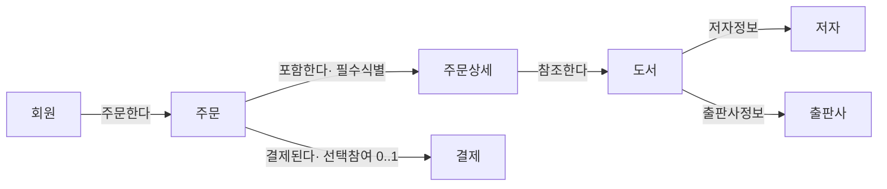

</details>

---

## 08 NULL

### 문제 NULL-01 (난이도: 하)

NULL에 대한 설명으로 옳지 않은 것은?

#### 보기
① NULL은 값이 아직 정해지지 않았거나 존재하지 않는 상태를 의미한다.
② 숫자형 컬럼에서 NULL은 0과 동일하게 취급되어 산술연산에 그대로 반영된다.
③ 문자형 컬럼에서 NULL은 길이가 0인 빈 문자열과 다른 개념이다.
④ Oracle DBMS는 예외적으로 빈 문자열을 NULL처럼 처리한다.

<details>
<summary>정답과 해설</summary>

### 주문
**정답: ②**

### 질문 극성
"옳지 않은 것"을 묻는다(부정형) → X인 선지를 찾는다.

### 적용 결정 트리
```text
값이 0·공백·빈 문자열인가?
│
├─ 일반적인 DBMS
│  ├─ 0 → 숫자 값(NULL 아님) ★
│  ├─ 빈 문자열 → 길이 0의 문자 값(NULL 아님)
│  └─ NULL → 알 수 없음 또는 값 없음(상태값)
└─ Oracle 예외 → 빈 문자열을 NULL처럼 처리
```

### 핵심 법리
NULL은 "값이 존재하지 않거나 아직 정해지지 않은 상태"를 나타내는 상태값이며, 숫자 0이나 공백(빈 문자열)과는 전혀 다른 개념이다.

### 정답을 가르는 사실
"NULL은 0과 같다"는 서술은 값과 상태를 혼동한 전형적 오답이다.

### 선지별 판단
| 선지 | 판정 | 이유 |
|---|---|---|
| ① | O | NULL의 정의를 정확히 서술 |
| ② | X | NULL은 0이 아니며, 산술연산에서 0처럼 계산되지 않고 오히려 결과를 NULL로 전파시킨다 — 정답 |
| ③ | O | NULL과 빈 문자열은 다른 개념이라는 서술이 정확함(일반 DBMS 기준) |
| ④ | O | Oracle의 예외적 처리를 정확히 서술 |

### 선지 교정
②를 "NULL은 산술연산에서 0과 다르게 취급되며, 연산에 참여하면 결과가 NULL로 전파된다"로 고치면 참.

### 관련 조항
- 헌법 제28조(NULL-01)
- 상세 판례: `./08-NULL/NULL-01-NULL의-의미와-표기법.md`

</details>

---

### 문제 NULL-02 (난이도: 하)

ERD 표기법과 NULL 허용 여부 표시에 대한 설명으로 옳은 것은?

#### 보기
① IE(정보공학) 표기법은 속성 앞에 o/* 기호를 붙여 NULL 허용 여부를 표시한다.
② Barker 표기법은 NULL 허용 여부를 표기하는 관례가 없다.
③ Barker 표기법에서 *는 NULL 비허용(NOT NULL)을, o는 NULL 허용을 의미한다.
④ Barker 표기법에서 #는 NULL 비허용을 의미하는 기호다.

<details>
<summary>정답과 해설</summary>

### 주문
**정답: ③**

### 질문 극성
옳은 것을 묻는다 → O인 선지를 찾는다.

### 적용 결정 트리
```text
ERD 표기법상 NULL 허용 여부 표기:
├─ Barker → 속성 앞 o(허용)/*(비허용) 기호로 명시 ★
└─ IE → 애초에 NULL 허용 여부를 표기하는 관례 없음
```

### 핵심 법리
Barker 표기법은 o(NULL 허용)/*(NULL 비허용)/#(주식별자) 기호로 NULL 여부를 명시하지만, IE 표기법은 NULL 허용 여부를 표기하는 관례 자체가 없다.

### 정답을 가르는 사실
"IE도 NULL 여부를 표시한다"거나 "Barker는 표기 관례가 없다"는 서술은 두 표기법의 특징을 뒤바꾼 함정이다. #(주식별자)와 *(NULL 비허용)의 의미도 혼동하기 쉽다.

### 선지별 판단
| 선지 | 판정 | 이유 |
|---|---|---|
| ① | X | NULL 허용 여부를 o/*로 표시하는 것은 IE가 아니라 Barker 표기법이다 |
| ② | X | NULL 표기 관례가 없는 것은 Barker가 아니라 IE 표기법이다 |
| ③ | O | Barker의 o/* 기호 의미를 정확히 서술 — 정답 |
| ④ | X | #는 주식별자를 의미하는 기호이며 NULL 비허용과는 별개의 개념이다 |

### 선지 교정
①은 "Barker 표기법은"으로, ②는 "IE 표기법은"으로, ④는 "#는 주식별자를 의미한다"로 고치면 참.

### 관련 조항
- 헌법 제28조(NULL-01)
- 상세 판례: `./08-NULL/NULL-01-NULL의-의미와-표기법.md`

</details>

---

### 문제 NULL-03 (난이도: 중)

COL 컬럼에 NULL인 행이 존재하는 테이블 T에 대한 다음 SQL 실행 결과 설명 중 옳은 것은?

#### 보기
① `WHERE COL = NULL` 조건은 COL이 NULL인 행을 모두 반환한다.
② `WHERE COL = NULL` 조건과 `WHERE COL IS NULL` 조건은 항상 동일한 결과를 반환한다.
③ `WHERE COL = NULL` 조건은 비교연산의 결과가 UNKNOWN이 되어 어떤 행도 반환하지 않는다.
④ `WHERE COL <> NULL` 조건은 COL이 NULL이 아닌 행을 모두 반환한다.

<details>
<summary>정답과 해설</summary>

### 주문
**정답: ③**

### 질문 극성
옳은 것을 묻는다 → O인 선지를 찾는다.

### 적용 결정 트리
```text
COL = NULL → 일반 비교연산, 결과는 항상 UNKNOWN(0건 반환) ★
COL IS NULL → NULL 상태 판정 전용 연산자, TRUE/FALSE 반환
WHERE → TRUE만 통과, FALSE·UNKNOWN 제외
```

### 핵심 법리
NULL은 일반 비교연산자(`=`, `<>` 등)로 비교할 수 없다. `COL = NULL`은 항상 UNKNOWN이 되고, WHERE 절은 TRUE인 행만 통과시키므로 결과는 항상 0건이다. NULL 여부 판단은 반드시 `IS NULL`/`IS NOT NULL`을 써야 한다.

### 정답을 가르는 사실
`= NULL`과 `IS NULL`을 같은 것으로 서술하면 오답이다. `<> NULL` 역시 비교연산이므로 결과는 UNKNOWN이지 "NULL이 아닌 행 전체"가 아니다.

### 선지별 판단
| 선지 | 판정 | 이유 |
|---|---|---|
| ① | X | `= NULL`은 UNKNOWN이 되어 어떤 행도 반환하지 않는다(NULL인 행조차 반환 못함) |
| ② | X | `IS NULL`은 정상 판정(TRUE/FALSE)되지만 `= NULL`은 항상 UNKNOWN이므로 두 조건은 다르다 |
| ③ | O | UNKNOWN의 결과와 WHERE 절의 필터링 규칙을 정확히 서술 — 정답 |
| ④ | X | `<>`도 비교연산이므로 NULL과 비교하면 UNKNOWN이 되어 0건이 반환된다(NULL이 아닌 행 전체가 반환된다는 서술은 틀림) |

### 선지 교정
①·④는 "0건이 반환된다"로, ②는 "결과가 다르다(후자는 항상 0건)"로 고치면 참.

### 관련 조항
- 헌법 제29조(NULL-02)
- 상세 판례: `./08-NULL/NULL-02-NULL과-비교연산.md`

</details>

---

### 문제 NULL-04 (난이도: 중)

테이블 T의 컬럼 A에 NULL을 포함한 값이 섞여 있을 때, 3값 논리(TRUE/FALSE/UNKNOWN)에 대한 설명으로 옳지 않은 것은?

#### 보기
① `WHERE A IS NULL`의 결과는 TRUE 또는 FALSE로 정상 판정된다.
② `WHERE A = 10` 조건에서 A가 NULL인 행은 UNKNOWN으로 판정되어 결과에서 제외된다.
③ WHERE 절은 조건이 TRUE인 행만 통과시키며, FALSE와 UNKNOWN인 행은 모두 제외한다.
④ UNKNOWN은 비교연산 결과가 정해지지 않았다는 뜻으로, 산술연산에서 NULL이 반환되는 것과 동일한 개념이다.

<details>
<summary>정답과 해설</summary>

### 주문
**정답: ④**

### 질문 극성
"옳지 않은 것"을 묻는다(부정형) → X인 선지를 찾는다.

### 적용 결정 트리
```text
조건식(비교연산)의 결과가 무엇인가?
├─ TRUE → WHERE 통과
├─ FALSE → WHERE 제외
└─ UNKNOWN(NULL이 비교연산에 관여) → WHERE 제외 ★

⚠️ UNKNOWN(진리값, 비교연산)과 NULL 전파(값, 산술연산)는 서로 다른 개념
```

### 핵심 법리
비교연산의 결과는 값이 아니라 진리값(TRUE/FALSE/UNKNOWN)이다. 반면 산술연산에서 NULL이 관여하면 결과는 "값" 그 자체가 NULL로 전파된다. 이 둘은 서로 다른 연산 범주이므로 같은 개념으로 서술하면 오답이다.

### 정답을 가르는 사실
"UNKNOWN = NULL 전파"라는 서술은 비교연산(진리값)과 산술연산(값)의 결과 종류를 혼동한 함정이다.

### 선지별 판단
| 선지 | 판정 | 이유 |
|---|---|---|
| ① | O | IS NULL은 NULL 상태 판정 전용 연산자로 TRUE/FALSE를 정상 반환한다 |
| ② | O | 일반 비교연산에 NULL이 관여하면 UNKNOWN이 되어 WHERE 절에서 제외된다 |
| ③ | O | WHERE 절의 3값 논리 필터링 규칙을 정확히 서술 |
| ④ | X | UNKNOWN(비교연산의 진리값)과 NULL 전파(산술연산의 값)는 서로 다른 개념이며 동일시할 수 없다 — 정답 |

### 선지 교정
④를 "UNKNOWN은 비교연산 고유의 진리값이며, 산술연산에서 NULL이 전파되는 것과는 다른 개념이다"로 고치면 참.

### 관련 조항
- 헌법 제29조(NULL-02) / 제30조(NULL-03)
- 상세 판례: `./08-NULL/NULL-02-NULL과-비교연산.md`, `./08-NULL/NULL-03-NULL과-산술연산.md`

</details>

---

### 문제 NULL-05 (난이도: 상)

SAMPLE 테이블의 컬럼 COL에 NULL이 포함되어 있을 때, 다음 중 그 결과가 NULL이 되지 않는 것은?

#### 보기
① `COL + 100`
② `COL * 0`
③ `COL - COL`
④ `NVL(COL, 0) + 100`

<details>
<summary>정답과 해설</summary>

### 주문
**정답: ④**

### 질문 극성
"NULL이 되지 않는 것"을 묻는다 → 결과가 NULL이 아닌 선지(예외)를 찾는다.

### 적용 결정 트리
```text
NULL이 산술연산(+, -, *, /)의 피연산자로 쓰이는가?
├─ 예 → 결과는 항상 NULL(전파)
│  └─ NVL/COALESCE/ISNULL 등으로 먼저 치환하지 않는 한 예외 없음 ★
└─ 아니오(사전에 NVL로 치환됨) → 정상 계산
```

### 핵심 법리
NULL이 산술연산의 피연산자로 사용되면 결과는 항상 NULL이 된다(전파). "0을 곱하면 0이 된다", "자기 자신을 빼면 0이 된다"는 일반적인 산술 직관은 NULL에는 적용되지 않는다. NULL을 값으로 살리려면 NVL 등으로 먼저 치환해야 한다.

### 정답을 가르는 사실
COL이 NULL인 한, `COL * 0`도 `COL - COL`도 모두 NULL이다. NVL로 COL을 먼저 0으로 치환한 ④만 정상적인 숫자 결과(100)를 낸다.

### 선지별 판단
| 선지 | 판정 | 이유 |
|---|---|---|
| ① | NULL | NULL + 100은 NULL로 전파된다 |
| ② | NULL | NULL * 0은 0이 아니라 NULL로 전파된다("0을 곱하면 0"이라는 직관 함정) |
| ③ | NULL | NULL - NULL은 0이 아니라 NULL로 전파된다("자기 자신을 빼면 0"이라는 직관 함정) |
| ④ | 100(NULL 아님) | NVL(COL, 0)이 COL의 NULL을 0으로 먼저 치환하므로 이후 연산은 정상적으로 100이 된다 — 정답 |

### 선지 교정
①·②·③이 NULL이 되지 않으려면 모두 NVL 등으로 COL을 먼저 치환해야 한다.

### 관련 조항
- 헌법 제30조(NULL-03)
- 상세 판례: `./08-NULL/NULL-03-NULL과-산술연산.md`

</details>

---

### 문제 NULL-06 (난이도: 중)

다음 진술 중 옳은 것만을 모두 고른 것은?

#### 보기
가. NULL은 공백(space)이나 빈 문자열과 같은 값으로 취급된다.
나. IE 표기법으로 그려진 ERD만으로는 특정 속성이 NULL을 허용하는지 판단할 수 없다.
다. `SELECT * FROM T WHERE COL IS NOT NULL;`은 COL이 NULL이 아닌 행만 정상적으로 반환한다.
라. `COL1 = COL2` 조건에서 COL1과 COL2가 모두 NULL이면 두 값이 같으므로 TRUE가 반환된다.

① 가, 나
② 나, 다
③ 다, 라
④ 가, 라
⑤ 나, 다, 라

<details>
<summary>정답과 해설</summary>

### 주문
**정답: ②**

### 질문 극성
모두 고른 것을 묻는다 → 각 진술을 O/X 판정 → X 포함 조합 소거 → O만 포함된 조합 채택.

### 적용 결정 트리
```text
총칙 제1항: 모두 고른 것을 묻는다
├─ 각 진술을 O/X 판정
├─ X가 포함된 조합 소거
└─ O만 포함된 조합 채택
```

### 핵심 법리
NULL은 값이 아니라 상태이므로 공백·빈 문자열과 다르다(제28조). IE 표기법은 NULL 여부를 표기하지 않는다(제28조). `IS NOT NULL`은 정상적으로 판정된다(제29조). NULL은 NULL끼리 비교해도 UNKNOWN이지 TRUE가 아니다(제29조).

### 진술별 O/X 판정
| 진술 | 판정 | 이유 |
|---|---|---|
| 가 | X | NULL은 상태이며 공백·빈 문자열이라는 값과 다르다 |
| 나 | O | IE 표기법은 NULL 허용 여부를 표기하는 관례가 없다 |
| 다 | O | `IS NOT NULL`은 전용 연산자로 정상 판정된다 |
| 라 | X | NULL은 NULL끼리 비교해도 UNKNOWN이며, "같으므로 TRUE"라는 서술은 3값 논리를 위반한다 |

### 조합 판정표
| 조합 | 포함 진술 | X 포함 여부 | 채택 여부 |
|---|---|---|---|
| ① | 가, 나 | 가(X) 포함 | 소거 |
| ② | 나, 다 | 없음 | **채택** |
| ③ | 다, 라 | 라(X) 포함 | 소거 |
| ④ | 가, 라 | 가, 라(X) 포함 | 소거 |
| ⑤ | 나, 다, 라 | 라(X) 포함 | 소거 |

### 선지 교정
가는 "NULL은 공백·빈 문자열과 다른, 값이 존재하지 않는 상태다"로, 라는 "NULL끼리 비교해도 결과는 UNKNOWN이다"로 고치면 참.

### 관련 조항
- 헌법 제28조(NULL-01) / 제29조(NULL-02)
- 상세 판례: `./08-NULL/NULL-01-NULL의-의미와-표기법.md`, `./08-NULL/NULL-02-NULL과-비교연산.md`

</details>

---

### 문제 NULL-07 (난이도: 상)

다음 진술 중 옳은 것만을 모두 고른 것은?

#### 보기
가. `SUM(COL)`은 COL에 NULL이 있으면 그 NULL을 0으로 치환해서 더한다.
나. `COL1 + COL2`에서 COL1과 COL2 중 하나라도 NULL이면 그 행의 연산 결과는 NULL이다.
다. `COUNT(*)`는 컬럼의 NULL 여부와 무관하게 행의 개수를 그대로 센다.
라. `AVG(COL)`은 NULL인 행도 분모(전체 행 수)에 포함시켜 평균을 계산한다.

① 가, 나
② 나, 다
③ 다, 라
④ 가, 다
⑤ 나, 라

<details>
<summary>정답과 해설</summary>

### 주문
**정답: ②**

### 질문 극성
모두 고른 것을 묻는다 → 각 진술을 O/X 판정 → X 포함 조합 소거 → O만 포함된 조합 채택.

### 적용 결정 트리
```text
총칙 제1항: 모두 고른 것을 묻는다
├─ 각 진술을 O/X 판정
├─ X가 포함된 조합 소거
└─ O만 포함된 조합 채택

⚠️ 산술연산(전파, 나)과 집계함수(제외, 가·다·라)의 규칙은 정반대이므로
   서로 바꿔치기하지 않도록 주의
```

### 핵심 법리
산술연산은 NULL이 하나라도 섞이면 결과 전체가 NULL로 전파된다(제30조). 반면 집계함수는 NULL을 "제외"하고 계산하는 것이지 "0으로 치환"하거나 "분모에 포함"하는 것이 아니며, 유일한 예외는 `COUNT(*)`다(제31조).

### 진술별 O/X 판정
| 진술 | 판정 | 이유 |
|---|---|---|
| 가 | X | SUM은 NULL을 0으로 치환하는 것이 아니라 계산 대상에서 제외한다 |
| 나 | O | 산술연산에서 NULL은 전파되어 그 행의 결과가 NULL이 된다 |
| 다 | O | COUNT(*)는 행의 존재 여부만 세는 유일한 예외다 |
| 라 | X | AVG는 NULL인 행을 분모(개수)에서 제외하고 계산한다 |

### 조합 판정표
| 조합 | 포함 진술 | X 포함 여부 | 채택 여부 |
|---|---|---|---|
| ① | 가, 나 | 가(X) 포함 | 소거 |
| ② | 나, 다 | 없음 | **채택** |
| ③ | 다, 라 | 라(X) 포함 | 소거 |
| ④ | 가, 다 | 가(X) 포함 | 소거 |
| ⑤ | 나, 라 | 라(X) 포함 | 소거 |

### 선지 교정
가는 "NULL을 계산에서 제외한다"로, 라는 "NULL인 행은 분모에서 제외한다"로 고치면 참.

### 관련 조항
- 헌법 제30조(NULL-03) / 제31조(NULL-04)
- 상세 판례: `./08-NULL/NULL-03-NULL과-산술연산.md`, `./08-NULL/NULL-04-NULL과-집계함수.md`

</details>

---

### 문제 NULL-08 (난이도: 중)

다음 사례를 읽고 물음에 답하시오.

> 회원 테이블 MEMBER는 이메일(EMAIL) 컬럼이 선택 속성으로, 값이 없으면 NULL이 저장된다. 어느 개발자가 "이메일을 등록하지 않은 회원 수"를 구하기 위해 다음 SQL을 작성했다.
>
> ```sql
> SELECT COUNT(*) FROM MEMBER WHERE EMAIL = NULL;
> ```

이 SQL의 실행 결과와 그 이유로 가장 적절한 것은?

#### 보기
① 이메일이 NULL인 회원 수가 정상적으로 반환된다. COUNT(*)는 NULL과 무관하게 행을 세기 때문이다.
② 항상 0이 반환된다. EMAIL = NULL 비교의 결과가 UNKNOWN이 되어 WHERE 절을 통과하는 행이 없기 때문이다.
③ 전체 회원 수가 반환된다. COUNT(*)는 WHERE 조건과 무관하게 항상 전체 행을 세기 때문이다.
④ 오류가 발생한다. NULL은 비교연산자와 함께 사용할 수 없기 때문이다.

<details>
<summary>정답과 해설</summary>

### 주문
**정답: ②**

### 질문 극성
가장 적절한 것(결론+이유가 모두 맞는 것)을 묻는다 → O인 선지를 찾는다.

### 적용 결정 트리
```text
EMAIL = NULL → 일반 비교연산, 결과 UNKNOWN ★
→ WHERE 절은 TRUE만 통과, UNKNOWN 제외 → 통과하는 행 0건
→ COUNT(*)는 "통과한 행"을 세는 것이므로 결과는 0
```

### 핵심 법리
`EMAIL = NULL`은 IS NULL이 아니라 일반 비교연산이므로 결과가 UNKNOWN이 되어 WHERE 절을 통과하는 행이 없다. COUNT(*)가 "NULL과 무관하게 행을 센다"는 것은 맞는 지식이지만, 그것은 이미 WHERE로 걸러진 결과 집합(0건)에 대해 세는 것이므로 이 사례에서는 최종 결과가 0이 된다.

### 정답을 가르는 사실
COUNT(*)의 성질(NULL 무관 카운트)과 WHERE 절의 비교연산 필터링(UNKNOWN 제외)을 구분해야 한다 — COUNT(*) 자체의 성질만 보고 "정상적으로 개수가 나온다"고 결론 내리면 WHERE 절에서 이미 모든 행이 걸러진다는 사실을 놓친 것이다.

### 선지별 판단
| 선지 | 판정 | 이유 |
|---|---|---|
| ① | X | 결론이 틀렸다 — EMAIL=NULL 조건 자체가 UNKNOWN이라 애초에 통과하는 행이 없다(COUNT(*)의 성질과 WHERE 필터링을 혼동) |
| ② | O | 결론(0 반환)과 이유(UNKNOWN이라 WHERE 통과 행 없음)가 모두 정확 — 정답 |
| ③ | X | COUNT(*)가 WHERE 조건과 무관하다는 서술이 틀렸다 — WHERE 절을 통과한 행만 대상이 된다 |
| ④ | X | `= NULL`은 문법 오류가 아니라 정상적으로 실행되며 결과가 UNKNOWN(0건)일 뿐이다 |

### 선지 교정
"이메일 미등록 회원 수"를 구하려면 `WHERE EMAIL IS NULL`로 고쳐야 정상적으로 카운트된다.

### 관련 조항
- 헌법 제29조(NULL-02) / 제31조(NULL-04)
- 상세 판례: `./08-NULL/NULL-02-NULL과-비교연산.md`, `./08-NULL/NULL-04-NULL과-집계함수.md`

</details>

---

### 문제 NULL-09 (난이도: 상)

다음 사례를 읽고 물음에 답하시오.

> 급여관리 시스템에 SALARY(기본급)와 BONUS(상여금) 컬럼을 가진 EMP 테이블이 있다. BONUS는 상여금이 없는 직원의 경우 NULL로 저장된다. 다음 두 SQL의 실행 결과를 비교한다.
>
> ```sql
> (A) SELECT SUM(SALARY + BONUS) FROM EMP;
> (B) SELECT SUM(SALARY) + SUM(BONUS) FROM EMP;
> ```

BONUS가 NULL인 직원이 한 명 이상 존재할 때, (A)와 (B)의 결과에 대한 설명으로 가장 적절한 것은?

#### 보기
① (A)와 (B)의 결과는 항상 같다. SUM은 NULL을 제외하고 계산하기 때문이다.
② (A)는 BONUS가 NULL인 직원의 (SALARY+BONUS) 값이 행 단위로 NULL로 전파되어 그 직원의 급여가 합계에서 빠지지만, (B)는 SUM(BONUS)에서만 NULL이 제외되므로 두 결과가 다를 수 있다.
③ (A)와 (B)의 결과는 항상 다르다. SUM 함수 자체가 NULL이 있으면 오류를 반환하기 때문이다.
④ (A)는 오류가 발생하고, (B)만 정상적으로 계산된다.

<details>
<summary>정답과 해설</summary>

### 주문
**정답: ②**

### 질문 극성
가장 적절한 것을 묻는다 → O인 선지를 찾는다.

### 적용 결정 트리
```text
(A) SUM(SALARY + BONUS)
├─ 1단계: 행별 산술 SALARY+BONUS → BONUS가 NULL인 행은 NULL로 전파(제30조) ★
└─ 2단계: SUM은 NULL이 된 행을 집계에서 제외(제31조) → 그 직원의 SALARY까지 합계에서 빠짐

(B) SUM(SALARY) + SUM(BONUS)
├─ SUM(SALARY): 모든 SALARY 합산(NULL 없다고 가정)
├─ SUM(BONUS): BONUS의 NULL만 제외하고 합산(제31조)
└─ 두 집계 결과를 더함 → BONUS가 NULL이어도 SALARY는 합계에 그대로 반영됨
```

### 핵심 법리
같은 데이터라도 "산술연산 먼저(행 단위 NULL 전파, 제30조) 후 집계"와 "집계 먼저(컬럼별 NULL 제외, 제31조) 후 산술연산"은 처리 순서가 달라 결과가 달라질 수 있다. (A)는 행 단위로 먼저 더하므로 BONUS가 NULL인 행 전체가 NULL로 오염되어 집계에서 빠지지만, (B)는 SALARY와 BONUS를 각각 따로 집계한 뒤 더하므로 BONUS의 NULL이 SALARY의 합계에는 영향을 주지 않는다.

### 정답을 가르는 사실
"SUM(A+B)"와 "SUM(A)+SUM(B))"는 언뜻 같아 보이지만 NULL이 섞이면 계산 순서(연산 우선인지 집계 우선인지)에 따라 결과가 달라진다는 점이 이 사례의 결정적 사실이다.

### 선지별 판단
| 선지 | 판정 | 이유 |
|---|---|---|
| ① | X | 결론이 틀렸다 — (A)는 행 단위 전파 때문에 SALARY까지 함께 제외되어 (B)보다 작아질 수 있다 |
| ② | O | 처리 순서 차이로 인한 결과 차이를 정확히 서술 — 정답 |
| ③ | X | SUM은 오류를 내지 않고 정상적으로 NULL을 제외(또는 전파된 NULL을 제외)하고 계산한다 |
| ④ | X | (A)는 오류가 아니라 정상적으로 실행되며 값이 더 작게(또는 다르게) 나올 뿐이다 |

### 선지 교정
①은 "결과가 다를 수 있다"로, ③·④는 "오류가 아니라 정상적으로 계산되며 결과값에 차이가 생긴다"로 고치면 참.

### 관련 조항
- 헌법 제30조(NULL-03) / 제31조(NULL-04)
- 상세 판례: `./08-NULL/NULL-03-NULL과-산술연산.md`, `./08-NULL/NULL-04-NULL과-집계함수.md`

</details>

---

### 문제 NULL-10 (난이도: 상)

다음 PRODUCT 테이블을 보고 결과값이 가장 큰 SQL을 고르시오.

| 행 | PRICE | DISCOUNT |
|---:|---:|---:|
| 1 | 1000 | 100 |
| 2 | 2000 | NULL |
| 3 | NULL | 300 |
| 4 | 500 | 0 |

#### 보기
① `SELECT SUM(PRICE) FROM PRODUCT;`
② `SELECT SUM(PRICE - DISCOUNT) FROM PRODUCT;`
③ `SELECT SUM(DISCOUNT) FROM PRODUCT;`
④ `SELECT COUNT(*) * 100 FROM PRODUCT;`

<details>
<summary>정답과 해설</summary>

### 1단계: 행별 산술 (`PRICE - DISCOUNT`)
| 행 | `PRICE - DISCOUNT` | 이유 |
|---:|---:|---|
| 1 | 900 | 두 값 모두 존재(1000-100) |
| 2 | NULL | DISCOUNT가 NULL |
| 3 | NULL | PRICE가 NULL |
| 4 | 500 | 두 값 모두 존재(500-0, 0은 NULL이 아닌 값) |

### 2단계: 집계
| 표현 | 계산 과정 | 결과 |
|---|---|---:|
| `SUM(PRICE)` | 1000+2000+500 (행3의 PRICE는 NULL이라 제외) | 3500 |
| `SUM(PRICE-DISCOUNT)` | 900, NULL, NULL, 500 중 NULL 제외 → 900+500 | 1400 |
| `SUM(DISCOUNT)` | 100+300+0 (행2의 DISCOUNT는 NULL이라 제외) | 400 |
| `COUNT(*)` | 전체 행 | 4 |
| `COUNT(*) * 100` | 4 * 100 | 400 |

### 선지별 결과 비교
| 선지 | 결과값 |
|---|---:|
| ① SUM(PRICE) | 3500 |
| ② SUM(PRICE-DISCOUNT) | 1400 |
| ③ SUM(DISCOUNT) | 400 |
| ④ COUNT(*)*100 | 400 |

### 주문
**정답: ①**

### 정답을 가르는 사실
①은 컬럼 하나만 집계 대상이므로 NULL 제외 규칙(제31조)만 적용되어 3500이라는 가장 큰 값이 나온다. ②는 행 단위 산술(제30조, NULL 전파)이 먼저 일어나 900·NULL·NULL·500만 남고 그중 NULL이 제외되어 1400이 된다. ③·④는 모두 400으로 같은 값이지만 근거가 다르다(③은 컬럼 집계에서 NULL 제외, ④는 행 자체를 세는 것과 무관한 산술식).

### 관련 조항
- 헌법 제30조(NULL-03) / 제31조(NULL-04)
- 상세 판례: `./08-NULL/NULL-03-NULL과-산술연산.md`, `./08-NULL/NULL-04-NULL과-집계함수.md`

</details>

---

### 문제 NULL-11 (난이도: 최상)

다음 ORDERS 테이블을 보고 아래 네 SQL의 결과값을 작은 것부터 큰 순서로 나열한 것을 고르시오.

| 행 | QTY | PRICE |
|---:|---:|---:|
| 1 | 10 | 1000 |
| 2 | NULL | 2000 |
| 3 | 5 | NULL |
| 4 | 20 | 1500 |
| 5 | NULL | NULL |

#### 보기(비교 대상 SQL)
① `SELECT SUM(QTY*PRICE) FROM ORDERS;`
② `SELECT AVG(QTY) FROM ORDERS;`
③ `SELECT COUNT(PRICE) FROM ORDERS;`
④ `SELECT COUNT(*) FROM ORDERS;`

#### 정렬 선택지
㉮ ③-④-②-①
㉯ ①-②-③-④
㉰ ④-③-①-②
㉱ ②-①-④-③

<details>
<summary>정답과 해설</summary>

### 1단계: 행별 산술 (`QTY * PRICE`)
| 행 | QTY | PRICE | `QTY*PRICE` | 이유 |
|---:|---:|---:|---:|---|
| 1 | 10 | 1000 | 10000 | 두 값 모두 존재 |
| 2 | NULL | 2000 | NULL | QTY가 NULL |
| 3 | 5 | NULL | NULL | PRICE가 NULL |
| 4 | 20 | 1500 | 30000 | 두 값 모두 존재 |
| 5 | NULL | NULL | NULL | 둘 다 NULL |

### 2단계: 집계
| 표현 | 계산 과정 | 결과 |
|---|---|---:|
| `SUM(QTY*PRICE)` | 10000, NULL, NULL, 30000, NULL 중 NULL 제외 → 10000+30000 | 40000 |
| `AVG(QTY)` | NULL 아닌 QTY(10, 5, 20)의 평균 = 35 ÷ 3 | 약 11.67 |
| `COUNT(PRICE)` | NULL 아닌 PRICE의 개수(1000, 2000, 1500 → 3개) | 3 |
| `COUNT(*)` | 전체 행 | 5 |

### 선지별 결과 비교
| 선지 | 결과값 |
|---|---:|
| ① SUM(QTY*PRICE) | 40000 |
| ② AVG(QTY) | 약 11.67 |
| ③ COUNT(PRICE) | 3 |
| ④ COUNT(*) | 5 |

### 오름차순 정렬
`3(③) < 5(④) < 11.67(②) < 40000(①)` → **③-④-②-①**

### 주문
**정답: ㉮**

### 정답을 가르는 사실
④ `COUNT(*)`는 NULL과 무관하게 행 자체(5개)를 세지만, ③ `COUNT(PRICE)`는 PRICE가 NULL인 행(3번째 행)을 제외해 3이 된다 — 같은 "개수"를 구하는 함수라도 `*`인지 컬럼인지에 따라 값이 다르다. ② `AVG(QTY)`는 QTY가 NULL인 행(2, 5번째)을 분모·분자 모두에서 제외하고 계산하므로 35÷3이지, 5개 행 전체로 나누는 35÷5가 아니다. ① `SUM(QTY*PRICE)`는 행 단위 곱셈에서 먼저 NULL이 전파(2, 3, 5번째 행)된 뒤 남은 두 값만 더해지므로 큰 값이 그대로 유지된다.

### 관련 조항
- 헌법 제30조(NULL-03) / 제31조(NULL-04)
- 상세 판례: `./08-NULL/NULL-03-NULL과-산술연산.md`, `./08-NULL/NULL-04-NULL과-집계함수.md`

</details>

---

### 문제 NULL-12 (난이도: 최상, 장문 지문형)

다음은 한 물류 회사의 배송비 정산 시스템에 대한 설명이다.

> ORDER 테이블에는 BASE_FEE(기본 배송비)와 DISCOUNT_RATE(할인율, %) 컬럼이 있다. DISCOUNT_RATE는 프로모션이 적용되지 않은 주문의 경우 NULL로 저장된다. 정산 담당자는 "최종 배송비 = BASE_FEE - (BASE_FEE * DISCOUNT_RATE / 100)"라는 계산식을 SQL로 작성하려 하며, 다음 네 가지 방안을 검토했다.
>
> - 방안 1: `SELECT BASE_FEE - (BASE_FEE * DISCOUNT_RATE / 100) FROM ORDER;`
> - 방안 2: `SELECT BASE_FEE - (BASE_FEE * NVL(DISCOUNT_RATE, 0) / 100) FROM ORDER;`
> - 방안 3: `SELECT COUNT(*) FROM ORDER WHERE DISCOUNT_RATE = NULL;`
> - 방안 4: `SELECT AVG(DISCOUNT_RATE) FROM ORDER;`
>
> 담당자는 "방안 1은 모든 주문에 대해 정확한 최종 배송비를 계산해줄 것이다", "방안 3은 프로모션이 적용되지 않은 주문 건수를 정확히 세어줄 것이다", "방안 4는 전체 주문 건수를 분모로 하여 평균 할인율을 계산해줄 것이다"라고 예상했다.

담당자의 예상 중 옳은 것과 그 근거로 가장 적절한 것은?

#### 보기
① 방안 1의 예상이 옳다. DISCOUNT_RATE가 NULL이어도 산술연산에서는 0으로 취급되어 BASE_FEE 그대로 계산되기 때문이다.
② 방안 2만 모든 주문에 대해 정상적인 최종 배송비를 계산한다. NVL로 NULL을 0으로 먼저 치환하여 산술연산의 NULL 전파를 차단했기 때문이며, 방안 1은 DISCOUNT_RATE가 NULL인 주문의 최종 배송비가 NULL로 전파되어 계산되지 않는다.
③ 방안 3의 예상이 옳다. `DISCOUNT_RATE = NULL` 조건이 NULL인 행을 정확히 찾아내기 때문이다.
④ 방안 4의 예상이 옳다. AVG는 전체 행 수를 분모로 하여 평균을 계산하기 때문이다.

<details>
<summary>정답과 해설</summary>

### 주문
**정답: ②**

### 질문 극성
옳은 예상과 근거를 모두 갖춘 것을 묻는다 → 결론과 이유가 모두 O인 선지를 찾는다.

### 적용 결정 트리
```text
[방안 1] BASE_FEE - (BASE_FEE * DISCOUNT_RATE / 100)
└─ DISCOUNT_RATE가 NULL인 피연산자로 산술연산에 참여
   → 결과 전체가 NULL로 전파(제30조) ★ → "정확한 계산"이라는 예상은 틀림

[방안 2] NVL(DISCOUNT_RATE, 0)으로 사전 치환
└─ NULL이 0으로 치환된 뒤 연산되므로 전파 차단
   → 모든 주문에 대해 정상 계산 ★

[방안 3] WHERE DISCOUNT_RATE = NULL
└─ 일반 비교연산이므로 결과 UNKNOWN(제29조) → 0건 반환(NULL인 행조차 못 찾음)

[방안 4] AVG(DISCOUNT_RATE)
└─ NULL인 행은 분모(개수)에서 제외되고 계산됨(제31조) → "전체 행 수가 분모"라는 예상은 틀림
```

### 핵심 법리
산술연산(제30조)은 NULL이 하나라도 섞이면 결과 전체가 NULL로 전파되므로, NULL을 계산에 포함시키려면 NVL 등으로 먼저 치환해야 한다. 비교연산(제29조)에서 `= NULL`은 항상 UNKNOWN이 되어 NULL인 행조차 찾아내지 못하며, NULL 여부 확인에는 `IS NULL`을 써야 한다. 집계함수(제31조)는 NULL을 계산 대상에서 "제외"하는 것이지 "분모에 포함"하는 것이 아니다.

### 정답을 가르는 사실
- 방안 1: DISCOUNT_RATE가 NULL인 행은 산술연산 전체가 NULL로 전파되어 "최종 배송비"가 계산되지 않는다(결론이 틀림)
- 방안 2: NVL로 먼저 치환했으므로 모든 행에서 정상 계산됨(결론·근거 모두 옳음)
- 방안 3: `= NULL`은 UNKNOWN이라 0건이 반환되므로 "정확히 센다"는 예상이 틀림
- 방안 4: AVG는 NULL을 제외한 개수를 분모로 쓰므로 "전체 행 수가 분모"라는 근거가 틀림

### 선지별 판단
| 선지 | 판정 | 이유 |
|---|---|---|
| ① | X | "산술연산에서 NULL이 0으로 취급된다"는 전제 자체가 틀렸다(제30조 위반) |
| ② | O | 방안 2의 결론(정상 계산)과 근거(NVL로 전파 차단), 방안 1의 실패 이유(전파)를 모두 정확히 서술 — 정답 |
| ③ | X | `= NULL`은 UNKNOWN이 되어 0건이 반환되므로 "정확히 센다"는 결론이 틀렸다 |
| ④ | X | AVG는 NULL을 제외한 행만 분모로 삼으므로 "전체 행 수"라는 근거가 틀렸다 |

### 선지 교정
방안 1은 `NVL(DISCOUNT_RATE, 0)`으로, 방안 3은 `WHERE DISCOUNT_RATE IS NULL`로, 방안 4의 설명은 "NULL이 아닌 행만 분모로 삼는다"로 고쳐야 한다.

### 관련 조항
- 헌법 제29조(NULL-02) / 제30조(NULL-03) / 제31조(NULL-04)
- 상세 판례: `./08-NULL/NULL-02-NULL과-비교연산.md`, `./08-NULL/NULL-03-NULL과-산술연산.md`, `./08-NULL/NULL-04-NULL과-집계함수.md`

</details>

---

### 문제 NULL-13 (난이도: 하)

집계함수의 NULL 처리에 대한 설명으로 옳은 것은?

#### 보기
① COUNT(*)는 특정 컬럼이 NULL이면 그 행을 세지 않는다.
② MAX, MIN 함수는 NULL 값을 0으로 치환한 뒤 최댓값·최솟값을 구한다.
③ COUNT(컬럼)은 해당 컬럼 값이 NULL이 아닌 행만 센다.
④ 집계함수는 예외 없이 NULL이 하나라도 있으면 결과가 NULL이 된다.

<details>
<summary>정답과 해설</summary>

### 주문
**정답: ③**

### 질문 극성
옳은 것을 묻는다 → O인 선지를 찾는다.

### 적용 결정 트리
```text
COUNT(*) → NULL 여부와 무관하게 행 자체를 카운트(유일한 예외)
COUNT(컬럼)/SUM/AVG/MAX/MIN → NULL 제외하고 계산 ★
```

### 핵심 법리
`COUNT(컬럼)`, `SUM`, `AVG`, `MAX`, `MIN`은 계산 대상 컬럼의 NULL을 제외하고 나머지 값만으로 집계한다. `COUNT(*)`만 예외적으로 NULL과 무관하게 행 자체를 센다.

### 정답을 가르는 사실
"NULL을 0으로 치환"이나 "NULL이 있으면 결과도 NULL"이라는 서술은 집계함수가 아니라 산술연산의 규칙(제30조)을 잘못 가져온 것이다.

### 선지별 판단
| 선지 | 판정 | 이유 |
|---|---|---|
| ① | X | COUNT(*)는 컬럼 값을 보지 않고 행의 존재 자체를 센다(NULL과 무관) |
| ② | X | MAX/MIN은 NULL을 0으로 치환하지 않고 계산 대상에서 제외한다 |
| ③ | O | COUNT(컬럼)의 NULL 제외 규칙을 정확히 서술 — 정답 |
| ④ | X | 이는 산술연산(제30조)의 전파 규칙이며, 집계함수(제31조)는 NULL을 제외하고 계산한다 |

### 선지 교정
①은 "COUNT(*)는 NULL과 무관하게 행을 센다"로, ②는 "제외하고 계산한다"로, ④는 "NULL을 제외하고 계산한다(COUNT(*)는 예외)"로 고치면 참.

### 관련 조항
- 헌법 제31조(NULL-04)
- 상세 판례: `./08-NULL/NULL-04-NULL과-집계함수.md`

</details>

---

## 총평

| 단원 | 문제 수 | A(단일선지) | B(조합선지) | C(사례형) | D(표·계산형) | F(장문형) | 하 | 중 | 상 | 최상 |
|---|---:|---:|---:|---:|---:|---:|---:|---:|---:|---:|
| 07 데이터 모델과 SQL | 12 | 5 | 2 | 2 | 2 | 1 | 2 | 4 | 4 | 2 |
| 08 NULL | 13 | 6 | 2 | 2 | 2 | 1 | 3 | 4 | 4 | 2 |
| **합계** | **25** | **11** | **4** | **4** | **4** | **2** | **5** | **8** | **8** | **4** |

- 08단원 표·계산형(NULL-10, NULL-11)은 행별 산술(1단계) → 집계(2단계) 분리 형식을 그대로 적용했다.
- `=NULL` vs `IS NULL`(3값 논리) 문제: NULL-03, NULL-04(직접), NULL-08·NULL-12(사례 응용) 등 총 4문제에서 다뤘다(요구된 최소 2문제 충족).
- 모든 문제는 헌법 제25조~제31조(SQL-01, TXN-01, PERF-01, NULL-01~04) 범위 안에서만 출제했다.
