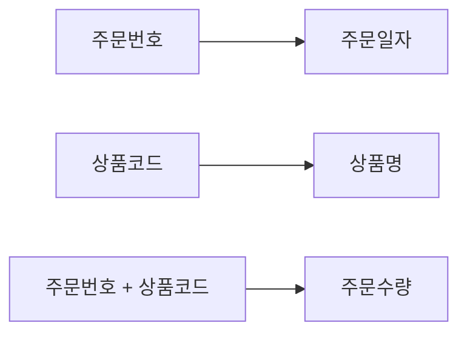
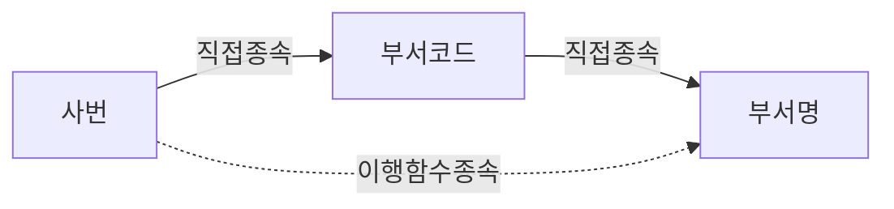

# SQLD 1과목 누적형 헌법

`01~08` 단원 판례 파일(31개 법리)을 학습 순서대로 읽으며, 새로 등장하는 개념·분류기준·예외마다 조항을 신설하거나 개정한 누적형 학습 헌법이다. 조항은 뒤로 갈수록 앞선 조항을 전제로 쌓이며, 앞에서 정의되지 않은 용어를 설명 없이 사용하지 않는다.

**조항 표시 순서**: 결정 트리 → 핵심 법리 → 정답을 가르는 사실 → 반복 오답 → (새 용어·원칙과 예외·관련 조항) → 근거 판례

**총칙 결정 트리·상세 해설·고난도 문제**는 별도 문서를 참고한다.
- [00-SQLD-1과목-결정트리.md](./00-SQLD-1과목-결정트리.md) — 이 헌법의 모든 결정 트리만 모은 회독용 문서
- [00-SQLD-1과목-고난도문제.md](./00-SQLD-1과목-고난도문제.md) — 각 조항을 적용해야 풀리는 고난도 문제
- 각 조항의 "근거 판례" 링크는 `01~08` 단원 폴더의 상세 판례 파일이며, 사실관계·선지별 해설·유사/구별 판례는 그곳에만 있다(이 헌법에는 복제하지 않는다)

---

## 총칙

### 총칙 제1항 — 기본 O/X 판정

```text
문제가 무엇을 요구하는가?
│
├─ 옳은 것을 묻는다
│  └─ O인 선지를 찾는다
│
├─ 옳지 않은 것을 묻는다
│  └─ X인 선지를 찾는다
│
└─ 모두 고른 것을 묻는다
   ├─ 각 진술을 O/X 판정
   ├─ X가 포함된 조합 소거
   └─ O만 포함된 조합 채택
```

### 총칙 제2항 — 부정형 문제

```text
각 선지를 일반 법리대로 판정
│
├─ 법리에 맞음
│  └─ O → 소거
│
└─ 법리에 어긋남
   └─ X → 정답 후보
```

### 총칙 제3항 — 표·계산형

```text
문제 자료가 표·계산형인가?
│
├─ 예
│  ├─ 원본 표를 행·열 단위로 다시 쓴다
│  ├─ 행별 계산 또는 함수 종속을 확인한다
│  ├─ 적용 법리를 선택한다
│  └─ 선지별 결과와 비교한다
│
└─ 아니오
   └─ 정의·사례·ERD형 트리로 이동
```

### 총칙 제4항 — ERD형

```text
ERD를 판독해야 하는가?
│
├─ 예
│  ├─ 엔터티 확인
│  ├─ 부모·자식 방향 확인
│  ├─ 최소 참여 확인
│  ├─ 최대 카디널리티 확인
│  ├─ 식별·비식별관계 확인
│  └─ 선지별 O/X 판정
│
└─ 아니오
   └─ 다른 결정 트리로 이동
```

**방법론 한 문장**: 모든 선지를 먼저 O/X로 판정하고, 문제에서 O를 요구하는지 X를 요구하는지만 마지막에 확인한다.

```text
법리 확정
→ 각 선지의 위법·합헌 여부(O/X) 판단
→ 주문이 합헌(O)을 찾는지 위헌(X)을 찾는지 확인
→ 정답 선고
```

---

## 제1장 데이터 모델링 총론

### 제1조 [MOD-01] 데이터 모델링의 유의사항

#### 결정 트리

```text
지문에서 어떤 문제가 발생했는가?
│
├─ 같은 데이터가 여러 곳에 반복 저장
│  └─ 중복(Duplication)
│
├─ 애플리케이션 변경 때마다 데이터 모델도 변경
│  (연계성이 높아서 발생)
│  └─ 비유연성(Inflexibility)
│
└─ 연관관계가 명확하지 않아 일부 데이터만 변경
   └─ 비일관성(Inconsistency)
```

- **핵심 법리:** 데이터 모델링은 중복·비유연성·비일관성 세 가지를 지양해야 하며, 이 셋은 서로 다른 원인에서 발생하는 독립된 위험이다.
- **정답을 가르는 사실:** 선지가 "무엇 때문에 어떤 문제가 생기는가"를 묻는지 확인한다 — 중복=같은 데이터가 여러 곳에 저장, 비유연성=애플리케이션과 데이터의 연계성이 높아 사소한 변경에도 모델이 흔들림, 비일관성=연관관계를 명확히 정의하지 않아 일부 데이터만 변경되는 경우.
- **반복 오답:** "애플리케이션과 데이터 간 연계성을 높인다"를 장점처럼 서술(실제로는 비유연성의 원인), 세 가지 유의사항의 정의를 서로 바꿔치기.
- **새로 도입된 용어:** 데이터 모델링, 중복, 비유연성, 비일관성
- **근거 판례:** [MOD-01](./01-데이터모델링-총론/MOD-01-데이터모델링의-유의사항.md)

### 제2조 [MOD-02] 개념·논리·물리 데이터 모델링 단계 구분

#### 결정 트리

```text
어떤 수준의 모델링을 설명하는가?
│
├─ 업무의 핵심 개념과 관계만 표현, 추상적·전사적, 사용자 관점
│  └─ 개념적 모델링
│
├─ Key·속성·관계를 구체적으로 표현, DBMS 독립적, 재사용성 높음
│  └─ 논리적 모델링
│
└─ 실제 DBMS의 테이블·컬럼·자료형·인덱스로 구현, 성능·저장구조 반영
   └─ 물리적 모델링(반정규화 포함 — 정식 정의는 제27조)
```

- **핵심 법리:** 개념적 모델링은 추상적·전사적 수준에서 사용자 관점의 전체 구조를 표현하고, 논리적 모델링은 Key·속성·관계를 구체적으로 표현하며 재사용성이 높고, 물리적 모델링은 실제 DB에 반영되도록 성능·저장구조까지 설계한다. 반정규화·인덱스·저장구조는 물리적 모델링의 영역이다.
- **정답을 가르는 사실:** "추상적/전사적/사용자 관점"이면 개념적, "Key·속성·관계를 정확히 표현/재사용성"이면 논리적, "성능/저장구조/반정규화/인덱스"면 물리적이다.
- **반복 오답:** 개념 모델링에 물리적 특성(저장구조·인덱스)을 섞어 넣기, 논리 모델링 단계에서 반정규화를 수행한다고 서술, 3단계 순서를 뒤바꾸기.
- **원칙과 예외:** 원칙적으로 성능 조정(반정규화)은 물리적 모델링에서만 이뤄진다. 이 기법의 상세 정의·기법 목록은 제27조(PERF-01)에서 다룬다.
- **관련 조항:** 제27조(PERF-01, 반정규화의 상세 정의), 제20조(NORM-01, 정규화는 논리적 모델링 단계)
- **근거 판례:** [MOD-02](./01-데이터모델링-총론/MOD-02-개념논리물리모델.md)

### 제3조 [MOD-03] 데이터 모델링의 세 가지 관점

#### 결정 트리

```text
선지가 설명하는 대상은?
│
├─ 업무가 어떤 데이터를 필요로 하는가(저장 대상 자체)
│  └─ 데이터 관점(What)
│
├─ 업무 처리 절차 자체가 어떻게 진행되는가
│  └─ 프로세스 관점(How)
│
├─ 업무 흐름에 따라 데이터가 어떻게 생성·조회·변경·삭제되는가
│  └─ 상관 관점(Data-Process 상호작용)
│
└─ "정규화 관점"처럼 모델링 기법이 관점 목록에 등장
   └─ 함정(정규화·반정규화는 관점이 아니라 논리 모델링 기법, 제20조·제27조)
```

- **핵심 법리:** 데이터 모델링은 데이터 관점(무엇을 저장할 것인가), 프로세스 관점(어떻게 처리할 것인가), 상관 관점(업무 흐름에 따라 데이터가 어떻게 조작되는가)이라는 세 가지 관점으로 접근한다. 정규화·반정규화 같은 모델링 "기법"은 이 세 관점에 속하지 않는다.
- **정답을 가르는 사실:** 선지가 "업무 흐름에 따라 데이터가 생성·조회·변경·삭제되는 방식"을 서술하면 상관 관점, "업무 처리 절차 자체"면 프로세스 관점, "엔터티·속성·관계 등 저장 대상 자체"면 데이터 관점이다.
- **반복 오답:** 정규화·반정규화 같은 모델링 기법을 세 가지 관점 중 하나인 것처럼 섞어 넣는 함정, 상관 관점의 정의를 프로세스 관점의 정의와 뒤바꾸는 함정.
- **새로 도입된 용어:** 데이터 관점, 프로세스 관점, 상관 관점
- **관련 조항:** 제1조(MOD-01, 모델링 "단계"와는 다른 분류축), 제2조(MOD-02)
- **근거 판례:** [MOD-03](./01-데이터모델링-총론/MOD-03-모델링관점.md)

### 제4조 [SCH-01] 데이터베이스 3단계 스키마

#### 결정 트리

```text
어느 관점의 스키마인가?
│
├─ 사용자·응용프로그램별로 보이는 개별 뷰
│  └─ 외부 스키마
│
├─ 조직 전체 관점에서 통합된 논리적 구조
│  └─ 개념 스키마
│
├─ 실제 저장 장치의 물리적 저장 구조
│  └─ 내부 스키마
│
└─ "논리 스키마"라는 이름이 등장
   └─ 함정(3층 스키마에 "논리" 단계는 없음)
```

- **핵심 법리:** ANSI/SPARC 3층 스키마는 외부 스키마(사용자·응용프로그램 관점의 개별 뷰), 개념 스키마(조직 전체 관점에서 통합된 논리적 구조), 내부 스키마(실제 데이터가 저장되는 물리적 구조) 3단계로만 구성된다. "논리"라는 이름의 스키마는 존재하지 않는다.
- **정답을 가르는 사실:** 선지에 "논리 단계/논리 스키마"가 3층 스키마의 하나로 등장하면 함정이다. "실제 데이터 저장구조"라는 서술이 나오면 내부 스키마를 가리킨다.
- **반복 오답:** 3층 스키마(외부/개념/내부)와 데이터 모델링 3단계(개념적/논리적/물리적, 제2조)를 혼동해서 "논리"를 3층 스키마의 하나로 서술, 내부 스키마와 물리적 모델링을 완전히 같은 개념으로 뒤섞기.
- **새로 도입된 용어:** 외부 스키마, 개념 스키마, 내부 스키마
- **원칙과 예외:** "개념 스키마"(3층 스키마 축)와 "개념적 모델링"(제2조, 모델링 단계 축)은 이름이 비슷하지만 서로 다른 분류축이므로 혼동하지 않는다.
- **관련 조항:** 제2조(MOD-02) — 반드시 구별할 것(이름은 비슷하나 분류축이 다름)
- **근거 판례:** [SCH-01](./01-데이터모델링-총론/SCH-01-데이터베이스-3단계-스키마.md)

---

## 제2장 엔터티

### 제5조 [ENT-01] 엔터티의 성립요건과 엔터티 vs 속성 구분

#### 결정 트리

```text
요구사항서의 단어가 독립적으로 관리되는가?
│
├─ 예
│  ├─ 두 개 이상의 인스턴스를 가질 수 있는가?
│  │  ├─ 예
│  │  │  ├─ 하나 이상의 속성(제7조에서 정식 정의)을 가지는가?
│  │  │  │  ├─ 예
│  │  │  │  │  ├─ 다른 엔터티와 최소 1개 이상의 관계가 있는가?
│  │  │  │  │  │  ├─ 예 → 엔터티
│  │  │  │  │  │  └─ 아니오 → 통계성·코드성 엔터티 예외 검토(관계 없어도 성립 가능)
│  │  │  │  └─ 아니오 → 엔터티 아님
│  │  │  └─ 아니오 → 개별 인스턴스일 가능성(엔터티 아님)
│  │  └─ 아니오 → 엔터티 아님
│
└─ 아니오(다른 관리 대상을 설명하는 세부 항목인가?)
   ├─ 예 → 속성(제7조)
   └─ 아니오 → 단순 배경 설명(엔터티도 속성도 아님)
```

- **핵심 법리:** 엔터티가 되려면 업무에서 필요로 하는 정보를 저장·관리하기 위한 집합적이고 포괄적인 대상이어야 하며, 인스턴스가 2개 이상 모여야 하고, 속성을 1개 이상 가져야 하며, 다른 엔터티와 최소 1개 이상의 관계를 맺어야 한다(단, 통계성·코드성 엔터티는 관계 없이도 성립 가능한 예외). 요구사항서에서 "관리 대상"인지 "관리 대상을 설명하는 세부 항목"인지를 구분하는 것이 엔터티와 속성을 가르는 기준이다.
- **정답을 가르는 사실:** 지문에서 그 단어 자체가 독립적으로 저장·관리되어야 하는 대상(예: 회원, 상품, 구매)인지, 아니면 그 대상을 설명하는 하나의 정보 항목(예: 회원ID, 이름, 상품명)인지를 확인한다. "관계는 반드시 2개 이상"이라는 서술이 나오면 최소 1개라는 원칙 위반이다.
- **반복 오답:** 관계 개수를 "반드시 2개 이상"으로 과장, 속성(세부 항목)을 엔터티로 잘못 분류, 요구사항의 배경 설명(예: "다양한 음료를 판매")을 관리 대상 엔터티로 착각하게 만드는 함정, 명명규칙에서 복수형·영문 약어 등을 옳은 것처럼 서술.
- **새로 도입된 용어:** 엔터티, 인스턴스(엔터티가 반드시 2개 이상 가져야 하는 개별 사례), 속성(제7조에서 완전한 정의를 다룬다 — 여기서는 "엔터티가 가지는 정보 항목"이라는 최소 의미로만 사용)
- **원칙과 예외:** 원칙적으로 엔터티는 다른 엔터티와 관계를 맺어야 하지만, 통계성·코드성 엔터티(예: 공통 코드 테이블)는 예외적으로 관계 없이도 성립할 수 있다.
- **근거 판례:** [ENT-01](./02-엔터티/ENT-01-엔터티-성립요건과-속성구분.md)

### 제6조 [ENT-02] 엔터티 분류(발생시점 축 / 유무형 축)

#### 결정 트리

```text
무엇을 기준으로 분류하는가?
│
├─ 유무형(실체의 성격) 기준
│  ├─ 물리적 형태가 있음 → 유형 엔터티
│  ├─ 개념적 정보(무형) → 개념 엔터티
│  └─ 업무 수행으로 발생하는 사건 → 사건(Event) 엔터티
│
└─ 발생시점·업무 중심성 기준
   ├─ 원래부터 독립적으로 존재, 다른 엔터티의 부모 역할 → 기본(키) 엔터티
   ├─ 기본엔터티에서 파생, 업무의 핵심 데이터를 많이 발생 → 중심 엔터티
   └─ 기본·중심엔터티의 관계 속에서 자주 발생·변경(이력 포함) → 행위(Event) 엔터티

⚠️ "Event"라는 이름이 유무형 축(사건 엔터티)과 발생시점 축(행위 엔터티) 양쪽에
   등장하지만 서로 다른 축의 별개 개념이다. 어느 축을 묻는지 먼저 확인한다.
```

- **핵심 법리:** 엔터티는 서로 다른 두 개의 축으로 분류된다. 발생시점 기준으로는 기본(키)엔터티 → 중심엔터티 → 행위(Event)엔터티 순으로 파생되며, 유무형 기준으로는 유형엔터티·개념엔터티·사건(Event)엔터티로 나뉜다.
- **정답을 가르는 사실:** 선지가 "발생시점"을 묻는지 "유형(有形)·무형(無形)"을 묻는지 먼저 확인한다. 기본엔터티는 독립적으로 생성 가능하고 다른 엔터티의 부모 역할을 하며, 중심엔터티는 기본엔터티에서 파생되고 업무의 핵심 데이터를 많이 발생시키며, 행위엔터티(이력엔터티 포함)는 기본·중심엔터티의 관계 속에서 자주 발생·변경된다.
- **반복 오답:** "개념엔터티"나 "Event Entity"를 발생시점 분류(기본/중심/행위)에 끼워 넣는 함정 — 이들은 유무형 기준 분류다. 이력엔터티를 "기본엔터티"로, 기본엔터티를 "독립적으로 생성될 수 없다"로 서술하는 함정.
- **새로 도입된 용어:** 유형 엔터티, 개념 엔터티, 사건 엔터티, 기본(키) 엔터티, 중심 엔터티, 행위(이력) 엔터티
- **관련 조항:** 제5조(ENT-01)
- **근거 판례:** [ENT-02](./02-엔터티/ENT-02-엔터티-분류.md)

---

## 제3장 속성과 도메인

### 제7조 [ATTR-01] 속성의 정의와 특징(단일값 원칙)

#### 결정 트리

```text
속성이 가지는 값의 개수는?
│
├─ 하나의 인스턴스에 하나의 값만 존재
│  └─ 단일값 원칙 충족 → 정상 속성
│
└─ 하나의 인스턴스에 여러 값이 동시에 존재
   └─ 단일값 원칙 위반 → 1차정규화 대상(제21조)
      (다중값속성이면 별도 엔터티로 분리해야 함, 제9조 참고)
```

- **핵심 법리:** 속성(Attribute)은 엔터티의 인스턴스를 설명하는 더 이상 분리되지 않는 최소 단위의 정보 항목이며, 반드시 하나의 속성은 하나의 속성값만 가져야 한다(단일값 원칙). 하나의 속성이 여러 개의 값을 동시에 가지면 1차 정규화 대상이다.
- **정답을 가르는 사실:** 선지가 "속성이 다중값을 가질 수 있다"고 서술하면 무조건 틀린 설명이다. 속성 명명규칙에서 "의미가 길면 임의로 약어를 사용해도 된다"는 서술도 틀린 설명이다 — 협의되고 공식화된 약어만 허용된다.
- **반복 오답:** 속성이 다중값을 가질 수 있다고 서술, 속성 명명 시 임의 약어 사용을 허용하는 것처럼 서술, 엔터티(관리 대상)를 속성(설명 항목)의 정의로 서술.
- **새로 도입된 용어:** 속성(완전한 정의), 단일값 원칙
- **관련 조항:** 제5조(ENT-01, 엔터티 vs 속성 구분), 제21조(NORM-02, 1차정규화)
- **근거 판례:** [ATTR-01](./03-속성과-도메인/ATTR-01-속성의-정의와-특징.md)

### 제8조 [ATTR-02] 기본속성·설계속성·파생속성 구분

#### 결정 트리

```text
속성값이 어떻게 만들어지는가?
│
├─ 업무에서 원천적으로 입력됨(요구사항에서 직접 도출)
│  └─ 기본속성
│
├─ 업무 규칙을 정형화하기 위해 설계 과정에서 새로 정의(코드값, 구분값 등)
│  └─ 설계속성
│
└─ 다른 속성을 계산·집계·가공
   └─ 파생속성
      └─ 원본 값 변경 시 재계산·갱신 필요(자동 갱신 아님에 주의)
```

- **핵심 법리:** 속성은 발생 방식에 따라 업무 자체에서 자연스럽게 도출되는 기본속성, 업무를 규칙화·정형화하기 위해 설계 과정에서 새로 만들어지는 설계속성, 다른 속성의 값을 계산·가공해서 만들어지는 파생속성으로 나뉜다. 파생속성은 원본 데이터가 변경되면 함께 재계산·갱신되어야 한다.
- **정답을 가르는 사실:** 선지에 "계산", "집계", "자동 생성", "검색 속도를 위해 미리 저장" 같은 표현이 있으면 파생속성이다. "코드값", "구분값(DV01, DV02 등)"처럼 업무 규칙을 위해 새로 정의한 값이면 설계속성이다. 원본 업무 데이터를 그대로 관리하는 것이면 기본속성이다.
- **반복 오답:** 파생속성을 "데이터 변경 시 별도 갱신이 필요 없다"고 서술(실제로는 갱신 필요), "일반속성"을 발생방식 분류의 하나처럼 서술(일반속성은 PK/FK 포함 여부에 따른 엔터티 구성방식 분류다), 파생속성(나이, 부서별 인원수)을 기본속성으로 잘못 분류.
- **새로 도입된 용어:** 기본속성, 설계속성, 파생속성
- **관련 조항:** 제7조(ATTR-01)
- **근거 판례:** [ATTR-02](./03-속성과-도메인/ATTR-02-기본설계파생속성.md)

### 제9조 [ATTR-03] 단일속성·복합속성 구분

#### 결정 트리

```text
속성값의 구조가 어떠한가?
│
├─ 더 이상 의미 있게 분해할 필요가 없음
│  └─ 단일(단순)속성 (예: 사번, 이름)
│
└─ 여러 세부 항목으로 다시 분해 가능
   └─ 복합속성 (예: 주소 = 시/구/동/번지)

⚠️ 이 트리는 "구조를 나눌 수 있는가"를 묻는다.
   "값이 몇 개인가"(제7조 단일값 원칙)나
   "값이 계산되는가"(제8조 파생속성)와는 다른 축이다.
```

- **핵심 법리:** 속성은 구조 관점에서 더 이상 세부 항목으로 나뉘지 않는 단일속성과, 의미상 몇 개의 하위 항목으로 다시 나뉠 수 있는 복합속성으로 구분된다.
- **정답을 가르는 사실:** 그 속성이 업무상 의미 있는 여러 하위 구성요소로 다시 나눌 수 있는지 확인한다. 나눌 수 있으면 복합속성, 그 자체로 최소 단위이면 단일속성이다. 이는 제7조의 "단일값 원칙"(속성이 값을 몇 개 가지는가)과는 다른 축의 판단이다.
- **반복 오답:** 복합속성을 다중값속성(여러 개의 값을 동시에 가지는 것, 제7조 위반 사례)과 혼동, 복합속성을 파생속성(제8조, 계산으로 생성된 속성)으로 착각 — 복합속성은 "구조를 나눌 수 있는가"의 문제이지 "값이 계산되는가"의 문제가 아니다.
- **새로 도입된 용어:** 단일(단순)속성, 복합속성, 다중값속성(제7조의 단일값 원칙 위반 사례를 가리키는 이름으로 이 조에서 공식 명명)
- **관련 조항:** 제7조(ATTR-01), 제8조(ATTR-02)
- **근거 판례:** [ATTR-03](./03-속성과-도메인/ATTR-03-단일복합속성.md)

### 제10조 [DOM-01] 도메인의 의미

#### 결정 트리

```text
무엇을 판단하는 문제인가?
│
├─ 속성이 가질 수 있는 값의 범위(자료형·길이·형식·허용범위·제약조건)
│  └─ 도메인
│
└─ 속성 자체가 무엇인지(정의)
   └─ 도메인이 아니라 속성(제7조)의 정의
```

- **핵심 법리:** 도메인(Domain)은 하나의 속성이 가질 수 있는 값들의 범위로, 데이터 타입·길이·형식·허용 범위 등의 제약조건을 의미한다. 도메인은 속성이 무엇인지(정의)를 다루는 것이 아니라 그 속성에 "어떤 값이 들어갈 수 있는가"를 다루는 개념이다.
- **정답을 가르는 사실:** 선지가 "데이터 타입", "형식", "허용 범위", "제약조건"을 말하면 도메인이다. 선지가 "인스턴스를 설명하는 정보 항목"처럼 속성 자체의 정의를 말하면 도메인이 아니라 속성의 정의다.
- **반복 오답:** 도메인의 정의를 속성이나 엔터티의 정의와 바꿔치기, 도메인을 "속성이 여러 개 모인 집합"처럼 서술해 엔터티 정의와 혼동시키는 함정.
- **새로 도입된 용어:** 도메인
- **관련 조항:** 제7조(ATTR-01)
- **근거 판례:** [DOM-01](./03-속성과-도메인/DOM-01-도메인의-의미.md)

---

## 제4장 관계와 ERD

### 제11조 [REL-01] 관계의 정의·성립요건과 필수참여·선택참여

#### 결정 트리

```text
두 엔터티 사이의 연관성을 관리해야 하는가?
│
├─ 예
│  ├─ 업무기술서에 관계를 나타내는 동사가 있는가?(명사가 아님에 주의)
│  │  ├─ 예 → 관계 후보
│  │  └─ 아니오 → 임의 관계일 가능성, 재검토
│  │
│  ├─ 관계 차수(카디널리티)는?
│  │  ├─ 1:1 / 1:N → 그대로 유지
│  │  └─ M:N → 원칙적으로 1:N과 M:1로 분리(교차엔터티 도입)
│  │
│  └─ 참여방식은?
│     ├─ 업무규칙상 반드시 있어야 하는 관계 → 필수참여
│     └─ 없어도 되는 관계 → 선택참여
│
└─ 아니오 → 관계 아님
```

- **핵심 법리:** 관계(Relationship)는 두 개 이상의 엔터티 간 의미 있는 연결이며, 업무기술서에서 관계를 도출하는 근거는 명사가 아니라 동사다. 관계에는 차수(1:1, 1:N, M:N — M:N은 원칙적으로 1:N과 M:1로 분리)와, 그 관계에 반드시 참여해야 하는지(필수참여) 참여하지 않아도 되는지(선택참여)가 함께 정의되어야 한다.
- **정답을 가르는 사실:** 관계 성립요건을 묻는 선지는 "명사/동사" 중 무엇을 근거로 드는지 확인하고, 참여방식을 묻는 선지는 "업무규칙상 반드시 있어야 하는 관계인지"를 확인한다.
- **반복 오답:** 관계 도출 근거를 "명사"라고 서술(실제로는 동사), 필수참여·선택참여를 반대로 서술, "두 엔터티는 반드시 부모-자식 관계여야 한다"처럼 관계 성립조건을 과장, M:N 관계를 그대로 두어도 된다고 서술.
- **새로 도입된 용어:** 관계, 관계 차수(카디널리티), 필수참여, 선택참여
- **관련 조항:** 제5조(ENT-01, "다른 엔터티와 관계 1개 이상" 요건)
- **근거 판례:** [REL-01](./04-관계와-ERD/REL-01-관계의-정의와-필수선택참여.md)

### 제12조 [REL-02] 존재관계와 행위관계의 구분

#### 결정 트리

```text
관계가 왜 발생했는가?
│
├─ 별도의 업무 행위 없이 신분·소속상 자연히 성립
│  └─ 존재적 관계 (예: ~에 소속되다)
│
└─ 특정 업무 행위가 발생해야 성립
   └─ 행위적 관계 (예: 구매하다, 수령하다, 작성하다)

⚠️ ERD는 이 둘을 표기법상 구분하지 않고 동일한 선·기호로 표현한다.
   ("ERD가 존재/행위관계를 구분해 표현하는가"라는 선지는 항상 X)
```

- **핵심 법리:** 관계는 발생 성격에 따라 존재적 관계(별도의 업무 행위 없이 신분·소속상 자연히 성립하는 관계)와 행위적 관계(구매·수령·작성 등 특정 업무 행위가 발생해야 성립하는 관계)로 구분된다. 다만 ERD는 이 둘을 표기법상 구분하지 않고 동일한 선·기호로 표현한다.
- **정답을 가르는 사실:** 선지의 동사가 "~에 소속되다/속하다"처럼 상태를 나타내면 존재적 관계, "구매하다/수령하다/작성하다"처럼 특정 시점에 일어나는 행위를 나타내면 행위적 관계다.
- **반복 오답:** 행위관계 예시를 존재관계처럼 서술하거나 그 반대로 뒤바꾸는 함정, "ERD는 존재적 관계와 행위적 관계를 구분해서 표현한다"고 서술(실제로 이 구분은 클래스다이어그램의 몫).
- **새로 도입된 용어:** 존재적 관계, 행위적 관계
- **관련 조항:** 제11조(REL-01)
- **근거 판례:** [REL-02](./04-관계와-ERD/REL-02-존재관계와-행위관계.md)

### 제13조 [ERD-01] ERD 표기법과 카디널리티·선택성 판독

#### 결정 트리

```text
문제가 묻는 대상은?
│
├─ 표기법 자체를 구분해야 하는 문제
│  ├─ 마름모(다이아몬드)로 관계를 표시 → Peter Chen
│  ├─ 실선 박스(식별관계)/점선 박스(비식별관계)로 자식엔터티 구분 → IDEF1X
│  ├─ 관계선 반대편 실선(필수)/점선(선택) + 속성 앞 o(허용)/*(비허용) 기호 → Barker
│  └─ 까치발(Crow's Foot) + 원(선택)/바(필수) 기호, 선 위주 표현 → IE(정보공학표기법)
│
└─ 카디널리티·선택성을 읽어야 하는 문제
   ├─ 까치발이 한쪽에만 있음 → 1:N(또는 N:1)
   ├─ 까치발이 양쪽에 모두 있음 → M:N
   ├─ 까치발 기호 자체는 "2개 이상"을 의미(3개 이상 아님)
   ├─ 원(O)/점선 → 선택참여, 바(|)/실선 → 필수참여
   └─ NULL 허용 여부 표기 가능 여부 → Barker만 가능(IE는 불가능, 제28조)
```

- **핵심 법리:** ERD 표기법은 IE(Crow's Foot 포함)·Barker·IDEF1X·Peter Chen 등 여러 종류가 있으며, 각 표기법마다 필수/선택참여·카디널리티·NULL 허용 여부를 표시하는 기호 체계가 다르다. 문제에 제시된 표기법이 무엇인지 먼저 확정한 뒤에 기호를 해석해야 한다.
- **정답을 가르는 사실:** 까치발(`<`)은 "2개 이상"을 의미하며 "3개 이상"이 아니다. IE표기법은 NULL 허용 여부를 표기하지 않고, Barker표기법만 속성 앞 `o`(허용)/`*`(비허용) 기호로 NULL 여부를 표기한다.
- **반복 오답:** 까치발 기호를 "3개 이상"으로 과장, Barker표기법의 필수(실선)/선택(점선) 위치를 반대로 서술, IE표기법도 NULL 허용 여부를 표기한다고 서술.
- **새로 도입된 용어:** IE(정보공학) 표기법, Barker 표기법, IDEF1X 표기법, Peter Chen 표기법, 까치발(Crow's Foot)
- **원칙과 예외:** 원칙적으로 관계·카디널리티 판독 방식은 표기법마다 다르며 서로 섞어 쓰지 않는다. 예외적으로 IE표기법은 NULL 여부 표기 자체가 없다는 점에서 다른 표기법과 근본적으로 다르다(제28조 NULL-01과 연결).
- **관련 조항:** 제11조(REL-01, 필수·선택참여의 개념), 제28조(NULL-01, NULL 표기)
- **근거 판례:** [ERD-01](./04-관계와-ERD/ERD-01-ERD-표기법과-카디널리티.md)

### 제14조 [ERD-02] ERD 작성 순서

#### 결정 트리

```text
선지가 제시하는 순서가 다음과 일치하는가?
│
1. 엔터티 도출
2. 엔터티 배치
3. 관계선 연결
4. 관계명 작성
5. 관계차수(카디널리티) 표현
6. 관계선택성(참여도) 표시
│
├─ 6단계 전부 일치 → 정답
└─ 하나라도 순서가 어긋남 → 오답(그 지점에서 소거)
```

- **핵심 법리:** ERD는 "엔터티 도출 → 엔터티 배치 → 관계선 연결 → 관계명 작성 → 관계차수(카디널리티) 표현 → 관계선택성(참여도) 표시"의 순서로 작성한다.
- **정답을 가르는 사실:** 선지가 제시하는 순서에서 "엔터티 도출"이 맨 앞에 있는지, "관계선택성 표시"가 맨 뒤에 있는지 확인한다. 관계명 작성은 관계선을 그은 뒤, 차수·선택성 표시보다 앞선다.
- **반복 오답:** 6단계의 순서를 임의로 뒤섞어 제시, 엔터티 배치 단계를 건너뛰고 도출 다음 바로 관계선 연결로 넘어가는 것처럼 서술.
- **관련 조항:** 제13조(ERD-01)
- **근거 판례:** [ERD-02](./04-관계와-ERD/ERD-02-ERD-작성순서.md)

---

## 제5장 식별자

### 제15조 [ID-01] 주식별자의 성립요건

#### 결정 트리

```text
후보 속성이 인스턴스를 구별할 수 있는가?
│
├─ 아니오 → 식별자 아님
│
└─ 예
   ├─ 유일한가?(유일성)
   │  ├─ 아니오 → 탈락
   │  └─ 예
   │     ├─ 최소 속성만으로 구성됐는가?(최소성)
   │     │  ├─ 아니오 → 최소성 위반
   │     │  └─ 예
   │     │     ├─ 값이 자주 변경되지 않는가?(불변성)
   │     │     │  ├─ 아니오 → 불변성 위반
   │     │     │  └─ 예
   │     │     │     ├─ NULL이 허용되지 않는가?(존재성=개체무결성)
   │     │     │     │  ├─ 예 → 주식별자 후보
   │     │     │     │  └─ 아니오 → 존재성 위반
```

- **핵심 법리:** 주식별자는 유일성(모든 인스턴스를 서로 구분)·최소성(유일성을 만족하는 최소 속성 수)·불변성(값이 자주 바뀌지 않음)·존재성(NULL을 허용하지 않는 개체무결성)의 네 가지 요건을 모두 갖춰야 하며, 이 넷은 서로 독립된 별개의 판단 기준이다.
- **정답을 가르는 사실:** 선지가 유일성·최소성·불변성·존재성 중 어느 요건을 설명하는지, 그 요건의 방향을 정확히 서술했는지 확인한다.
- **반복 오답:** 불변성을 "값이 자주 바뀔 수 있다"로 뒤집는 함정, 최소성을 "최대한 많은 속성을 조합"으로 과장, "특수성"처럼 존재하지 않는 다섯 번째 요건을 만들어내는 함정, 주식별자와 보조식별자가 한 엔터티에 동시에 존재할 수 없다고 서술.
- **새로 도입된 용어:** 주식별자, 유일성, 최소성, 불변성, 존재성(개체무결성)
- **관련 조항:** 제5조(ENT-01, 인스턴스), 제7조(ATTR-01, 속성)
- **근거 판례:** [ID-01](./05-식별자/ID-01-주식별자의-성립요건.md)

### 제16조 [ID-02] 식별관계와 비식별관계

#### 결정 트리

```text
부모의 식별자가 자식에게 전달됐는가?
│
├─ 아니오 → 관계가 없거나 다른 구조
│
└─ 예
   ├─ 자식의 주식별자에 포함(부모 없이 자식 인스턴스 생성 불가)
   │  └─ 식별관계 — ERD 표기: 실선
   │
   └─ 자식의 일반 외래키로만 존재(부모 없이도 생성 가능)
      └─ 비식별관계 — ERD 표기: 점선
```

- **핵심 법리:** 부모 엔터티의 식별자를 자식 엔터티가 자신의 주식별자 일부로 포함시키면 식별관계이고, 일반속성(외부식별자)으로만 포함시키면 비식별관계다. ERD 표기법상 식별관계는 실선, 비식별관계는 점선으로 표현한다.
- **정답을 가르는 사실:** "부모의 식별자가 자식의 주식별자에 포함되는가, 아니면 일반속성으로만 쓰이는가"를 확인한다. 식별관계는 부모 없이 자식 인스턴스가 독립적으로 생성될 수 없고, 비식별관계는 부모 없이도(외래키가 NULL이면) 자식 인스턴스가 독립적으로 생성될 수 있다.
- **반복 오답:** "외부식별자가 포함되면 무조건 비식별관계"라거나 "무조건 식별관계"라고 단순화하는 함정, 실선·점선 표시를 서로 바꿔 서술, 식별관계의 연쇄 상속을 무시하고 자식이 독립적으로 인스턴스를 생성할 수 있다고 서술.
- **새로 도입된 용어:** 식별관계, 비식별관계
- **관련 조항:** 제15조(ID-01), 제11조(REL-01)
- **근거 판례:** [ID-02](./05-식별자/ID-02-식별관계와-비식별관계.md)

### 제17조 [ID-03] 본질식별자와 인조식별자

#### 결정 트리

```text
식별자가 어떻게 만들어졌는가?
│
├─ 업무에서 자연스럽게 존재하는 속성을 그대로 사용
│  └─ 본질식별자(의미를 내포, 복합키가 되기 쉬움)
│
└─ 업무 편의·성능·단순화를 위해 인위적으로 새로 생성
   └─ 인조식별자(의미 없는 일련번호, 자동증가, 관리 간편)
      ⚠️ 예외: 인조식별자를 쓰면 원래 자연식별자의 중복을
         DB가 자동으로 걸러주지 않는다(별도 로직 필요)
```

- **핵심 법리:** 본질식별자는 업무 분석을 통해 자연적으로 발생한 값을 그대로 식별자로 사용하는 것이고, 인조식별자는 업무상 자연발생 식별자가 마땅치 않거나 복잡할 때 인위적으로 일련번호 등을 부여해 만든 식별자다.
- **정답을 가르는 사실:** 선지가 "의미를 내포한다/복합키가 되기 쉽다"고 서술하면 본질식별자, "의미가 없는 일련번호/자동증가/관리가 간편하다"고 서술하면 인조식별자다. 다만 인조식별자를 쓰면 자연 식별자의 중복이 발생해도 DB가 자동으로 걸러주지는 않는다.
- **반복 오답:** 본질식별자의 "복합키가 되기 쉽다"는 특징을 "그래서 관리가 간편하다"는 인조식별자의 장점과 뒤섞는 함정, 인조식별자를 쓰면 데이터 중복 여부를 DB가 자동으로 감지·차단해준다고 과장, 인조식별자가 사용자에게 의미 파악이 쉽다고 반대로 서술, 본질식별자가 검색 성능이 항상 우수하다고 과장.
- **새로 도입된 용어:** 본질식별자, 인조식별자
- **관련 조항:** 제15조(ID-01)
- **근거 판례:** [ID-03](./05-식별자/ID-03-본질식별자와-인조식별자.md)

### 제18조 [ID-04] 식별자의 구성방식 분류(내부/외부, 단일/복합, 주/보조)

#### 결정 트리

```text
어느 분류축을 묻는가? (세 축은 서로 독립적이며 동시에 적용됨)
│
├─ 자체 생성 여부
│  ├─ 엔터티 스스로 자체적으로 만듦 → 내부식별자
│  └─ 관계를 통해 다른 엔터티로부터 받아들임 → 외부식별자
│
├─ 속성 개수
│  ├─ 1개 → 단일식별자
│  └─ 2개 이상 → 복합식별자
│
└─ 대표성 여부
   ├─ 엔터티를 대표해 관계·참조에 사용됨(후보키 중 대표로 선정) → 주식별자
   └─ 유일성은 있으나 대표로 선정되지 않음 → 보조식별자
```

- **핵심 법리:** 식별자는 (1) 스스로 생성했는가 관계로 받아들였는가에 따라 내부식별자/외부식별자로, (2) 속성 개수에 따라 단일식별자/복합식별자로, (3) 대표성 여부에 따라 주식별자/보조식별자로 각각 분류된다. 이 세 분류축은 서로 독립적이며 동시에 적용된다.
- **정답을 가르는 사실:** "그 엔터티 자신이 자체적으로 만들었는가, 관계를 통해 받아들였는가"이면 내부/외부, "속성이 몇 개 결합되었는가"이면 단일/복합, "엔터티를 대표해 관계·참조에 사용되는가"이면 주식별자/보조식별자다.
- **반복 오답:** 관계를 통해 받아들인 외부식별자를 내부식별자로 서술, 식별자 요건(제15조 유일성·최소성)을 갖추지 못한 일반속성을 식별자 후보로 제시, 대표성이 없는 후보키를 보조식별자가 아니라 주식별자로 서술.
- **새로 도입된 용어:** 내부식별자, 외부식별자, 단일식별자, 복합식별자, 보조식별자
- **관련 조항:** 제15조(ID-01), 제16조(ID-02, 외부식별자와 비식별관계의 외래키 구분에 유의)
- **근거 판례:** [ID-04](./05-식별자/ID-04-식별자의-구성방식-분류.md)

### 제19조 [ID-05] 외래키와 참조무결성

#### 결정 트리

```text
외래키(FK) 값이 무엇을 가리키는가?
│
├─ 부모 테이블에 실제로 존재하는 값
│  └─ 참조무결성 충족
│
├─ NULL(관계가 선택참여인 경우)
│  └─ 참조무결성 충족(NULL은 예외적으로 허용)
│
└─ 부모 테이블에 존재하지 않는 값
   └─ 참조무결성 위반(허용되지 않음)
```

- **핵심 법리:** 외래키(FK)는 다른 테이블(부모 테이블)의 기본키를 참조하는 컬럼으로, 참조무결성 규칙상 그 값은 반드시 부모 테이블에 실제로 존재하는 값이거나 NULL이어야 한다.
- **정답을 가르는 사실:** 선지가 "외래키는 부모 테이블에 존재하는 값만 가질 수 있다"고 서술하는지, "부모 테이블에 없는 값도 사용할 수 있다"고 서술하는지 확인한다. 외래키 컬럼 자체의 NULL 허용 여부는 그 관계가 필수(NOT NULL)로 설정되었는지에 달려 있다.
- **반복 오답:** "부모 테이블에 없는 값도 외래키로 사용할 수 있다"며 참조무결성 규칙을 정반대로 서술, 외래키 컬럼은 항상 NULL이 될 수 없다고 과장(실제로는 관계가 선택적이면 NULL 허용 가능).
- **새로 도입된 용어:** 외래키, 참조무결성
- **관련 조항:** 제16조(ID-02, 식별관계·비식별관계 모두에서 외래키가 쓰임), 제11조(REL-01, 필수·선택참여에 따른 NULL 허용 여부)
- **근거 판례:** [ID-05](./05-식별자/ID-05-외래키와-참조무결성.md)

---

## 제6장 정규화

### 제20조 [NORM-01] 정규화의 목적과 이상현상, 함수종속의 정의

#### 결정 트리 (정규화 총론)

```text
현재 릴레이션의 속성값이 원자값인가?
│
├─ 아니오 → 반복속성·다중값속성 분리 → 제1정규형(제21조)
│
└─ 예
   ├─ 기본키(주식별자)가 복합키인가?
   │  ├─ 아니오 → 부분함수종속은 발생하지 않음(2NF 자동 통과)
   │  └─ 예
   │     └─ 일반속성이 복합키 "일부"에만 종속되는가?
   │        ├─ 예 → 부분함수종속 → 제2정규형 위반(제22조)
   │        └─ 아니오(복합키 전체에 종속=완전함수종속) → 2NF 충족
   │
   ├─ 일반속성이 다른 일반속성을 결정하는가?
   │  ├─ 예 → 이행함수종속 → 제3정규형 위반(제23조)
   │  └─ 아니오 → 3NF 충족 가능
   │
   └─ 모든 결정자가 후보키인가?
      ├─ 아니오 → BCNF 위반(제24조)
      └─ 예 → BCNF 충족
```

#### 결정 트리 (함수종속 판정)

```text
속성 집합 X의 값이 정해지면 Y의 값이 하나로 결정되는가?
│
├─ 예 → X → Y 함수종속 성립
│  ├─ X = 결정자(Determinant)
│  └─ Y = 종속자(Dependent)
│
└─ 아니오 → 함수종속 아님
```

#### 결정 트리 (이상현상)

```text
데이터 중복 때문에 어떤 문제가 발생하는가?
│
├─ 데이터를 추가할 수 없음 → 삽입 이상
├─ 일부 데이터 삭제로 필요한 정보도 함께 사라짐 → 삭제 이상
└─ 같은 값이 여러 곳에서 서로 다르게 수정됨 → 갱신 이상

⚠️ "생성이상"이라는 용어는 존재하지 않는다(3유형: 삽입·갱신·삭제만 있음)
```

- **핵심 법리:** 정규화는 논리적 데이터 모델링 단계(제2조)에서 함수종속성을 분석해 테이블을 무손실 분해하는 작업으로, 그 직접적 목적은 데이터 무결성 확보와 삽입·갱신·삭제 세 가지 이상현상의 제거다. 함수종속(X→Y)에서 X는 결정자, Y는 종속자다.
- **정답을 가르는 사실:** 이상현상 사례가 "정보가 없어서 못 넣는다"인지, "일부만 고쳐서 어긋난다"인지, "지우니 필요한 다른 정보까지 같이 없어진다"인지로 삽입·갱신·삭제이상을 구분한다.
- **반복 오답:** 존재하지 않는 "생성이상"이라는 용어를 이상현상 목록에 끼워넣는 함정, 정규화를 물리적 모델링 단계의 작업으로 서술(제2조 위반), 정규화의 효과를 "조회성능향상"으로 과장(실제로는 반정규화의 목적, 제27조).
- **새로 도입된 용어:** 정규화, 함수종속, 결정자, 종속자, 삽입이상, 갱신이상, 삭제이상
- **관련 조항:** 제2조(MOD-02, 정규화는 논리 모델링 단계), 제15조(ID-01, 후보키·주식별자)
- **근거 판례:** [NORM-01](./06-정규화/NORM-01-정규화의-목적과-이상현상.md)

### 제21조 [NORM-02] 제1정규형(도메인 원자성)

#### 결정 트리

```text
한 셀(컬럼)에 여러 값이 들어 있거나, 같은 의미의 컬럼이 번호를 붙여 반복되는가?
│
├─ 예 → 반복속성·다중값 존재 → 1NF 위반
│  └─ 해당 속성을 별도 엔터티로 분리해 1:M 관계로 연결해야 충족
│
└─ 아니오(모든 속성값이 원자값) → 1NF 충족
```

- **핵심 법리:** 제1정규형(1NF)은 테이블의 모든 속성이 더 이상 나눌 수 없는 단일 값(원자값)만 가져야 한다는 도메인 원자성 조건이며, 번호가 붙어 반복되는 컬럼이나 다중값 속성은 1NF 위반으로 별도 엔터티로 분리해야 한다.
- **정답을 가르는 사실:** "속성1, 속성2, 속성3"처럼 같은 의미의 컬럼이 번호를 붙여 반복되거나, 한 칸에 여러 값이 동시에 들어있는지를 확인한다.
- **반복 오답:** 반복그룹 제거를 2차·3차 정규화 작업으로 서술, 컬럼 개수만 줄이면 해결된다는 식으로 별도 엔터티 분리 없이 처리, 도메인 원자성 확보를 후보키 도출 기준과 혼동.
- **관련 조항:** 제7조(ATTR-01, 단일값 원칙), 제20조(NORM-01)
- **근거 판례:** [NORM-02](./06-정규화/NORM-02-제1정규형.md)

### 제22조 [NORM-03] 제2정규형과 부분함수종속

#### 결정 트리

```text
복합 주식별자(예: 주문번호+상품코드)를 갖는가?
│
├─ 아니오 → 부분함수종속 성립 불가(2NF 자동 통과)
│
└─ 예
   └─ 일반속성이 복합키 "전체"에 종속되는가?
      ├─ 예 → 완전함수종속(2NF 충족)
      └─ 아니오(복합키 "일부"에만 종속) → 부분함수종속 → 2NF 위반
         └─ 해당 종속을 결정자와 함께 별도 테이블로 분리
```

예시 구조:



판정: `주문번호 → 주문일자`(복합키 일부에만 종속, 부분함수종속), `상품코드 → 상품명`(복합키 일부에만 종속, 부분함수종속), `(주문번호,상품코드) → 주문수량`(복합키 전체에 종속, 완전함수종속).

분해:

```text
주문(주문번호, 주문일자)
상품(상품코드, 상품명)
주문상세(주문번호, 상품코드, 주문수량)
```

- **핵심 법리:** 제2정규형(2NF)은 1NF를 만족한 테이블에서 복합 주식별자를 가질 때, 모든 일반속성이 주식별자 "전체"에 완전함수종속이어야 한다는 조건이다. 일반속성이 주식별자의 "일부"에만 종속되는 것을 부분함수종속이라 하며 2NF 위반이다.
- **정답을 가르는 사실:** 복합 주식별자를 갖는 테이블에서 일반속성이 주식별자 전체가 아니라 그 "일부"에만 종속되는지를 확인한다.
- **반복 오답:** 부분함수종속과 이행함수종속(제23조)을 서로 바꿔 서술, 단일 속성 주식별자에는 부분함수종속이 성립할 수 없다는 전제 조건을 누락, 부분함수종속 제거 직후의 정규형을 3NF로 잘못 서술.
- **새로 도입된 용어:** 완전함수종속, 부분함수종속
- **관련 조항:** 제20조(NORM-01, 함수종속·결정자·종속자), 제18조(ID-04, 복합식별자)
- **근거 판례:** [NORM-03](./06-정규화/NORM-03-제2정규형과-부분함수종속.md)

### 제23조 [NORM-04] 제3정규형과 이행함수종속

#### 결정 트리

```text
기본키(주식별자)가 아닌 일반속성 X가 다른 일반속성 Y를 결정하는가?
(X, Y 모두 일반속성이라는 점이 부분함수종속과 근본적으로 다름)
│
├─ 예 → 이행함수종속(주식별자 → X → Y로 간접 결정) → 3NF 위반
│  └─ X와 Y를 별도 테이블로 분리
│
└─ 아니오 → 3NF 충족 가능
```

예시 구조:



분해: `사원(사번, 부서코드)`, `부서(부서코드, 부서명)`

- **핵심 법리:** 제3정규형(3NF)은 2NF를 만족한 테이블에서 이행함수종속(주식별자가 아닌 일반속성이 다른 일반속성을 결정하는 관계)을 제거해야 한다는 조건이다. 결정자가 "일반속성"이라는 점이 부분함수종속(제22조)과 근본적으로 다르다.
- **정답을 가르는 사실:** 주식별자가 아닌 일반속성 X가 다른 일반속성 Y를 결정하는 관계(X→Y, 둘 다 일반속성)가 보이면 이행함수종속이다.
- **반복 오답:** 이행함수종속과 부분함수종속(제22조)을 서로 바꿔 서술, 3차정규화 작업을 "도메인원자성확보"(1차정규화)나 "부분함수종속제거"(2차정규화)로 잘못 서술.
- **새로 도입된 용어:** 이행함수종속
- **원칙과 예외:** 제2정규형과 제3정규형을 가르는 기준은 **결정자가 주식별자의 "일부"인가(2NF, 제22조)** 아니면 **"일반속성"인가(3NF, 이 조)**이다.
- **관련 조항:** 제22조(NORM-03) — 반드시 구별할 것
- **근거 판례:** [NORM-04](./06-정규화/NORM-04-제3정규형과-이행함수종속.md)

### 제24조 [NORM-05] BCNF와 상위정규형

#### 결정 트리

```text
함수종속 X → Y가 존재하는가?
│
├─ 아니오 → 해당 종속으로 인한 BCNF 위반 없음
│
└─ 예
   └─ 결정자 X가 후보키인가?
      ├─ 예 → BCNF 위반 아님
      └─ 아니오 → BCNF 위반

⚠️ 4NF(다치종속 제거)·5NF(조인종속 제거)는 SQLD 범위상
   상세 조건까지 다루지 않고 존재 정도만 알아두는 수준으로 취급된다.
```

- **핵심 법리:** BCNF(보이스-코드 정규형)는 3NF를 만족한 테이블에서 "모든 결정자가 후보키"여야 한다는 조건이다. SQLD 시험 범위상 4NF·5NF는 상세 조건까지 다루지 않고 존재 정도만 알아두는 수준으로 취급된다.
- **정답을 가르는 사실:** "모든 결정자가 후보키인가"를 조건으로 제시하면 BCNF, "이행함수종속 제거"를 조건으로 제시하면 3NF, "다치종속/조인종속"을 언급하면 4NF/5NF다.
- **반복 오답:** BCNF의 조건(모든 결정자=후보키)을 3NF·4NF·5NF의 조건과 바꿔 서술, 일반속성 간 이행함수종속 제거(3NF 개념)를 BCNF나 4NF의 조건인 것처럼 확대 서술.
- **새로 도입된 용어:** BCNF, 후보키(candidate key — 제15조의 유일성·최소성을 만족하는 속성 조합 중 주식별자로 선정되지 않은 것도 포함하는 상위 개념)
- **관련 조항:** 제23조(NORM-04), 제15조(ID-01)
- **근거 판례:** [NORM-05](./06-정규화/NORM-05-BCNF와-상위정규형.md)

---

## 제7장 데이터 모델과 SQL

### 제25조 [SQL-01] 관계형 모델의 조인 목적, 계층형·상호배타 모델

#### 결정 트리

```text
필요한 정보가 하나의 테이블에 모두 있는가?
│
├─ 예 → 단일 테이블 조회 가능
│
└─ 아니오
   └─ 테이블 사이에 관계·공통 식별자가 있는가?
      ├─ 예 → JOIN 필요
      │  └─ 목적: 여러 엔터티에서 데이터를 한 번에 가져오는 것
      │     (중복 허용으로 성능을 높이는 것이 아님 — 그건 제27조 반정규화)
      └─ 아니오 → 모델 또는 관계 재검토

부가 판정:
├─ 엔터티가 "자기 자신"과 관계를 맺는가? → 계층형 모델(Self Join)
└─ 하나의 관계가 여러 후보 엔터티 중 정확히 하나와만 대응되는가?
   → 상호배타 모델(중복이 원천적으로 없어 UNION=UNION ALL)
```

- **핵심 법리:** 관계형 데이터모델은 정규화 원칙에 따라 데이터를 여러 엔터티로 분산 저장하므로, 필요한 정보를 한 번에 조회하려면 조인이 필요하다. 조인의 목적은 "여러 엔터티에서 데이터를 한 번에 가져오는 것"이지, 중복을 허용해 성능을 높이는 것(반정규화의 목적)이 아니다.
- **정답을 가르는 사실:** "중복을 허용해 품질/성능을 높인다"는 서술이 "조인의 목적"으로 등장하면 함정이다. "자기 자신과 관계를 맺는다"면 계층형 모델(Self Join)이고, "UNION과 UNION ALL의 결과가 같다"면 상호배타 모델(중복 없음)의 특징이다.
- **반복 오답:** 조인의 목적을 반정규화의 목적과 뒤바꿔 서술, 상호배타 모델에서 중복이 발생한다고(UNION과 UNION ALL 결과가 다르다고) 서술, 계층형 모델을 일반적인 다른 엔터티와의 관계로 서술.
- **새로 도입된 용어:** 조인(JOIN), 계층형 모델(Self Join), 상호배타 모델
- **원칙과 예외:** 조인의 목적(정보 통합 조회)과 반정규화의 목적(중복 허용을 통한 성능 향상, 제27조)은 정반대이므로 혼동하지 않는다.
- **관련 조항:** 제20조(NORM-01, 정규화로 분산 저장), 제27조(PERF-01)
- **근거 판례:** [SQL-01](./07-데이터모델과-SQL/SQL-01-관계형모델과-조인.md)

### 제26조 [TXN-01] 트랜잭션과 데이터 모델

#### 결정 트리

```text
여러 DML이 하나의 업무 단위인가?
│
├─ 아니오 → 개별 작업으로 처리 가능
│
└─ 예(트랜잭션)
   ├─ 모든 작업 성공 → COMMIT
   └─ 하나라도 실패 → ROLLBACK

부가 판정("반드시 함께 등록"이라는 요구사항이 있을 때):
└─ ERD의 관계가 필수참여(제11조)로 설정되어 있는가?
   ├─ 예 → 트랜잭션 요구사항이 데이터 모델에 정확히 반영됨
   └─ 아니오(선택참여로 설정) → 요구사항 미반영(오류)
```

- **핵심 법리:** 트랜잭션은 업무상 나눌 수 없는 하나의 논리적 작업 단위로서 원자성(모두 성공 또는 모두 실패)을 가지며, 하나의 커밋 단위로 묶인다. 트랜잭션의 목적은 성능 향상이 아니라 데이터 정합성 보장이며, "반드시 함께 등록되어야 한다"는 요구사항은 논리적 모델링 단계에서 엔터티 간 관계의 필수참여로 반영해야 한다.
- **정답을 가르는 사실:** "트랜잭션의 목적"을 성능 향상/조회속도 개선으로 서술하면 오답이다. "반드시 함께 등록"이라는 요구사항이 있는데 ERD의 관계가 선택참여(0..*)로 그려져 있으면 요구사항이 반영되지 않은 것이다.
- **반복 오답:** 트랜잭션의 목적을 성능 향상으로 서술, 트랜잭션이 하나의 엔터티만 사용한다고 범위를 축소, 필수 트랜잭션 요구사항을 선택관계 ERD로 설정해 놓고 문제없다고 서술, 트랜잭션 반영을 물리설계 단계의 성능튜닝과 혼동.
- **새로 도입된 용어:** 트랜잭션, 원자성, 커밋, 롤백
- **관련 조항:** 제11조(REL-01, 필수·선택참여), 제2조(MOD-02, 물리설계와 구별)
- **근거 판례:** [TXN-01](./07-데이터모델과-SQL/TXN-01-트랜잭션과-데이터모델.md)

### 제27조 [PERF-01] 반정규화의 목적과 기법

#### 결정 트리

```text
성능 문제가 확인됐는가?
│
├─ 아니오 → 정규화 구조 유지
│
└─ 예
   └─ 조인·집계 비용이 반복적으로 큰가?
      ├─ 아니오 → 다른 성능 원인(인덱스 등) 검토
      └─ 예
         └─ 중복 저장에 따른 정합성 위험을 감수할 수 있는가?
            ├─ 아니오 → 인덱스·쿼리 개선 우선(반정규화 보류)
            └─ 예 → 반정규화 기법 선택
               ├─ 테이블 병합(1:1, 1:M, 슈퍼/서브타입 "병합")
               ├─ 테이블 분할(수직/수평)
               ├─ 중복 테이블·컬럼 추가
               └─ 중복 관계 추가 ← 유일하게 무결성 위험 없는 기법

⚠️ 함수종속을 고려한 "테이블 분할"이나 슈퍼/서브타입 "분리"는
   반정규화가 아니라 정규화 방향이다(제22·23조와 반대 방향).
```

- **핵심 법리:** 반정규화(De-normalization)는 조회 성능을 향상시키기 위해 이미 정규화된 데이터모델에 의도적으로 중복을 허용하는 물리적 모델링(제2조) 단계의 기법이며, 정규화(제20조)와 목적·수단이 정반대다. 반정규화 기법은 테이블 병합, 테이블 분할(수직/수평), 중복 컬럼 추가, 중복 관계 추가로 나뉜다.
- **정답을 가르는 사실:** "반정규화 기법이 아닌 것"을 고를 때 "함수종속을 고려한 분할", "슈퍼/서브타입 분리"가 나오면 이는 정규화 방향이므로 정답 후보다. "반정규화 적용 이유"를 물을 때 "입력/갱신 속도 저하"가 나오면 이는 반정규화의 부작용이지 이유가 아니므로 정답 후보다.
- **반복 오답:** 정규화와 반정규화의 목적을 서로 바꿔치기(무결성 보장 ↔ 조회성능 향상), 반정규화 기법 목록에 정규화 기법(함수종속 분할, 슈퍼/서브타입 분리)을 섞어 넣기, 반정규화의 부작용(입력 속도 저하, 무결성 위험)을 적용 "이유"로 뒤집어 서술.
- **새로 도입된 용어:** 반정규화, 테이블 병합, 테이블 분할(수직/수평), 중복 컬럼 추가, 중복 관계 추가
- **원칙과 예외:** 반정규화 기법은 원칙적으로 무결성 위험을 감수하는 대가로 성능을 얻지만, 예외적으로 "중복 관계 추가"는 무결성 위험 없이 성능을 향상시킬 수 있는 기법이다.
- **관련 조항:** 제2조(MOD-02), 제20조(NORM-01, 목적이 반대), 제25조(SQL-01, 조인의 목적과 구별)
- **근거 판례:** [PERF-01](./07-데이터모델과-SQL/PERF-01-반정규화.md)

---

## 제8장 NULL

### 제28조 [NULL-01] NULL의 의미와 표기법

#### 결정 트리

```text
값이 0·공백·빈 문자열인가?
│
├─ 일반적인 DBMS
│  ├─ 0 → 숫자 값(NULL 아님)
│  ├─ 공백 → 문자 값(NULL 아님)
│  ├─ 빈 문자열 → 길이 0의 문자 값(NULL 아님)
│  └─ NULL → 알 수 없음 또는 값 없음(상태값이지 값이 아님)
│
└─ Oracle의 예외
   └─ 빈 문자열 ''을 NULL처럼 처리(DBMS별 예외, 일반 원칙 아님)

ERD 표기법상 NULL 허용 여부 표기:
├─ Barker → 속성 앞 o(허용)/*(비허용) 기호로 명시
└─ IE → 애초에 NULL 허용 여부를 표기하는 관례 없음(제13조)
```

- **핵심 법리:** NULL은 "값이 존재하지 않거나 아직 정해지지 않은 상태"를 나타내는 상태값이며, 숫자 0이나 공백(빈 문자열)과는 전혀 다른 개념이다. ERD 표기법마다 NULL 허용 여부를 표현하는 방식이 다른데, Barker 표기법은 o/* 기호로 명시하지만 IE 표기법은 표기하는 관례가 없다.
- **정답을 가르는 사실:** 선지가 "NULL이 무엇인가"를 정의하는 서술인지, "어느 표기법이 NULL 여부를 표현할 수 있는가"를 묻는 서술인지 구분한다.
- **반복 오답:** "NULL은 0과 같다", "NULL은 공백과 같다"는 값·상태 혼동 함정, "IE 표기법도 NULL 허용 여부를 표시할 수 있다"는 표기법 혼동 함정, Barker의 *(NULL 비허용)과 #(주식별자) 기호의 의미를 뒤바꾸는 함정.
- **새로 도입된 용어:** NULL
- **원칙과 예외:** 원칙적으로 NULL은 0·공백·빈 문자열과 다른 값이지만, 예외적으로 Oracle DBMS는 빈 문자열을 NULL처럼 취급한다(D10 원칙·예외 혼동에 유의).
- **관련 조항:** 제13조(ERD-01, 표기법별 NULL 표기)
- **근거 판례:** [NULL-01](./08-NULL/NULL-01-NULL의-의미와-표기법.md)

### 제29조 [NULL-02] NULL과 비교연산·3값 논리(UNKNOWN)

#### 결정 트리

```text
조건식(비교연산)의 결과가 무엇인가?
│
├─ TRUE → WHERE 통과
├─ FALSE → WHERE 제외
└─ UNKNOWN(NULL이 비교연산에 관여) → WHERE 제외

세부 판정:
├─ COL IS NULL / IS NOT NULL → NULL 상태 판정 전용 연산자, TRUE/FALSE 반환
└─ COL = NULL → 일반 비교연산, 결과는 항상 UNKNOWN(0건 반환)
```

- **핵심 법리:** NULL은 "값이 없는 상태"이므로 일반 비교연산자(`=`, `<>`, `>` 등)로 비교할 수 없다. `COL = NULL`은 UNKNOWN이 되며, WHERE 절은 TRUE인 행만 통과시키므로 이런 조건은 항상 결과가 없다(0건). NULL 여부 판단은 반드시 `IS NULL`/`IS NOT NULL`을 써야 한다.
- **정답을 가르는 사실:** 선지가 `= NULL`과 `IS NULL`을 같은 것처럼 서술하는지 확인한다. `IS NULL`은 NULL 여부를 정상적으로 판별하지만 `= NULL`은 항상 UNKNOWN이라 어떤 행도 반환하지 않는다.
- **반복 오답:** "`WHERE COL = NULL`과 `WHERE COL IS NULL`은 같은 조건이다"라는 함정, `= NULL`의 결과를 FALSE라고 단정(정확히는 UNKNOWN), NULL 비교 결과를 산술연산처럼 "NULL"이라는 값으로 서술(비교연산의 결과는 값이 아니라 진리값 UNKNOWN).
- **새로 도입된 용어:** 3값 논리(TRUE/FALSE/UNKNOWN), UNKNOWN
- **관련 조항:** 제28조(NULL-01)
- **근거 판례:** [NULL-02](./08-NULL/NULL-02-NULL과-비교연산.md)

### 제30조 [NULL-03] NULL과 산술연산

#### 결정 트리

```text
NULL이 산술연산(+, -, *, /)의 피연산자로 쓰이는가?
│
├─ 예 → 결과는 항상 NULL(전파, propagation)
│  └─ NULL을 값으로 치환하려면 NVL/COALESCE/ISNULL 등 사용
│
└─ 아니오 → 정상 계산
```

- **핵심 법리:** NULL이 산술연산의 피연산자로 사용되면 결과는 항상 NULL이 된다("NULL의 전파"). 다른 피연산자가 어떤 값이든 상관없이 NULL이 하나라도 섞이면 전체 계산 결과가 NULL로 오염된다.
- **정답을 가르는 사실:** 선지가 "NULL이 포함된 산술식의 결과"를 묻는지 확인한다. NULL과의 산술연산은 0을 더한 것처럼 원래 값이 그대로 나오는 것이 아니라, 결과 전체가 NULL이 된다.
- **반복 오답:** "NULL은 산술연산에서 0으로 취급된다"는 함정, NULL이 포함된 식의 결과를 오류(에러)로 서술(실제로는 정상적인 결과값 NULL), NVL 없이도 NULL이 자동으로 무시된다고 서술.
- **새로 도입된 용어:** NULL 전파(propagation), NVL(NULL 처리 함수)
- **관련 조항:** 제28조(NULL-01), 제29조(NULL-02) — 비교연산(UNKNOWN)과 산술연산(NULL 전파)의 결과가 다름에 유의
- **근거 판례:** [NULL-03](./08-NULL/NULL-03-NULL과-산술연산.md)

### 제31조 [NULL-04] NULL과 집계함수

#### 결정 트리

```text
집계함수가 무엇인가?
│
├─ COUNT(*) → NULL 여부와 무관하게 행 자체를 카운트(유일한 예외)
│
└─ COUNT(컬럼), SUM, AVG, MAX, MIN
   └─ 계산 대상 컬럼의 NULL 값을 제외하고 나머지 값만으로 집계

⚠️ "NULL을 0으로 계산한다"는 틀림(제외하는 것이지 0으로 치환하는 것이 아님)
⚠️ "집계함수도 NULL이 있으면 결과가 NULL"이라는 서술은 틀림
   (그것은 산술연산의 전파 규칙(제30조)이지 집계함수의 규칙이 아님)
```

- **핵심 법리:** `SUM`, `AVG`, `MAX`, `MIN`, `COUNT(컬럼)` 같은 집계함수는 계산 대상 컬럼에 NULL이 있으면 그 NULL 값을 제외하고 나머지 값만으로 집계한다. 단 `COUNT(*)`는 예외로, 컬럼 값이 NULL이든 아니든 행 자체가 존재하면 그대로 카운트한다.
- **정답을 가르는 사실:** 선지가 `COUNT(*)`를 묻는지 `COUNT(컬럼)`을 묻는지 정확히 구분한다. "NULL이 포함되어도 영향을 받지 않는 집계함수"의 정답은 `COUNT(*)`다.
- **반복 오답:** `COUNT(*)`와 `COUNT(컬럼)`을 서로 바꿔 서술, "집계함수는 NULL을 0으로 계산한다"는 함정, "집계함수는 NULL이 있으면 결과도 NULL이 된다"고 산술연산의 전파 규칙을 집계함수에 잘못 적용.
- **원칙과 예외:** 원칙적으로 집계함수는 NULL을 제외하지만, `COUNT(*)`만 예외적으로 NULL과 무관하게 행을 센다.
- **관련 조항:** 제30조(NULL-03) — 산술연산(전파)과 집계함수(제외)의 처리 방식이 정반대임에 유의
- **근거 판례:** [NULL-04](./08-NULL/NULL-04-NULL과-집계함수.md)

---

## 개정 기록

| 개정 번호 | 변경 조항 | 새로 등장한 개념·조건 | 개정 이유 | 근거 파일 |
| ---: | --- | --- | --- | --- |
| 1 | 제1조(MOD-01) | 중복, 비유연성, 비일관성 | 헌법 최초 신설, 모델링 유의사항 3분류 정의 | MOD-01 |
| 2 | 제2조(MOD-02) | 개념적/논리적/물리적 모델링 | 모델링 3단계 신설, 반정규화를 제27조로 전방 참조 | MOD-02, PERF-01 |
| 3 | 제5조(ENT-01) | 엔터티, 인스턴스, 속성(최소 의미) | 엔터티 성립요건 신설. 속성은 제7조에서 완전한 정의를 다루도록 전방 참조 처리 | ENT-01 |
| 4 | 제7조(ATTR-01) | 속성(완전한 정의), 단일값 원칙 | 제5조에서 예고한 속성의 정식 정의 편입 | ATTR-01 |
| 5 | 제11조(REL-01) | 관계, 필수참여, 선택참여 | 엔터티 간 연결 개념 신설 | REL-01 |
| 6 | 제13조(ERD-01) | ERD 표기법 4종 | NULL 허용 여부 표기를 제28조로 전방 참조 | ERD-01 |
| 7 | 제15조(ID-01) | 주식별자, 유일성·최소성·불변성·존재성 | 식별자 성립요건 신설 | ID-01 |
| 8 | 제20조(NORM-01) | 함수종속, 결정자, 종속자 | 정규화 전체를 관통하는 핵심 개념 신설, 제22·23조가 이를 전제로 함 | NORM-01 |
| 9 | 제22조(NORM-03) | 완전함수종속, 부분함수종속 | 제20조의 함수종속을 복합키 상황에 적용 | NORM-03 |
| 10 | 제23조(NORM-04) | 이행함수종속 | 제22조 부분함수종속과 반드시 구별되는 개념으로 신설 | NORM-04 |
| 11 | 제27조(PERF-01) | 반정규화, 4개 기법 | 제2조에서 예고한 반정규화의 정식 정의·기법 편입, 제20조 정규화와 목적 대조 | PERF-01 |
| 12 | 제29~31조(NULL-02~04) | UNKNOWN, NULL 전파, 집계함수 예외 | NULL이 연산 종류(비교/산술/집계)에 따라 다르게 처리됨을 3개 조로 분리 신설 | NULL-02, NULL-03, NULL-04 |
| 13 | — | 표본 감사로 정답·법리가 재확인됨(ID-02, page_25 문제09 등) | 사용자 원본 대조로 UNRESOLVED 해제, 헌법 내용에는 영향 없음(원본 판례 파일만 갱신) | `00-표본감사-보고서.md` |

## 용어 등록부

| 용어 | 최초 등장 조항 | 정의 상태 | 관련 법리 ID | 결정 트리 반영 여부 |
| --- | ---: | --- | --- | --- |
| 데이터 모델링 | 제1조 | 정의 완료 | MOD-01 | 완료 |
| 중복 | 제1조 | 정의 완료 | MOD-01 | 완료 |
| 비유연성 | 제1조 | 정의 완료 | MOD-01 | 완료 |
| 비일관성 | 제1조 | 정의 완료 | MOD-01 | 완료 |
| 개념적/논리적/물리적 모델링 | 제2조 | 정의 완료 | MOD-02 | 완료 |
| 데이터/프로세스/상관 관점 | 제3조 | 정의 완료 | MOD-03 | 완료 |
| 외부/개념/내부 스키마 | 제4조 | 정의 완료 | SCH-01 | 완료 |
| 엔터티 | 제5조 | 정의 완료 | ENT-01 | 완료 |
| 인스턴스 | 제5조 | 정의 완료 | ENT-01 | 완료 |
| 속성(최소 의미) | 제5조 | 하위 개념(전방 참조) | ENT-01 | 완료 |
| 유형/개념/사건 엔터티 | 제6조 | 정의 완료 | ENT-02 | 완료 |
| 기본/중심/행위 엔터티 | 제6조 | 정의 완료 | ENT-02 | 완료 |
| 속성(완전한 정의) | 제7조 | 정의 완료 | ATTR-01 | 완료 |
| 단일값 원칙 | 제7조 | 정의 완료 | ATTR-01 | 완료 |
| 기본속성/설계속성/파생속성 | 제8조 | 정의 완료 | ATTR-02 | 완료 |
| 단일속성/복합속성 | 제9조 | 정의 완료 | ATTR-03 | 완료 |
| 다중값속성 | 제9조 | 정의 완료(제7조 위반 사례의 공식 명명) | ATTR-01, ATTR-03 | 완료 |
| 도메인 | 제10조 | 정의 완료 | DOM-01 | 완료 |
| 관계 | 제11조 | 정의 완료 | REL-01 | 완료 |
| 필수참여/선택참여 | 제11조 | 정의 완료 | REL-01 | 완료 |
| 존재적 관계/행위적 관계 | 제12조 | 정의 완료 | REL-02 | 완료 |
| IE/Barker/IDEF1X/Peter Chen 표기법 | 제13조 | 정의 완료 | ERD-01 | 완료 |
| 까치발(Crow's Foot) | 제13조 | 정의 완료 | ERD-01 | 완료 |
| ERD 작성 순서(6단계) | 제14조 | 정의 완료 | ERD-02 | 완료 |
| 주식별자, 유일성·최소성·불변성·존재성 | 제15조 | 정의 완료 | ID-01 | 완료 |
| 식별관계/비식별관계 | 제16조 | 정의 완료 | ID-02 | 완료 |
| 본질식별자/인조식별자 | 제17조 | 정의 완료 | ID-03 | 완료 |
| 내부/외부, 단일/복합, 주/보조식별자 | 제18조 | 정의 완료 | ID-04 | 완료 |
| 외래키, 참조무결성 | 제19조 | 정의 완료 | ID-05 | 완료 |
| 정규화, 함수종속, 결정자, 종속자 | 제20조 | 정의 완료 | NORM-01 | 완료 |
| 삽입/갱신/삭제 이상 | 제20조 | 정의 완료 | NORM-01 | 완료 |
| 완전함수종속/부분함수종속 | 제22조 | 정의 완료 | NORM-03 | 완료 |
| 이행함수종속 | 제23조 | 정의 완료 | NORM-04 | 완료 |
| BCNF, 후보키 | 제24조 | 정의 완료 | NORM-05 | 완료 |
| 조인, 계층형 모델, 상호배타 모델 | 제25조 | 정의 완료 | SQL-01 | 완료 |
| 트랜잭션, 원자성, 커밋, 롤백 | 제26조 | 정의 완료 | TXN-01 | 완료 |
| 반정규화(4개 기법) | 제27조 | 정의 완료 | PERF-01 | 완료 |
| NULL | 제28조 | 정의 완료 | NULL-01 | 완료 |
| 3값 논리, UNKNOWN | 제29조 | 정의 완료 | NULL-02 | 완료 |
| NULL 전파, NVL | 제30조 | 정의 완료 | NULL-03 | 완료 |
| COUNT(*) 예외 | 제31조 | 정의 완료 | NULL-04 | 완료 |

"추가 검토 필요" 상태인 용어는 없다(31개 법리 파일 전체가 각 1개 조항으로 연결되고, 모든 용어가 등장 조항에서 정의를 완료했다).

## 법리 의존관계

```text
엔터티(제5조)
├─ 인스턴스(제5조)
├─ 속성(제5조 예고 → 제7조 완전정의)
│  ├─ 기본/설계/파생속성(제8조)
│  ├─ 단일/복합속성(제9조)
│  └─ 도메인(제10조)
└─ 관계(제11조)
   ├─ 존재/행위관계(제12조)
   └─ ERD 표기(제13·14조)

식별자(제15조)
├─ 엔터티 인스턴스(제5조)
├─ 유일성·최소성·불변성·존재성(제15조)
├─ 식별관계·비식별관계(제16조, 제11조 관계 개념 전제)
├─ 본질·인조식별자(제17조)
├─ 구성방식 분류(제18조)
└─ 외래키·참조무결성(제19조, 제16조 전제)

정규화(제20조)
├─ 릴레이션·주식별자(제15조 전제)
├─ 함수종속(제20조)
├─ 결정자·종속자(제20조)
├─ 완전함수종속·부분함수종속(제22조)
├─ 이행함수종속(제23조)
└─ BCNF(제24조, 제23조 전제)

성능(제27조)
├─ 정규화와 목적 대조(제20조)
├─ 물리적 모델링(제2조)
└─ 조인과 구별(제25조)

NULL(제28조)
├─ 일반 비교·3값 논리(제29조)
├─ 산술 연산(제30조)
└─ 집계함수(제31조)
```

뒤 조항이 앞 조항을 전제로 하는 관계는 모두 "관련 조항"에 명시했다. 위 의존관계 검사 결과, 순환 정의는 발견되지 않았다(⚠️ 개념 의존관계 검토 필요 항목 없음).
