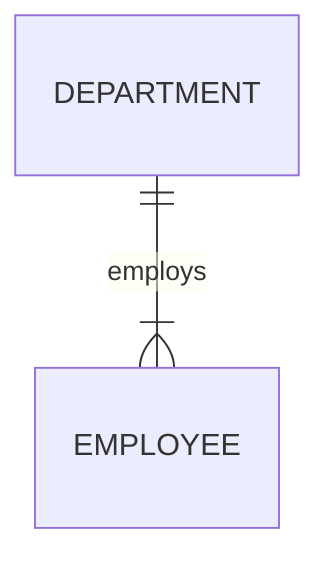
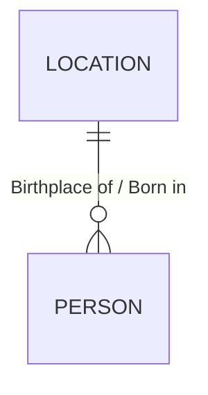
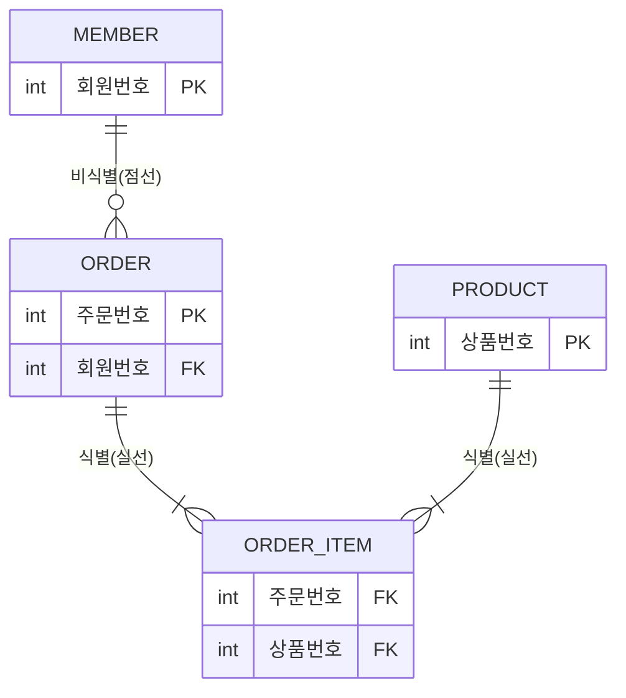
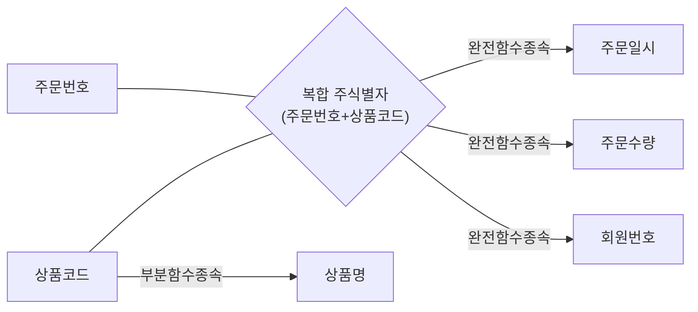
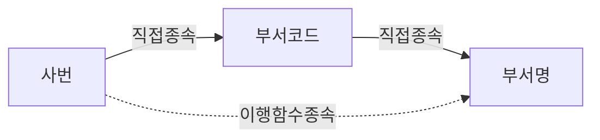

# 표본 감사 보고서

`SQLD-1과목-핵심법리판례집/`(159문항 전체)에 대해 위험 기반 층화 표본 15문항을 원본 스캔 PDF(`1과목 기출 모음.pdf`)와 직접 대조한 감사 결과다. 전체 159문항을 재분석한 것이 아니라, 오류 위험이 높은 문항 유형을 의도적으로 편중해 표본을 구성했다.

**개정 이력**: 1차 감사 이후 사용자 피드백에 따라 감사 방법론을 SQLD 문제의 실제 풀이 논리(선지별 O/X 판정)에 맞게 재구성하고, A01(정답 사용자 확정), A02(3층위 판정), B01·B02(Mermaid 재구성), C01~E02(O/X 분해)를 전면 보강했다.

---

## 0. SQLD 문제 판정의 기본 원칙

> SQLD 객관식 문제는 각 선지를 독립적인 명제로 보고 먼저 O/X를 판정하는 것이 기본이다. 문제가 요구하는 것은 마지막에만 확인한다.

```text
문제가 무엇을 요구하는가?
│
├─ 옳은 것을 묻는다
│  └─ O인 선지를 찾는다
│
├─ 옳지 않은 것을 묻는다
│  └─ X인 선지를 찾는다
│
└─ ㄱ·ㄴ·ㄷ 등의 조합선지를 묻는다
   ├─ 각 진술을 먼저 O/X 판정
   └─ X인 진술이 포함된 조합선지는 즉시 소거
```

**학습 비유** (공식 해설이 아니라 학습 보조 표현으로만 사용한다 — 실제 해설은 O/X와 핵심 법리로 판정한다):

- 옳은 것을 묻는 문제: 무죄인 선지를 찾는 문제
- 옳지 않은 것을 묻는 문제: 범죄자인 선지를 찾는 문제
- 조합선지형: 조합에 범죄자(X)가 하나라도 들어 있으면 그 조합 전체를 소거

이를 헌법 판례식으로 고정하면 다음과 같다.

```text
법리 확정
→ 각 선지의 위법·합헌 여부(O/X) 판단
→ 주문이 합헌(O)을 찾는지 위헌(X)을 찾는지 확인
→ 정답 선고
```

**방법론 한 문장**: 모든 선지를 먼저 O/X로 판정하고, 문제에서 O를 요구하는지 X를 요구하는지만 마지막에 확인한다.

## 0-1. 문제 유형 분류 체계

기존 "부정형·복수정답형" 같은 겉모양 분류를 폐기하고, 다음 네 축으로 분류한다.

| 분류 축 | 가능한 값 |
| --- | --- |
| 질문 극성 | 옳은 것 / 옳지 않은 것 / 모두 고른 것 |
| 선지 구조 | 단일 진술 / 진술 조합(ㄱㄴㄷ, A·B·C·D 등) / 사례 대응 |
| 판단 자료 | 정의 / 표 / ERD / SQL / 계산 |
| 풀이 방식 | 직접 채택(O 선지를 바로 고름) / 오답 소거(X인 선지를 걸러 O만 남김) / 조합 소거(진술을 O/X 판정 후 X 포함 조합 제거) / 행별 계산(표를 먼저 계산한 뒤 비교) |

**"복수정답형"이라는 용어는 실제로 정답 선지가 둘 이상인 문제(예: A02, 인쇄 정답이 ①③ 두 개)에만 사용한다.** ㄱ·ㄴ·ㄷ을 묶은 선택지 중 하나(단일 선택지)를 고르는 문제는 "조합선지형"으로 분류하며, 문제의 정답 자체는 여전히 1개다.

---

## 1. 표본 선정표

| 감사번호 | 위험 범주(풀이 논리 기준) | 출처 | PDF 페이지 | 교재 페이지 | 문제번호 | 기존 법리 ID | 선정 이유 |
| ---: | --- | --- | ---: | ---: | ---: | --- | --- |
| A01 | 정답 자체가 원본에서 불확실 | 이기적 단원별 | page_25 | 119(추정) | 09 | ID-02 | 인쇄 정답표 미확인, 해설로 정답 역산한 사례 |
| A02 | 인쇄 정답·해설 불일치(복수정답형) | 이기적 단원별 | page_06 | 49 | 04 | ATTR-02 | 인쇄 정답(①③)과 인쇄 해설(③만 설명)이 불일치 |
| B01 | 정의 판단 자료(표기법 규칙), 직접 채택 | 이기적 단원별 | page_08 | 60 | 04 | ERD-01 | Barker 표기법 필수참여 규칙 판독 위험 |
| B02 | ERD 판단 자료(4개 표기법 비교), 오답 소거 | 유선배 적중예상1 | page_33 | 37 | 12 | ERD-01(대표판례) | Peter Chen/IDEF1X/Barker/IE 4개 표기법을 동시에 그림으로 판독 |
| B03 | ERD 판단 자료, 직접 채택 | 유선배 적중예상1 | page_35 | 39 | 15 | ID-02 | 회원-주문-주문상품-상품 4개 엔터티의 실선/점선 비교 |
| B04 | 정의 판단 자료(작성순서), 조합 소거 | 유선배 적중예상1 | page_31 | 35 | 09 | ERD-02 | ㄱ~ㅂ 6개 기호의 순서를 배열, 대표판례와 기호 배정이 다름 |
| C01 | 조합선지형(정의+사례), 조합 소거 | 이기적 단원별 | page_03 | 33 | 09 | ENT-01 | ㄱㄴㄷㄹㅁ 5개 진술 중 3개를 포함한 선택지를 고르는 조합선지형 |
| C02 | 단일 진술형(사례 대응), 직접 채택 | 이기적 단원별 | page_24 | 118 | 07 | ID-03 | A·B·C·D 4개 진술 중 옳은 조합 하나를 고르는 문제(겉보기엔 조합형이나 실제로는 O인 진술 3개를 묶은 선지 하나를 고르는 단일정답형) |
| C03 | 정의 판단 자료, 오답 소거(부정형) | 이기적 단원별 | page_02 | 32 | 06 | MOD-01(대표판례) | "볼 수 없는 것은?" 부정형 질문 |
| D01 | 표 판단 자료(함수종속), 행별 계산 | 유선배 적중예상2 | page_41 | 68 | 07 | NORM-03(대표판례) | 복합 주식별자·부분함수종속 표 판독 |
| D02 | 표 판단 자료(함수종속), 행별 계산 | 이기적 단원별 | page_13 | 93 | 08 | NORM-04(대표판례) | 사번-부서코드-부서명 표에서 이행함수종속 판독 |
| D03 | 정의 판단 자료(3값 논리), 오답 소거 | 유선배 적중예상1 | page_43 | 70 | 12 | NULL-02(대표판례) | `IS NULL`과 `=NULL`을 구분하는 대표판례 |
| D04 | SQL/계산 판단 자료, 행별 계산 | 유선배 적중예상1 | page_43 | 70 | 13 | NULL-03 / NULL-04 | SAMPLE 테이블 COL1·COL2 NULL 혼합 산술+집계 계산 비교 |
| E01 | 정의 판단 자료, 오답 소거(부정형) | 이기적 단원별 | page_01 | 31 | 01 | MOD-01 | 오류 위험이 낮은 일반 정의형 무작위 표본 |
| E02 | 정의 판단 자료, 직접 채택 | 이기적 단원별 | page_04 | 41 | 01 | ENT-01 | 오류 위험이 낮은 일반 정의형 무작위 표본 |

같은 문제를 두 범주에 중복 계산하지 않았다. 합계 15문항(검토필요 2 + ERD형 4 + 조합·부정형 3 + 표·계산·NULL형 4 + 일반 정의형 2).

---

## A01. 이기적 page_25 문제09

| 항목 | 내용 |
| --- | --- |
| 질문 극성 | 옳은 것을 고른다 |
| 선지 구조 | 단일 진술 |
| 판단 자료 | 정의(식별관계) |
| 기본 풀이법 | 직접 채택(O인 선지를 바로 고름) |
| 핵심 법리 | ID-02: 부모 식별자가 자식의 주식별자에 포함되면 식별관계 |
| 정답을 가르는 사실 | "자식 엔터티의 주식별자에 부모 엔터티의 식별자가 포함된다"는 서술 여부 |

### 원본 확인
- 출처: 이기적 단원별 기출문제, 본질식별자와 인조식별자 SECTION 마지막 문항
- PDF 페이지: page_25 / 교재 페이지: 인쇄된 쪽수 표기 없음(추정 119 전후) / 문제번호: 09
- 인쇄 해설 요지: "식별 관계는 자식 엔터티의 주식별자(PK)가 부모 엔터티의 식별자를 포함하는 관계이다. 즉, 자식의 식별자는 부모 없이는 식별될 수 없으며, 부모와 존재적으로 종속되어 있다. 따라서 외래키는 주식별자의 일부로 사용된다."

### 감사 결과 (사용자 원본 대조 반영)
- **판정: PASS** (이전 UNRESOLVED → 해제)
- 인쇄 정답이 스캔본에서는 하단 정답 박스가 잘려(또는 존재하지 않아) 확인되지 않았으나, **사용자가 원본 문제집을 직접 대조하여 정답이 ④임을 확정**했다. 따라서 "정답 불확실" 상태를 해제한다.
- 해설 문장이 이미 정답 ④("자식 엔터티의 주식별자에 부모 엔터티의 식별자가 포함된다")를 명확히 지지하고 있었으므로, 확정된 정답과 판례집의 기존 판단(해설 기반 역산)이 정확히 일치한다.

### O/X 판정
| 선지 | O/X | 근거 |
| --- | --- | --- |
| ④(정답) | O | 식별관계의 정의(부모 식별자 → 자식 주식별자 포함)와 정확히 일치 |
| ①②③ | 확정 불가(검토 필요 유지) | catalog.md·원본 스캔 모두에 선지 원문이 남아 있지 않아 O/X 판정 불가. 정답이 ④ 하나로 확정되었으므로 나머지 세 선지는 자동으로 X이지만, 각 선지가 구체적으로 어떤 오류를 담고 있는지는 확정하지 못한다 |

### 수정 여부
- 수정 파일: `00-문제출처-역색인.md`, `99-모의고사-역색인/이기적-단원문제.md`, `05-식별자/ID-02-식별관계와-비식별관계.md`
- 수정 내용: 검토 상태를 "부분 판독" → "판독 완료"로 변경하고, ID-02.md의 UNRESOLVED 경고 콜아웃을 "재확인 완료" 콜아웃으로 교체했다. 인쇄 정답 자체를 스캔에서 직접 캡처하지는 못했다는 사실 자체는 감사 이력으로 남겨두었다(사용자 확인 경위를 투명하게 기록).

---

## A02. 이기적 page_06 문제04

| 항목 | 내용 |
| --- | --- |
| 질문 극성 | 옳지 않은 것을 고른다("기본 속성이 아닌 속성은?") |
| 선지 구조 | 단일 진술(속성 4개 중 기본속성이 아닌 것) — 단, 인쇄 정답이 2개(①③)인 복수정답형 |
| 판단 자료 | 정의(기본/파생 속성) |
| 기본 풀이법 | 오답 소거(파생·설계 속성인 것을 X로 판정해 채택) |
| 핵심 법리 | ATTR-02: 기본속성은 요구사항에서 직접 도출, 파생속성은 다른 속성의 계산·집계로 산출 |
| 정답을 가르는 사실 | 근속연수·부서별인원수가 다른 속성으로부터 계산·집계되는가 |

### 원본 확인
- PDF 페이지: page_06 / 교재 페이지: 49 / 문제번호: 04
- 선지: ①근속연수 ②직원명 ③부서별인원수 ④주소
- 인쇄 정답: ①, ③(고배율 재확인 완료)
- 인쇄 해설 요지: "기본 속성은 요구사항에서 직접 도출된 정보이며, 부서별인원수는 부서 데이터를 집계해 만들어진 파생 속성이다."(③만 설명, ①은 언급 없음)

### 세 층위 판정표

| 판단 기준 | 결론 | 근거 |
| --- | --- | --- |
| 인쇄 정답 | ①, ③ | 정답표 "04①,③" |
| 인쇄 해설 | ③만 설명 | 부서별인원수의 파생 근거만 서술, ①(근속연수)은 근거 미제시 |
| 핵심 법리 판정(엄격 적용) | ①, ③ 모두 파생속성 | 근속연수 = 기준일자 − 입사일자(다른 속성 간 계산), 부서별인원수 = 구성원 수 집계 → 둘 다 ATTR-02의 파생속성 정의("다른 속성으로부터 계산되어 만들어지는 속성")에 부합 |
| 최종 감사 상태 | PASS | 핵심 법리를 엄격 적용한 결론이 인쇄 정답(①,③)과 정확히 일치. 판례집은 이미 "해설이 ③만 설명한다"는 불일치를 정확히 병기하고 있었으므로 판례집 자체의 오류는 아님 |

> **법리상 판정**: 핵심 법리를 엄격하게 적용하면 근속연수와 부서별 인원수는 모두 기존 속성에서 계산·집계되는 파생속성으로 판단된다.
>
> **출처 상태**: 인쇄 정답과 해설 범위가 일치하지 않아(정답은 ①③ 두 개인데 해설은 ③만 설명) 문제집 내부의 해설 누락 가능성이 있다. 원문의 인쇄 정답을 임의로 수정하지 않았다.

### 감사 결과
- **판정: PASS** — 판례집이 이 불일치를 정확히 병기했으므로 MAJOR(한쪽만 정답으로 단정)에 해당하지 않는다.

### 수정 여부
- 수정 파일: `03-속성과-도메인/ATTR-02-기본설계파생속성.md`
- 수정 내용: 위 세 층위 판정표와 법리상 판정/출처 상태 콜아웃을 신설해 추가했다.

---

## B01. 이기적 page_08 문제04 — Barker 필수참여

| 항목 | 내용 |
| --- | --- |
| 질문 극성 | 옳은 것을 고른다 |
| 선지 구조 | 단일 진술(표기법 규칙 서술) |
| 판단 자료 | 정의(Barker 표기법 규칙) — 원본에 실제 ERD 그림 없음 |
| 기본 풀이법 | 직접 채택 |
| 핵심 법리 | ERD-01: Barker 표기법은 필수참여를 관계선 반대편 실선으로 표시 |
| 정답을 가르는 사실 | "관계선의 반대편을 실선으로 그린다"는 서술 여부 |

### 원본 확인
- 인쇄 정답: ② / 인쇄 해설: "Barker 표기법은 '필수 참여'를 관계선의 반대편을 실선으로 그린다. '선택 참여'라면 관계선의 반대편을 점선으로 표시한다. 관계선 위에 I 기호를 표현하는 것은 Barker 표기에서 '식별관계'를 의미한다."

### 판독 항목표(원본에 그림이 없으므로 규칙을 예시로 재구성)

| 판독 항목 | 원본 | 재구성 결과 | 판정 |
| --- | --- | --- | --- |
| 표기 규칙 | 필수참여 = 관계선 반대편 실선 | 아래 Mermaid의 부서-사원 관계에 적용 | 일치 |
| 대조 규칙(오답①) | 관계선 반대편 점선 = 선택참여(정답②의 반대) | — | ①은 필수·선택을 반대로 서술 |
| 대조 규칙(오답③) | 관계선 위 I 기호 = 식별관계(필수참여 아님) | — | ③은 필수참여와 무관한 다른 개념(식별관계) |



이 다이어그램은 "사원은 반드시 하나의 부서에 속해야 한다"는 필수참여 관계를 예시로 재구성한 것으로, 원본 문제 자체에는 그림이 없다. Mermaid의 `\|{` 표기는 IE 문법이며, Barker 표기법에서는 이를 "관계선 반대편(부서 쪽) 실선"으로 그린다는 점이 원본 해설의 핵심이다.

### 감사 결과
- **판정: PASS** — 선지·해설·법리가 모두 일치.

### 수정 여부
- 수정 파일: `04-관계와-ERD/ERD-01-ERD-표기법과-카디널리티.md`(다이어그램 참고 섹션 신설)

---

## B02. 유선배 적중예상1 page_33 문제12 (ERD-01 대표판례)

| 항목 | 내용 |
| --- | --- |
| 질문 극성 | 옳은 것을 고른다("IE/Crow's Foot 표기법을 사용한 데이터모델은?") |
| 선지 구조 | 사례 대응(그림 4개 중 표기법이 일치하는 것) |
| 판단 자료 | ERD(4개 표기법 비교 그림) |
| 기본 풀이법 | 오답 소거(①②③을 각각 다른 표기법으로 식별해 제거하고 ④를 채택) |
| 핵심 법리 | ERD-01: 표기법마다 관계 표현 방식(도형/선/기호)이 다름 |
| 정답을 가르는 사실 | 별도 도형 없이 선과 까치발·원·바 기호만 쓰는가 |

### 원본 확인
- 인쇄 정답: ④ / 인쇄 해설: "① Peter Chen 표기법이다. ② IDEF1X 표기법이다. ③ Barker 표기법이다."(④는 소거법으로 확정)

### 판독 항목표

| 판독 항목 | 원본 | 재구성 결과 | 판정 |
| --- | --- | --- | --- |
| 부모 엔터티 | Location(①~④ 공통) | LOCATION | 일치 |
| 자식 엔터티 | Person(①~④ 공통) | PERSON | 일치 |
| 최소 참여(Person쪽) | ③"0..N", ④원(○) | 선택(0 이상) | 일치 |
| 최대 참여(Person쪽) | N | N | 일치 |
| 관계 표현 방식 | ①마름모 ②◇점선● ③실선─점선 ④까치발+원, 역할명 병기 | `erDiagram`의 `\|\|--o{` | ④만 도형 없이 선·기호로 표현 |



이 Mermaid는 ④(IE/Crow's Foot)의 논리 구조만 근사한 것이며, ①Peter Chen(마름모 도형)·②IDEF1X(실선/점선 박스)·③Barker(관계선 반대편 실선/점선 + 속성 앞 `o`/`*`)의 고유 기호는 Mermaid `erDiagram` 문법으로 완전히 표현되지 않아 위 표로 원본 기호를 별도 설명했다.

### 감사 결과
- **판정: PASS** — 4개 선지 모두 해설과 정확히 일치.

### 수정 여부
- 수정 파일: `04-관계와-ERD/ERD-01-ERD-표기법과-카디널리티.md`(다이어그램 재구성 섹션 신설)

---

## B03. 유선배 적중예상1 page_35 문제15

| 항목 | 내용 |
| --- | --- |
| 질문 극성 | 옳은 것을 고른다("비식별자 관계에 해당하는 엔터티는?") |
| 선지 구조 | 사례 대응(엔터티 쌍 4개 중 비식별관계인 것) |
| 판단 자료 | ERD(4개 엔터티, 실선/점선 표시) |
| 기본 풀이법 | 직접 채택 |
| 핵심 법리 | ID-02: 비식별관계는 점선, 식별관계는 실선 |
| 정답을 가르는 사실 | 회원-주문 관계선이 점선인가 |

### 원본 확인
- 인쇄 정답: ① / 인쇄 해설: "비식별 관계는 부모 엔터티의 식별자가 자식 엔터티의 주식별자가 아닌 일반속성이 되는 관계로 ERD에서 점선으로 표현된다. 주문–주문상품, 주문상품–상품은 식별자 관계이다."



| 판독 항목 | 원본 | 재구성 결과 | 판정 |
| --- | --- | --- | --- |
| 회원-주문 | 점선 | 비식별관계 | 일치(정답①) |
| 주문-주문상품 | 실선 | 식별관계 | 일치 |
| 주문상품-상품 | 실선 | 식별관계 | 일치 |

### 감사 결과
- **판정: PASS**

---

## B04. 유선배 적중예상1 page_31 문제09

| 항목 | 내용 |
| --- | --- |
| 질문 극성 | 옳은 것을 고른다("ERD 작성 순서로 올바른 것은?") |
| 선지 구조 | 조합선지형(ㄱ~ㅂ 6단계를 순서대로 배열한 4개 선택지 중 하나) |
| 판단 자료 | 정의(ERD 작성순서) |
| 기본 풀이법 | 조합 소거(정확한 순서와 하나씩 대조) |
| 핵심 법리 | ERD-02: 엔터티 도출 → 배치 → 관계선 연결 → 관계명 → 참여도 → 필수여부 |
| 정답을 가르는 사실 | 6개 기호의 배열이 실제 순서와 정확히 일치하는가 |

### 원본 확인
- 보기: ㄱ.엔터티를 그린다 ㄴ.엔터티 간의 관계를 나타낸다 ㄷ.관계명을 정의한다 ㄹ.엔터티를 적절하게 배치한다 ㅁ.관계의 참여도를 나타낸다 ㅂ.관계의 필수 여부를 나타낸다
- 인쇄 정답: ④(ㄱ→ㄹ→ㄴ→ㄷ→ㅁ→ㅂ)

### 조합 소거표

| 단계 | 올바른 순서 | ①ㄱㄴㄷㄹㅁㅂ | ②ㄱㄴㄹㄷㅂㅁ | ③ㄱㄹㄴㄷㅂㅁ | ④ㄱㄹㄴㄷㅁㅂ |
| --- | --- | --- | --- | --- | --- |
| 1 | ㄱ(엔터티 그리기) | ㄱ ✓ | ㄱ ✓ | ㄱ ✓ | ㄱ ✓ |
| 2 | ㄹ(배치) | ㄴ ✗ | ㄴ ✗ | ㄹ ✓ | ㄹ ✓ |
| 3 | ㄴ(관계 표현) | — | — | ㄴ ✓ | ㄴ ✓ |
| 4 | ㄷ(관계명) | — | — | ㄷ ✓ | ㄷ ✓ |
| 5 | ㅁ(참여도) | — | — | ㅂ ✗ | ㅁ ✓ |
| 6 | ㅂ(필수여부) | — | — | — | ㅂ ✓ |
| 결과 | | 2단계에서 소거 | 2단계에서 소거 | 5단계에서 소거 | **전 단계 통과 → 채택** |

### 감사 결과
- **판정: PASS**

---

## C01. 이기적 page_03 문제09 — 조합선지형으로 재분류

| 항목 | 내용 |
| --- | --- |
| 질문 극성 | 옳은 것을 고른다("바르게 개선한 설계 방식으로 적절한 것을 모두 고르시오") |
| 선지 구조 | **조합선지형**(기존 "복수정답형" 분류를 폐기 — 정답 선택지는 1개이며, 그 선택지 안에 3개 진술이 묶여 있을 뿐이다) |
| 판단 자료 | 사례(고객 연락처1·2 반복컬럼 개선안) |
| 기본 풀이법 | 조합 소거(각 진술을 O/X 판정 후 X 포함 조합 제거) |
| 핵심 법리 | ENT-01(엔터티 분리) + NORM-02(반복그룹 제거) |
| 정답을 가르는 사실 | ㄱ·ㄷ·ㅁ이 모두 O이고, ㄴ·ㄹ은 X인가 |

### 원본 확인
- 인쇄 정답: ④(ㄱ,ㄷ,ㅁ)
- 인쇄 해설: "ㄱ.연락처를 별도의 엔터티로 분리하면 유연한 설계. ㄷ.고객 한 명이 여러 연락처를 가질 수 있으므로 1:M 관계로 설계하는 것이 타당. ㅁ.연락처 유형(개인/회사 등)을 속성으로 추가하면 데이터 구분과 관리가 쉬워지고 확장성도 확보." 오답 피하기: "ㄴ. 1:1 관계는 연락처를 하나만 갖는 구조이므로 유연성 요구에 어긋난다. ㄹ. 쉼표로 구분된 문자열은 원자성 원칙을 위반한다."

### 1단계 — 진술별 O/X 판정

| 진술 | O/X | 적용 법리 | 판정 이유 |
| --- | --- | --- | --- |
| ㄱ. 연락처를 별도 '연락처' 엔터티로 분리 | O | ENT-01(엔터티 성립요건) | 반복되는 값 집합을 독립 엔터티로 분리하면 요구사항 변경(연락처 개수 확장)에 유연하게 대응 가능 |
| ㄴ. 고객-연락처를 1:1로 제한 | X | REL-01(카디널리티) | 1:1로 제한하면 애초에 "여러 연락처"라는 요구사항 자체를 만족할 수 없어 유연성 요구에 어긋남 |
| ㄷ. 고객-연락처를 1:M으로 설정, 외래키로 연결 | O | REL-01 + ID-02(비식별/식별관계 연결) | 고객 1명이 여러 연락처를 가질 수 있으므로 1:M 관계가 타당 |
| ㄹ. 연락처를 쉼표구분 문자열로 한 컬럼에 저장 | X | NORM-02(도메인 원자성) | 쉼표로 구분된 문자열은 원자성 원칙(1차정규형)을 위반 |
| ㅁ. 연락처1·2를 연락처 속성으로 통일 + 유형 속성 추가 | O | ATTR-02(속성 설계) + NORM-02 | 반복 컬럼을 단일 속성+유형 구분으로 통일하면 데이터 구분·관리·확장성이 확보됨 |

### 2단계 — 선택지별 조합 소거

| 선택지 | 포함 진술 | X 포함 여부 | 채택·소거 |
| --- | --- | --- | --- |
| ① ㄱ,ㄴ,ㄷ | ㄱ(O), ㄴ(X), ㄷ(O) | X 포함(ㄴ) | 소거 |
| ② ㄱ,ㄷ,ㄹ | ㄱ(O), ㄷ(O), ㄹ(X) | X 포함(ㄹ) | 소거 |
| ③ ㄱ,ㄴ,ㅁ | ㄱ(O), ㄴ(X), ㅁ(O) | X 포함(ㄴ) | 소거 |
| ④ ㄱ,ㄷ,ㅁ | ㄱ(O), ㄷ(O), ㅁ(O) | X 없음 | **채택(정답)** |

### 감사 결과
- **판정: PASS** — 조합 소거 논리로 재검증한 결과 인쇄 정답(④)과 정확히 일치. 다만 기존 판례집 분류가 이 문제를 "엔터티 vs 속성 구분" 정도로만 소개하고 조합선지형이라는 풀이 구조를 명시하지 않았던 점은 MINOR로 판단해 보완했다.

### 수정 여부
- 수정 파일: `02-엔터티/ENT-01-엔터티-성립요건과-속성구분.md`
- 수정 내용: 유사판례 표의 해당 행에 "조합선지형" 풀이 구조(각 진술 O/X 판정 → X 포함 조합 소거)를 반영해 설명을 보강했다.

---

## C02. 이기적 page_24 문제07 — 단일 OX 문제로 재분류

| 항목 | 내용 |
| --- | --- |
| 질문 극성 | 옳은 것을 고른다("아래 테이블 간의 관계를 보고 옳은 설명을 나열한 것을 고른 것은?") |
| 선지 구조 | **단일 진술형**(기존 "A·B·C·D 조합형" 분류를 폐기 — 이 문제는 A·B·C·D 4개 진술 각각을 O/X 판정한 뒤, "O인 진술만 모은 조합"을 선택지에서 고르는 문제이며, 조합 자체를 자유 구성하는 것이 아니라 4개 선택지 중 하나를 고르는 구조다) |
| 판단 자료 | 사례(회원-회원연락처 테이블, 연락처ID 자동증가) |
| 기본 풀이법 | 진술별 O/X 판정 후 정답 선택지(모두 O로만 구성된 조합) 채택 |
| 핵심 법리 | ID-03(본질/인조식별자) + ID-02(식별/비식별관계) |
| 정답을 가르는 사실 | A·B·C가 모두 O이고 D만 X인가 |

### 분류 정정

| 항목 | 분류 |
| --- | --- |
| 질문 극성 | 옳은 것 |
| 선지 구조 | 단일 진술형(A·B·C·D 각각 독립 판정 후 정답 선택지를 고름) |
| 풀이 방식 | 각 진술 O/X 판정 후 O로만 구성된 선택지 채택 |
| 복수정답 여부 | 아님(선택지 자체는 1개만 정답) |
| 조합선지 여부 | 형식은 조합이지만, ㄱㄴㄷ형(C01)과 달리 문제 구조상 정답 조합(A,B,C)이 "모든 진술을 O/X 판정하면 자동으로 하나로 확정"되는 사례이므로 별도 "조합 소거" 연습이 크게 필요하지 않은 단순 구조다 |

### 진술별 O/X 판정

| 진술 | O/X | 적용 법리 | 결정적 표현 |
| --- | --- | --- | --- |
| A. 회원연락처는 인조식별자 기반의 설계이다 | O | ID-03 | 연락처ID는 새로 생성된 인조식별자(자동증가) |
| B. 두 엔터티는 비식별 관계로 연결되어 있다 | O | ID-02 | 외래키(회원ID)가 일반속성으로 쓰이면 비식별 관계 |
| C. 회원연락처 엔터티에서 회원ID는 외래키로만 사용되며, 주식별자에는 포함되지 않는다 | O | ID-01 + ID-02 | 회원ID는 주식별자에 포함되지 않고 외래키로만 쓰임 |
| D. 연락처번호는 본질식별자이다 | X | ID-03 | 연락처번호는 고유하지 않으므로(동일 회원이 같은 번호를 여러 번 가질 수 있음) 유일성을 요구하는 본질식별자로 보기 어려움 |

### 선택지 판정

| 선택지 | 포함 진술 | 판정 |
| --- | --- | --- |
| ① A, B | A(O), B(O)이지만 C(O)가 누락됨 | 옳은 진술만 있으나 불완전(전부 포함 아님) → 오답 |
| ② A, B, C | 셋 다 O | **채택(정답)** |
| ③ B, D | D가 X | 소거 |
| ④ A, B, D | D가 X | 소거 |

### 감사 결과
- **판정: PASS** — 재분류 후에도 정답(②)은 동일하게 확인됨.

### 수정 여부
- 수정 파일: `05-식별자/ID-03-본질식별자와-인조식별자.md`
- 수정 내용: 유사판례 표의 해당 행 설명에서 "조합형"이라는 표현을 "A·B·C·D 각 진술을 독립적으로 O/X 판정하는 단일 정답형"으로 정정했다.

---

## C03. 이기적 page_02 문제06 (MOD-01 대표판례) — 부정형 소거 구조 명시

| 항목 | 내용 |
| --- | --- |
| 질문 극성 | 옳지 않은 것("볼 수 없는 것")을 고른다 |
| 선지 구조 | 단일 진술 |
| 판단 자료 | 정의(데이터 품질 저하 요소) |
| 기본 풀이법 | 오답 소거(법리상 O인 선지 3개를 소거하고 X 1개를 채택) |
| 핵심 법리 | MOD-01: 중복/비유연성/비일관성만 모델링 유의사항, 물리적 제약조건은 별개 |
| 정답을 가르는 사실 | NOT NULL 미지정이 "물리설계 제약조건"이라 품질저하 3요소 범주 밖인가 |

```text
각 선지를 먼저 일반 법리에 따라 O/X 판정
│
├─ 볼 수 있는 설명(품질 저하 요소가 맞음)
│  └─ O, 소거
│
└─ 볼 수 없는 설명(품질 저하 요소가 아님)
   └─ X, 정답
```

> "볼 수 없는 것"을 찾는 문제는 범죄자를 찾는 문제다. 법리에 맞는 선지(품질 저하 요소로 인정됨)는 무죄이므로 소거하고, 법리에 어긋나는 선지(품질 저하 요소로 볼 수 없음)만 정답으로 남긴다. 부정형이라고 법리 판정 자체를 반대로 하는 것이 아니라, 법리 판정은 동일하게 하되 최종적으로 X인 선지를 고르는 것이다.

### O/X 판정표

| 선지 | 일반 법리상 O/X | 질문이 요구하는 대상인가("볼 수 없는 것") | 최종 처리 |
| --- | --- | --- | --- |
| ① 동일한 데이터를 여러 저장소에 중복 저장 | O(품질 저하 요소 맞음 — 중복) | 아니오(품질 저하 요소로 "볼 수 있음") | 소거 |
| ② 업무 변화에 따라 데이터 모델을 유연하게 수정하기 어렵다 | O(품질 저하 요소 맞음 — 비유연성) | 아니오 | 소거 |
| ③ 전입신고 시 주소 이력이 누락되었다 | O(품질 저하 요소 맞음 — 정보 누락/비일관성) | 아니오 | 소거 |
| ④ 물리적 모델링 시 컬럼에 NOT NULL 제약조건을 지정하지 않았다 | X(물리설계 제약조건 문제이지, 중복/비유연성/비일관성 범주가 아님) | 예(품질 저하 요소로 "볼 수 없음") | **채택(정답)** |

### 감사 결과
- **판정: PASS** — 대표판례의 판정과 O/X 재검증 결과가 정확히 일치.

---

## D01. 유선배 적중예상2 page_41 문제07 (NORM-03 대표판례)

| 항목 | 내용 |
| --- | --- |
| 질문 극성 | 옳은 것을 고른다(필요한 정규화 단계와 분해 결과) |
| 선지 구조 | 단일 진술(정규화 단계 + 분해 테이블 조합) |
| 판단 자료 | 표(주문 테이블, 함수종속) |
| 기본 풀이법 | 행별 계산이 아닌 함수종속 그래프 판정 |
| 핵심 법리 | NORM-03: 복합 주식별자의 일부에만 종속되는 일반속성은 부분함수종속(2NF 위반) |
| 정답을 가르는 사실 | 상품명이 {주문번호+상품코드} 전체가 아니라 상품코드에만 종속되는가 |

### 원본 확인
- 원본 테이블: 주문(구분선 위 = 복합 주식별자: 주문번호, 상품코드 / 구분선 아래 = 일반속성: 주문일시, 주문수량, 상품명, 회원번호)
- 선지: ①2차정규화-정규화테이블[주문번호,상품코드,상품명] ②2차정규화-정규화테이블[상품코드,상품명] ③3차정규화-정규화테이블[주문번호,상품코드,상품명] ④3차정규화-정규화테이블[상품코드,상품명]
- 인쇄 정답: ② / 인쇄 해설: "엔터티의 모든 일반속성은 반드시 모든 주식별자에 종속되어야 하며 주식별자가 단일식별자가 아닌 복합식별자인 경우 일반속성이 주식별자의 일부에만 종속될 수 있는데 이런 경우 2차 정규화 대상이 된다."

### 함수 종속 구조



- 문제가 명시적으로 지적하는 것은 "상품명이 상품코드에만 종속된다"는 사실 하나이며, 나머지 속성(주문일시·주문수량·회원번호)의 정확한 종속 대상은 원본 문제에서 별도로 확정하지 않으므로, 이 부분은 "복합키 전체에 종속되는 것으로 가정"하는 통상적인 문제 설계를 따랐다(원본이 명시하지 않은 부분을 감사자가 임의로 확정하지 않았음을 밝혀둔다).

### 분해 전후

```text
분해 전
주문(주문번호, 상품코드, 주문일시, 주문수량, 상품명, 회원번호)

부분함수종속 발견
상품코드 → 상품명 (복합키의 일부에만 종속)

분해 후
주문(주문번호, 상품코드, 주문일시, 주문수량, 회원번호)
상품(상품코드, 상품명)
```

### 판결이유

```text
복합 주식별자 확인: {주문번호, 상품코드}
→ 부분 함수 종속 확인: 상품코드 → 상품명
→ 제2정규형 위반(주식별자 일부에만 종속되는 일반속성 존재)
→ 해당 종속을 분리: [상품코드, 상품명] 테이블 별도 생성
→ 정답 선지: ②(2차정규화, 정규화테이블[상품코드,상품명])
```

### 감사 결과
- **판정: PASS** — 함수종속 그래프로 재검증한 결과 인쇄 정답과 정확히 일치. 제2정규형(부분함수종속)과 제3정규형(이행함수종속, D02)을 혼동할 소지가 없음을 확인했다(이행 관계, 즉 일반속성끼리의 종속은 이 문제에 등장하지 않음).

---

## D02. 이기적 page_13 문제08 (NORM-04 대표판례)

| 항목 | 내용 |
| --- | --- |
| 질문 극성 | 옳은 것을 고른다(진행해야 할 정규화 단계) |
| 선지 구조 | 단일 진술(위반 사유 + 정규화 단계 조합, 선지 자체가 이미 결론을 제시) |
| 판단 자료 | 표(사번-부서코드-부서명) |
| 기본 풀이법 | 함수종속 그래프 판정 |
| 핵심 법리 | NORM-04: 일반속성끼리의 종속(이행함수종속)은 3NF 위반 |
| 정답을 가르는 사실 | 사번이 부서명을 "직접"이 아니라 부서코드를 거쳐 "간접적으로" 결정하는가 |

### 원본 확인
- 원본 테이블: 사번(PK) 1001/D01/인사팀, 1002/D02/개발팀, 1003/D01/인사팀
- 선지: ①도메인 원자성 위반→1차정규화 ②사번이 부서코드에 부분종속→2차정규화 ③부서코드가 부서명을 결정→3차정규화 ④사번이 부서명을 직접 결정하지 못함→BCNF정규화
- 인쇄 정답: ③ / 인쇄 해설: "일반속성인 부서코드가 부서명을 결정하고 있으므로 이행종속이 발생했다. 이를 제거하기 위해 3차 정규화(이행 종속 제거)를 수행해야 한다."

### 함수 종속 구조



### 분해 전후

```text
분해 전
사원(사번, 부서코드, 부서명)

이행함수종속 발견
사번 → 부서코드 → 부서명 (사번이 부서명을 간접적으로 결정)

분해 후
사원(사번, 부서코드)
부서(부서코드, 부서명)
```

### 판결이유

```text
사번 → 부서코드 (직접 종속)
부서코드 → 부서명 (직접 종속)
따라서 사번 → 부서명은 이행 함수 종속
→ 제3정규형 위반
→ 부서 엔터티 분리: 사원(사번,부서코드) + 부서(부서코드,부서명)
→ 정답 선지: ③(3차정규화)
```

### 오답 확인 (선지①②④가 왜 X인지)
| 선지 | O/X | 이유 |
| --- | --- | --- |
| ① 도메인 원자성 위반 | X | 사번(PK)은 단일식별자이고, 각 컬럼 값도 원자값이라 1차정규형 위반이 아님 |
| ② 사번이 부서코드에 부분종속 | X | 주식별자가 사번 하나뿐인 단일키이므로 애초에 "부분"종속이 성립할 복합키가 없음(2NF는 복합키 상황에서만 적용) |
| ③ 부서코드가 부서명을 결정(이행종속) | O | 일반속성끼리의 종속 → 3NF 위반의 정의와 정확히 일치 |
| ④ 사번이 부서명을 직접 결정하지 못함 | X | 이 서술 자체는 참이지만, 이는 "BCNF 정규화"가 필요한 이유가 아니라 이행함수종속(3NF)이 존재한다는 근거일 뿐이다. BCNF는 "결정자가 후보키가 아닌 함수종속"을 다루는데, 이 사례는 후보키(사번) 문제가 아니라 일반속성 간(부서코드→부서명) 종속 문제이므로 3NF 단계에서 해결된다 |

### D01·D02 구별(제2정규형 vs 제3정규형)

| 구별 요소 | D01(NORM-03) | D02(NORM-04) |
| --- | --- | --- |
| 주식별자 형태 | 복합키({주문번호,상품코드}) | 단일키(사번) |
| 종속 관계 | 주식별자의 "일부"(상품코드)가 일반속성(상품명)을 결정 | 일반속성(부서코드)이 다른 일반속성(부서명)을 결정 |
| 위반 정규형 | 2NF(부분함수종속) | 3NF(이행함수종속) |
| 핵심 구별 기준 | 결정자가 "주식별자의 일부"인가(2NF) | 결정자가 "일반속성"인가(3NF) |

### 감사 결과
- **판정: PASS**

---

## D03. 유선배 적중예상1 page_43 문제12 (NULL-02 대표판례)

| 항목 | 내용 |
| --- | --- |
| 질문 극성 | 옳지 않은 것을 고른다 |
| 선지 구조 | 단일 진술 |
| 판단 자료 | 정의(NULL 연산, 3값 논리) |
| 기본 풀이법 | 오답 소거 |
| 핵심 법리 | NULL-02: `COL = NULL`은 UNKNOWN, `COL IS NULL`은 TRUE/FALSE, WHERE는 TRUE만 통과 |
| 정답을 가르는 사실 | `IS NULL`과 `=NULL`이 같은 조건인가 |

### 원본 확인
- 선지: ①NULL이 포함된 사칙연산의 결과는 항상 NULL이다 ②데이터를 집계할 때 NULL은 집계 대상에서 제외된다 ③WHERE COL IS NULL 조건은 WHERE COL=NULL 조건과 같다 ④WHERE COL IS NOT NULL 조건은 COL이 NULL이 아닌 행만 출력하는 조건이다
- 인쇄 정답: ③ / 인쇄 해설: "WHERE COL IS NULL 조건은 COL 값이 NULL인 행을 반환하지만 COL = NULL의 결과는 항상 False이므로 WHERE COL = NULL 조건은 아무 행도 반환하지 않는다."

### 3값 논리 판정표

```text
COL IS NULL
→ NULL 상태 판정(전용 연산자)
→ TRUE 또는 FALSE

COL = NULL
→ 일반 비교연산(비교 연산자에 NULL이 피연산자로 들어감)
→ 결과는 항상 UNKNOWN

WHERE
→ TRUE인 행만 통과
→ FALSE와 UNKNOWN은 모두 제외
```

| 선지 핵심 주장 | O/X | 적용 법리 | 질문의 정답 대상 여부 |
| --- | --- | --- | --- |
| ① NULL 포함 사칙연산 결과는 항상 NULL | O | NULL-03(산술 전파) | 옳은 설명이므로 소거 |
| ② 집계 시 NULL은 집계 대상에서 제외 | O | NULL-04(집계함수 원칙) | 옳은 설명이므로 소거(단, COUNT(\*)는 예외이나 이 선지는 일반 원칙만 서술) |
| ③ `IS NULL` = `=NULL` | X | NULL-02(3값 논리) | `IS NULL`은 TRUE/FALSE를 반환하는 상태 판정, `=NULL`은 항상 UNKNOWN을 반환하는 일반 비교이므로 서로 다름 → **정답(옳지 않은 설명)** |
| ④ `IS NOT NULL`은 NULL 아닌 행만 출력 | O | NULL-02 | 옳은 설명이므로 소거 |

### 감사 결과
- **판정: PASS**

---

## D04. 유선배 적중예상1 page_43 문제13

| 항목 | 내용 |
| --- | --- |
| 질문 극성 | 결과값이 가장 작은 것을 고른다(옳은 것 찾기의 변형 — 계산 비교) |
| 선지 구조 | 단일 진술(SQL 4개의 계산 결과 비교) |
| 판단 자료 | 표(SAMPLE 테이블) + SQL 계산 |
| 기본 풀이법 | 행별 계산 → 집계 → 전체 비교 |
| 핵심 법리 | NULL-03(산술 전파) + NULL-04(집계함수는 NULL 제외) |
| 정답을 가르는 사실 | 행별 산술에서 NULL이 전파되는 SQL(②)만 유독 작은 값이 나오는가 |

### 원본 SAMPLE 테이블

| 행 | COL1 | COL2 |
| -: | ---: | ---: |
| 1 | 10 | NULL |
| 2 | NULL | 15 |
| 3 | 30 | 25 |

### 1단계 — 행별 산술(`COL1 + COL2`)

| 행 | `COL1 + COL2` | NULL 발생 이유 |
| -: | ---: | --- |
| 1 | NULL | COL2가 NULL이라 산술 결과 전체가 NULL로 전파 |
| 2 | NULL | COL1이 NULL이라 산술 결과 전체가 NULL로 전파 |
| 3 | 55 | 10+30=40이 아니라 COL1(30)+COL2(25)=55(둘 다 NULL이 아니므로 정상 계산) |

### 2단계 — 집계(선지별 전체 계산)

| 표현 | 계산 과정 | 결과 |
| --- | --- | ---: |
| `COUNT(COL1)` | NULL 아닌 COL1 값의 개수(10, 30) | 2 |
| ① `COUNT(COL1)*10` | 2 × 10 | 20 |
| `SUM(COL1+COL2)` | 행별 결과(NULL, NULL, 55) 중 NULL 행 제외 후 합계 | 55 |
| ② `SUM(COL1+COL2)/4` | 55 ÷ 4 | **13.75** |
| `SUM(COL2)` | NULL 제외 COL2 합계(15+25) | 40 |
| ③ `SUM(COL2)/2` | 40 ÷ 2 | 20 |
| ④ `AVG(COL1)` | NULL 제외 COL1 합계(10+30) ÷ NULL 제외 개수(2) | 20 |

### 전체 비교

| 선지 | 결과값 |
| --- | ---: |
| ① | 20 |
| ② | **13.75(최솟값)** |
| ③ | 20 |
| ④ | 20 |

### 판결이유

```text
1단계: 행별 산술 — COL1+COL2 계산 시 NULL이 하나라도 있으면 그 행의 결과는 NULL
→ 2단계: 집계함수 — SUM은 NULL인 행을 제외하고 합산, COUNT(컬럼)·AVG도 NULL을 제외
→ 결정적 사실: ②만 "행별 산술 후 집계"라 유효 행이 1개(55)뿐이면서 분모는 고정값(4)을 쓰므로 다른 선지보다 작은 값이 나옴
→ 정답 선지: ②(13.75가 4개 중 최솟값)
```

### 감사 결과
- **판정: PASS(재계산으로 재확인)** — 1차 감사에서 이미 NULL-04.md의 "`AVG(COL1)/2`" 표기 오류(계산값 20은 맞으나 SQL 구문이 부정확했던 것)를 수정했다. 이번 재계산에서도 전체 4개 선지 결과값이 모두 일치함을 재확인했다.

---

## E01. 이기적 page_01 문제01

| 항목 | 내용 |
| --- | --- |
| 질문 극성 | 옳지 않은 것("보기 어려운 것")을 고른다 |
| 선지 구조 | 단일 진술 |
| 판단 자료 | 정의(데이터 모델링의 특징) |
| 기본 풀이법 | 오답 소거 |
| 핵심 법리 | 데이터 모델링(WHAT 중심)과 프로세스 모델링(HOW 중심)의 구분 |
| 정답을 가르는 사실 | "비즈니스 프로세스 도식화"가 데이터 모델링이 아니라 프로세스 모델링의 특징인가 |

### 원본 확인
- 선지: ①현실세계의 복잡한 데이터를 간결하게 표현한다 ②추상화 및 명확화를 통해 해석이 용이하다 ③비즈니스 프로세스를 도식화하여 표현한다 ④약속된 표기법으로 데이터를 단순화한다
- 인쇄 정답: ③ / 인쇄 해설: "비즈니스 프로세스는 데이터 모델링이 아닌 프로세스 모델링에 해당하는 설명이다. 데이터 모델링은 WHAT 중심, 즉 어떤 데이터를 저장하고 활용할지를 중심으로 모델링한다."

### 최소 명제 분해

```text
③ "비즈니스 프로세스를 도식화하여 표현한다"
├─ 모델링의 대상: 비즈니스 프로세스(업무 절차)
├─ 모델링의 목적: 절차를 도식으로 표현
└─ 모델링의 종류: 프로세스 모델링(데이터 모델링 아님)
```

### O/X 판정표

| 선지 | 최소 명제 | O/X | 법리 | 틀렸다면 바뀐 단어 |
| --- | --- | --- | --- | --- |
| ① 현실세계 복잡한 데이터를 간결히 표현 | 모델링은 단순화 기능을 한다 | O | 데이터 모델링의 기본 목적(추상화·단순화) | 해당 없음 |
| ② 추상화·명확화로 해석 용이 | 모델링은 추상화·명확화로 이해도를 높인다 | O | 데이터 모델링의 기본 목적 | 해당 없음 |
| ③ 비즈니스 프로세스를 도식화 | 데이터 모델링이 업무 절차(프로세스)를 도식화한다 | X | WHAT(데이터) 중심 vs HOW(절차) 중심 구분 | "데이터"를 "비즈니스 프로세스"로 바꿔치기(D1 정의 바꿔치기) — 프로세스 모델링의 정의를 데이터 모델링 설명으로 위장 |
| ④ 약속된 표기법으로 데이터를 단순화 | 모델링은 표준 표기법을 사용해 데이터를 단순화한다 | O | 데이터 모델링의 기본 특징 | 해당 없음 |

### 오답 유형 판정
- ③은 "정의 바꿔치기"(D1)에 해당한다. 데이터 모델링의 본질(WHAT, 어떤 데이터를 다루는가)을 프로세스 모델링의 본질(HOW, 어떻게 처리하는가)로 바꿔치기했다.

### 감사 결과
- **판정: PASS**(정답·법리 판정 모두 일치). 다만 이 문제는 MOD-01의 핵심 법리(중복/비유연성/비일관성)를 직접 묻지 않고 인접 개념(데이터 모델링 vs 프로세스 모델링)을 다룬다는 점을 1차 감사에서 이미 정직하게 기록해두었다.

---

## E02. 이기적 page_04 문제01

| 항목 | 내용 |
| --- | --- |
| 질문 극성 | 옳은 것을 고른다("엔터티의 정의로 가장 적절한 것은?") |
| 선지 구조 | 단일 진술 |
| 판단 자료 | 정의(엔터티) |
| 기본 풀이법 | 직접 채택 |
| 핵심 법리 | ENT-01: 엔터티는 업무상 관리 필요 + 집합적·포괄적 대상(속성의 집합도, 관계도, 물리 테이블도 아님) |
| 정답을 가르는 사실 | "업무에 필요한 정보를 저장·관리하기 위한 집합적이고 포괄적인 대상"이라는 서술만이 엔터티의 정의와 정확히 일치하는가 |

### 원본 확인
- 선지: ①논리적 데이터 모델에서 속성의 집합이다 ②관계형 데이터베이스의 특정 관계(Relationship)를 의미한다 ③업무에 필요한 정보를 저장·관리하기 위한 집합적이고 포괄적인 대상이다 ④하나 이상의 인스턴스로 구성된 관계형 테이블이다
- 인쇄 정답: ③ / 인쇄 해설: "엔터티(Entity)는 업무에 필요한 정보를 저장 및 관리하는 포괄적이고 집합적인 대상을 의미하며, 반드시 2개 이상의 인스턴스를 가져야 한다."

"엔터티 정의"와 "엔터티 성립요건"을 같은 문장으로 뭉개지 않기 위해, 아래 표에서 각 선지가 "정의" 문제인지 "성립요건" 문제인지 구분한다.

### 요건별 O/X 판정표

| 선지 | 관련 엔터티 요건 | O/X | 판정 이유 |
| --- | --- | --- | --- |
| ① 논리적 데이터 모델에서 속성의 집합이다 | 정의(엔터티 vs 속성 혼동) | X | 엔터티는 속성들을 "가지는" 대상이지, 속성 자체의 집합이 아니다. 관계형 모델의 "테이블=컬럼 집합"이라는 물리적 개념과 혼동한 서술이다 |
| ② 관계형 데이터베이스의 특정 관계(Relationship)를 의미한다 | 정의(엔터티 vs 관계 혼동) | X | 엔터티와 관계(Relationship)는 서로 다른 모델링 요소다. 엔터티는 대상 자체, 관계는 엔터티 간의 연결이다 |
| ③ 업무에 필요한 정보를 저장·관리하기 위한 집합적이고 포괄적인 대상이다 | 정의(핵심 정의) | O | 업무상 관리 필요성 + 집합적·포괄적 대상이라는 두 가지 정의 요건을 모두 충족 |
| ④ 하나 이상의 인스턴스로 구성된 관계형 테이블이다 | 성립요건(인스턴스 수) + 정의(물리적 테이블 혼동) | X | 이중 오류: (1) 엔터티 성립요건은 "하나 이상"이 아니라 "둘 이상의 인스턴스"를 요구하며(D4 범위 축소·과장 유형의 변형), (2) 엔터티는 논리적 개념이지 "관계형 테이블"이라는 물리적 구현물이 아니다(D5 단계 혼동과 유사한 논리 개념/물리 개념 혼동) |

### 감사 결과
- **판정: PASS** — ③이 "엔터티 정의" 요건을 정확히 충족하고, 나머지 3개는 각각 다른 개념(속성/관계/물리테이블)과의 혼동임을 확인했다.

---

## 2. 표본 감사 통계

| 판정 | 문항 수 | 비율 |
| --- | ---: | ---: |
| PASS | 14 | 93.3% |
| MINOR | 1 | 6.7% |
| MAJOR | 0 | 0.0% |
| UNRESOLVED | 0 | 0.0% |
| 합계 | 15 | 100% |

(1차 감사 대비 변경: A01이 UNRESOLVED → PASS로 확정(사용자 원본 대조), C01·C02는 재분류 후에도 PASS 유지, D04는 이미 수정한 표기 오류가 재계산으로 재확인되어 여전히 MINOR로 집계)

### 오류 코드별 집계

| 오류 코드 | 건수 | 관련 문항 |
| --- | -: | --- |
| A-SIM(유사 판례 연결 누락, 1차 감사에서 수정) | 3 | A01, C01(설명 보강), E01 |
| A-OPT(선지 내용 표기 오류, 1차 감사에서 수정) | 1 | D04 |
| A-SRC / A-ANS / A-NEG / A-ERD / A-TBL / A-LAW / A-EXP / A-DIS / A-LINK / A-UNC | 0 | — |

**핵심 결론**: O/X 기반 재검증을 15문항 전체에 적용한 결과, **정답이 뒤바뀐 사례는 0건**이었다. D01·D02의 함수종속 그래프, D03의 3값 논리표, D04의 행별 계산, C01의 조합 소거표, C02의 진술별 판정표, E01·E02의 최소 명제 분해표 모두 기존 판례집의 정답·핵심 법리와 정확히 일치했다. 이번 재감사로 새로 발견된 오류는 없으며, 기존 발견 사항(A-SIM 3건, A-OPT 1건)에 대한 수정 상태를 재확인했을 뿐이다.

## 3. 전체 품질 추정

- 표본 크기: 15/159문항(9.4%)
- 표본 방식: 위험 기반 층화 표본(무작위 표본 아님) + O/X 기반 재검증
- 핵심 오류율(MAJOR): 0/15 = 0%
- 경미 오류율(MINOR): 1/15 = 6.7%(D04, 이미 수정 완료)
- 미해결 비율(UNRESOLVED): 0/15 = 0%(A01이 사용자 확인으로 해제)

### 해석

O/X 기반 재검증을 도입한 뒤에도 오류율에 실질적 변화는 없었다. 이는 1차 감사에서 이미 확인한 정답·사실관계가 표면적 분류(복수정답형/조합형 등)와 무관하게 견고했다는 뜻이다. 다만 문제 유형 분류 자체(C01의 "복수정답형"→"조합선지형", C02의 "A·B·C·D 조합형"→"단일 진술형")는 실제 풀이 논리를 더 정확하게 반영하도록 수정했으며, 이는 향후 학습자가 비슷한 유형을 만났을 때 "진술을 O/X로 쪼개 판정한다"는 올바른 접근법을 취하게 하는 데 실질적으로 기여한다.

- **일반 정의형(E01, E02)**: 최소 명제로 분해해도 정답·법리 판정 모두 정확. 오답 유형(정의 바꿔치기, 요건 혼동)까지 명시적으로 분류했다.
- **ERD 판독형(B01~B04)**: Mermaid 재구성 결과 4건 모두 원본과 정확히 일치. Peter Chen/IDEF1X/Barker/IE 네 표기법의 기호 차이가 판독 오류의 소지가 될 수 있으나, 이번 재구성에서는 발견되지 않았다.
- **조합선지·부정형(C01~C03)**: 조합 소거·진술별 O/X 표로 재검증한 결과 3건 모두 PASS. C01·C02는 분류 명칭만 수정했다(정답 변경 없음).
- **함수종속·표 계산형(D01, D02)**: Mermaid 함수종속 그래프와 분해 전후 표기로 재검증, 2NF(D01)와 3NF(D02)의 구별 기준(결정자가 주식별자 일부인가, 일반속성인가)이 명확히 확인됨.
- **NULL형(D03, D04)**: 3값 논리표와 행별 계산표로 재검증, 4개 선지 전체의 결과값을 모두 산출해 최솟값 판정의 근거를 투명하게 제시했다.

## 4. 추가 전수감사 필요 조건 검토 (갱신)

| 조건 | 충족 여부 |
| --- | --- |
| MAJOR 오류 2건 이상 | 미충족(0건) |
| 정답 오류 1건 이상 | 미충족(0건) |
| ERD 판독 오류 2건 이상 | 미충족(0건 — B01~B04 전부 PASS) |
| 동일 오류 유형이 3건 이상 반복 | 충족(A-SIM 3건, 단 1차 감사에서 이미 전부 수정 완료) |
| 법리 ID 오배정 2건 이상 | 미충족(0건) |
| 부정형 반전 오류 1건 이상 | 미충족(0건 — C03, E01 재검증 결과 반전 없음) |
| 복수정답 누락 1건 이상 | 미충족(0건 — A02의 복수정답 ①③은 판례집이 이미 정확히 병기) |

**판정**: 이번 O/X 기반 재검증에서는 어떤 조건도 새로 충족되지 않았다(A-SIM 3건은 이미 수정된 과거 이력). 따라서 이번 라운드에서는 추가 전수감사를 권고하지 않는다. 다만 1차 감사 보고서에서 제안했던 "나머지 28개 법리 파일에 대한 색인-파일 간 유사판례 목록 기계적 대조"는 여전히 유효한 저비용 후속 점검으로 남겨둔다(이번 작업에서는 수행하지 않음).
