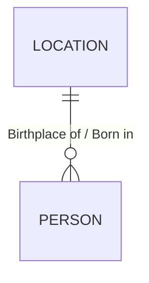
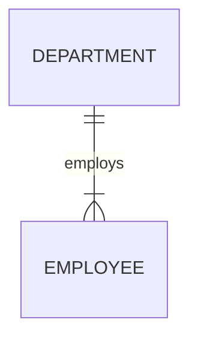

# [ERD-01] ERD 표기법(IE/Barker/Crow's Foot/IDEF1X/Peter Chen)과 카디널리티·선택성 판독

> [!IMPORTANT]
> **핵심 법리:**
> ERD 표기법은 IE(Information Engineering, Crow's Foot 포함)·Barker·IDEF1X·Peter Chen 등 여러 종류가 있으며, 각 표기법마다 필수/선택참여·카디널리티·NULL 허용 여부를 표시하는 기호 체계가 다르다. 문제에 제시된 표기법이 무엇인지 먼저 확정한 뒤에 기호를 해석해야 한다.
>
> [!TIP]
> **정답을 가르는 사실:**
> 까치발(Crow's Foot, `<`)은 "2개 이상"을 의미하며 "3개 이상"이 아니다. IE표기법은 NULL 허용 여부를 표기하지 않고, Barker표기법만 속성 앞 `o`(허용)/`*`(비허용) 기호로 NULL 여부를 표기한다.
>
> [!WARNING]
> **반복 오답:**
> 까치발 기호를 "3개 이상"으로 과장하는 함정, Barker표기법의 필수(실선)/선택(점선) 위치를 반대로 서술하는 함정, IE표기법도 NULL 허용 여부를 표기한다고 서술하는 함정.

## 1. 판시사항

- IE·Barker·IDEF1X·Peter Chen 등 ERD 표기법은 각각 어떤 기호로 관계·카디널리티·필수/선택참여·NULL 허용 여부를 표현하는가?
- 까치발(Crow's Foot) 기호는 몇 개 이상의 관계를 의미하는가?

## 2. 핵심 법리

> ERD 표기법은 표기법마다 관계·카디널리티·참여방식·NULL 허용 여부를 나타내는 기호 체계가 다르다. IE(Crow's Foot)는 까치발과 원(선택)/바(필수) 기호로 카디널리티와 참여방식을 표시하지만 NULL 허용 여부는 표기하지 않는다. Barker는 관계선 반대편의 실선(필수)/점선(선택)으로 참여방식을, 속성 앞 `o`/`*` 기호로 NULL 허용 여부를 표시한다. IDEF1X는 실선 박스(식별관계)/점선 박스(비식별관계)로 자식엔터티를 구분하며, Peter Chen은 관계를 마름모(다이아몬드) 도형으로 별도 표시한다. 까치발 기호 자체는 "2개 이상"을 의미하며 "3개 이상"이 아니다.

## 3. 법리 적용 분기

```text
문제가 묻는 대상은?
│
├─ 표기법 자체를 구분해야 하는 문제
│  ├─ 마름모(다이아몬드)로 관계를 표시 → Peter Chen
│  ├─ 실선 박스(식별관계)/점선 박스(비식별관계)로 자식엔터티를 구분 → IDEF1X
│  ├─ 관계선 반대편 실선(필수)/점선(선택) + 속성 앞 o(허용)/*(비허용) 기호 → Barker
│  └─ 까치발(Crow's Foot) + 원(선택)/바(필수) 기호, 선 위주 표현 → IE(정보공학표기법)
│
└─ 카디널리티·선택성을 읽어야 하는 문제
   ├─ 까치발이 한쪽에만 있음 → 1:N (또는 N:1)
   ├─ 까치발이 양쪽에 모두 있음 → M:N
   ├─ 까치발 기호 자체는 "2개 이상"을 의미(3개 이상이 아님)
   └─ 원(O)/점선 → 선택참여, 바(|)/실선 → 필수참여
   └─ NULL 허용 여부 표기 가능 여부 → Barker만 가능(IE는 불가능)
```

## 4. 이 문제들이 유사한 이유

| 기준 | 내용 |
| --- | --- |
| 공통 핵심 법리 | 표기법마다 필수/선택참여·카디널리티·관계 유형을 나타내는 기호 체계가 다르며, 이를 정확히 매칭해야 한다는 동일한 판단 규칙 |
| 공통 결정 사실 | 지문에 어떤 표기법이 명시(또는 그림으로 제시)되었는지, 그리고 실선·점선·까치발·원·바 중 무엇이 등장하는지 |
| 반복되는 오답 구조 | 까치발을 "3개 이상"으로 과장(D4 범위 과장), Barker의 필수/선택 실선·점선 위치를 반대로 서술(D7 기호 오독), IE표기법도 NULL 여부를 표기한다고 서술(D7 기호 오독, NULL-01과 연결) |
| 정답이 달라지는 조건 | 지문이 명시한 표기법이 IE인지 Barker인지에 따라 동일한 "실선/점선"이 의미하는 필수/선택 여부의 위치가 달라진다 |

## 5. 대표 판례

### 사건 ERD-01-01

- 출처: 유선배 CHAPTER1 적중예상문제
- PDF 페이지: page_33 (교재 p.37)
- 원문 문제번호: 12
- 핵심 법리 ID: ERD-01
- 보조 법리 ID: 없음

### 사실관계

"IE/Crow's Foot 표기법을 사용한 데이터모델을 고르시오"라는 질문에 4개의 ERD 그림이 제시되며, 각 그림은 Peter Chen·IDEF1X·Barker·IE/Crow's Foot 네 가지 표기법 중 하나로 그려져 있다.

### 쟁점

어떤 그림이 IE/Crow's Foot 표기법의 기호 체계(까치발, 원/바)로 그려졌는지 판별하는 것이 쟁점이다.

### 적용 법리

Peter Chen은 관계를 마름모 도형으로, IDEF1X는 실선/점선 박스로, Barker는 관계선 반대편 실선/점선과 속성 기호(#, *, o)로 각각 표현하지만, IE/Crow's Foot은 별도의 도형 없이 선과 까치발·원·바 기호만으로 관계와 카디널리티, 참여방식을 표현한다.

### 주문

**정답: ④**

### 판결이유

```text
문제의 결정적 사실: 선지 ④의 그림이 까치발 기호와 선만으로 관계·카디널리티를 표시함
→ 적용되는 핵심 법리: 별도 도형(마름모) 없이 선과 까치발·원·바 기호만 쓰는 것이 IE/Crow's Foot 표기법의 특징이다
→ 정답 선지: ④(나머지는 각각 Peter Chen·IDEF1X·Barker 표기법의 기호 체계를 사용함)
```

## 6. 선지별 판단

| 선지 | 판정 | 핵심 주장 | 맞거나 틀린 이유 | 오답 유형 | 올바르게 고치면 |
| --- | --- | --- | --- | --- | --- |
| ① | 오답(다른 표기법) | Peter Chen 표기법 다이어그램 | 관계를 마름모(다이아몬드) 도형으로 별도 표시하는 Peter Chen 표기법이므로 IE/Crow's Foot이 아니다 | 해당 없음(다른 표기법의 정상 예시) | 해당 없음 |
| ② | 오답(다른 표기법) | IDEF1X 표기법 다이어그램 | 실선 박스(식별관계)/점선 박스(비식별관계)로 자식엔터티를 구분하는 IDEF1X 표기법이므로 IE/Crow's Foot이 아니다 | 해당 없음 | 해당 없음 |
| ③ | 오답(다른 표기법) | Barker 표기법 다이어그램 | 관계선 반대편의 실선/점선과 속성 앞 `o`/`*` 기호로 필수/선택·NULL 여부를 표시하는 Barker 표기법이므로 IE/Crow's Foot이 아니다 | 해당 없음 | 해당 없음 |
| ④ | 정답 | IE/Crow's Foot 표기법 다이어그램 | 까치발 기호와 원/바로 카디널리티·선택성을 표시하고 별도 도형이 없는 IE 표기법이다 | 해당 없음(이 선지 자체가 정답) | 해당 없음 |

### 다이어그램 재구성 (표본감사 B02)

원본 4개 그림은 모두 "Location(장소)"과 "Person(사람)"이 "Birthplace(출생지)"라는 의미로 1:N 관계를 맺는 동일한 논리 구조를, 표기법만 다르게 그린 것이다. Mermaid의 `erDiagram` 문법은 IE/Crow's Foot 표기(선지④)를 가장 가깝게 표현하므로, 그 논리 구조를 아래와 같이 재구성하고 나머지 세 표기법은 원본 기호를 텍스트로 병기한다.



- 이 Mermaid는 "Location 1개당 Person 0~N명이 그 장소에서 태어날 수 있다"는 **논리 구조**만 표현한 것이며, Peter Chen·IDEF1X·Barker 세 표기법의 고유 기호(마름모, 실선/점선 박스, 관계선 반대편 실선/점선)는 Mermaid `erDiagram` 문법으로 그대로 표현되지 않아 아래 표로 원본 기호를 별도 설명한다.

| 판독 항목 | 원본(선지①~④) | 재구성 결과 | 판정 |
| --- | --- | --- | --- |
| 부모 엔터티 | Location(①~④ 공통) | LOCATION | 일치 |
| 자식 엔터티 | Person(①~④ 공통) | PERSON | 일치 |
| 관계 표현 방식 | ①마름모 도형(Birthplace) ②◇점선●기호 ③실선─점선─0..N○< ④까치발+원, 역할명 "Birthplace of"/"Born in" 병기 | `\|\|--o{`(1 : 0..N, 선택) | ④만 도형 없이 선·기호만으로 표현 |
| 최소 참여(Person쪽) | ③"0..N"으로 명시, ④원(○) 기호로 선택 표시 | 선택(0 이상) | 일치 |
| 최대 참여(Person쪽) | N(다수) | N(다수, `{` 까치발) | 일치 |
| 식별관계 여부 | ②IDEF1X는 점선 관계선으로 비식별관계 표시, 나머지는 표기법 특성상 식별/비식별을 이 그림만으로 판별하지 않음 | 표기법별 상이(이 문제의 쟁점은 식별관계 여부가 아니라 표기법 자체의 식별) | 표기법 판별이 이 문제의 핵심 쟁점이며 식별관계 판단(ID-02)과는 별개 |

## 7. 유사 판례

| 사건 | 공통점 | 표현 방식의 차이 | 동일 법리가 적용되는 이유 |
| --- | --- | --- | --- |
| 이기적기출(page_08, p.60, 문제03) | IE표기법의 선택참여 기호를 묻는 문제 | 기호 판독형(정답① O) | IE표기법에서 선택참여를 원(O)으로 표시한다는 동일한 기호 규칙 |
| 이기적기출(page_08, p.60, 문제04) | Barker표기법의 필수참여 표현방법을 묻는 문제 | 기호 판독형(정답② 관계선 반대편 실선) | Barker표기법에서 필수참여를 실선으로 표시한다는 동일한 기호 규칙 |
| 이기적기출(page_09, p.61, 문제09) | Barker표기법 설명 중 옳지 않은 것을 고르는 문제 | 정오형(정답④ "Barker표기법에서 선택관계는 실선이다"는 틀림, 점선이 맞음) | 필수/선택 기호 위치를 반대로 서술한 동일한 함정 구조 |
| 이기적기출(page_21, p.111, 문제04) | Barker표기법의 NULL 허용 기호를 묻는 문제(주법리 NULL-01, 보조 ERD-01) | 기호 판독형(정답③ o) | Barker표기법만 NULL 허용 여부를 별도 기호로 표시한다는 동일한 표기법 규칙 |
| 이기적기출(page_22, p.112, 문제07) | IE표기법이 NULL 여부를 표기하지 않는다는 점을 묻는 문제(주법리 NULL-01) | 정오형(정답④ "IE표기법은 NULL 비허용을 *로 표시한다"는 틀림, *는 Barker 기호) | IE표기법은 NULL 여부를 표기하지 않는다는 동일한 표기법 경계 규칙 |
| 이기적기출(page_27, p.441, 문제09) | IE·Barker 두 표기법을 비교하는 문제(주법리 NULL-01) | 정오형(정답① "IE, Barker 모두 NOT NULL 여부를 확인할 수 있다"는 틀림) | IE표기법은 NULL 여부를 표기하지 않는다는 동일한 규칙을 두 표기법 비교 형태로 재출제 |
| 유선배예상1(page_32, p.36, 문제10) | 까치발(Crow's Foot) 기호의 의미를 묻는 문제 | 정오형(정답① "까치발은 3개 이상을 의미한다"는 틀림, 2개 이상이 맞음) | 까치발 기호의 정확한 의미(2개 이상)를 확인하는 동일한 기호 규칙 |
| 유선배예상1(page_35, p.39, 문제16) | ERD에서 관계의 필수여부를 나타내는 요소를 묻는 문제 | 용어 판별형(정답③ 관계선택사양) | 필수/선택 참여를 나타내는 표기 요소(관계선택사양)를 확인하는 동일한 규칙 |

### 다이어그램 참고 (표본감사 B01)

이기적기출(page_08, 문제04)은 원본 문제 자체에 ERD 그림이 없고 "Barker 표기법에서 필수 참여를 나타내는 방법"을 텍스트 선지로만 묻는다. 다만 이 규칙을 실제 ERD에 적용했을 때 어떤 모습인지 확인하기 위해, 부서-사원의 필수관계를 예시로 재구성한다.



- Barker 표기법에서는 이 관계를 사원 쪽 관계선 반대편(부서 쪽)에 실선을 그려 "사원은 반드시 하나의 부서에 속해야 한다(필수참여)"는 것을 표시한다. Mermaid `erDiagram`의 `|{`(바+까치발)는 IE표기법 문법이지만, "1개 이상 반드시 존재"라는 동일한 논리(필수참여)를 표현하는 데 사용했다. 표기법 자체의 기호(실선 vs 바)는 이기적기출(page_08, 문제03·04) 해설처럼 표기법마다 다르므로 혼동하지 말아야 한다.

## 8. 구별 판례

| 구별 요소 | 이 사건 | 비교 사건 | 답이 달라지는 이유 |
| --- | --- | --- | --- |
| 필수/선택 참여 기호 | IE — 실선+바(필수), 점선 또는 원(선택) | Barker — 관계선 반대편 실선(필수), 점선(선택). 이기적기출(page_08, p.60, 문제04) | 같은 필수참여를 나타내더라도 IE는 관계선 자체의 실선/바, Barker는 관계선 반대편의 실선 여부로 표시 위치가 다르므로 표기법을 먼저 확정해야 기호를 해석할 수 있다 |
| 관계 표현 도형 | IE — 선과 까치발 기호만 사용, 별도 도형 없음 | Peter Chen — 관계를 마름모(다이아몬드)라는 별도 도형으로 표시. 유선배예상1(page_33, p.37, 문제12) | IE는 선과 기호만으로 관계를 표시하지만 Peter Chen은 마름모라는 제3의 도형을 추가한다는 점이 근본적으로 다르다 |
| 엔터티 박스 스타일 | IE — 엔터티 도형은 하나로 통일, 관계 종류는 선 스타일(까치발·원·바)로만 구분 | IDEF1X — 실선 박스(식별관계)와 점선 박스(비식별관계)로 자식엔터티 자체를 구분. 유선배예상1(page_33, p.37, 문제12) | IE는 연결선의 스타일로 식별/비식별을 구분하지만 IDEF1X는 엔터티 박스 자체의 선 스타일로 구분한다 |
| NULL 표기 여부 | IE — NULL 허용 여부를 표기하지 않음 | Barker — 속성 앞 `o`(허용)/`*`(비허용) 기호로 표기. 이기적기출(page_22, p.112, 문제07), (page_27, p.441, 문제09) | "IE표기법에서도 NULL 여부를 확인할 수 있다"고 서술하면 오답이 되며, 이는 NULL-01 법리와 직결된다 |

## 9. 출제자가 바꾸는 사실

- 까치발 기호의 의미를 "3개 이상"으로 과장
- Barker표기법의 필수/선택 실선·점선 위치를 반대로 서술
- IE표기법도 NULL 허용 여부를 표기한다고 서술(실제로는 Barker만 가능)
- 서로 다른 표기법의 기호를 섞어서 서술

## 10. 시험용 한 줄 법리

> 필수참여는 실선/바, 선택참여는 점선/원이며, 까치발은 "2개 이상"을 뜻하고, NULL 표기가 가능한 것은 Barker표기법뿐이다.

## 11. 연결 판례

- 상위 법리: [REL-01 관계의 정의와 필수·선택참여](./REL-01-관계의-정의와-필수선택참여.md)
- 하위 법리: [ERD-02 ERD 작성순서](./ERD-02-ERD-작성순서.md)
- 유사 법리: [REL-02 존재관계와 행위관계](./REL-02-존재관계와-행위관계.md), [NULL-01 NULL의 의미와 표기법](../08-NULL/NULL-01-NULL의-의미와-표기법.md)
- 혼동하기 쉬운 반대 법리: [ID-02 식별관계와 비식별관계](../05-식별자/ID-02-식별관계와-비식별관계.md) (실선/점선 표기는 겹치지만 ERD-01은 "표기법 자체의 기호 체계"를, ID-02는 "식별자 상속 여부"를 판단기준으로 삼는다)
