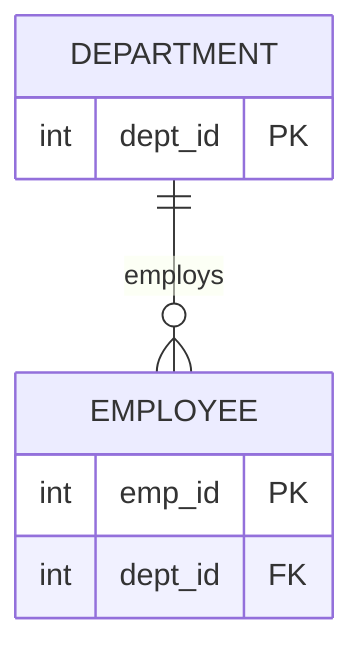

# 04 관계와 ERD

기본 학습은 아래 비교표와 결정 트리로 진행한다. 상세 근거와 기출 해설이 필요할 때만 하단 "상세 법리 파일" 링크를 연다. 식별관계·비식별관계는 이 단원과 05 식별자 양쪽에서 다루므로 중복 설명 없이 [05-식별자/README.md](../05-식별자/README.md)로 링크한다.

## 1. 핵심 개념 비교표

### 존재관계 vs 행위관계

| 구분 | 존재관계 | 행위관계 |
| --- | --- | --- |
| 발생 이유 | 신분·소속상 자연히 성립(존재 상태 자체) | 특정 업무 행위가 발생해야 성립 |
| 대표 사례 | ~에 소속되다 | 구매하다, 수령하다, 작성하다 |
| ERD 표기 | 구분하지 않음(둘 다 같은 선·기호) | 구분하지 않음 |

### 카디널리티·참여 기호 (IE/Crow's Foot 기준)

| 기호·조건 | 최소 참여 | 최대 참여 |
| --- | --- | --- |
| 원(O) | 0(선택참여) | 해당 없음 |
| 선(바, `\|`) | 1(필수참여) | 1일 수 있음 |
| 갈퀴(까치발, `<`) | 해당 없음 | 다수(2개 이상, "3개 이상" 아님) |

### ERD 표기법 4종 구분

| 표기법 | 관계 표현 방식 | 필수/선택 표시 | NULL 표시 |
| --- | --- | --- | --- |
| IE(정보공학, Crow's Foot) | 선 + 까치발/원/바 | 바=필수, 원=선택 | 표시 안 함 |
| Barker | 관계선 반대편 실선/점선 | 실선=필수, 점선=선택 | 속성 앞 o(허용)/*(비허용)로 표시 |
| IDEF1X | 실선/점선 박스로 자식엔터티 구분 | 박스 스타일 | — |
| Peter Chen | 마름모(다이아몬드) 도형 | — | — |

## 2. 판정용 결정 트리

```text
① 관계 성립 확인
어느 엔터티 관점인지 확인
→ 부모·자식 확인(부모 식별자를 자식이 보유하는 방향)
→ 최소 참여 확인(0 또는 1)
→ 최대 카디널리티 확인(1 또는 다수)
→ 부모 키가 자식 PK에 포함되는지 확인(식별관계 여부, 05단원 참고)
```

```text
② ERD 작성 순서
엔터티 도출 → 엔터티 배치 → 관계선 연결 → 관계명 작성 → 관계차수 표현 → 관계선택성 표시
```

ERD형 문제는 엔터티 확인 → 부모·자식 방향 → 최소 참여 → 최대 카디널리티 → 식별·비식별 확인 순서로 판정한 뒤 선지별 O/X를 매기며, 표기법 문제는 반드시 "어느 표기법인지"부터 확정한 뒤 기호를 해석한다(IE와 Barker는 필수/선택 표시 위치와 방식이 다름).

### 참고: 대표 ERD 구조



이 Mermaid는 IE/Crow's Foot 표기법의 논리 구조만 단순화한 것이다(까치발=다수, 원=선택참여). Barker·IDEF1X·Peter Chen 등 다른 표기법의 고유 기호는 Mermaid로 완전히 표현되지 않으므로, 표기법 문제는 위 "핵심 개념 비교표"의 기호 설명을 함께 참고한다.

## 3. 유사 사례 비교

| 사례 | 결정적 사실 | 적용 개념 | 결론 |
| --- | --- | --- | --- |
| "학생이 학과에 소속되다" | 업무 행위 없이 자연 성립 | 존재/행위관계 | 존재관계 |
| "고객이 상품을 구매하다" | 특정 시점의 업무 행위 필요 | 존재/행위관계 | 행위관계 |
| 관계선 양쪽 모두 까치발 | 양쪽 다 "다수" | 카디널리티 | M:N(원칙적으로 1:N+M:1로 분리) |
| Barker에서 관계선 반대편 실선 | 필수참여 표시 위치 | 표기법별 필수참여 | Barker 필수참여(IE는 바로 표시) |
| IE표기법에 NULL 허용 여부 표시 여부 | 표기법 자체의 표현 한계 | ERD 표기법 비교 | IE는 NULL 표시 안 함(Barker만 가능) |

## 4. 반복 오답

| 선지 표현 | O/X | 틀린 이유 | 올바르게 고치면 |
| --- | :-: | --- | --- |
| 까치발 기호는 3개 이상을 의미한다 | X | 까치발은 2개 이상을 의미(범위 과장, D4) | 까치발은 2개 이상(다수)을 의미한다 |
| Barker표기법에서 선택참여는 실선으로 표시한다 | X | 필수=실선, 선택=점선(방향 역전, D6) | Barker표기법에서 선택참여는 점선으로 표시한다 |
| IE표기법도 NULL 허용 여부를 표시할 수 있다 | X | IE는 NULL 표기 관례 자체가 없음(기호 오독, D7) | NULL 허용 여부는 Barker표기법만 표시할 수 있다 |
| 관계는 업무기술서의 명사를 근거로 도출한다 | X | 관계는 동사를 근거로 도출(정의 바꿔치기, D1) | 관계는 업무기술서의 동사(가입하다, 주문하다 등)를 근거로 도출한다 |
| ERD는 존재관계와 행위관계를 구분해 표현한다 | X | ERD는 이 둘을 표기법상 구분하지 않음(조건 누락, D3) | ERD는 존재관계와 행위관계를 동일한 선·기호로 표현한다 |
| 두 엔터티는 반드시 부모-자식 관계여야 한다 | X | 관계 성립에 부모-자식 관계가 필수는 아님(범위 과장, D4) | 두 엔터티 사이에 업무상 의미 있는 연결이 있으면 관계가 성립한다 |

## 5. 자가 점검

표와 결정 트리를 가린 상태에서 답한다.

1. (핵심개념설명형) 관계를 도출하는 근거는 명사인가 동사인가? 그 이유를 한 문장으로 설명하시오.
2. (핵심개념설명형) 필수참여와 선택참여를 구분하는 결정적 기준은 무엇인가?
3. (유사개념구별형) 존재관계와 행위관계를 구분하는 결정적 기준은 무엇인가?
4. (유사개념구별형) IE표기법과 Barker표기법에서 필수참여를 표시하는 위치·방식의 차이는 무엇인가?
5. (사례판정형) "학생이 학과에 소속되다"는 존재관계인가 행위관계인가? 그 이유는?
6. (사례판정형) 관계선 양쪽에 모두 까치발이 있으면 카디널리티는 무엇이며, 원칙적으로 어떻게 처리하는가?
7. (사례판정형) 부모 엔터티의 키가 자식 엔터티의 주식별자(PK)에 포함되면 이 관계는 식별관계인가 비식별관계인가?
8. (반복오답교정형) "IE표기법도 NULL 허용 여부를 표시할 수 있다"는 서술의 어디가 왜 틀렸는지 고치시오.
9. (결정트리재현형) 아래 빈칸을 채우시오.

```text
① 관계 성립 확인
어느 엔터티 관점인지 확인
→ 부모·자식 확인(부모 식별자를 자식이 보유하는 방향)
→ (        ) 참여 확인(0 또는 1)
→ (        ) 카디널리티 확인(1 또는 다수)
→ 부모 키가 자식 PK에 포함되는지 확인((        )관계 여부, 05단원 참고)
```

10. (결정트리재현형, ERD 판독 순서) 아래 빈칸을 채우시오.

```text
ERD 판독 순서: 부모·자식 → (        ) 참여 → (        ) 카디널리티 → 식별·비식별관계
```

<details>
<summary>자가 점검 정답</summary>

1. 동사다. 업무기술서에서 관계를 나타내는 것은 명사(엔터티·속성 도출 근거)가 아니라 동사(가입하다, 주문하다 등)이기 때문이다.
2. 그 관계가 업무규칙상 반드시 있어야 하는지 여부다 — 반드시 있어야 하면 필수참여, 없어도 되면 선택참여다.
3. 관계가 별도의 업무 행위 없이 신분·소속상 자연히 성립하는지(존재관계), 아니면 특정 업무 행위가 발생해야 성립하는지(행위관계)다.
4. IE는 관계선 자체에 실선/바로 필수참여를 표시하고, Barker는 관계선 반대편에 실선을 그려 필수참여를 표시한다 — 표시 위치와 기호 체계가 서로 다르다.
5. 존재관계다. 별도의 업무 행위 없이 신분상 자연히 성립하는 관계이기 때문이다.
6. M:N이다. 원칙적으로 1:N과 M:1로 분리해서(교차엔터티 도입) 표현해야 한다.
7. 식별관계다. 부모의 식별자가 자식의 주식별자 일부로 포함되면 부모 없이 자식 인스턴스가 독립적으로 생성될 수 없는 식별관계다.
8. 틀린 부분은 "IE표기법도 표시할 수 있다"이다. NULL 허용 여부는 Barker표기법만 속성 앞 o/* 기호로 표시할 수 있고, IE표기법은 NULL 표기 관례 자체가 없다.
9. 순서대로 최소 / 최대 / 식별
10. 순서대로 최소 / 최대

</details>

## 6. 기출 적용

| 문제 | 출처 | 법리 ID | 질문 극성 | 먼저 확인할 사실 | 상세 해설 |
| --- | --- | --- | --- | --- | --- |
| 관계의 정의로 가장 적절한 것 고르기 | 이기적 단원별(관계) page_08 문제01 | REL-01 | 옳은 것(O) | "두 개 이상 엔터티 간 의미 있는 연결"이라는 정의와 일치하는지 | [REL-01](./REL-01-관계의-정의와-필수선택참여.md) |
| 관계 설정 체크리스트로 보기 어려운 것 고르기(명사/동사 함정) | 이기적 단원별(관계) page_08 문제06 | REL-01 | 옳지 않은 것(X) | 관계 도출 근거를 "명사"로 서술했는지 | [REL-01](./REL-01-관계의-정의와-필수선택참여.md) |
| 필수관계 모델링 사례 판정 | 이기적 단원별(관계) page_09 문제07 | REL-01 | 옳은 것(O) | 업무규칙상 반드시 있어야 하는 관계인지 | [REL-01](./REL-01-관계의-정의와-필수선택참여.md) |
| 회원가입시 휴대폰 필수등록 요구사항 반영 여부 | 이기적 단원별(트랜잭션) page_18 문제02 | REL-01 | 옳은 것(O) | 필수등록 요구사항이 필수참여로 모델링됐는지 | [REL-01](./REL-01-관계의-정의와-필수선택참여.md) |
| 관계 정의 시 고려사항으로 옳지 않은 것 고르기(부모-자식 과장) | 유선배 예상문제 page_36 문제17 | REL-01 | 옳지 않은 것(X) | "반드시 부모-자식 관계여야 한다"는 과장 표현이 있는지 | [REL-01](./REL-01-관계의-정의와-필수선택참여.md) |
| 존재적 관계에 해당하는 예시 고르기 | 이기적 단원별(관계) page_08 문제02 | REL-02 | 옳은 것(O) | 동사가 상태(소속)인지 행위(구매·수령·작성)인지 | [REL-02](./REL-02-존재관계와-행위관계.md) |
| ERD 특징 설명 중 옳지 않은 것 고르기(존재/행위 구분 여부) | 유선배 예상문제 page_29 문제03 | REL-02 | 옳지 않은 것(X) | "ERD가 존재/행위관계를 구분해 표현한다"는 서술이 있는지 | [REL-02](./REL-02-존재관계와-행위관계.md) |
| IE표기법의 선택참여 기호 고르기 | 이기적 단원별(관계) page_08 문제03 | ERD-01 | 옳은 것(O) | 원(O) 기호가 선택참여를 의미하는지 | [ERD-01](./ERD-01-ERD-표기법과-카디널리티.md) |
| Barker표기법의 필수참여 표현방법 고르기 | 이기적 단원별(관계) page_08 문제04 | ERD-01 | 옳은 것(O) | 관계선 반대편 실선이 필수참여를 의미하는지 | [ERD-01](./ERD-01-ERD-표기법과-카디널리티.md) |
| 까치발 기호의 의미를 묻는 문제(3개 이상 함정) | 유선배 예상문제 page_32 문제10 | ERD-01 | 옳지 않은 것(X) | 까치발을 "3개 이상"으로 서술했는지 | [ERD-01](./ERD-01-ERD-표기법과-카디널리티.md) |
| IE/Crow's Foot 표기법 다이어그램 고르기 | 유선배 예상문제 page_33 문제12 | ERD-01 | 옳은 것(O) | 별도 도형 없이 선+까치발/원/바만 쓰는지 | [ERD-01](./ERD-01-ERD-표기법과-카디널리티.md) |
| ERD 작성 순서로 올바른 것 고르기 | 이기적 단원별(관계) page_09 문제08 | ERD-02 | 옳은 것(O) | 엔터티 도출이 맨 앞, 관계선택성 표시가 맨 뒤인지 | [ERD-02](./ERD-02-ERD-작성순서.md) |

<details>
<summary>기출 적용 정답</summary>

| 문제 | 정답 | 핵심 이유 |
| --- | :-: | --- |
| page_08 문제01 | ③ | 관계는 두 개 이상 엔터티 간 의미 있는 연결이라는 정의에 부합 |
| page_08 문제06 | ② | 관계는 명사가 아니라 동사를 근거로 도출됨 |
| page_09 문제07 | ② | 주문-주문상세 등 반드시 있어야 하는 관계는 필수참여로 모델링 |
| page_18 문제02 | ② | 필수등록 요구사항은 필수참여 관계로 반영해야 함 |
| page_36 문제17 | ② | 두 엔터티가 반드시 부모-자식 관계여야 하는 것은 아님 |
| page_08 문제02 | ② | "학생이 학과에 소속되다"는 행위 없이 성립하는 존재적 관계 |
| page_29 문제03 | ③ | ERD는 존재/행위관계를 구분하지 않고 동일한 선·기호로 표현 |
| page_08 문제03 | ① | IE표기법에서 선택참여는 원(O)으로 표시 |
| page_08 문제04 | ② | Barker표기법에서 필수참여는 관계선 반대편 실선으로 표시 |
| page_32 문제10 | ① | 까치발은 2개 이상을 의미하며 3개 이상이 아님 |
| page_33 문제12 | ④ | 별도 도형 없이 선과 까치발·원·바 기호만 쓰는 것이 IE/Crow's Foot의 특징 |
| page_09 문제08 | ③ | 엔터티 도출 → 배치 → 관계선 연결 → 관계명 작성 → 차수 표현 → 선택성 표시 순서와 일치 |

</details>

### 선지 O/X 훈련

**문제 1: '존재적 관계'에 해당하는 예시로 가장 적절한 것은? (이기적 단원별(관계) page_08 문제02)**

| 선지 핵심 주장 | 내 판정 | 정답 | 결정적 이유 |
| --- | :-: | :-: | --- |
| ① 회원이 상품을 구매하다 | | X | 구매라는 업무 행위가 있어야 성립하는 행위적 관계 |
| ② 학생이 학과에 소속되다 | | O | 별도 행위 없이 신분상 자연히 성립하는 존재적 관계 |
| ③ 직원이 급여를 수령하다 | | X | 급여 수령이라는 업무 행위가 있어야 성립하는 행위적 관계 |
| ④ 사용자가 게시글을 작성하다 | | X | 게시글 작성이라는 업무 행위가 있어야 성립하는 행위적 관계 |

<details>
<summary>선지별 정답</summary>

| 선지 | O/X | 이유 | 틀린 경우 올바른 문장 |
| --- | :-: | --- | --- |
| ① | X | 구매는 특정 시점의 업무 행위가 발생해야 성립하므로 행위적 관계 | "회원이 상품을 구매하다"는 행위적 관계의 예시다 |
| ② | O | 학생-학과 소속은 업무 행위 없이 신분상 자연히 성립하는 존재적 관계 | 해당 없음 |
| ③ | X | 급여 수령은 업무 행위가 발생해야 성립하므로 행위적 관계 | "직원이 급여를 수령하다"는 행위적 관계의 예시다 |
| ④ | X | 게시글 작성은 업무 행위가 발생해야 성립하므로 행위적 관계 | "사용자가 게시글을 작성하다"는 행위적 관계의 예시다 |

</details>

**문제 2: IE/Crow's Foot 표기법을 사용한 데이터모델을 고르시오. (유선배 예상문제 page_33 문제12)**

| 선지 핵심 주장 | 내 판정 | 정답 | 결정적 이유 |
| --- | :-: | :-: | --- |
| ① 관계를 마름모(다이아몬드) 도형으로 표시 | | X | Peter Chen 표기법의 특징 |
| ② 실선/점선 박스로 자식엔터티(식별/비식별)를 구분 | | X | IDEF1X 표기법의 특징 |
| ③ 관계선 반대편 실선/점선 + 속성 앞 o/* 기호 | | X | Barker 표기법의 특징 |
| ④ 별도 도형 없이 선 + 까치발/원/바 기호만 사용 | | O | IE/Crow's Foot 표기법의 특징 |

<details>
<summary>선지별 정답</summary>

| 선지 | O/X | 이유 | 틀린 경우 올바른 문장 |
| --- | :-: | --- | --- |
| ① | X | 마름모 도형으로 관계를 표시하는 것은 Peter Chen 표기법 | 이 그림은 Peter Chen 표기법이다 |
| ② | X | 실선/점선 박스로 자식엔터티를 구분하는 것은 IDEF1X 표기법 | 이 그림은 IDEF1X 표기법이다 |
| ③ | X | 관계선 반대편 실선/점선과 속성 앞 o/* 기호는 Barker 표기법 | 이 그림은 Barker 표기법이다 |
| ④ | O | 별도 도형 없이 선과 까치발·원·바 기호만으로 표현하는 것이 IE/Crow's Foot 표기법 | 해당 없음 |

</details>

## 7. 상세 법리 파일

- [REL-01 관계의 정의와 필수·선택참여](./REL-01-관계의-정의와-필수선택참여.md) — 관계 성립요건 대표 판례
- [REL-02 존재관계와 행위관계](./REL-02-존재관계와-행위관계.md) — 두 관계 유형 구분 대표 판례
- [ERD-01 ERD 표기법과 카디널리티](./ERD-01-ERD-표기법과-카디널리티.md) — 4개 표기법 비교(대표 판례), 카디널리티·선택성 판독
- [ERD-02 ERD 작성 순서](./ERD-02-ERD-작성순서.md) — 6단계 작성 순서 대표 판례

## 오답 회귀 경로

```text
문제 오답
→ 어느 선지에서 O/X를 잘못 판정했는지 확인
→ 이 단원 README의 "4. 반복 오답" 표 확인
→ "2. 판정용 결정 트리"에서 잘못 탄 분기 확인
→ "7. 상세 법리 파일"에서 근거 확인
→ 같은 유형 문제 재풀이
```

| 오답 원인 | 의미 |
| --- | --- |
| 개념미기억 | 핵심 법리 자체를 기억하지 못함 |
| 개념혼동 | 비슷한 두 개념을 서로 바꿔 적용 |
| 질문극성 | "옳은 것"과 "옳지 않은 것"을 반대로 읽음 |
| 조건누락 | 선지에 있는 전제 조건을 빠뜨림 |
| 방향역전 | 원인과 결과, 목적과 수단을 반대로 서술 |
| 계산오류 | 함수종속·NULL 집계 등 계산 과정에서 실수 |
| 예외과잉 | 예외 규정을 일반 규칙처럼 과도하게 적용 |
| 범위과장 | 일부에만 적용되는 규칙을 전체로 확대 |

## 단원 완료 기준

다음 항목을 모두 만족하면 이 단원을 완료한 것으로 본다.

- [ ] 비교표를 보지 않고 핵심 개념의 차이를 설명할 수 있다.
- [ ] 결정 트리를 빈 종이에 다시 그릴 수 있다.
- [ ] 자가 점검에서 80% 이상 맞혔다.
- [ ] 대표 기출의 모든 선지를 O/X로 설명할 수 있다.
- [ ] 틀린 선지를 올바른 문장으로 고칠 수 있다.
- [ ] 처음 보는 사례에도 같은 판단 기준을 적용할 수 있다.
- [ ] 최소 참여와 최대 카디널리티를 분리해서 읽을 수 있다.
- [ ] 부모·자식 방향을 설명할 수 있다.
- [ ] 식별관계 여부를 부모 키의 자식 PK 포함 여부로 판정할 수 있다.
