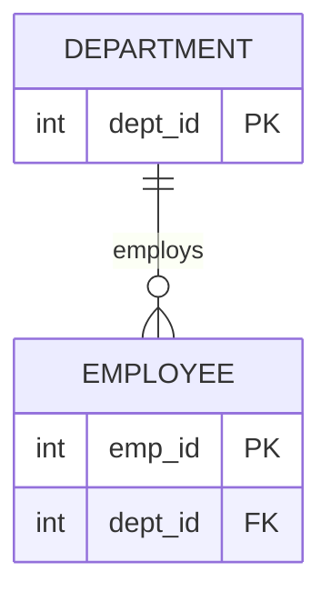

# 04 관계와 ERD

기본 학습은 아래 비교표와 결정 트리로 진행한다. 상세 근거와 기출 해설이 필요할 때만 하단 "상세 기출 해설" 링크를 연다. 식별관계·비식별관계는 이 단원과 05 식별자 양쪽에서 다루므로 중복 설명 없이 [05-식별자/README.md](../05-식별자/README.md)로 링크한다.

## 1. 핵심 개념 비교표

### 존재관계 vs 행위관계

| 구분 | 존재관계 | 행위관계 |
| --- | --- | --- |
| 발생 이유 | 신분·소속상 자연히 성립(존재 상태 자체) | 특정 업무 행위가 발생해야 성립 |
| 대표 사례 | ~에 소속되다 | 구매하다, 수령하다, 작성하다 |
| ERD 표기 | 구분하지 않음(둘 다 같은 선·기호) | 구분하지 않음 |

### 카디널리티·참여 기호 (IE/Crow's Foot 기준)

| 기호·조건 | 최소 참여 | 최대 참여 |
| --- | --- | --- |
| 원(O) | 0(선택참여) | 해당 없음 |
| 선(바, `\|`) | 1(필수참여) | 1일 수 있음 |
| 갈퀴(까치발, `<`) | 해당 없음 | 다수(2개 이상, "3개 이상" 아님) |

### ERD 표기법 4종 구분

| 표기법 | 관계 표현 방식 | 필수/선택 표시 | NULL 표시 |
| --- | --- | --- | --- |
| IE(정보공학, Crow's Foot) | 선 + 까치발/원/바 | 바=필수, 원=선택 | 표시 안 함 |
| Barker | 관계선 반대편 실선/점선 | 실선=필수, 점선=선택 | 속성 앞 o(허용)/*(비허용)로 표시 |
| IDEF1X | 실선/점선 박스로 자식엔터티 구분 | 박스 스타일 | — |
| Peter Chen | 마름모(다이아몬드) 도형 | — | — |

## 2. 판정 순서

```text
① 관계 성립 확인
어느 엔터티 관점인지 확인
→ 부모·자식 확인(부모 식별자를 자식이 보유하는 방향)
→ 최소 참여 확인(0 또는 1)
→ 최대 카디널리티 확인(1 또는 다수)
→ 부모 키가 자식 PK에 포함되는지 확인(식별관계 여부, 05단원 참고)
```

```text
② ERD 작성 순서
엔터티 도출 → 엔터티 배치 → 관계선 연결 → 관계명 작성 → 관계차수 표현 → 관계선택성 표시
```

## 3. 유사 사례 비교

| 사례 | 결정적 사실 | 적용 개념 | 결론 |
| --- | --- | --- | --- |
| "학생이 학과에 소속되다" | 업무 행위 없이 자연 성립 | 존재/행위관계 | 존재관계 |
| "고객이 상품을 구매하다" | 특정 시점의 업무 행위 필요 | 존재/행위관계 | 행위관계 |
| 관계선 양쪽 모두 까치발 | 양쪽 다 "다수" | 카디널리티 | M:N(원칙적으로 1:N+M:1로 분리) |
| Barker에서 관계선 반대편 실선 | 필수참여 표시 위치 | 표기법별 필수참여 | Barker 필수참여(IE는 바로 표시) |
| IE표기법에 NULL 허용 여부 표시 여부 | 표기법 자체의 표현 한계 | ERD 표기법 비교 | IE는 NULL 표시 안 함(Barker만 가능) |

## 4. 반복 오답

| 선지 표현 | O/X | 틀린 이유 | 올바르게 고치면 |
| --- | :-: | --- | --- |
| 까치발 기호는 3개 이상을 의미한다 | X | 까치발은 2개 이상을 의미(범위 과장, D4) | 까치발은 2개 이상(다수)을 의미한다 |
| Barker표기법에서 선택참여는 실선으로 표시한다 | X | 필수=실선, 선택=점선(방향 역전, D6) | Barker표기법에서 선택참여는 점선으로 표시한다 |
| IE표기법도 NULL 허용 여부를 표시할 수 있다 | X | IE는 NULL 표기 관례 자체가 없음(기호 오독, D7) | NULL 허용 여부는 Barker표기법만 표시할 수 있다 |
| 관계는 업무기술서의 명사를 근거로 도출한다 | X | 관계는 동사를 근거로 도출(정의 바꿔치기, D1) | 관계는 업무기술서의 동사(가입하다, 주문하다 등)를 근거로 도출한다 |
| ERD는 존재관계와 행위관계를 구분해 표현한다 | X | ERD는 이 둘을 표기법상 구분하지 않음(조건 누락, D3) | ERD는 존재관계와 행위관계를 동일한 선·기호로 표현한다 |
| 두 엔터티는 반드시 부모-자식 관계여야 한다 | X | 관계 성립에 부모-자식 관계가 필수는 아님(범위 과장, D4) | 두 엔터티 사이에 업무상 의미 있는 연결이 있으면 관계가 성립한다 |

## 5. 문제 풀이 규칙

```text
ERD형: 엔터티 확인 → 부모·자식 방향 → 최소 참여 → 최대 카디널리티 → 식별·비식별 확인 → 선지별 O/X 판정
```

표기법 문제는 반드시 "어느 표기법인지"부터 확정한 뒤 기호를 해석한다(IE와 Barker는 필수/선택 표시 위치와 방식이 다름).

## 참고: 대표 ERD 구조



이 Mermaid는 IE/Crow's Foot 표기법의 논리 구조만 단순화한 것이다(까치발=다수, 원=선택참여). Barker·IDEF1X·Peter Chen 등 다른 표기법의 고유 기호는 Mermaid로 완전히 표현되지 않으므로, 표기법 문제는 위 "핵심 개념 비교표"의 기호 설명을 함께 참고한다.

## 6. 상세 기출 해설

- [REL-01 관계의 정의와 필수·선택참여](./REL-01-관계의-정의와-필수선택참여.md) — 관계 성립요건 대표 판례
- [REL-02 존재관계와 행위관계](./REL-02-존재관계와-행위관계.md) — 두 관계 유형 구분 대표 판례
- [ERD-01 ERD 표기법과 카디널리티](./ERD-01-ERD-표기법과-카디널리티.md) — 4개 표기법 비교(대표 판례), 카디널리티·선택성 판독
- [ERD-02 ERD 작성 순서](./ERD-02-ERD-작성순서.md) — 6단계 작성 순서 대표 판례
