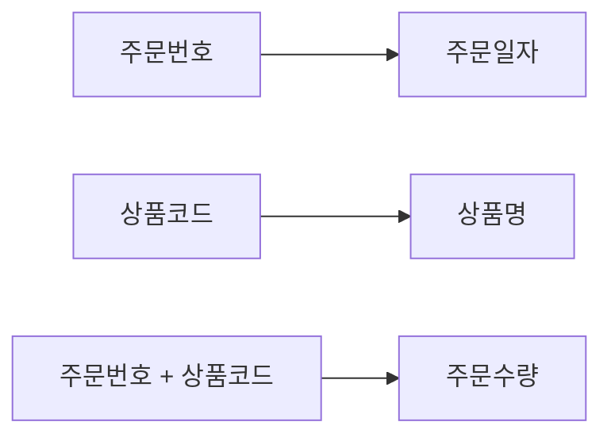
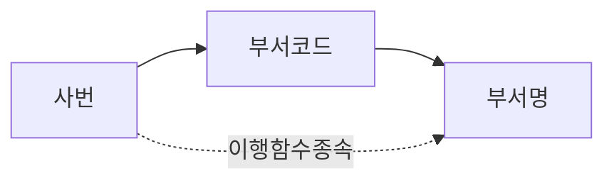

# 06 정규화

기본 학습은 아래 비교표와 함수 종속 다이어그램으로 진행한다. 상세 근거와 기출 해설이 필요할 때만 하단 "상세 기출 해설" 링크를 연다.

## 1. 핵심 개념 비교표

### 정규형 판별표

| 확인 사항 | 발견된 구조 | 판정 |
| --- | --- | --- |
| 셀에 여러 값 또는 번호붙은 반복컬럼 | 비원자값·반복속성 | 1NF 위반 |
| 복합키 일부 → 일반속성 | 부분 함수 종속 | 2NF 위반 |
| 기본키 → 일반속성A → 일반속성B | 이행 함수 종속 | 3NF 위반 |
| 후보키가 아닌 결정자 → 속성 | 결정자가 후보키(슈퍼키)가 아님 | BCNF 위반 |

### 종속 개념 비교표

| 구분 | 완전 함수 종속 | 부분 함수 종속 | 이행 함수 종속 |
| --- | --- | --- | --- |
| 결정 구조 | 복합키 전체 → 일반속성 | 복합키 일부 → 일반속성 | 일반속성 → 다른 일반속성 |
| 관련 정규형 | 2NF 충족 | 2NF 위반 | 3NF 위반 |
| 핵심 구별 | 결정자가 복합키 "전체" | 결정자가 복합키의 "일부" | 결정자가 "일반속성"(주식별자 아님) |

### 이상현상

| 이상 | 의미 |
| --- | --- |
| 삽입 이상 | 필요한 다른 정보가 없어 정보를 추가할 수 없음 |
| 삭제 이상 | 일부 행을 삭제하면 필요한 다른 정보도 함께 사라짐 |
| 갱신 이상 | 중복 저장된 값 중 일부만 변경되어 불일치 발생 |

⚠️ "생성이상"이라는 용어는 존재하지 않는다(이상현상은 삽입·갱신·삭제 3유형뿐).

## 2. 판정 순서

```text
모든 값이 원자값인가?
├─ 아니오 → 1NF 위반(반복속성·다중값 분리)
└─ 예
   ├─ 복합키 일부가 일반속성을 결정하는가?
   │  └─ 예 → 2NF 위반(부분함수종속)
   ├─ 일반속성이 다른 일반속성을 결정하는가?
   │  └─ 예 → 3NF 위반(이행함수종속)
   └─ 후보키가 아닌 결정자가 존재하는가?
      └─ 예 → BCNF 위반
```

## 3. 유사 사례 비교 — 제2정규형

주문(주문번호+상품코드 복합키, 주문일자, 상품명, 주문수량)



| 속성 | 결정자 | 종속 유형 | 결과 |
| --- | --- | --- | --- |
| 주문일자 | 주문번호 | 부분 함수 종속 | 분리 |
| 상품명 | 상품코드 | 부분 함수 종속 | 분리 |
| 주문수량 | 주문번호+상품코드 | 완전 함수 종속 | 유지 |

## 4. 유사 사례 비교 — 제3정규형

사원(사번 PK, 부서코드, 부서명)



| 분해 전 | 분해 후 |
| --- | --- |
| 사원(사번, 부서코드, 부서명) | 사원(사번, 부서코드) |
| | 부서(부서코드, 부서명) |

## 5. 반복 오답

| 선지 표현 | O/X | 틀린 이유 | 올바르게 고치면 |
| --- | :-: | --- | --- |
| 이상현상은 삽입·갱신·삭제·생성이상 4가지다 | X | "생성이상"은 없는 용어(범위 과장, D4) | 이상현상은 삽입·갱신·삭제이상 3가지다 |
| 정규화는 물리적 모델링 단계에서 수행한다 | X | 정규화는 논리적 모델링 단계(단계 혼동, D5) | 정규화는 논리적 모델링 단계에서 수행한다 |
| 정규화의 직접적 효과는 조회성능 향상이다 | X | 조회성능 향상은 반정규화의 목적(목적·수단 혼동, D11) | 정규화의 직접적 효과는 이상현상 제거와 무결성 확보다 |
| 부분함수종속을 제거하면 3NF가 된다 | X | 부분함수종속 제거는 2NF(단계 혼동, D5) | 부분함수종속을 제거하면 2NF가 된다 |
| 이행함수종속과 부분함수종속은 같은 개념이다 | X | 결정자가 "복합키 일부"인지 "일반속성"인지가 다름(정의 바꿔치기, D1) | 부분함수종속은 결정자가 복합키 일부, 이행함수종속은 결정자가 일반속성이다 |
| 단일 속성 주식별자에도 부분함수종속이 성립한다 | X | 부분함수종속은 복합키에서만 성립(조건 누락, D3) | 부분함수종속은 주식별자가 복합키일 때만 성립한다 |
| BCNF는 이행함수종속을 제거하는 정규형이다 | X | 이행함수종속 제거는 3NF, BCNF는 "모든 결정자가 후보키"(정의 바꿔치기, D1) | BCNF는 모든 결정자가 후보키여야 한다는 조건이다 |

## 6. 문제 풀이 규칙

```text
표·계산형: 원본 표 재작성 → 후보키/기본키 확인 → 함수종속 확인(결정자→종속자) → 완전/부분/이행 종속 판별 → 위반 정규형 판정 → 적절한 분해
```

정규화 문제는 단계 이름을 암기하지 말고, 매번 "결정자가 복합키 전체인가/일부인가/일반속성인가"를 직접 따져서 2NF와 3NF를 구별한다.

## 7. 상세 기출 해설

- [NORM-01 정규화의 목적과 이상현상](./NORM-01-정규화의-목적과-이상현상.md) — 함수종속·결정자·종속자 정의, 이상현상 3유형 대표 판례
- [NORM-02 제1정규형](./NORM-02-제1정규형.md) — 도메인 원자성, 반복그룹 제거 대표 판례
- [NORM-03 제2정규형과 부분함수종속](./NORM-03-제2정규형과-부분함수종속.md) — 대표 판례(주문/상품코드 사례)
- [NORM-04 제3정규형과 이행함수종속](./NORM-04-제3정규형과-이행함수종속.md) — 대표 판례(사번/부서코드 사례)
- [NORM-05 BCNF와 상위정규형](./NORM-05-BCNF와-상위정규형.md) — BCNF 조건, 4NF·5NF 존재만 인지
