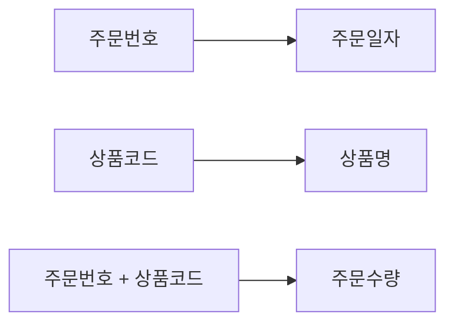
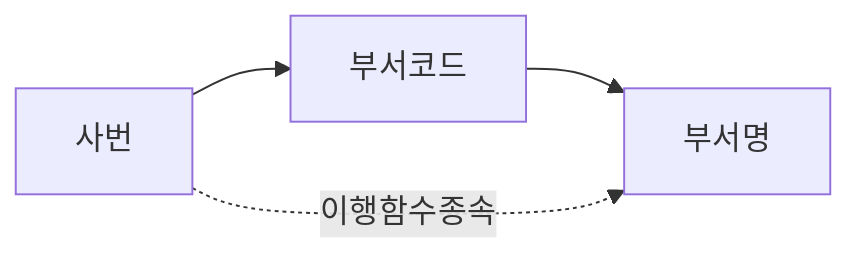

# 06 정규화

기본 학습은 아래 비교표와 함수 종속 다이어그램으로 진행한다. 상세 근거와 기출 해설이 필요할 때만 하단 "상세 법리 파일" 링크를 연다.

## 1. 핵심 개념 비교표

### 정규형 판별표

| 확인 사항 | 발견된 구조 | 판정 |
| --- | --- | --- |
| 셀에 여러 값 또는 번호붙은 반복컬럼 | 비원자값·반복속성 | 1NF 위반 |
| 복합키 일부 → 일반속성 | 부분 함수 종속 | 2NF 위반 |
| 기본키 → 일반속성A → 일반속성B | 이행 함수 종속 | 3NF 위반 |
| 후보키가 아닌 결정자 → 속성 | 결정자가 후보키(슈퍼키)가 아님 | BCNF 위반 |

### 종속 개념 비교표

| 구분 | 완전 함수 종속 | 부분 함수 종속 | 이행 함수 종속 |
| --- | --- | --- | --- |
| 결정 구조 | 복합키 전체 → 일반속성 | 복합키 일부 → 일반속성 | 일반속성 → 다른 일반속성 |
| 관련 정규형 | 2NF 충족 | 2NF 위반 | 3NF 위반 |
| 핵심 구별 | 결정자가 복합키 "전체" | 결정자가 복합키의 "일부" | 결정자가 "일반속성"(주식별자 아님) |

### 이상현상

| 이상 | 의미 |
| --- | --- |
| 삽입 이상 | 필요한 다른 정보가 없어 정보를 추가할 수 없음 |
| 삭제 이상 | 일부 행을 삭제하면 필요한 다른 정보도 함께 사라짐 |
| 갱신 이상 | 중복 저장된 값 중 일부만 변경되어 불일치 발생 |

⚠️ "생성이상"이라는 용어는 존재하지 않는다(이상현상은 삽입·갱신·삭제 3유형뿐).

## 2. 판정용 결정 트리

```text
모든 값이 원자값인가?
├─ 아니오 → 1NF 위반(반복속성·다중값 분리)
└─ 예
   ├─ 복합키 일부가 일반속성을 결정하는가?
   │  └─ 예 → 2NF 위반(부분함수종속)
   ├─ 일반속성이 다른 일반속성을 결정하는가?
   │  └─ 예 → 3NF 위반(이행함수종속)
   └─ 후보키가 아닌 결정자가 존재하는가?
      └─ 예 → BCNF 위반
```

```text
표·계산형: 원본 표 재작성 → 후보키/기본키 확인 → 함수종속 확인(결정자→종속자) → 완전/부분/이행 종속 판별 → 위반 정규형 판정 → 적절한 분해
```

정규화 문제는 단계 이름을 암기하지 말고, 매번 "결정자가 복합키 전체인가/일부인가/일반속성인가"를 직접 따져서 2NF와 3NF를 구별한다.

## 3. 유사 사례 비교

### 유사 사례 비교 — 제2정규형

주문(주문번호+상품코드 복합키, 주문일자, 상품명, 주문수량)



| 속성 | 결정자 | 종속 유형 | 결과 |
| --- | --- | --- | --- |
| 주문일자 | 주문번호 | 부분 함수 종속 | 분리 |
| 상품명 | 상품코드 | 부분 함수 종속 | 분리 |
| 주문수량 | 주문번호+상품코드 | 완전 함수 종속 | 유지 |

### 유사 사례 비교 — 제3정규형

사원(사번 PK, 부서코드, 부서명)



| 분해 전 | 분해 후 |
| --- | --- |
| 사원(사번, 부서코드, 부서명) | 사원(사번, 부서코드) |
| | 부서(부서코드, 부서명) |

## 4. 반복 오답

| 선지 표현 | O/X | 틀린 이유 | 올바르게 고치면 |
| --- | :-: | --- | --- |
| 이상현상은 삽입·갱신·삭제·생성이상 4가지다 | X | "생성이상"은 없는 용어(범위 과장, D4) | 이상현상은 삽입·갱신·삭제이상 3가지다 |
| 정규화는 물리적 모델링 단계에서 수행한다 | X | 정규화는 논리적 모델링 단계(단계 혼동, D5) | 정규화는 논리적 모델링 단계에서 수행한다 |
| 정규화의 직접적 효과는 조회성능 향상이다 | X | 조회성능 향상은 반정규화의 목적(목적·수단 혼동, D11) | 정규화의 직접적 효과는 이상현상 제거와 무결성 확보다 |
| 부분함수종속을 제거하면 3NF가 된다 | X | 부분함수종속 제거는 2NF(단계 혼동, D5) | 부분함수종속을 제거하면 2NF가 된다 |
| 이행함수종속과 부분함수종속은 같은 개념이다 | X | 결정자가 "복합키 일부"인지 "일반속성"인지가 다름(정의 바꿔치기, D1) | 부분함수종속은 결정자가 복합키 일부, 이행함수종속은 결정자가 일반속성이다 |
| 단일 속성 주식별자에도 부분함수종속이 성립한다 | X | 부분함수종속은 복합키에서만 성립(조건 누락, D3) | 부분함수종속은 주식별자가 복합키일 때만 성립한다 |
| BCNF는 이행함수종속을 제거하는 정규형이다 | X | 이행함수종속 제거는 3NF, BCNF는 "모든 결정자가 후보키"(정의 바꿔치기, D1) | BCNF는 모든 결정자가 후보키여야 한다는 조건이다 |

## 5. 자가 점검

표와 결정 트리를 가린 상태에서 답한다.

1. (핵심개념설명형) 함수종속(X→Y)에서 결정자와 종속자란 각각 무엇인지 정의하고, 간단한 예를 하나 드시오.
2. (핵심개념설명형) 삽입이상·갱신이상·삭제이상을 각각 한 문장으로 구분해 설명하시오.
3. (유사개념구별형) 부분함수종속과 이행함수종속을 가르는 핵심 기준 한 문장을 쓰시오.
4. (유사개념구별형) 3NF와 BCNF를 가르는 핵심 기준 한 문장을 쓰시오.
5. (사례판정형) {학번, 과목코드}가 복합 주식별자이고, 일반속성 "학생명"이 학번에만 종속된다. 이는 어떤 종속이며, 몇 정규형 위반인지 판정 기준과 함께 답하시오.
6. (사례판정형) 사번(PK), 부서코드, 부서명으로 구성된 테이블에서 부서코드→부서명이 성립한다. 이는 어떤 종속이며, 어떻게 분해해야 하는지 쓰시오.
7. (사례판정형·함수종속 판정) 릴레이션 R(A, B, C, D)의 주식별자가 {A,B}이고, 함수종속 A→C와 {A,B}→D가 성립한다. C와 D는 각각 완전함수종속인지 부분함수종속인지 판정하고, 필요한 분해를 제시하시오.
8. (반복오답교정형) "이상현상은 삽입·갱신·삭제·생성이상 4가지다"라는 서술의 오류를 지적하고 올바른 문장으로 고치시오.
9. (결정트리재현형) 아래 빈칸을 채우시오.

```text
모든 값이 원자값인가?
├─ 아니오 → (        ) 위반
└─ 예
   ├─ 복합키 일부 → 일반속성 → (        ) 위반
   ├─ 일반속성 → 일반속성 → (        ) 위반
   └─ 후보키 아닌 결정자 존재 → (        ) 위반
```

10. (결정트리재현형) 아래 빈칸을 채우시오.

```text
속성 집합 X의 값이 정해지면 Y의 값이 하나로 결정되는가?
│
├─ 예 → X → Y (        ) 성립
│  ├─ X = (        )
│  └─ Y = (        )
└─ 아니오 → 함수종속 아님
```

<details>
<summary>자가 점검 정답</summary>

1. 함수종속 X→Y는 X의 값이 정해지면 Y의 값이 하나로 결정되는 관계이며, 이때 X를 결정자, Y를 종속자라 한다(예: 학번→이름).
2. 삽입이상=필요한 다른 정보가 없어 데이터를 넣지 못함, 갱신이상=중복 저장된 값 중 일부만 고쳐 불일치가 생김, 삭제이상=행을 지우면 필요한 다른 정보까지 함께 사라짐.
3. 결정자가 "복합키의 일부"이면 부분함수종속(2NF 위반), 결정자가 "일반속성"이면 이행함수종속(3NF 위반)이다.
4. 3NF는 이행함수종속(일반속성 간 종속)을 제거하는 조건이고, BCNF는 한 단계 더 나아가 "모든 결정자가 후보키"여야 한다는 조건이다.
5. 부분함수종속이다 — 학생명이 복합 주식별자 전체가 아니라 그 일부(학번)에만 종속되므로 2NF 위반이며, 학번을 기준으로 별도 테이블로 분리해야 한다.
6. 이행함수종속이다 — 사번→부서코드→부서명으로 간접 결정되므로 3NF 위반이며, 부서코드와 부서명을 부서(부서코드, 부서명) 테이블로 분리해야 한다.
7. A→C는 복합키 {A,B}의 일부(A)에만 종속되므로 부분함수종속(2NF 위반) → 분리 필요. {A,B}→D는 복합키 전체에 종속되므로 완전함수종속 → 유지. 분해: R1(A,B,D), R2(A,C).
8. 오류: "생성이상"이라는 용어는 존재하지 않는다(이상현상은 삽입·갱신·삭제 3유형뿐). 올바른 문장: "이상현상은 삽입·갱신·삭제이상 3가지다."
9. 위에서부터 순서대로: 1NF / 2NF / 3NF / BCNF.
10. 위에서부터 순서대로: 함수종속 / 결정자(Determinant) / 종속자(Dependent).

</details>

## 6. 기출 적용

| 문제 | 출처 | 법리 ID | 질문 극성 | 먼저 확인할 사실 | 상세 해설 |
| --- | --- | --- | --- | --- | --- |
| 정규화 설명 중 옳지 않은 것 고르기 | 이기적 단원별(정규화) page_12 문제01 | NORM-01 | 옳지 않은 것 | 정규화 수행 단계가 논리적 모델링인지 물리적 모델링인지 확인 | [NORM-01](./NORM-01-정규화의-목적과-이상현상.md) |
| 삽입이상의 예로 가장 적절한 것 고르기 | 이기적 단원별(정규화) page_12 문제02 | NORM-01 | 옳은 것 | "정보가 없어서 못 넣는다"에 해당하는 선지인지 확인 | [NORM-01](./NORM-01-정규화의-목적과-이상현상.md) |
| 1차정규형이 되기 위한 조건 고르기 | 이기적 단원별(정규화) page_12 문제03 | NORM-02 | 옳은 것 | 도메인 원자성(모든 속성이 원자값)을 서술했는지 확인 | [NORM-02](./NORM-02-제1정규형.md) |
| 2차정규화 위반 이유 고르기(표·계산형) | 이기적 단원별(정규화) page_12 문제04 | NORM-03 | 옳은 것 | {학번,과목코드} 복합키 중 과목명이 과목코드에만 종속되는지 확인 | [NORM-03](./NORM-03-제2정규형과-부분함수종속.md) |
| 3차정규화를 만족시키기 위한 작업 고르기 | 이기적 단원별(정규화) page_13 문제05 | NORM-04 | 옳은 것 | "일반속성 간 종속성(이행함수종속) 제거"를 서술했는지 확인 | [NORM-04](./NORM-04-제3정규형과-이행함수종속.md) |
| BCNF 정규형에 해당하기 위한 조건 고르기 | 이기적 단원별(정규화) page_13 문제07 | NORM-05 | 옳은 것 | "모든 결정자가 후보키"를 서술한 선지인지 확인 | [NORM-05](./NORM-05-BCNF와-상위정규형.md) |
| 부분함수종속 제거 직후의 정규형 명칭 고르기 | 이기적 모의 1회 page_26 문제03 | NORM-03 | 옳은 것 | 부분함수종속 제거=2NF(3NF 아님)임을 확인 | [NORM-03](./NORM-03-제2정규형과-부분함수종속.md) |
| 함수종속 기호형 분해 결과 고르기(표·계산형) | 이기적 모의 1회 page_27 문제08 | NORM-03 | 옳은 것 | R1(A,B,C,D,E), PK{A,B}, {A,B}→{C,D,E}, B→D에서 어떤 속성이 부분함수종속인지 확인 | [NORM-03](./NORM-03-제2정규형과-부분함수종속.md) |

<details>
<summary>기출 적용 정답</summary>

| 문제 | 정답 | 핵심 이유 |
| --- | :-: | --- |
| 정규화 설명 중 옳지 않은 것 고르기 | (원자료에 선지 문자 미기재) | 정규화를 물리적 모델링 단계로 서술한 선지가 오답 |
| 삽입이상의 예로 가장 적절한 것 고르기 | ② | "교수 정보가 없어 학생 정보를 입력할 수 없다"는 삽입이상의 정의에 정확히 부합 |
| 1차정규형이 되기 위한 조건 고르기 | ③ | 도메인의 원자성 확보가 1NF의 조건 |
| 2차정규화 위반 이유 고르기(표·계산형) | ④ | 과목명이 복합 주식별자 전체가 아니라 과목코드(일부)에만 종속되는 부분함수종속 |
| 3차정규화를 만족시키기 위한 작업 고르기 | ② | 일반속성들 간의 이행함수종속을 제거하는 것이 3NF 조건 |
| BCNF 정규형에 해당하기 위한 조건 고르기 | ① | "모든 결정자가 후보키여야 한다"가 BCNF의 정의 |
| 부분함수종속 제거 직후의 정규형 명칭 고르기 | ② | 부분함수종속을 제거하면 2NF를 만족(3NF가 아님) |
| 함수종속 기호형 분해 결과 고르기(표·계산형) | R1{A,B,C,E}, R2{B,D} | B→D는 복합키 일부(B)에만 종속되는 부분함수종속이므로 D를 B와 함께 분리 |

**함수종속 기호형 문제(NORM-03, page_27 문제08)의 종속판정표**

| 종속 관계 | 결정자 | 종속 유형 | 처리 |
| --- | --- | --- | --- |
| {A,B} → C | 복합키 전체 | 완전함수종속 | 유지 |
| {A,B} → E | 복합키 전체 | 완전함수종속 | 유지 |
| B → D | 복합키 일부(B) | 부분함수종속 | 분리(별도 테이블로) |

</details>

### 선지 O/X 훈련

**문제: 삽입이상(Insert Anomaly)의 예로 가장 적절한 것은? (이기적 단원별(정규화) page_12 문제02, NORM-01)**

| 선지 핵심 주장 | 내 판정 | 정답 | 결정적 이유 |
| --- | :-: | :-: | --- |
| ① 이미 저장된 값 중 일부만 고쳐 데이터 불일치가 발생한 상황 | | X | 갱신이상의 사례이지 삽입이상이 아님 |
| ② 학생을 입력하려 했으나 담당 교수 정보가 없어 입력할 수 없었다 | | O | 필요한 다른 정보 부재로 삽입 자체가 불가능한 삽입이상의 정의에 부합 |
| ③ 행을 삭제했더니 함께 저장된 다른 필요한 정보까지 사라진 상황 | | X | 삭제이상의 사례이지 삽입이상이 아님 |
| ④ (원자료상 상세 문구 미기재) | | 판단보류 | 원자료에 선지 문구가 기록되어 있지 않아 확인 필요 |

<details>
<summary>선지별 정답</summary>

| 선지 | O/X | 이유 | 틀린 경우 올바른 문장 |
| --- | :-: | --- | --- |
| ① | X | 값 일부만 고쳐 불일치가 생기는 것은 갱신이상(D1 정의 바꿔치기) | 해당 없음(선지 자체는 갱신이상 사례로는 옳음) |
| ② | O | 필요한 다른 정보 부재로 삽입 자체가 불가능 → 삽입이상 정의와 일치 | 해당 없음 |
| ③ | X | 행 삭제 시 다른 정보까지 소실되는 것은 삭제이상(D1 정의 바꿔치기) | 해당 없음(선지 자체는 삭제이상 사례로는 옳음) |
| ④ | 판단보류 | 원자료 미기재로 확정 불가 | 확인 필요 |

</details>

**문제: BCNF 정규형에 해당하기 위한 조건은? (이기적 단원별(정규화) page_13 문제07, NORM-05)**

| 선지 핵심 주장 | 내 판정 | 정답 | 결정적 이유 |
| --- | :-: | :-: | --- |
| ① 모든 결정자가 후보키여야 한다 | | O | BCNF의 정의 그 자체 |
| ② 이행함수종속을 제거해야 한다 | | X | 이는 BCNF가 아니라 3NF의 조건(D5 단계혼동) |
| ③ 다치종속을 제거해야 한다 | | X | 이는 BCNF가 아니라 4NF의 조건(D5 단계혼동) |
| ④ 조인종속을 제거해야 한다 | | X | 이는 BCNF가 아니라 5NF의 조건(D5 단계혼동) |

<details>
<summary>선지별 정답</summary>

| 선지 | O/X | 이유 | 틀린 경우 올바른 문장 |
| --- | :-: | --- | --- |
| ① | O | 모든 결정자가 후보키 = BCNF의 정의 | 해당 없음 |
| ② | X | 3NF 조건을 BCNF 자리에 배치한 단계혼동 | "이행함수종속을 제거해야 하는 것은 3NF의 조건이다" |
| ③ | X | 4NF 조건을 BCNF 자리에 배치한 단계혼동 | "다치종속을 제거해야 하는 것은 4NF의 조건이다" |
| ④ | X | 5NF 조건을 BCNF 자리에 배치한 단계혼동 | "조인종속을 제거해야 하는 것은 5NF의 조건이다" |

</details>

## 7. 상세 법리 파일

- [NORM-01 정규화의 목적과 이상현상](./NORM-01-정규화의-목적과-이상현상.md) — 함수종속·결정자·종속자 정의, 이상현상 3유형 대표 판례
- [NORM-02 제1정규형](./NORM-02-제1정규형.md) — 도메인 원자성, 반복그룹 제거 대표 판례
- [NORM-03 제2정규형과 부분함수종속](./NORM-03-제2정규형과-부분함수종속.md) — 대표 판례(주문/상품코드 사례)
- [NORM-04 제3정규형과 이행함수종속](./NORM-04-제3정규형과-이행함수종속.md) — 대표 판례(사번/부서코드 사례)
- [NORM-05 BCNF와 상위정규형](./NORM-05-BCNF와-상위정규형.md) — BCNF 조건, 4NF·5NF 존재만 인지

## 오답 회귀 경로

```text
문제 오답
→ 어느 선지에서 O/X를 잘못 판정했는지 확인
→ 이 단원 README의 "4. 반복 오답" 표 확인
→ "2. 판정용 결정 트리"에서 잘못 탄 분기 확인
→ "7. 상세 법리 파일"에서 근거 확인
→ 같은 유형 문제 재풀이
```

| 오답 원인 | 의미 |
| --- | --- |
| 개념미기억 | 핵심 법리 자체를 기억하지 못함 |
| 개념혼동 | 비슷한 두 개념을 서로 바꿔 적용 |
| 질문극성 | "옳은 것"과 "옳지 않은 것"을 반대로 읽음 |
| 조건누락 | 선지에 있는 전제 조건을 빠뜨림 |
| 방향역전 | 원인과 결과, 목적과 수단을 반대로 서술 |
| 계산오류 | 함수종속·NULL 집계 등 계산 과정에서 실수 |
| 예외과잉 | 예외 규정을 일반 규칙처럼 과도하게 적용 |
| 범위과장 | 일부에만 적용되는 규칙을 전체로 확대 |

## 단원 완료 기준

다음 항목을 모두 만족하면 이 단원을 완료한 것으로 본다.

- [ ] 비교표를 보지 않고 핵심 개념의 차이를 설명할 수 있다.
- [ ] 결정 트리를 빈 종이에 다시 그릴 수 있다.
- [ ] 자가 점검에서 80% 이상 맞혔다.
- [ ] 대표 기출의 모든 선지를 O/X로 설명할 수 있다.
- [ ] 틀린 선지를 올바른 문장으로 고칠 수 있다.
- [ ] 처음 보는 사례에도 같은 판단 기준을 적용할 수 있다.
- [ ] 기본키와 함수 종속을 직접 표시할 수 있다.
- [ ] 부분 함수 종속과 이행 함수 종속을 구별할 수 있다.
- [ ] 분해 전후 릴레이션을 직접 작성할 수 있다.
