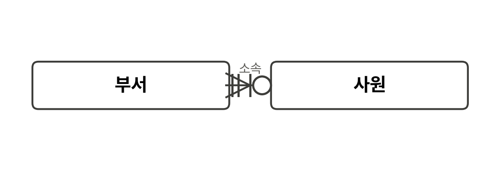
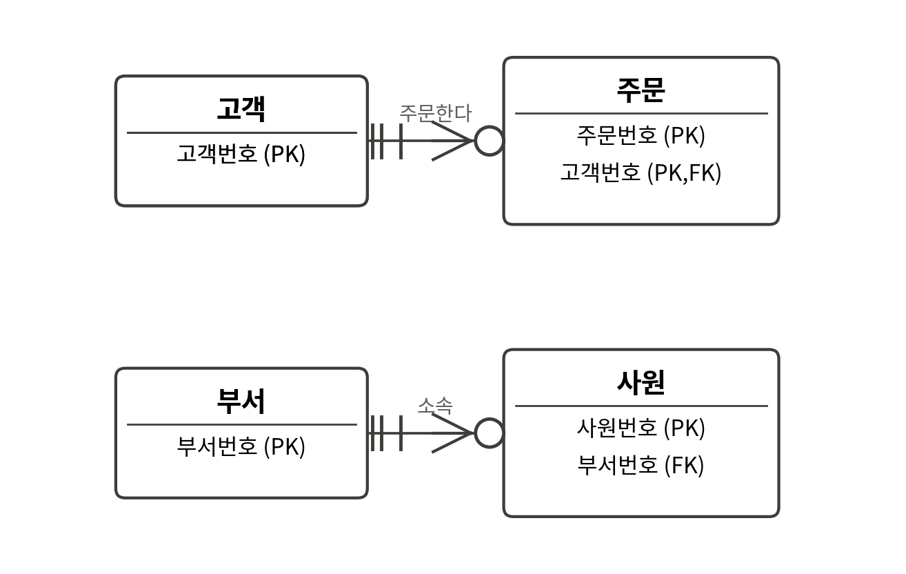
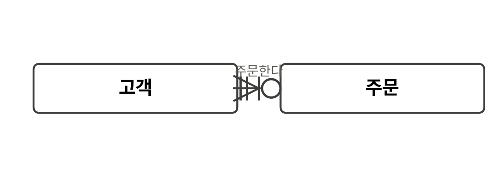
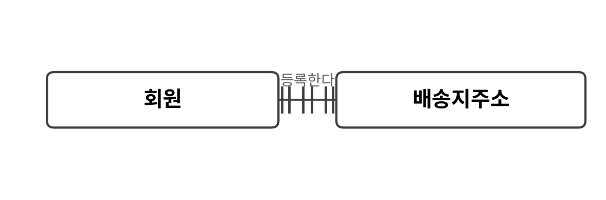
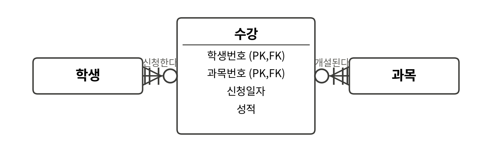
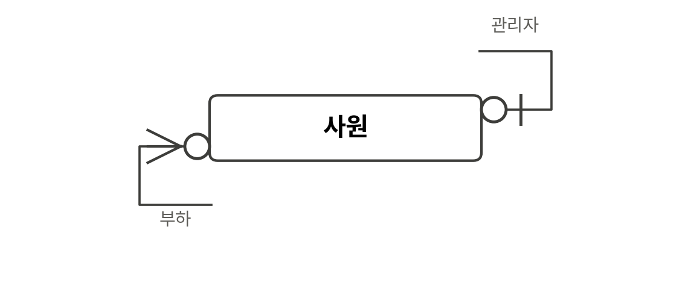
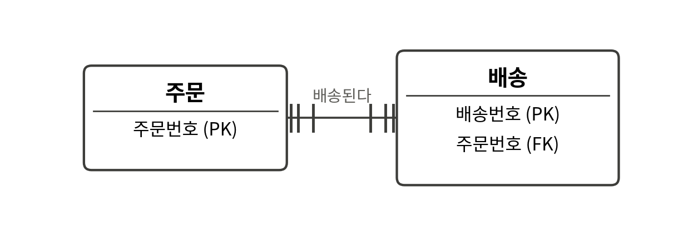
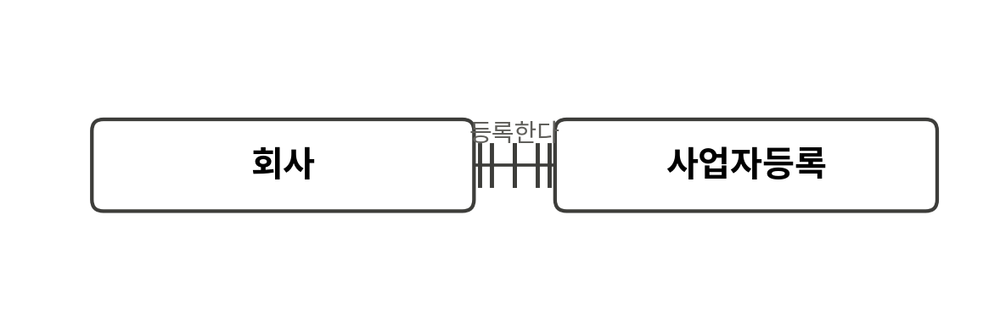

# SQLD 1과목 — 그림(ERD) 기반 논증형 문제

「데이터모델링 입문」(v3) 지문의 관계·식별자·PK/FK 개념을 바탕으로 하되, 관계차수·관계선택성·식별관계 판독처럼 지문 밖에서 그림으로 확인해야 하는 내용까지 포함한 보충 문제입니다. 선지 구성 방식(논증 형식·인과관계 요건)은 일반 문제와 같습니다.

---

### 문항 B1

다음 논증을 검토하시오.

> 전제1: 사원 쪽에 선택 기호(원)가 있다면, 부서 한 개를 기준으로 사원이 0명일 수도 있다.
> 전제2: 위 그림의 사원 쪽에는 선택 기호가 있다.
> 결론: 그러므로 이 그림에서는 부서 한 개에 사원이 0명인 경우가 허용된다.

이 논증과 그림에 대한 설명으로 **적절한 것**은?

① 이 논증은 전제1(P→Q)의 전건(P)을 긍정해 후건(Q)을 도출하는 전건 긍정식으로 타당하며, 그림의 실제 기호 배치와도 일치한다.
② 이 논증은 후건 긍정의 오류를 범하고 있으므로 결론을 신뢰할 수 없다.
③ 이 논증은 부서 쪽 기호에 대한 것이지 사원 쪽 기호에 대한 것이 아니므로 애초에 그림과 무관하다.
④ 전제1과 전제2가 모두 참이더라도, 결론은 전제와 독립적으로 별도 검증이 필요하다.
⑤ 사원 쪽 까치발 기호가 이 논증의 타당성을 결정하는 핵심 근거다.

### 문항 B2

다음 논증을 검토하시오.

> 전제1: 주문의 기본키에 고객번호가 포함되어 있다면, 고객과 주문은 식별관계다.
> 전제2: 그림에서 주문의 기본키는 고객번호를 포함한다(PK,FK 표시).
> 결론: 그러므로 고객과 주문은 식별관계다.

이 논증과 그림에 대한 설명으로 **적절하지 않은 것**은?

① 이 논증은 전건 긍정식(P→Q, P⊢Q)의 타당한 형식을 따르고 있다.
② 그림의 주문 엔터티에서 고객번호가 PK,FK로 표시되어 있으므로 전제2는 그림과 일치한다.
③ 이 논증은 전건을 부정해 후건의 부정을 이끌어내는 전건 부정의 오류를 범하고 있으므로 결론을 신뢰할 수 없다.
④ 반면 사원의 부서번호는 FK로만 표시되고 PK에는 포함되지 않으므로, 같은 논리를 적용하면 부서와 사원은 비식별관계라는 결론이 나온다.
⑤ 식별관계 여부가 구조(PK 포함 여부)로 결정된다는 것과, 주문이 고객 없이 존재할 수 있는지(필수·선택참여)는 서로 다른 질문이므로 이 논증만으로 참여 조건까지 알 수는 없다.

### 문항 B3

다음 논증을 검토하시오.

> 전제1: 주문 한 건에 대응하는 고객이 반드시 존재하지 않는다면, 고객 쪽 기호는 선택(원)으로 표시되어야 한다.
> 전제2: 그림에서 고객 쪽 기호는 선택(원)이 아니라 필수(이중 표시)다.
> 결론: 그러므로 주문 한 건에 대응하는 고객은 반드시 존재한다.

이 논증에 대한 판단으로 **적절한 것**은?

① 이 논증은 전건 부정의 오류를 범하고 있다.
② 이 논증은 후건 긍정의 오류를 범하고 있다.
③ 이 논증이 타당하려면 선언지가 추가로 필요하다.
④ 이 논증은 후건 부정식(Modus Tollens)의 타당한 형식이며, 결론은 전제로부터 타당하게 도출된다.
⑤ 전제1과 전제2가 다루는 것은 관계차수이지 관계선택성이 아니므로 이 논증은 그림과 무관하다.

### 문항 B4

문항 B3의 그림에서, 한 학생이 다음과 같이 주장한다. "이 그림에서 주문 쪽에 있는 원(선택) 기호는, 고객 한 명을 기준으로 주문이 0건일 수도 있다는 뜻이다. 그러므로 이 원 기호만 보면 주문 한 건에 고객이 필수인지 아닌지도 함께 알 수 있다." 이 주장에 대한 설명으로 **적절하지 않은 것**은?

① 원 기호가 나타내는 것은 "고객 한 명 기준 주문의 최소 개수가 0"이라는 뜻이므로, 주장의 앞부분은 정확하다.
② 이 주장은 타당하다 — 하나의 관계에서 한쪽의 선택성을 알면 논리적으로 반대쪽의 선택성도 항상 함께 결정되기 때문이다.
③ 주문 한 건에 고객이 필수인지는 고객 쪽 기호를 별도로 읽어야 알 수 있는 문제이므로, 원 기호 하나로 반대 방향의 정보까지 알 수 있다는 주장의 뒷부분은 부당한 확대다.
④ 이 주장의 오류는 한 방향의 선택성 정보를 반대 방향의 선택성 정보에 대한 충분조건으로 잘못 취급한 데 있다.
⑤ 이 그림에서 고객 쪽에는 원이 아니라 이중 표시가 있으므로, 실제로는 주문에 고객이 필수라는 사실이 별도로 확인된다.

### 문항 B5

업무 문장: "회원은 배송지 주소를 0개 이상 등록할 수 있으며, 배송지 주소는 반드시 한 명의 회원에게 속한다." 다음 논증을 검토하시오.

> 전제1: 그림이 업무 문장을 정확히 반영한다면, 회원 쪽 기호에 까치발이 있어야 한다.
> 전제2: 그림의 회원 쪽 기호에는 까치발이 없다(이중 표시만 있다).
> 결론: 그러므로 이 그림은 업무 문장을 정확히 반영하지 못했다.

이 논증에 대한 판단으로 **적절한 것**은?

① 이 논증은 전건 부정의 오류다.
② 이 논증은 후건 부정식으로 타당하며, 그림과 업무 문장 사이의 불일치를 정확히 짚어낸다.
③ 이 논증은 선언지 긍정의 오류다.
④ 전제1이 필요조건이 아니라 확률적 원인을 서술한 것이므로 결론은 개연적으로만 성립한다.
⑤ 업무 문장이 참인지 여부와 무관하게 이 논증은 애초에 성립할 수 없다.

### 문항 B6

다음 두 명제를 검토하시오.

> (A) 이 M:N 관계는 학생-수강, 수강-과목의 두 1:N 관계로 나뉘어 있다.
> (B) 원래 학생-과목 관계가 가졌을 신청일자·성적 같은 관계 속성이 교차엔터티인 수강으로 옮겨져 있다.

한 팀원이 "(A)가 참이면 (B)도 반드시 참이다. 관계를 나누는 것과 속성을 옮기는 것은 필연적으로 함께 일어나기 때문이다"라고 주장한다. 이 주장 및 그림에 대한 설명으로 **적절하지 않은 것**은?

① 그림을 보면 (A), (B) 모두 실제로 참이지만, 이는 각각 독립적으로 확인된 사실이지 하나가 다른 하나를 논리적으로 함의하기 때문이 아니다.
② (A)가 참이라고 해서 (B)가 자동으로 참이 되어야 할 논리적 필연성은 없으므로, 이 주장의 "필연적으로 함께 일어난다"는 근거는 부당하다.
③ 이 주장은 두 개의 서로 다른 사실(관계 분할과 속성 이전)을 하나의 조건 관계로 묶어버린 결합 오류에 가깝다.
④ 이 주장은 타당하다 — (A)와 (B)는 필요충분조건 관계에 있으므로 하나만 확인해도 다른 하나가 자동으로 보장된다.
⑤ 수강의 기본키가 학생번호·과목번호의 복합키로 구성된 것은, (A)에서 서술한 두 개의 1:N 관계가 각각 식별관계로 맺어진 결과와 관련이 있다.

### 문항 B7

다음 논증을 검토하시오.

> 전제1: 모든 사원에게 관리자가 있다면, 관리자 쪽 기호는 필수(이중 표시)여야 한다.
> 전제2: 그림에서 관리자 쪽 기호는 필수가 아니라 선택(원)이다.
> 결론: 그러므로 모든 사원에게 관리자가 있는 것은 아니다(즉, 관리자가 없는 사원이 존재할 수 있다).

이 논증에 대한 판단으로 **적절한 것**은?

① 이 논증은 후건 긍정의 오류를 범하고 있다.
② 결론은 "어떤 사원도 관리자를 가질 수 없다"는 전칭 부정으로 해석해야 한다.
③ 이 논증은 부하 쪽 까치발 기호에 대한 것이므로 관리자 쪽 기호와는 무관하다.
④ 이 논증이 타당하려면 선언지 부정식의 형태를 갖춰야 한다.
⑤ 이 논증은 후건 부정식으로 타당하며, 결론은 "적어도 한 명은 관리자가 없을 수 있다"는 존재양화 진술로 정확히 해석해야 한다.

### 문항 B8

한 팀원이 다음과 같이 주장한다. "배송의 기본키가 배송번호 단독이고 주문번호는 일반 외래키로만 쓰인다. 그러므로 주문 없이 배송이 단독으로 등록되는 일이 업무적으로 반드시 가능하다." 이 주장에 대한 설명으로 **적절하지 않은 것**은?

① 이 주장은 구조 정보로부터 업무 규칙을 타당하게 도출하는 전건 긍정식의 한 사례이므로 결론을 신뢰할 수 있다.
② 이 주장은 구조적 판정 근거(기본키 구성)로부터 업무적 참여 조건(단독 등록 가능 여부)을 도출하고 있는데, 이 둘은 서로 다른 축의 질문이므로 전제만으로 결론이 필연적으로 보장되지 않는다.
③ 비식별관계라는 구조는 "부모 없이 자식이 존재할 수 있다"는 것의 필요조건이 아니라, 그 가능성을 배제하지 않을 뿐인 별개의 사실이다.
④ 실제 업무 규칙에서 배송이 항상 특정 주문에 종속되도록 정할 수도 있으므로, 이 주장의 "반드시 가능하다"는 결론은 과도한 확신이다.
⑤ 이 주장이 부당하다고 해서 배송이 실제로 주문 없이 등록될 수 없다는 것이 증명되는 것도 아니며, 다만 주어진 구조 정보만으로는 알 수 없다는 뜻이다.

### 문항 B9

다음 논증을 검토하시오.

> 전제1: 회사와 사업자등록을 반드시 병합해야 한다면, 두 엔터티는 업무상 독립적으로 관리할 필요가 없어야 한다.
> 전제2: 실제로는 회사와 사업자등록이 서로 다른 시점에 생성·관리되는 등 독립적으로 관리할 필요가 있다.
> 결론: 그러므로 회사와 사업자등록을 반드시 병합해야 하는 것은 아니다.

이 논증에 대한 판단으로 **적절한 것**은?

① 이 논증은 전건 부정의 오류다.
② 이 논증은 선언지 긍정의 오류다.
③ 이 논증은 후건 부정식으로 타당하며, 1:1 필수참여라는 카디널리티 하나만으로 병합의 필연성을 결론지을 수 없다는 원칙과도 일치한다.
④ 전제2는 확률적 원인을 서술하고 있으므로 결론은 개연적으로만 성립한다.
⑤ 1:1 관계는 데이터 모델에 존재할 수 없으므로 이 논증의 전제 자체가 성립하지 않는다.

### 문항 B10

문항 B6의 그림에서, 한 팀원이 다음과 같이 주장한다. "수강처럼 두 부모의 식별자를 물려받아 복합키를 구성하는 교차엔터티는, 그 성격상 반드시 복합키만 주식별자로 쓸 수 있고 별도의 인조키를 도입하는 것은 논리적으로 불가능하다." 이 주장에 대한 설명으로 **적절하지 않은 것**은?

① 그림처럼 복합키로 구성하는 것이 일반적이지만, 관리 편의를 위해 별도의 인조키를 주식별자로 도입하고 (학생번호, 과목번호)는 유일성을 보장하는 별도 키로 두는 설계도 가능하다.
② 이 주장은 "일반적으로 그렇다"는 사실을 "논리적으로 그럴 수밖에 없다"는 필연으로 확대한 과잉 일반화다.
③ 이 주장은 타당하다 — 교차엔터티의 정의 자체가 복합키를 주식별자로 강제하기 때문이다.
④ 인조키를 도입하더라도 학생번호·과목번호는 여전히 저장해야 하므로, "저장할 필요가 없어진다"는 것은 이 주장을 반박하는 근거가 아니라 별도로 검토할 문제다.
⑤ 복합키와 인조키가 한 테이블에 동시에 존재할 수 없다는 상호배타 관계는 성립하지 않는다.

---

문제는 여기까지입니다. 정답과 해설은 별도 파일(SQLD_1과목_그림문제_해설.md)에 있습니다.
